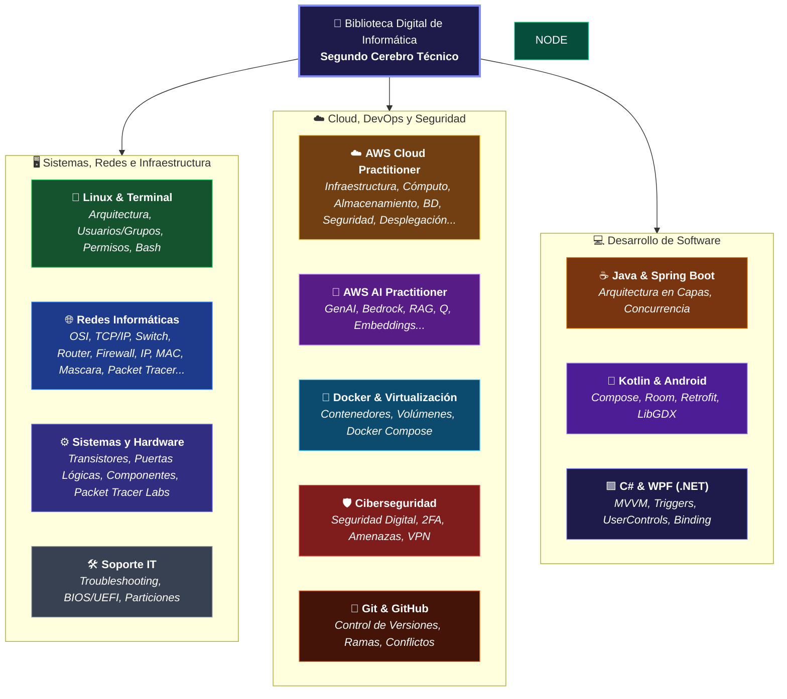

#indice #dashboard #segundo-cerebro #tecnologia #informatica #sistemas #redes #linux #cloud #ia #seguridad

> [!abstract] 🧠 Mi Biblioteca Digital y Centro de Mando: Apuntes de Informática
> ¡Hola y **bienvenido/a** a mi rincón de conocimiento técnico! ✨ 
> 
> Este espacio funciona como mi **segundo cerebro**. Aquí voy documentando, estructurando y conectando todo lo que aprendo sobre administración de sistemas, redes, nube, inteligencia artificial, ciberseguridad y desarrollo de software.
> 
> Cada nota combina **rigor técnico**, **casos prácticos reales** y **analogías visuales** para convertir conceptos complejos en conocimiento aplicable en el mundo profesional.

---

---

## ⚡ Accesos Rápidos y Hojas de Ruta Clave

Para consultar directamente los índices maestros, simulacros de examen o guías de diagnóstico más importantes:

* 🐧 **Linux:** [[📂Linux/📂00 - Dashboard y Mapeo/🐧00 - Índice Maestro de Linux, Terminal, Redes y Bash|🐧 Índice Maestro de Linux, Terminal y Bash]]
* 🌐 **Redes:** [[📂Redes/📂00 - Dashboard y Mapeo/🌐 00 - Índice Maestro de Redes Informáticas|🌐 Índice Maestro de Redes Informáticas (CCNA)]]
* 🧭 **Chuleta de Redes:** [[📂Redes/📂00 - Dashboard y Mapeo/🧭 00.1 - Guía Esencial de Conceptos y Diagnóstico de Redes (Niveles 1 al 9)|🧭 Chuleta Esencial y Guía de Diagnóstico de Redes (Niveles 1 al 9)]]
* 🧠 **AWS AI Practitioner:** [[📂AWS/📂IA Practitioner/000 - AWS AI Practitioner (Home)|🧠 AWS AI Practitioner AIF-C01 (Centro de Mando)]]
* 📝 **Simulacro de Examen:** [[📂AWS/📂IA Practitioner/00 - Examen Simulacro AIF-C01 (50 Preguntas)|📝 Examen de Práctica AIF-C01 (50 Preguntas de Examen Oficial)]]
* ☁️ **AWS Cloud Practitioner:** [[📂AWS/📂Cloud Practitioner/000 - AWS Cloud Practitioner (Home)|☁️ AWS Cloud Practitioner CLF-C02 (Home)]]
* 🛡️ **Seguridad Digital:** [[📂Seguridad/📁 00 - Mapeo y Navegación/🗺️ 00 - Índice de Seguridad Digital|🗺️ Índice General de Seguridad y Protección Digital]]
* 🧪 **Laboratorio Cisco:** [[📂Sistemas Informáticos/📂PacketTracer/📂Proyectos Básicos/🌐 README|🧪 Packet Tracer: Proyectos Básicos (01 al 06)]] y [[📂Sistemas Informáticos/📂PacketTracer/📂Proyectos Intermedios/🌐 README|🔀 Proyectos Intermedios (07 RoAS y VLANs)]]
* 🐳 **Docker:** [[📂Docker/📂Explicacion/🐳 Índice - Guía Docker|🐳 Guía Completa y Comandos de Docker]]
* 🐙 **Git:** [[📂Control de Versiones/Git&GitHub/Fundamentos Git|🐙 Fundamentos de Git y Flujos de Trabajo en GitHub]]

---

## 🧭 Explorador Detallado de Áreas Técnicas

### 1. 🐧 Linux, Terminal y Automatización

Todo lo necesario para desenvolverse con soltura en la línea de comandos de sistemas tipo UNIX, administración de servidores y scripting:

* **Arquitectura y Archivos:** [[📂Linux/📂01 - Fundamentos y Arquitectura/01.1 - Qué es Linux (Kernel vs Aplicaciones)|¿Qué es Linux? Kernel vs Aplicaciones]], [[📂Linux/📂01 - Fundamentos y Arquitectura/01.2 - El Árbol de Directorios y File System de Linux|El Árbol de Directorios (/)]] y [[📂Linux/📂01 - Fundamentos y Arquitectura/01.3 - Rutas Absolutas vs Relativas|Rutas Absolutas y Relativas]].

* **Operativa Diaria:** [[📂Linux/📂02 - Comandos y Navegación Básica/02.1 - Orientación, Inspección y Ayuda|Comandos de Navegación (`ls`, `cd`, `tree`)]], manipulación de ficheros (`touch`, `mkdir`, `cp`, `mv`, `rm`) y comodines (*wildcards*).

* **Seguridad y Permisos:** [[📂Linux/📂03 - Seguridad, Usuarios, Grupos y Permisos/03.1 - Anatomía de los Permisos en Linux|Anatomía de Permisos (rwx)]], modificación octal y simbólica (`chmod`), administración de cuentas (`useradd`, `sudo`, `chown`) y máscara `umask`.

* **Procesos y Redirecciones:** Redirección de streams (`stdin`, `stdout`, `stderr`), pipes (`|`), filtros (`grep`, `sed`, `awk`, `tail -f`) y gestión de señales y procesos (`ps`, `kill`, `top`).

* **Automatización:** [[📂Linux/📂05 - Automatización y Scripting en Bash/05.1 - Anatomía de un Script en Bash y Variables|Scripting en Bash]], variables, condicionales, bucles y cron jobs.

---

### 2. 🌐 Redes Informáticas y Telecomunicaciones

Arquitectura de comunicaciones diseñada con rigor técnico de nivel Cisco CCNA, desde las señales físicas hasta los servicios de aplicación:

* **Modelos y Fundamentos:** [[📂Redes/📂01 - Fundamentos y Arquitectura de Redes/🌐 01.1 - Introducción a las Redes Informáticas|Introducción a Redes]], [[📂Redes/📂01 - Fundamentos y Arquitectura de Redes/🏛️ 01.3 - Modelos de Referencia (OSI vs TCP-IP y Encapsulación)|Modelos OSI vs TCP/IP]] y flujo de empaquetado de PDUs.

* **Capa Física y Enlace (L2):** Cables UTP, fibra óptica, tramas Ethernet 802.3, direcciones MAC, conmutación en switches, [[📂Redes/📂02 - Capa Física y de Enlace/🔀 02.3 - Conmutación, Switches, VLANs y Spanning Tree (STP)|VLANs (802.1Q) y Spanning Tree (STP)]].

* **Direccionamiento (L3):** [[📂Redes/📂03 - Capa de Red y Direccionamiento/🌐 03.1 - Protocolo IP y Direccionamiento IPv4|Protocolo IPv4]], rangos privados (RFC 1918), [[📂Redes/📂03 - Capa de Red y Direccionamiento/🧮 03.2 - Subnetting y VLSM (Cálculo Práctico de Subredes)|Cálculo de Subnetting y VLSM]], IPv6 y protocolos de soporte ARP e ICMP.

* **Enrutamiento (Routing):** [[📂Redes/📂04 - Enrutamiento (Routing)/🧭 04.1 - Fundamentos de Routers y Enrutamiento Estático|Routers y Rutas Estáticas]], [[📂Redes/📂04 - Enrutamiento (Routing)/🚀 04.2 - Protocolos de Enrutamiento Dinámico (RIP, OSPF y BGP)|Protocolos Dinámicos (OSPF, BGP)]] y Router-on-a-Stick.

* **Capa de Transporte (L4):** [[📂Redes/📂05 - Capa de Transporte/🤝 05.2 - Protocolo TCP (3-Way Handshake, Flujo y Confiabilidad)|Protocolo TCP (3-Way Handshake)]], [[📂Redes/📂05 - Capa de Transporte/⚡ 05.3 - Protocolo UDP (Datagramas, Rendimiento y QUIC)|Protocolo UDP]], puertos conocidos y sockets.

* **Servicios de Red (L7):** [[📂Redes/📂06 - Capa de Aplicación y Servicios de Red/📖 06.1 - DNS (Domain Name System - Jerarquía, Consultas y Registros)|DNS (Registros A, AAAA, MX)]], [[📂Redes/📂06 - Capa de Aplicación y Servicios de Red/📡 06.2 - DHCP (Dynamic Host Configuration Protocol y Proceso DORA)|DHCP (Proceso DORA)]] y [[📂Redes/📂06 - Capa de Aplicación y Servicios de Red/🔁 06.3 - NAT, PAT y CGNAT (Traducción de Direcciones de Red)|NAT/PAT]].

* **Inalámbrico y Seguridad:** Wi-Fi (802.11ax/be, canales, roaming), ACLs perimetrales, firewalls con inspección de estado y túneles VPN (IPsec/WireGuard).

* **Diagnóstico y Laboratorio:** Comandos de terminal (`ping`, `traceroute`, `netstat`, `nslookup`), análisis de tramas en Wireshark y proyectos en Cisco Packet Tracer.

---

### 3. ☁️ Cloud Computing & Inteligencia Artificial en AWS

Doble certificación oficial de Amazon Web Services cubierta en profundidad:

#### 🧠 AWS AI Practitioner (AIF-C01)

* **Fundamentos IA/ML:** Tipos de Machine Learning (Supervisado, No Supervisado, RL), Overfitting vs Underfitting, Métricas (Precisión, Recall, F1, AUC) y ciclo de vida de ML.

* **Servicios Gestionados:** Rekognition (visión), Textract (OCR inteligente), Comprehend (NLP/sentimiento), Transcribe/Polly (voz), Translate, Lex (chatbots), Personalize y Forecast.

* **IA Generativa y LLMs:** Modelos Fundacionales (FMs), Transformers (Self-Attention), Tokens, Context Window, Embeddings y Bases de Datos Vectoriales (OpenSearch Serverless, Pinecone).

* **Amazon Bedrock y RAG:** Catálogo de modelos (Claude, Titan, Llama, Jurassic), [[📂AWS/📂IA Practitioner/📂M4 - Bedrock y Amazon Q/02 - Knowledge Bases for Bedrock (RAG Gestionado)|Knowledge Bases for Bedrock (RAG de extremo a extremo, Chunks, Embeddings y Vector Store)]], Agents for Bedrock, Model Evaluation y Amazon Q (Developer, Business, QuickSight).

* **IA Responsable y Seguridad:** Sesgos, explicabilidad, HITL, defensas contra *Prompt Injection*, alucinaciones, Guardrails for Bedrock y AI Service Cards.

* **Entrenamiento y Hardware:** Chips propietarios Trainium (entrenamiento) e Inferentia (inferencia económica).

#### ☁️ AWS Cloud Practitioner (CLF-C02)

* **Conceptos de Nube:** Ventajas del Cloud, modelos de despliegue (Público, Privado, Híbrido) y economía de escala.

* **Infraestructura Global:** Regiones, Zonas de Disponibilidad (AZs), Data Centers y Edge Locations (CloudFront).

* **Cómputo y Almacenamiento:** Instancias Amazon EC2 (tipos, precios Spot/On-Demand/RI), contenedores ECS/EKS, Serverless con AWS Lambda, almacenamiento en S3 (clases), EBS y EFS.

* **Redes y Bases de Datos:** Amazon VPC (subredes, Internet Gateway, Security Groups vs NACLs), Route 53, Amazon RDS, DynamoDB y Aurora.

* **Seguridad y Soporte:** Modelo de Responsabilidad Compartida, AWS IAM (usuarios, roles, políticas), KMS, CloudWatch, CloudTrail y el marco Well-Architected.

* ➔ **Acceso:** [[📂AWS/📂Cloud Practitioner/000 - AWS Cloud Practitioner (Home)|☁️ Centro de Mando Cloud Practitioner]]

---

### 4. 🛡️ Ciberseguridad & Protección Digital

Cultura de seguridad preventiva y defensa en profundidad:

* **Mitos y Riesgos Reales:** Separación de amenazas reales frente al sensacionalismo.

* **Identidad y Accesos:** Gestión de contraseñas robustas, gestores seguros y autenticación multifactor (2FA / MFA / Passkeys).

* **Ingeniería Social:** Vectores de ataque humanos: Phishing, Spear Phishing, Vishing, Smishing y técnicas de engaño psicológico.

* **Privacidad y Rastro Digital:** Metadatos en ficheros (EXIF), huella digital en navegadores y reducción del *oversharing*.

* **Conexiones y Dispositivos:** Seguridad en redes Wi-Fi abiertas, uso seguro de memorias USB y buenas prácticas en navegación.

---

### 5. 🐳 Docker, Contenedores y DevOps

Empaquetado y ejecución de aplicaciones en entornos aislados y reproducibles:

* **Conceptos Core:** Diferencias arquitectónicas entre Máquinas Virtuales y Contenedores.

* **Motor Docker:** Imágenes base, capas de sólo lectura, Dockerfile, contenedores efímeros y ciclo de vida (`run`, `stop`, `rm`, `logs`, `exec`).

* **Persistencia y Redes:** Volúmenes (`docker volume`), montajes bind, redes bridge y comunicación entre contenedores.

---

### 6. 🔀 Control de Versiones: Git & GitHub

La herramienta indispensable para el trabajo en equipo y el control de código:

* **Fundamentos:** El repositorio local (Working Directory, Staging Area, Git Repository), confirmaciones (`commit`), historial (`log`) e inspección de diferencias (`diff`).

* **Ramas y Estrategias:** Ramas de características (`branch`), fusión (`merge`), rebase (`rebase`) y resolución manual de conflictos.

* **Colaboración Remota:** Sincronización con GitHub (`push`, `pull`, `fetch`), Pull Requests, fork y tags de versiones.

---

### 7. 💻 Desarrollo de Software y Programación

### **☕ Java & Spring Boot:**

  * Arquitectura empresarial en 3 capas: Controladores REST, Servicios y Repositorios.
  * Inversión de Control (IoC), Inyección de Dependencias (`@Autowired`), Entidades con Hibernate/JPA y operaciones CRUD.
  * Programación concurrente avanzada: Hilos (`Thread`, `Runnable`), bloques sincronizados, cerrojos, `ExecutorService`, `Callable` y `Future`.
  * Colecciones avanzadas, Streams funcionales y comunicación con Sockets TCP/SSL.
  
### **📱 Kotlin & Desarrollo Móvil (Android):**

  * Arquitectura limpia con **MVVM** y principio **Offline-First**.
  * Consumo de APIs REST con **Retrofit 2** y convertidores JSON.
  * Bases de datos locales reactivas con **Room** (Entities, DAOs, Flow).
  * Interfaces declarativas con **Jetpack Compose** y gestión de estado.
  * Desarrollo breve y visto muy por encima de videojuegos 2D con **LibGDX**: ciclo de vida, renderizado gráfico y motor de físicas **Box2D** (cuerpos, sensores, colisiones).
  
### **🟪 C# & .NET (WPF & Arquitectura MVVM):**

Desarrollo de aplicaciones de escritorio empresariales en **C# y WPF**, aplicando el patrón **MVVM** para una separación limpia entre interfaz y lógica:

* **Arquitectura MVVM Pura:** [[📂Programación/📂CSharp/📂MVVM/📂01_Estructura_Proyecto/📄Que es MVVM|¿Qué es el patrón MVVM?]] (Model, View, ViewModel) y [[📂Programación/📂CSharp/📂MVVM/📂01_Estructura_Proyecto/📄Estructura|Estructura estándar de carpetas]] para erradicar el código acoplado en el *code-behind*.

* **Data Binding & Reactividad:** [[📂Programación/📂CSharp/📂MVVM/📂Conceptos/Binding|Conexión automática de datos (Binding)]] entre controles XAML y el ViewModel, sincronizando en tiempo real mediante la interfaz `INotifyPropertyChanged`.

* **Triggers y Behaviors (Eventos sin Code-Behind):** [[📂Programación/📂CSharp/📂MVVM/📂02_View/📄Triggers y Behaviors|Manejo de Triggers con Microsoft.Xaml.Behaviors.Wpf]] para capturar eventos que carecen de la propiedad `Command` (`Loaded`, `SelectionChanged`, `MouseEnter`, `Closing`) y redirigirlos limpiamente a métodos `ICommand` en el ViewModel.

* **Validaciones Robustas con INotifyDataErrorInfo:** [[📂Programación/📂CSharp/📂MVVM/📂06_Validaciones/📄Explicación|Validación de datos en tiempo real]] centralizada en `BaseViewModel` con diccionarios de errores, evento `ErrorsChanged` y aviso visual inmediato al usuario en la interfaz XAML.

* **Navegación Dinámica con UserControls:** [[📂Programación/📂CSharp/📂MVVM/📂07_UserControls/📄Explicación|Navegación fluida tipo SPA]] incrustando vistas modulares (`UserControl`) dentro de un `ContentControl` en la ventana principal (`MainWindow.xaml`), alternando pantallas al modificar `CurrentView`.

* **Servicios Desacoplados y Persistencia:** [[📂Programación/📂CSharp/📂MVVM/📂05_Services/📄Explicación|Capa de Servicios]] para abstraer el acceso a bases de datos y APIs externas, junto a comandos de mantenimiento como el [[📂Programación/📂CSharp/📂MVVM/📂00_Inicio/📄Borrar Base de Datos|borrado y reseteo de bases de datos locales]].

---

### 8. 🖥️ Sistemas Informáticos, Hardware y Laboratorio

Fundamentos físicos de la computación e implementación de redes en simuladores:

* **Historia y Semiconductores:** [[📂Sistemas Informáticos/📂Origen/📄Indice|Origen de la Informática]]: de la electricidad y el transistor a las compuertas lógicas, ALU, binario/ASCII y la creación de la CPU moderna.

* **Hardware de PC:** Componentes de hardware, buses de datos, memorias y periféricos.

* **Laboratorio Cisco Packet Tracer:**

  * [[📂Sistemas Informáticos/📂PacketTracer/📂Proyectos Básicos/🌐 README|🧪 Proyectos Básicos (01 al 06):]] Conexión PC a PC, LAN con Switch 2960, interconexión de subredes con Router ISR4321, automatización con Servidores DHCP, resolución Web/DNS y red inalámbrica Wi-Fi.
  
  * [[📂Sistemas Informáticos/📂PacketTracer/📂Proyectos Intermedios/🌐 README|🔀 Proyectos Intermedios (07+):]] Segmentación de redes con VLANs (10 y 20), enlaces troncales 802.1Q y enrutamiento inter-VLAN mediante Router-on-a-Stick (RoAS).
  
* **Virtualización y Prácticas:** Despliegue automatizado de entornos con Vagrant y VirtualBox, y memorias de servicios web con Javalin.

---

### 9. 🛠️ Soporte IT y Resolución de Incidencias

Experiencia práctica y resolución de problemas cotidianos de administración:

* **Sistemas de Arranque y Discos:** [[📂IT/Rufus, BIOS UEFI y Particiones|Guía de Creación de Medios de Instalación]], comparativa entre BIOS Legacy vs UEFI, y tablas de particiones MBR vs GPT.

* **Incidencias Reales:** [[📂IT/Problemas del Dia a Dia|Resolución de problemas técnicos habituales en soporte]], fallos de conectividad, asignación de IP estática y configuración de periféricos.

---

> [!tip] 💡 Consejo de Navegación
> Puedes pulsar `Ctrl + O` (o `Cmd + O` en Mac) dentro de Obsidian para abrir cualquier archivo buscando directamente su título o su emoji distintivo. ¡Disfruta del aprendizaje! 🚀