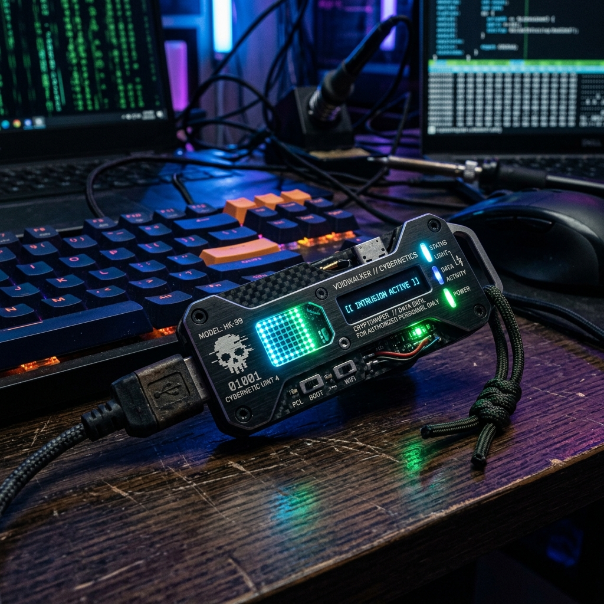
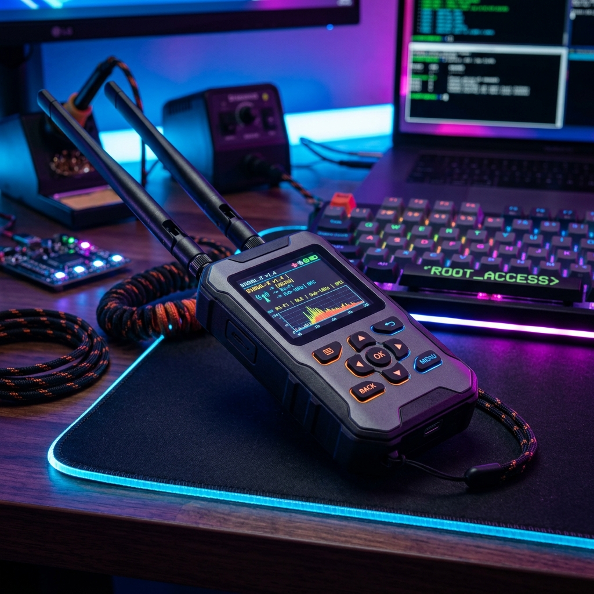
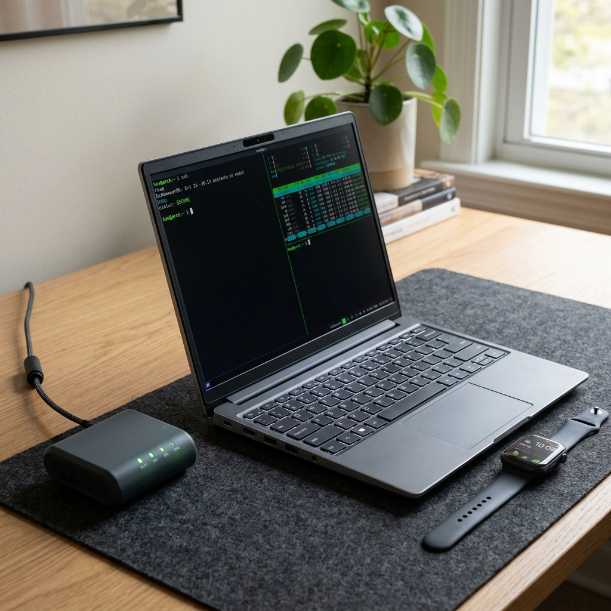

#seguridad #hardware #hacking #privacidad

> [!info] Navegación
> ◀ Anterior: [[09 - Mitigación, Antivirus y Recuperación de Datos]]

---

# 10 — Hardware Hacking y Privacidad Física: Gadgets y Uso Real

El acceso físico a un dispositivo suele significar el **compromiso total del sistema** ("Game Over"). En esta sección exploramos las herramientas de hardware que utilizan tanto los profesionales de ciberseguridad (Red Team / Blue Team) para auditar, como los atacantes para infiltrarse, además de gadgets enfocados en la extrema privacidad.

---

## 🛑 1. Herramientas Ofensivas (Infiltración Física y USB)

Estos dispositivos aprovechan la confianza implícita que los sistemas operativos tienen sobre el hardware físico (como teclados o ratones) para saltarse las protecciones lógicas.

*Concepto de hardware táctico ofensivo estilo Hak5.*

### 🦆 USB Rubber Ducky
- **Qué es:** A simple vista es un pendrive normal, pero por dentro tiene un chip que le dice al ordenador: *"Hola, soy un teclado USB"*. 
- **Uso Real:** Al enchufarlo, el ordenador lo acepta inmediatamente sin pedir permisos (igual que cuando enchufas un teclado nuevo). En milisegundos, el Rubber Ducky "teclea" comandos maliciosos a una velocidad sobrehumana (ej: abrir la terminal, descargar un virus y ejecutarlo antes de que el usuario parpadee).
- **Precio Real:** ~79.99$ (Hak5).

### 🐰 Bash Bunny
- **Qué es:** El hermano mayor del Rubber Ducky. No solo simula un teclado, sino que puede simular múltiples dispositivos a la vez: un teclado, una tarjeta de red Ethernet y un disco duro.
- **Uso Real:** Permite ataques mucho más complejos. Por ejemplo, al conectarlo simula ser una tarjeta de red más rápida que el Wi-Fi del ordenador. El PC automáticamente pasa todo su tráfico de red por el Bash Bunny, permitiendo robar credenciales al vuelo o instalar *backdoors*.
- **Precio Real:** ~119.99$ (Hak5).

### 🐢 LAN Turtle
- **Qué es:** Un adaptador Ethernet a USB que esconde un mini ordenador Linux completo en su interior.
- **Uso Real:** Se conecta en la parte trasera de un PC de oficina sin que el empleado se dé cuenta. Funciona como puente de red transparente, interceptando todo el tráfico, falsificando DNS o abriendo una conexión remota (túnel VPN) para que el atacante controle la red interna desde su casa.
- **Precio Real:** ~79.99$ (Hak5).

### 🔌 O.MG Cable
- **Qué es:** Un cable de carga para móvil (Lightning, USB-C) idéntico a los originales, pero que esconde un microchip con antena Wi-Fi en la punta.
- **Uso Real:** Le prestas el cable a alguien. Cuando lo conecta a su PC, el atacante (que puede estar en el coche de fuera usando la red Wi-Fi invisible que emite el propio cable) envía comandos que el cable inyecta como si fuera un teclado fantasma.
- **Precio Real:** 139.99$ - 179.99$ (Depende del tipo de conector).

---

## 📻 2. Herramientas Inalámbricas y de Radiofrecuencia (RF)

*Concepto de Multiherramienta de Radiofrecuencia.*

### 🐬 Flipper Zero
- **Qué es:** El "tamagotchi para hackers". Es una multiherramienta de bolsillo que lee y emite todo tipo de señales invisibles: sub-GHz, Infrarrojos, RFID, NFC y Bluetooth.
- **Uso Real:** Clonar tarjetas de acceso de hoteles o garajes, abrir barreras de parking antiguas, cambiar el canal de todas las teles de un bar a la vez (infrarrojos), o leer el chip subcutáneo de mascotas. Muy usado en auditorías de control de acceso.
- **Precio Real:** ~169.00$ (Se suele agotar rápido).

### 🍍 Wi-Fi Pineapple
- **Qué es:** Un router táctico diseñado para ataques de red y *Man-in-the-Middle*.
- **Uso Real:** Se lleva en una mochila en una cafetería. Detecta qué redes Wi-Fi está buscando tu móvil (ej: "Starbucks_Free") y crea una red falsa con ese mismo nombre. Tu móvil se conecta automáticamente pensando que es la legítima, y a partir de ahí, todo el tráfico (contraseñas no cifradas, webs visitadas) pasa por la "Piña".
- **Precio Real:** ~119.99$ (Modelo Mark VII).

### 📡 HackRF One
- **Qué es:** Una radio definida por software (SDR). Es como la antena de radio de un coche, pero con esteroides: puede escuchar y transmitir en un espectro brutal (1 MHz a 6 GHz).
- **Uso Real:** Capturar la señal de la llave de un coche moderno cuando el dueño lo cierra, analizarla en un ordenador, modificarla y retransmitirla para robar el coche. También se usa para interceptar comunicaciones de drones o sistemas industriales.
- **Precio Real:** ~330.00$ (Great Scott Gadgets), aunque existen clones chinos por ~100$.

### 💳 ProxMark 3
- **Qué es:** La herramienta definitiva para auditar tarjetas magnéticas y chips (RFID/NFC).
- **Uso Real:** Acercarte a un empleado en el metro, leer subrepticiamente la tarjeta identificativa que lleva colgada en el cuello y crear un clon exacto en una tarjeta virgen en segundos para entrar a su oficina.
- **Precio Real:** ~300.00$ (Modelo RDV4), clones "Easy" en AliExpress por ~40$.

---

## 🛡️ 3. Hardware Enfocado a la Privacidad Extrema

Los expertos en seguridad usan dispositivos específicos (o modificados) para recuperar el control absoluto sobre sus datos y evitar el rastreo corporativo y gubernamental.

*Ecosistema de hardware centrado en la privacidad.*

### 💻 Framework Laptop con Linux / Tails
- **Qué es:** Un portátil 100% modular, reparable y donde el usuario tiene control total sobre cada pieza física (incluyendo interruptores físicos para apagar micrófono y cámara).
- **Uso Real:** Ejecutar Linux para evitar la telemetría de Windows/macOS. Los más paranoicos (o periodistas en zonas de riesgo) lo arrancan con un USB que lleva **Tails OS**, un sistema que enruta todo por la red Tor y que, al apagar el PC, olvida (borra de la RAM) absolutamente todo lo que ha pasado, sin dejar rastro en el disco duro.
- **Precio Real:** A partir de ~800$ - 1.000$ (Versión base DIY).

### 🌐 Router de Viaje (GL.iNet)
- **Qué es:** Un mini-router de bolsillo del tamaño de un cargador.
- **Uso Real:** Llegas a un hotel. En lugar de conectar tu móvil, tu portátil y tu tablet al dudoso Wi-Fi del hotel (donde te pueden espiar), conectas el router de viaje al Wi-Fi del hotel. Tus dispositivos se conectan a tu propio router, que a su vez crea un "túnel VPN" seguro. El hotel solo ve 1 dispositivo conectado enviando ruido cifrado.
- **Precio Real:** ~90$ - 130$ (Modelos Beryl AX o Slate AX).

### ⌚ Smartwatch Autoprogramable (Ej: PineTime)
- **Qué es:** Relojes inteligentes de código abierto sin servicios de Google ni Apple.
- **Uso Real:** Monitorear pasos y ritmo cardíaco sin que una corporación sepa cuándo duermes, qué rutas haces o comparta esos datos médicos con aseguradoras. Todo el procesamiento se queda en la muñeca.
- **Precio Real:** ~27$ - 30$ (Muy asequibles por ser hardware abierto).

### 🎧 iPod Classic Modificado (Rockbox)
- **Qué es:** Un iPod antiguo revivido con baterías nuevas, almacenamiento SD y firmware libre.
- **Uso Real:** Escuchar música sin estar conectado a internet. Evita el rastreo de Spotify (que sabe qué escuchas, dónde, a qué hora y tu estado de ánimo), y al usar auriculares de cable sin Bluetooth, se evita que tiendas físicas o balizas mapeen tus movimientos por la calle leyendo la señal de tus AirPods.
- **Precio Real:** ~150$ - 250$ (Comprando uno restaurado de segunda mano).
