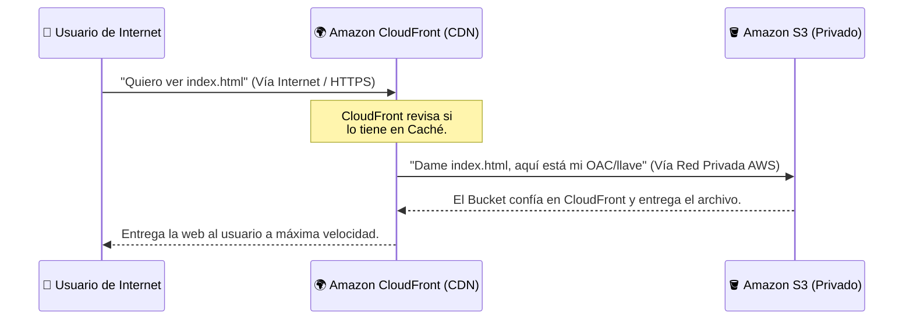

**Tags:** #aws #cloud-practitioner #cp-redes #s3 #ec2 #cloudfront #cdn #arquitectura

# 🏗️ Arquitectura Web: EC2, S3 y CloudFront (CDN)

A la hora de alojar y distribuir páginas web en AWS, entender cómo interactúan **Amazon EC2**, **Amazon S3** y **Amazon CloudFront** es vital tanto para arquitecturas reales como para el examen *AWS Cloud Practitioner*.

Existen dos enfoques principales según el tipo de página web:

---

## 1. 🖥️ Web Dinámica (El Servidor Tradicional con EC2)

Si tu página web requiere procesamiento backend en tiempo real (ej. consultar una base de datos MySQL, procesar pagos, ejecutar PHP, Node.js o Python), necesitas **poder de cómputo**.

- **Amazon EC2 (Elastic Compute Cloud):** Es una máquina virtual donde instalas tu servidor web (como Apache o Nginx). El servidor está "vivo" procesando cada petición del usuario y construyendo la página HTML al vuelo.
- **Inconveniente:** Pagas por segundo que la máquina esté encendida. Si tienes picos masivos de tráfico, la máquina se satura a menos que configures Auto Scaling.

---

## 2. 🪣 Web Estática (El Alojamiento Moderno con S3)

Si tu página web está compuesta únicamente por archivos que no cambian al vuelo (archivos `.html`, `.css`, `.js`, imágenes o frameworks compilados como React o Angular), **no necesitas un servidor EC2**. 

- **Amazon S3 (Simple Storage Service):** En lugar de pagar por un servidor EC2 encendido 24/7, simplemente subes los archivos de tu web a un "Bucket" de S3. S3 tiene una función llamada *Static Website Hosting* que sirve esos archivos directamente a los visitantes.
- **Ventaja:** Cuesta una fracción de un servidor EC2 (céntimos al mes), escala infinitamente sin configuración y nunca se cae (11 nueves de durabilidad).

---

## 🔒 El Gran Dilema de S3: ¿Público o Privado?

Por defecto, todos los buckets de S3 en AWS nacen siendo **estrictamente privados**. Nadie en internet puede ver su contenido.

### ❌ Las Consecuencias de Dejar un S3 en Público
Para que un usuario pueda ver tu web alojada en S3, la solución de los novatos es desactivar el bloqueo público ("Block Public Access") y hacer el bucket accesible para todo internet. **Esto es una práctica pésima y peligrosa:**

1. **Fuga de Datos Sensibles:** Un error de configuración puede exponer documentos privados, copias de seguridad o datos de clientes almacenados en el mismo bucket al público general. (Causa #1 de filtraciones masivas de datos).
2. **Costes Desorbitados:** En AWS, tú pagas por el ancho de banda saliente (*Data Transfer Out*). Si tu bucket es público, bots, web scrapers o atacantes pueden descargar los archivos de tu bucket millones de veces directamente desde S3, generándote una factura de miles de euros.
3. **Falta de HTTPS:** S3 por sí solo sirviendo webs estáticas no soporta certificados SSL/TLS propios, por lo que tu web aparecerá como "No segura" en el navegador.

---

## 🌍 La Solución Profesional: CloudFront + S3 Privado

Si el bucket S3 debe mantenerse estrictamente **Privado** (como recomienda AWS y cualquier auditoría de seguridad), los archivos no están accesibles desde internet. ¿Cómo pueden entonces los usuarios ver la web?

La solución es poner un intermediario en la frontera (Edge) de AWS: **Amazon CloudFront (CDN)**.

### ¿Qué es CloudFront?
CloudFront es una Red de Entrega de Contenido (CDN). Tiene servidores repartidos por todo el mundo (*Edge Locations*). Cuando un usuario en España pide ver tu web, no va hasta tu servidor en Estados Unidos, sino que el servidor de CloudFront en Madrid le entrega una copia guardada (caché) de tu web a la velocidad de la luz.

### ¿Cómo se comunican CloudFront y el S3 Privado?

Aquí está la magia arquitectónica (muy importante para el examen):

1. **El S3 sigue Privado:** Mantenemos el bloqueo de acceso público activado en S3. Nadie en internet puede entrar al bucket.
2. **OAC / OAI (Origin Access Control / Identity):** Creamos una "identidad o llave especial" dentro de AWS y se la damos **exclusivamente a CloudFront**.
3. **Política de Bucket:** Le decimos al bucket S3: *"Rechaza a todo el mundo, EXCEPTO a CloudFront cuando venga con su llave especial"*.

### 🔄 El Flujo Completo de la Petición

### 🏆 Ventajas de esta Arquitectura

| Ventaja | Explicación |
| :--- | :--- |
| **Seguridad Total** | El bucket de S3 es completamente invisible y blindado desde internet. Solo CloudFront puede leerlo. |
| **Caché y Rendimiento** | CloudFront guarda la web cerca de los usuarios por todo el mundo, bajando la latencia drásticamente. |
| **Ahorro de Costes** | Como CloudFront tiene los archivos en caché, casi no se hacen peticiones directas al S3. La transferencia de datos de S3 a CloudFront es **GRATUITA** en AWS. |
| **HTTPS y SSL** | CloudFront permite usar tu propio dominio (`miweb.com`) e instalar certificados SSL gratuitos de *AWS Certificate Manager* para tener el candado de seguridad. |

---
→ Volver al índice: [[00 - Índice Redes|🪐 Módulo de Redes]]
