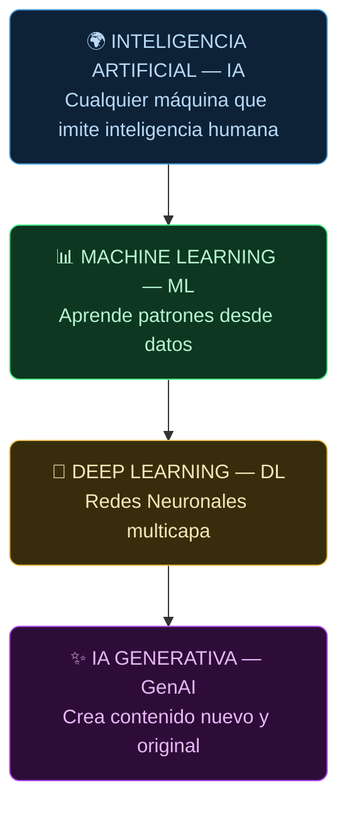

**Tags:** #fundamentos #ia #ml #dl #genai #m1-fundamentos

> [!quote] Concepto fundamental
> La IA no es una sola tecnología. Es un campo de estudio que contiene capas cada vez más especializadas. Visualízalo como **muñecas rusas**: cada capa interna es un subconjunto más potente y específico de la exterior.

---

## 🪆 El Ecosistema IA — Las Cuatro Capas

---

## 🔎 Comparativa Detallada de las Cuatro Capas

| Nivel | ¿Qué hace? | ¿Aprende sólo? | Datos típicos | Ejemplo canónico |
| :--- | :--- | :---: | :--- | :--- |
| **IA clásica** | Sigue reglas codificadas por humanos | ❌ | N/A (reglas `if/else`) | Bot de ajedrez con reglas fijas |
| **Machine Learning** | Aprende patrones estadísticos desde datos | ✅ | Tablas, CSV estructurados | Filtro de spam de Gmail |
| **Deep Learning** | Encuentra patrones en datos no estructurados mediante redes neuronales | ✅✅ | Imágenes, audio, texto libre | Reconocimiento facial de iPhone |
| **IA Generativa** | Crea contenido nuevo (texto, imágenes, código) que no existía antes | ✅✅✅ | Todo tipo: texto, código, imagen | ChatGPT, DALL-E, Amazon Titan |

---

## 🧩 Capa 1 — Inteligencia Artificial (IA clásica)

**¿Qué es?** El concepto más amplio. Cualquier sistema que imite comportamiento inteligente humano.

**¿Cómo funciona?** En su forma más básica, **no aprende**: un programador escribe reglas explícitas (`if temperatura > 38°C → fiebre`). Los "Sistemas Expertos" de los años 70-80 eran IA pura basada en reglas.

> [!example] Ejemplo real
> El bot de ajedrez de tu teléfono puede evaluar millones de posiciones mediante fuerza bruta. No aprendió a jugar al ajedrez: sigue algoritmos diseñados por humanos.

---

## 📊 Capa 2 — Machine Learning (ML)

**¿Qué aporta?** La clave del salto: **la máquina deduce las reglas por sí sola** a partir de los datos. No le dices "si es rojo y redondo es una manzana". Le das 1.000.000 de fotos y ella descifra las reglas.

**La revolución:** En ML ya no programas la solución; **programas el proceso de aprendizaje**.

> [!example] Ejemplo real
> Un filtro de spam no fue programado con la regla "si contiene 'Viaja gratis' → spam". Fue entrenado con millones de emails etiquetados como spam/no-spam y aprendió solo qué palabras o patrones son señales de spam.

---

## 🧠 Capa 3 — Deep Learning (DL)

**¿Qué aporta?** Una subcategoría de ML que usa **Redes Neuronales Artificiales** (ANN) de muchas capas ("profundas"). Su superpoder: puede extraer características de datos no estructurados **sin que un humano le diga en qué fijarse**.

**La diferencia con ML clásico:**

- En ML tradicional, un humano a veces "extrae features" manualmente (ej. le dice al modelo que mire el color y el peso).

- En DL, el modelo aprende solo qué features importan directamente de los píxeles crudos, las ondas de audio o los caracteres de texto.

> [!example] Ejemplos reales
>
> - **Visión por ordenador:** Detecta tumores en radiografías analizando píxeles en bruto.
>
> - **Reconocimiento de voz:** Transcribe audio a texto procesando ondas de sonido.
>
> - **AlphaGo:** Aprendió a jugar Go mediante redes neuronales (el Go tiene más posiciones que átomos en el universo, imposible por fuerza bruta).

---

## ✨ Capa 4 — IA Generativa (GenAI)

**¿Qué aporta?** El salto conceptual más importante: de **analizar/clasificar** la realidad a **crear** realidad nueva.

| Paradigma | Ejemplo |
| :--- | :--- |
| **DL clásico (clasifica):** | "Esta foto tiene un 99.8% de probabilidad de contener un perro" |
| **GenAI (crea):** | "Genera una foto de un perro verde volando sobre Manhattan" |

**¿Qué permite crear?**

- 📝 Texto: artículos, código, correos, resúmenes

- 🖼️ Imágenes: arte, fotos sintéticas, diseños

- 🎵 Audio: música, voces sintéticas

- 🎬 Vídeo: clips generados desde texto

- 💻 Código: funciones, tests, documentación

> [!tip] Truco de examen — La relación correcta
> El examen puede preguntarte la relación entre estos conceptos. La respuesta siempre sigue este patrón:
> **"El Deep Learning es un subconjunto del Machine Learning, que es un subconjunto de la Inteligencia Artificial"**
> Nunca al revés. Y la GenAI es una aplicación de los modelos de DL.

---

## 📋 Chuleta Rápida para el Examen

| Si el escenario menciona... | Piensa en... |
| :--- | :--- |
| "Reglas codificadas a mano", "sistema experto" | **IA clásica** |
| "Aprende de datos históricos", "predice" | **Machine Learning** |
| "Imágenes", "audio", "texto no estructurado", "redes neuronales" | **Deep Learning** |
| "Genera texto/imágenes/código", "LLM", "chatbot creativo" | **IA Generativa** |

---
→ Volver al índice: [[📂M1 - Fundamentos IA y ML/00 - Índice Módulo 1|🪐 Módulo 1: Fundamentos IA y ML]]
