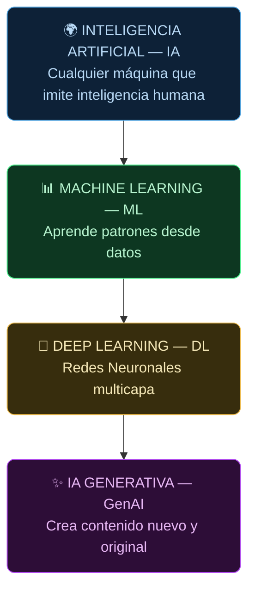

**Tags:** #fundamentos #ia #ml #dl #genai #m1-fundamentos

> [!quote] Concepto fundamental
> La IA no es una sola tecnología. Es un campo de estudio que contiene capas cada vez más especializadas. Visualízalo como **muñecas rusas**: cada capa interna es un subconjunto más potente y específico de la exterior.

---

## 🪆 El Ecosistema IA — Las Cuatro Capas

```mermaid
graph TD
 A["🌍 INTELIGENCIA ARTIFICIAL — IA<br/>Cualquier máquina que imite inteligencia humana"]
 B["📊 MACHINE LEARNING — ML<br/>Aprende patrones desde datos"]
 C["🧠 DEEP LEARNING — DL<br/>Redes Neuronales multicapa"]
 D["✨ IA GENERATIVA — GenAI<br/>Crea contenido nuevo y original"]

 A --> B --> C --> D

 style A fill:#0d2137,stroke:#4a9eda,color:#b8d9f5,rx:8
 style B fill:#0d3721,stroke:#4aed8a,color:#b8f5d0,rx:8
 style C fill:#372d0d,stroke:#edba4a,color:#f5e8b8,rx:8
 style D fill:#2d0d37,stroke:#b04aed,color:#e8b8f5,rx:8
```

---

## 🔎 Comparativa Detallada de las Cuatro Capas

| Nivel | ¿Qué hace? | ¿Aprende sólo? | Datos típicos | Ejemplo canónico |
| :--- | :--- | :---: | :--- | :--- |
| **IA clásica** | Sigue reglas codificadas por humanos | ❌ | N/A (reglas `if/else`) | Bot de ajedrez con reglas fijas |
| **Machine Learning** | Aprende patrones estadísticos desde datos | ✅ | Tablas, CSV estructurados | Filtro de spam de Gmail |
| **Deep Learning** | Encuentra patrones en datos no estructurados mediante redes neuronales | ✅✅ | Imágenes, audio, texto libre | Reconocimiento facial de iPhone |
| **IA Generativa** | Crea contenido nuevo (texto, imágenes, código) que no existía antes | ✅✅✅ | Todo tipo: texto, código, imagen | ChatGPT, DALL-E, Amazon Titan |

---

## 🧩 Capa 1 — Inteligencia Artificial (IA clásica)

**¿Qué es?** El concepto más amplio. Cualquier sistema que imite comportamiento inteligente humano.

**¿Cómo funciona?** En su forma más básica, **no aprende**: un programador escribe reglas explícitas (`if temperatura > 38°C → fiebre`). Los "Sistemas Expertos" de los años 70-80 eran IA pura basada en reglas.

> [!example] Ejemplo real
> El bot de ajedrez de tu teléfono puede evaluar millones de posiciones mediante fuerza bruta. No aprendió a jugar al ajedrez: sigue algoritmos diseñados por humanos.

---

## 📊 Capa 2 — Machine Learning (ML)

**¿Qué aporta?** La clave del salto: **la máquina deduce las reglas por sí sola** a partir de los datos. No le dices "si es rojo y redondo es una manzana". Le das 1.000.000 de fotos y ella descifra las reglas.

**La revolución:** En ML ya no programas la solución; **programas el proceso de aprendizaje**.

> [!example] Ejemplo real
> Un filtro de spam no fue programado con la regla "si contiene 'Viaja gratis' → spam". Fue entrenado con millones de emails etiquetados como spam/no-spam y aprendió solo qué palabras o patrones son señales de spam.

---

## 🧠 Capa 3 — Deep Learning (DL)

**¿Qué aporta?** Una subcategoría de ML que usa **Redes Neuronales Artificiales** (ANN) de muchas capas ("profundas"). Su superpoder: puede extraer características de datos no estructurados **sin que un humano le diga en qué fijarse**.

**La diferencia con ML clásico:**

- En ML tradicional, un humano a veces "extrae features" manualmente (ej. le dice al modelo que mire el color y el peso).

- En DL, el modelo aprende solo qué features importan directamente de los píxeles crudos, las ondas de audio o los caracteres de texto.

> [!example] Ejemplos reales
>
> - **Visión por ordenador:** Detecta tumores en radiografías analizando píxeles en bruto.
>
> - **Reconocimiento de voz:** Transcribe audio a texto procesando ondas de sonido.
>
> - **AlphaGo:** Aprendió a jugar Go mediante redes neuronales (el Go tiene más posiciones que átomos en el universo, imposible por fuerza bruta).

---

## ✨ Capa 4 — IA Generativa (GenAI)

**¿Qué aporta?** El salto conceptual más importante: de **analizar/clasificar** la realidad a **crear** realidad nueva.

| Paradigma | Ejemplo |
| :--- | :--- |
| **DL clásico (clasifica):** | "Esta foto tiene un 99.8% de probabilidad de contener un perro" |
| **GenAI (crea):** | "Genera una foto de un perro verde volando sobre Manhattan" |

**¿Qué permite crear?**

- 📝 Texto: artículos, código, correos, resúmenes

- 🖼️ Imágenes: arte, fotos sintéticas, diseños

- 🎵 Audio: música, voces sintéticas

- 🎬 Vídeo: clips generados desde texto

- 💻 Código: funciones, tests, documentación

> [!tip] Truco de examen — La relación correcta
> El examen puede preguntarte la relación entre estos conceptos. La respuesta siempre sigue este patrón:
> **"El Deep Learning es un subconjunto del Machine Learning, que es un subconjunto de la Inteligencia Artificial"**
> Nunca al revés. Y la GenAI es una aplicación de los modelos de DL.

> [!brain] El Mito de los LLMs
> Un error común en el examen es creer que los LLMs "piensan" o "razonan". En realidad, usan estadísticas de probabilidad (la arquitectura Transformer) para predecir matemáticamente cuál es la siguiente palabra en una secuencia.

---

## 🧮 Algoritmos vs Modelos vs Entrenamiento

Para el examen, es crucial no usar estos términos como sinónimos. Piensa en una pastelería:

> [!abstract] La Metáfora de la Cocina
> - **Algoritmo (La receta):** Es la base matemática pura. Instrucciones paso a paso que aún no han procesado ningún dato. En AWS, es el algoritmo vacío que eliges en SageMaker.
> - **Entrenamiento (Cocinar):** El momento en el que metes *tus datos históricos* al algoritmo para que aprenda. Mezclas tus ingredientes (datos en **S3**) y enciendes el horno (poder de cómputo en **EC2** / SageMaker Training).
> - **Modelo (La tarta terminada):** El resultado final. El algoritmo *después* de haber aprendido de tus datos. Ya está empaquetado y listo en un **Endpoint de SageMaker** para responder a tus preguntas (hacer predicciones al instante).

### Los 3 Algoritmos Clave del Examen

Hay docenas, pero el examen se centra en estos tres para comprobar si sabes elegir la herramienta adecuada:

**1. Regresión Lineal (Linear Regression)**

- **¿Para qué sirve?** Para predecir un **número continuo** en una escala infinita.

- **¿Cómo funciona?** Traza una línea matemática que atraviesa puntos de datos pasados para estimar el futuro.

- **En el examen:** Si te piden "predecir ventas futuras", "estimar el precio de una casa", o la respuesta es un número exacto ($45, 23ºC), elige Regresión Lineal.

**2. K-Means (K-Medias)**

- **¿Para qué sirve?** Para **agrupar** datos *sin etiquetas previas* (Aprendizaje No Supervisado).

- **¿Cómo funciona?** Le dices "hazme 3 grupos (*k=3*)" y junta automáticamente a los usuarios/datos más parecidos entre sí, sin saber cómo se llaman esos grupos.

- **En el examen:** Si ves "segmentar perfiles de compra sin categorías definidas" o "descubrir agrupaciones ocultas en datos", elige K-Means.

**3. Árboles de Decisión (Decision Trees)**

- **¿Para qué sirve?** Para **clasificar** en categorías concretas (Aprendizaje Supervisado).

- **¿Cómo funciona?** Crea un diagrama de flujo con reglas de Sí/No fáciles de interpretar por humanos.

- **En el examen:** Si piden "aprobar o denegar un préstamo" o "decidir si es Spam basándose en reglas transparentes", elige Árboles de Decisión.

---

## 🐱 Ejemplo Práctico: Un Mismo Problema a Través de las 4 Capas

Para entender cómo se relacionan IA, ML, DL y GenAI, vamos a resolver un **único problema** ("¿Es este animal un gato?") pasándolo por las 4 fases. Así ves claramente qué aporta cada capa respecto a la anterior.

### Fase 1: IA Clásica — Reglas Rígidas

Un programador escribe a mano: *"Si la imagen tiene 2 triángulos puntiagudos arriba Y bigotes horizontales → es un gato"*.
- **Problema:** Si el gato está de espaldas, durmiendo hecho una bola, o lleva un disfraz, el sistema falla. No aprende, solo obedece lo que le han escrito.
- **Analogía humana:** Es como un turista con un diccionario de frases: solo puede decir exactamente lo que tiene escrito en el libro.

### Fase 2: Machine Learning — Aprende de Datos Estructurados

Le damos una tabla de Excel con datos numéricos de 10.000 animales (`Peso_kg`, `Altura_cm`, `Longitud_orejas`, `Longitud_cola`) y una columna con la etiqueta `Tipo = Gato / Perro / Pájaro`. El modelo (ej. un **SVM** o un **XGBoost**) analiza esos números y deduce por sí solo las reglas matemáticas que separan a un gato de un perro.
- **Mejora:** Ya no dependemos de reglas manuales. Si le damos suficientes datos, generaliza bien.
- **Problema:** Necesitamos que un humano prepare los datos (medir el peso, la altura, etc. → **Feature Engineering**). No puede procesar la foto cruda.

### Fase 3: Deep Learning — Aprende de Datos No Estructurados

En lugar de darle un Excel con medidas, le pasamos **la foto cruda** (píxeles). Una Red Neuronal Convolucional (**CNN/ResNet**) examina bordes, texturas y formas directamente de los píxeles, y reconoce al gato aunque esté de espaldas, borroso o en una pose extraña.
- **Mejora:** No necesitamos Feature Engineering manual. El modelo aprende solo qué features importan.
- **Problema:** Solo clasifica. No puede imaginar ni inventar nada nuevo.

### Fase 4: IA Generativa — Crea Contenido Nuevo

Le escribimos un prompt: *"Un gato con gafas de sol conduciendo un descapotable en Marte"*. Un modelo generativo (ej. un **GAN** o un modelo de **Difusión** como Titan Image Generator) crea una imagen completamente nueva que nunca existió en sus datos de entrenamiento.
- **El salto:** Pasamos de *analizar la realidad* a *crear realidad nueva*.

> [!brain] Clave para el examen
> Los humanos hacemos las 4 cosas a la vez:
> - A veces **seguimos reglas** (*"si el semáforo está en rojo, para"*) → **IA Clásica**
> - A veces **clasificamos** por experiencia (*"eso parece comida en mal estado"*) → **ML**
> - A veces **reconocemos** cosas nuevas por contexto (*"nunca vi esta raza de perro, pero sé que es un perro"*) → **DL**
> - A veces **creamos** cosas originales (*"voy a inventar una receta nueva"*) → **GenAI**

---

## 📋 Chuleta Rápida para el Examen

| Si el escenario menciona... | Piensa en... |
| :--- | :--- |
| "Reglas codificadas a mano", "sistema experto" | **IA clásica** |
| "Aprende de datos históricos", "predice" | **Machine Learning** |
| "Imágenes", "audio", "texto no estructurado", "redes neuronales" | **Deep Learning** |
| "Genera texto/imágenes/código", "LLM", "chatbot creativo" | **IA Generativa** |

---
→ Volver al índice: [[📂M1 - Fundamentos IA y ML/00 - Índice Módulo 1|🪐 Módulo 1: Fundamentos IA y ML]]
