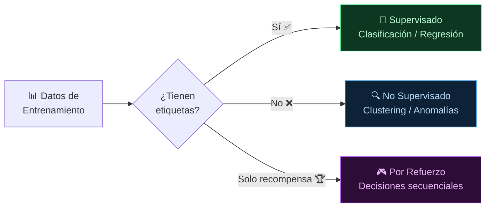
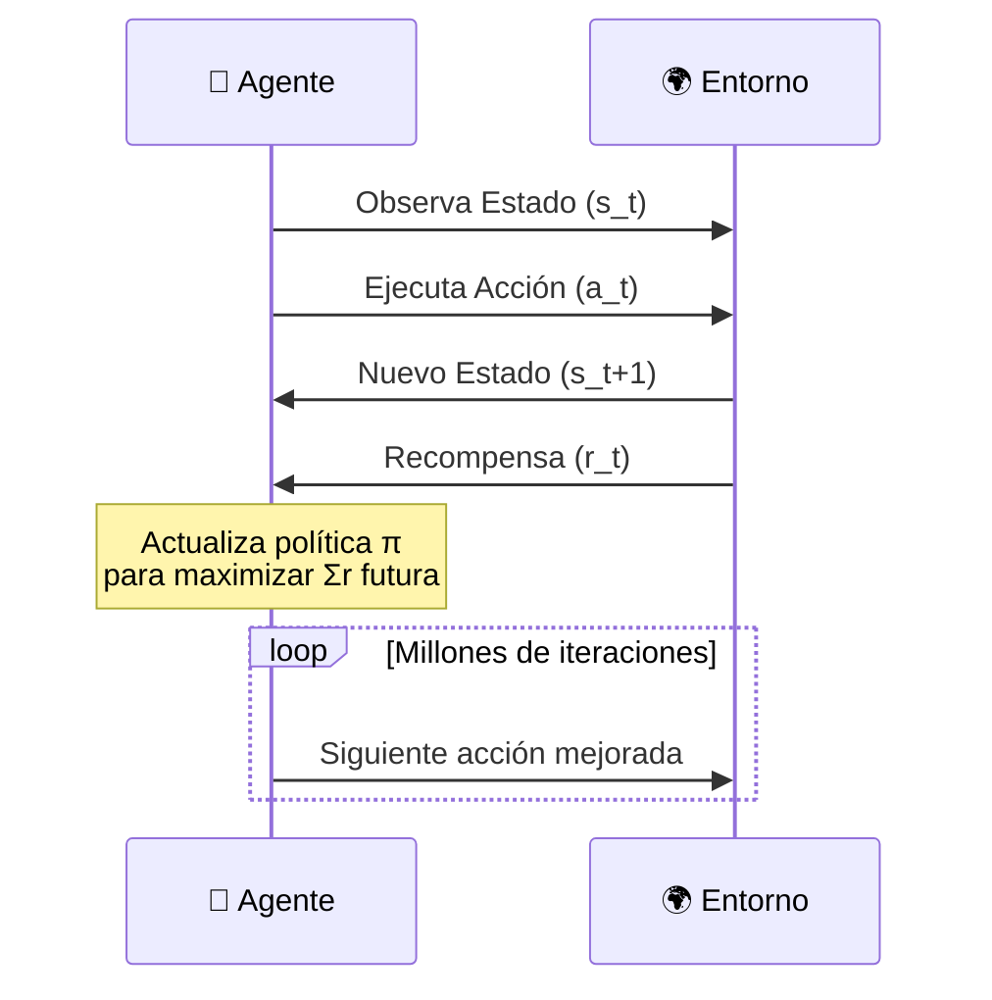

**Tags:** #ml #supervisado #no-supervisado #refuerzo #ia
 #m1-fundamentos

> [!quote] Concepto fundamental
> Los tres paradigmas de ML se diferencian por **qué información recibe el modelo durante el entrenamiento**. Esta distinción determina qué tipo de problemas puede resolver cada uno.

---

## 🔭 Visión General de los Tres Paradigmas

---

## 🎯 Aprendizaje Supervisado (Supervised Learning)

### ¿Qué es?

El modelo aprende de datos **etiquetados**: cada ejemplo tiene un input `X` y una respuesta correcta `y`. Es como estudiar con un libro de ejercicios resueltos.

**Formula lo que aprende:** `f(X) → y`

### Sub-tipos y Casos de Uso

#### 🏷️ Clasificación

La salida es una **categoría discreta** (una clase de entre varias). El modelo clasifica el input en "cubos" o "cajas" predefinidas.

**Ejemplo muy práctico:** Imagina que tienes una fábrica de manzanas. Hay una cámara que toma fotos de las manzanas en la cinta transportadora. El modelo ha visto previamente miles de fotos etiquetadas por un humano ("Manzana Buena", "Manzana Podrida"). Ahora, cuando llega una manzana nueva, el modelo la clasifica en una de esas dos cajas.

| Tipo | Ejemplo práctico | Casos de uso AWS |
| :--- | :--- | :--- |
| **Binaria (2 opciones)** | ¿El correo es Spam o No-spam? | Amazon Comprehend (detección PII) |
| **Multiclase (+2 opciones)** | Sentimiento: Positivo / Negativo / Neutro | Amazon Comprehend (Sentiment Analysis) |
| **Multi-etiqueta (Varias a la vez)** | Un artículo es de: [Deportes, Opinión] | Clasificación de artículos |

> [!example] Escenarios de clasificación para el examen
>
> - Detectar si una transacción bancaria es **fraude o no** → Clasificación binaria
>
> - Clasificar el **sentimiento** de una reseña → Clasificación multiclase
>
> - Diagnosticar si una imagen médica muestra **qué enfermedad** → Clasificación multiclase

#### 📈 Regresión

La salida es un **valor numérico continuo**. En lugar de meter algo en una "caja", el modelo predice un **número exacto** en una escala infinita.

**Ejemplo muy práctico:** Imagina que quieres vender tu coche de segunda mano. Le pasas al modelo un excel con miles de coches vendidos anteriormente con sus datos (kilómetros, año, marca, estado) y el **precio final de venta** (la etiqueta numérica). El modelo aprende la fórmula matemática que relaciona esos datos y te predice un número específico: *"Tu coche se venderá por 12.350€"*.

| Caso de uso | Output del modelo (siempre un número) |
| :--- | :--- |
| Predicción de precio de una casa | $245,000 |
| Estimación de temperatura mañana | 23.7°C |
| Predicción de ventas del próximo trimestre | 45,320 unidades |

> [!example] Escenarios de regresión para el examen
>
> - Estimar el **precio de venta** de un inmueble → Regresión
>
> - Predecir cuántas unidades de stock serán necesarias → Regresión (usa también Amazon Forecast)

---

## 🔍 Aprendizaje No Supervisado (Unsupervised Learning)

### ¿Qué es?

El modelo recibe datos **sin etiquetas** (sin las respuestas correctas). Le decimos al modelo: *"Búscate la vida y encuentra patrones ocultos"*. 

**Metáfora:** Es como darte un cajón lleno de cientos de fotos desordenadas de personas que no conoces. No sabes sus nombres ni parentescos (no tienes etiquetas), pero por tu cuenta puedes agruparlas por similitud visual: "Estos se parecen mucho entre sí, los pondré en este montón".

### Técnicas Principales (Explicadas de forma práctica)

**1. Clustering (Agrupamiento)**

- **En la práctica:** Eres dueño de un supermercado. Tienes un Excel enorme de qué productos se compran juntos en cada ticket, pero no sabes la demografía de tus clientes. El modelo analiza los tickets y te crea 3 grupos (clusters): "Los que compran pañales y cerveza los viernes", "Los que compran mucha verdura", y "Los que compran dulces". El modelo no sabe cómo se llaman esos grupos, solo detecta que hay comportamientos idénticos.

- **Uso típico:** Segmentación de clientes en Marketing para enviar correos personalizados.

**2. Reglas de Asociación**

- **En la práctica:** Similar al anterior pero más directo a la relación producto-producto. El modelo detecta que *"El 80% de las veces que alguien compra una consola, también compra un mando extra"*.

- **Uso típico:** El motor de recomendaciones de Amazon: *"Los clientes que compraron este artículo también compraron..."*

**3. Reducción de Dimensionalidad**

- **En la práctica:** Imagina que monitorizas un motor industrial. Tienes 500 sensores diferentes midiendo cada milisegundo (temperatura, presión, vibración...). Son demasiados datos (dimensiones) para que un modelo los analice rápido. Esta técnica usa matemáticas para "exprimir" la información y resumir esos 500 sensores en solo 3 indicadores clave ("Salud General", "Estrés", "Desgaste"), perdiendo muy poca información por el camino.

- **Uso típico:** Simplificar datos gigantes para que otros modelos los procesen más rápido, o compresión de imágenes.

**4. Detección de Anomalías**

- **En la práctica:** El modelo analiza millones de transacciones de tu tarjeta de crédito y entiende tu patrón "normal" (compras en Madrid, de 10€ a 100€, en horario de día). De repente, detecta un pago de 3.000€ en diamantes a las 4 AM en otro país. Como ese dato está aisladísimo de tu "cluster" normal, lo marca como anomalía y te bloquea la tarjeta.

- **Uso típico:** Prevención de fraude, detección de fallos inminentes en maquinaria.

> [!example] Escenarios no supervisados para el examen
>
> - Una empresa tiene datos de clientes **sin clasificar** y quiere agruparlos por comportamiento de compra → **Clustering** (No Supervisado)
>
> - Detectar transacciones bancarias **inusuales** sin tener ejemplos previos de fraude → **Detección de Anomalías**

> [!tip] Truco de examen — Sin etiquetas = No supervisado
> Si la pregunta dice "datos sin etiquetar" o "encontrar grupos/patrones ocultos" → **Unsupervised Learning**. Si hay etiquetas con la respuesta correcta → **Supervised Learning**.

---

## 🎮 Aprendizaje por Refuerzo (Reinforcement Learning)

### ¿Qué es?

Un **agente** (el modelo/programa) aprende a tomar decisiones interactuando con un **entorno**. Recibe **recompensas** (puntos positivos) por acciones buenas y **penalizaciones** (puntos negativos) por acciones malas. No aprende leyendo un Excel estático con respuestas, sino mediante la **prueba y error** repetida miles de veces.

**Metáfora 1: Entrenar a un perro.** No le das un libro de instrucciones para que aprenda a sentarse; simplemente le dices "siéntate". Si lo hace bien, le das una galleta (recompensa +1). Si lo hace mal o muerde el zapato, le riñes (penalización -1). El perro aprende por su cuenta qué comportamientos maximizan el número de galletas que recibe.

**Metáfora 2: IA jugando a Super Mario Bros.** 

- El **Agente** es Mario. 

- El **Entorno** es el nivel del juego. 

- Al principio, Mario no sabe jugar. Pulsa botones al azar. Si cae por un agujero recibe un castigo (-100 puntos y Game Over). Si salta sobre un enemigo recibe un premio (+100 puntos). Tras morir millones de veces (iteraciones), la IA descubre la secuencia exacta de botones que tiene que pulsar (su nueva **Política**) para pasarse el nivel lo más rápido posible maximizando la puntuación final.

### Componentes del Reinforcement Learning

| Componente | Definición | Ejemplo (juego Go) |
| :--- | :--- | :--- |
| **Agente** | El modelo que aprende | AlphaGo |
| **Entorno** | El contexto con el que interactúa | El tablero de Go |
| **Estado (State)** | Situación actual | Posición de todas las fichas |
| **Acción (Action)** | Decisión del agente | Colocar ficha en posición X |
| **Recompensa (Reward)** | Señal de retroalimentación | +1 si gana, -1 si pierde |
| **Política (Policy)** | Estrategia aprendida | "Dado este estado, haz esta acción" |

### Casos de Uso del Reinforcement Learning

> [!example] RL en la práctica
>
> - **AlphaGo / AlphaZero (DeepMind):** Aprendió a jugar Go y ajedrez siendo su propio rival, superando a campeones mundiales.
>
> - **Robótica:** Un brazo robótico aprende a coger objetos frágiles sin romperlos.
>
> - **RLHF — Reinforcement Learning from Human Feedback:** La técnica clave para alinear LLMs con preferencias humanas. Así se entrenó ChatGPT/InstructGPT. **¡Clave para el examen!**
>
> - **Optimización de rutas:** Un agente de logística aprende a optimizar rutas de reparto.

> [!warning] RLHF — Concepto clave del examen
> **RLHF** combina:
>
> 1. **Supervised Fine-tuning** en ejemplos demostrados por humanos.
>
> 2. **Reward Model** entrenado con preferencias humanas (qué respuesta es mejor).
>
> 3. **RL (PPO)** para optimizar el LLM según ese Reward Model.
> Si el examen pregunta cómo se alinean los LLMs con valores humanos → **RLHF**.

---

## 📋 Tabla Comparativa Final

| Paradigma | Etiquetas en entrenamiento | Tipo de output | Cuándo usarlo |
| :--- | :---: | :--- | :--- |
| **Supervisado** | ✅ Sí | Clase o valor numérico | Cuando tienes datos etiquetados y un objetivo claro |
| **No Supervisado** | ❌ No | Grupos, anomalías, representaciones | Cuando quieres explorar datos sin etiquetas |
| **Por Refuerzo** | 🏆 Recompensas | Política de decisión | Cuando el aprendizaje viene de la interacción con el entorno |

---
→ Volver al índice: [[📂M1 - Fundamentos IA y ML/00 - Índice Módulo 1|🪐 Módulo 1: Fundamentos IA y ML]]
