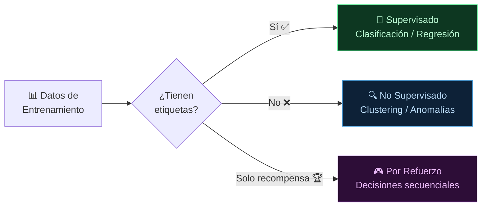
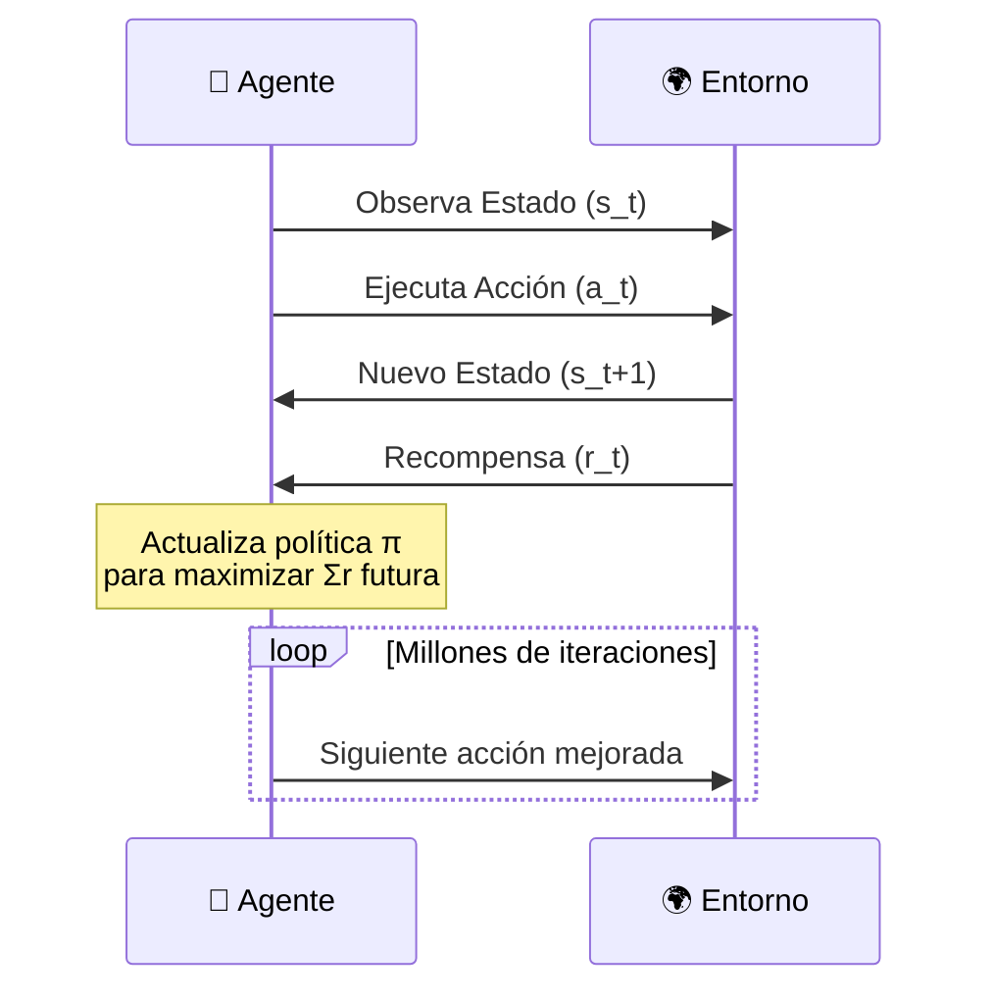

**Tags:** #ml #supervisado #no-supervisado #refuerzo #ia
 #m1-fundamentos

> [!quote] Concepto fundamental
> Los tres paradigmas de ML se diferencian por **qué información recibe el modelo durante el entrenamiento**. Esta distinción determina qué tipo de problemas puede resolver cada uno.

---

## 🔭 Visión General de los Tres Paradigmas

```mermaid
graph LR
 A["📊 Datos de\nEntrenamiento"] --> B{"¿Tienen\netiquetas?"}
 B -->|"Sí ✅"| C["🎯 Supervisado\nClasificación / Regresión"]
 B -->|"No ❌"| D["🔍 No Supervisado\nClustering / Anomalías"]
 B -->|"Solo recompensa 🏆"| E["🎮 Por Refuerzo\nDecisiones secuenciales"]

 style C fill:#0d3721,stroke:#4aed8a,color:#b8f5d0
 style D fill:#0d2137,stroke:#4a9eda,color:#b8d9f5
 style E fill:#2d0d37,stroke:#b04aed,color:#e8b8f5
```

---

## 🎯 Aprendizaje Supervisado (Supervised Learning)

### ¿Qué es?

El modelo aprende de datos **etiquetados**: cada ejemplo tiene un input `X` y una respuesta correcta `y`. Es como estudiar con un libro de ejercicios resueltos.

**Formula lo que aprende:** `f(X) → y`

### Sub-tipos y Casos de Uso

#### 🏷️ Clasificación

La salida es una **categoría discreta** (una clase de entre varias). El modelo clasifica el input en "cubos" o "cajas" predefinidas.

**Ejemplo muy práctico:** Imagina que tienes una fábrica de manzanas. Hay una cámara que toma fotos de las manzanas en la cinta transportadora. El modelo ha visto previamente miles de fotos etiquetadas por un humano ("Manzana Buena", "Manzana Podrida"). Ahora, cuando llega una manzana nueva, el modelo la clasifica en una de esas dos cajas.

| Tipo | Ejemplo práctico | Casos de uso AWS |
| :--- | :--- | :--- |
| **Binaria (2 opciones)** | ¿El correo es Spam o No-spam? | Amazon Comprehend (detección PII) |
| **Multiclase (+2 opciones)** | Sentimiento: Positivo / Negativo / Neutro | Amazon Comprehend (Sentiment Analysis) |
| **Multi-etiqueta (Varias a la vez)** | Un artículo es de: [Deportes, Opinión] | Clasificación de artículos |

> [!example] Escenarios de clasificación para el examen
>
> - Detectar si una transacción bancaria es **fraude o no** → Clasificación binaria
>
> - Clasificar el **sentimiento** de una reseña → Clasificación multiclase
>
> - Diagnosticar si una imagen médica muestra **qué enfermedad** → Clasificación multiclase

#### 📈 Regresión

La salida es un **valor numérico continuo**. En lugar de meter algo en una "caja", el modelo predice un **número exacto** en una escala infinita.

**Ejemplo muy práctico:** Imagina que quieres vender tu coche de segunda mano. Le pasas al modelo un excel con miles de coches vendidos anteriormente con sus datos (kilómetros, año, marca, estado) y el **precio final de venta** (la etiqueta numérica). El modelo aprende la fórmula matemática que relaciona esos datos y te predice un número específico: *"Tu coche se venderá por 12.350€"*.

| Caso de uso | Output del modelo (siempre un número) |
| :--- | :--- |
| Predicción de precio de una casa | $245,000 |
| Estimación de temperatura mañana | 23.7°C |
| Predicción de ventas del próximo trimestre | 45,320 unidades |

> [!example] Escenarios de regresión para el examen
>
> - Estimar el **precio de venta** de un inmueble → Regresión
>
> - Predecir cuántas unidades de stock serán necesarias → Regresión (usa también Amazon Forecast)

---

### 🔧 Feature Engineering en Aprendizaje Supervisado

Antes de entrenar un modelo supervisado, necesitas preparar los datos. Esta preparación se llama **Feature Engineering** (Ingeniería de Características): transformar los datos brutos en algo que el modelo pueda procesar eficientemente.

#### Datos Estructurados (Tablas, CSV, Bases de datos)
Son datos organizados en filas y columnas con tipos definidos (números, fechas, categorías).

| Técnica | Qué hace | Ejemplo |
| :--- | :--- | :--- |
| **Normalización** | Escalar valores a un rango común (0-1) para que ninguna variable domine | Precio (€5-€5000) y Edad (18-90) se normalizan ambos a 0-1 |
| **One-Hot Encoding** | Convertir categorías de texto en vectores binarios | Color: `Rojo=[1,0,0]`, `Verde=[0,1,0]`, `Azul=[0,0,1]` |
| **Imputación** | Rellenar valores nulos con la media, mediana o un valor calculado | Si falta la edad de un cliente, se rellena con la edad media del grupo |
| **Balanceo de datos** | Igualar el número de ejemplos por clase cuando hay desequilibrio severo | Si tienes 9.500 transacciones normales y 500 fraudulentas, las técnicas de *data balancing* (sobremuestreo/submuestreo) equilibran los datos para que el modelo no ignore la clase minoritaria |
| **Aumento de datos (Data Augmentation)** | Crear variaciones sintéticas de los datos existentes para ampliar el dataset | Rotar, recortar o espejear imágenes para tener más ejemplos de entrenamiento |

> [!brain] Conceptos clave de datos para el examen
> - **Data Quality (Calidad de datos):** Los datos deben ser precisos, completos y sin errores. "Basura entra → basura sale".
> - **Data Enrichment (Enriquecimiento):** Añadir información de fuentes externas para dar más contexto (ej. añadir datos meteorológicos a un dataset de ventas).
> - **Data Discoverability (Descubribilidad):** Capacidad de encontrar y acceder a los datos dentro de una organización (catálogos como **AWS Glue Data Catalog**).
> - **Data Lineage Tracking (Seguimiento de linaje):** Rastrear el origen, transformaciones y destino de los datos a lo largo del pipeline.
> - **Data Residency (Residencia de datos):** Requisitos legales sobre en qué región geográfica deben almacenarse los datos (GDPR, etc.).

#### Datos No Estructurados (Texto, Imágenes, Audio)
Son datos que no encajan en filas y columnas. Necesitan transformaciones especiales.

| Tipo de dato | Técnica de Feature Engineering | Resultado |
| :--- | :--- | :--- |
| **Texto** | **Tokenización + Embeddings:** Se parte el texto en fragmentos (tokens) y se convierte cada token en un vector de números que captura su significado semántico | `"El gato duerme"` → `[0.23, -0.87, 0.45, ...]` |
| **Imágenes** | Redimensionar a tamaño fijo, normalizar píxeles (0-255 → 0-1), aplicar augmentación (rotar, voltear, recortar) | Imagen 4000x3000 → Tensor 224x224x3 normalizado |
| **Audio** | Convertir ondas de sonido en **espectrogramas** (representaciones visuales de frecuencias) que luego se procesan como imágenes | Archivo .wav → Matriz de frecuencias por tiempo |

> [!tip] Truco de examen — Feature Engineering
> Si la pregunta habla de "preparar datos para un modelo" o "transformar variables antes de entrenar" → **Feature Engineering**.
> Si habla de un repositorio centralizado para almacenar y compartir features → **SageMaker Feature Store**.

---

## 🔍 Aprendizaje No Supervisado (Unsupervised Learning)

### ¿Qué es?

El modelo recibe datos **sin etiquetas** (sin las respuestas correctas). Le decimos al modelo: *"Búscate la vida y encuentra patrones ocultos"*. 

**Metáfora:** Es como darte un cajón lleno de cientos de fotos desordenadas de personas que no conoces. No sabes sus nombres ni parentescos (no tienes etiquetas), pero por tu cuenta puedes agruparlas por similitud visual: "Estos se parecen mucho entre sí, los pondré en este montón".

### Técnicas Principales (Explicadas de forma práctica)

**1. Clustering (Agrupamiento)**

- **En la práctica:** Eres dueño de un supermercado. Tienes un Excel enorme de qué productos se compran juntos en cada ticket, pero no sabes la demografía de tus clientes. El modelo analiza los tickets y te crea 3 grupos (clusters): "Los que compran pañales y cerveza los viernes", "Los que compran mucha verdura", y "Los que compran dulces". El modelo no sabe cómo se llaman esos grupos, solo detecta que hay comportamientos idénticos.

- **Uso típico:** Segmentación de clientes en Marketing para enviar correos personalizados.

**2. Reglas de Asociación**

- **En la práctica:** Similar al anterior pero más directo a la relación producto-producto. El modelo detecta que *"El 80% de las veces que alguien compra una consola, también compra un mando extra"*.

- **Uso típico:** El motor de recomendaciones de Amazon: *"Los clientes que compraron este artículo también compraron..."*

**3. Reducción de Dimensionalidad**

- **En la práctica:** Imagina que monitorizas un motor industrial. Tienes 500 sensores diferentes midiendo cada milisegundo (temperatura, presión, vibración...). Son demasiados datos (dimensiones) para que un modelo los analice rápido. Esta técnica usa matemáticas para "exprimir" la información y resumir esos 500 sensores en solo 3 indicadores clave ("Salud General", "Estrés", "Desgaste"), perdiendo muy poca información por el camino.

- **Uso típico:** Simplificar datos gigantes para que otros modelos los procesen más rápido, o compresión de imágenes.

**4. Detección de Anomalías**

- **En la práctica:** El modelo analiza millones de transacciones de tu tarjeta de crédito y entiende tu patrón "normal" (compras en Madrid, de 10€ a 100€, en horario de día). De repente, detecta un pago de 3.000€ en diamantes a las 4 AM en otro país. Como ese dato está aisladísimo de tu "cluster" normal, lo marca como anomalía y te bloquea la tarjeta.

- **Uso típico:** Prevención de fraude, detección de fallos inminentes en maquinaria.

**5. Autoencoders — El Detector de Anomalías por Reconstrucción**

Los **Autoencoders** son una arquitectura de red neuronal especialmente potente para detección de anomalías no supervisada. Su principio es simple pero brillante:

1. **Entrenamiento:** Le enseñas solo datos "normales". El autoencoder aprende a **comprimir** cada dato a su esencia mínima (Encoder) y luego **reconstruirlo** (Decoder).
2. **Inferencia:** Cuando le llega un dato nuevo, intenta reconstruirlo.
   - Si el **error de reconstrucción es bajo** → El dato es "normal" (el autoencoder sabe reconstruirlo bien).
   - Si el **error de reconstrucción es alto** → El dato es una **anomalía** (nunca vio nada parecido, no sabe reconstruirlo).

> [!example] Ejemplo práctico — Autoencoders en una fábrica
> Una fábrica tiene sensores en sus turbinas que miden 50 variables (temperatura, vibración, presión...). Se entrena un autoencoder con meses de datos de funcionamiento normal. Un día, una turbina empieza a fallar: las lecturas cambian sutilmente. El autoencoder no puede reconstruir bien esas lecturas nuevas → el error se dispara → se genera una alerta de mantenimiento predictivo **antes** de que la turbina se rompa.

> [!tip] Truco de examen — Autoencoders
> Si la pregunta habla de **detección de anomalías sin etiquetas** (sin ejemplos previos de fraude o fallo) → **Autoencoders** (Aprendizaje No Supervisado).
> Los autoencoders NO necesitan datos etiquetados como "fraude" o "normal". Solo necesitan datos normales para aprender qué es "lo normal".

> [!example] Escenarios no supervisados para el examen
>
> - Una empresa tiene datos de clientes **sin clasificar** y quiere agruparlos por comportamiento de compra → **Clustering** (No Supervisado)
>
> - Detectar transacciones bancarias **inusuales** sin tener ejemplos previos de fraude → **Detección de Anomalías**

> [!tip] Truco de examen — Sin etiquetas = No supervisado
> Si la pregunta dice "datos sin etiquetar" o "encontrar grupos/patrones ocultos" → **Unsupervised Learning**. Si hay etiquetas con la respuesta correcta → **Supervised Learning**.

---

## 🎮 Aprendizaje por Refuerzo (Reinforcement Learning)

### ¿Qué es?

Un **agente** (el modelo/programa) aprende a tomar decisiones interactuando con un **entorno**. Recibe **recompensas** (puntos positivos) por acciones buenas y **penalizaciones** (puntos negativos) por acciones malas. No aprende leyendo un Excel estático con respuestas, sino mediante la **prueba y error** repetida miles de veces.

**Metáfora 1: Entrenar a un perro.** No le das un libro de instrucciones para que aprenda a sentarse; simplemente le dices "siéntate". Si lo hace bien, le das una galleta (recompensa +1). Si lo hace mal o muerde el zapato, le riñes (penalización -1). El perro aprende por su cuenta qué comportamientos maximizan el número de galletas que recibe.

**Metáfora 2: IA jugando a Super Mario Bros.** 

- El **Agente** es Mario. 

- El **Entorno** es el nivel del juego. 

- Al principio, Mario no sabe jugar. Pulsa botones al azar. Si cae por un agujero recibe un castigo (-100 puntos y Game Over). Si salta sobre un enemigo recibe un premio (+100 puntos). Tras morir millones de veces (iteraciones), la IA descubre la secuencia exacta de botones que tiene que pulsar (su nueva **Política**) para pasarse el nivel lo más rápido posible maximizando la puntuación final.

### Componentes del Reinforcement Learning

```mermaid
sequenceDiagram
 participant A as 🤖 Agente
 participant E as 🌍 Entorno

 A->>E: Observa Estado (s_t)
 A->>E: Ejecuta Acción (a_t)
 E->>A: Nuevo Estado (s_t+1)
 E->>A: Recompensa (r_t)
 Note over A: Actualiza política π<br/>para maximizar Σr futura
 loop Millones de iteraciones
 A->>E: Siguiente acción mejorada
 end
```

| Componente | Definición | Ejemplo (juego Go) |
| :--- | :--- | :--- |
| **Agente** | El modelo que aprende | AlphaGo |
| **Entorno** | El contexto con el que interactúa | El tablero de Go |
| **Estado (State)** | Situación actual | Posición de todas las fichas |
| **Acción (Action)** | Decisión del agente | Colocar ficha en posición X |
| **Recompensa (Reward)** | Señal de retroalimentación | +1 si gana, -1 si pierde |
| **Política (Policy)** | Estrategia aprendida | "Dado este estado, haz esta acción" |

### Casos de Uso del Reinforcement Learning

> [!example] RL en la práctica
>
> - **AlphaGo / Ajedrez:** Aprenden a jugar siendo su propio rival mediante ensayo y error masivo, superando a humanos.
>
> - **Conducción Autónoma:** Los vehículos aprenden a navegar penalizando acciones peligrosas y premiando trayectos seguros.
>
> - **Robótica:** Un brazo robótico aprende a coger objetos frágiles sin romperlos.
>
> - **RLHF — Reinforcement Learning from Human Feedback:** La técnica clave para alinear LLMs con preferencias humanas. Así se entrenó ChatGPT/InstructGPT. **¡Clave para el examen!**
>
> - **Optimización de rutas:** Un agente de logística aprende a optimizar rutas de reparto.

> [!warning] RLHF — Concepto clave del examen
> **RLHF** combina:
>
> 1. **Supervised Fine-tuning** en ejemplos demostrados por humanos.
>
> 2. **Reward Model** entrenado con preferencias humanas (qué respuesta es mejor).
>
> 3. **RL (PPO)** para optimizar el LLM según ese Reward Model.
> Si el examen pregunta cómo se alinean los LLMs con valores humanos → **RLHF**.

---

## 🧠 Algoritmos Representativos y Explicabilidad

Dependiendo del paradigma y la necesidad de entender el modelo (explicabilidad), usamos diferentes arquitecturas:

> [!brain] Algoritmos Clave para el Examen
> - **Árboles de Decisión (Decision Trees):** Algoritmo de ML tradicional muy utilizado cuando se requiere **alta interpretabilidad**. Es fácil documentar cómo el mecanismo interno afecta a la salida (modelo de "caja blanca"). Ideal para auditorías o cumplimiento normativo.
> - **Modelos basados en BERT:** Arquitecturas de Deep Learning diseñadas para el entendimiento profundo del lenguaje. Un caso de uso clásico es la **inserción y sugerencia de palabras faltantes** en documentos basándose en el contexto bidireccional.
> - **GANs (Generative Adversarial Networks):** Un tipo avanzado de red neuronal utilizada en IA Generativa. Se basa en dos redes (un generador y un discriminador) que compiten entre sí. Su uso más destacado es la **generación de datos sintéticos** a partir de datos existentes.

---

## 📊 Algoritmos y Términos ML del Examen (Tabla Maestra)

Estos términos aparecen frecuentemente en el examen AIF-C01 como opciones de respuesta. No necesitas saber implementarlos, pero sí saber **qué hace cada uno y cuándo usarlo**.

| Algoritmo / Término | Nombre Completo | Paradigma | Qué Hace | Caso de Uso Típico |
| :--- | :--- | :--- | :--- | :--- |
| **SVM** | Support Vector Machine | Supervisado | Traza un hiperplano matemático para separar clases en un espacio multidimensional | Clasificación de textos, detección de spam, diagnóstico médico con pocas features |
| **k-NN** | K-Nearest Neighbours | Supervisado | Clasifica un dato nuevo mirando los K vecinos más cercanos y eligiendo la clase mayoritaria | Sistemas de recomendación simples, clasificación de imágenes básica |
| **XGBoost** | Extreme Gradient Boosting | Supervisado | Implementación ultra-optimizada de Gradient Boosting (muchos árboles de decisión en cascada) | Competiciones de ML (Kaggle), predicción de ventas, scoring crediticio |
| **K-Means** | K-Medias | **No Supervisado** | Agrupa datos en K clusters sin etiquetas previas | Segmentación de clientes, agrupación de documentos |
| **GPT** | Generative Pre-trained Transformer | GenAI | Genera texto o código basándose en prompts de entrada | ChatGPT, Amazon Titan Text, asistentes conversacionales |
| **BERT** | Bidirectional Encoder Representations from Transformers | DL | Similar a GPT pero lee el texto en **ambas direcciones** (bidireccional) para entender mejor el contexto | Análisis de sentimiento, NER, búsqueda semántica |
| **RNN** | Recurrent Neural Network | DL | Procesa datos secuenciales con "memoria" del paso anterior | Reconocimiento de voz, predicción de series temporales |
| **ResNet** | Residual Network | DL | CNN profunda con "atajos" (skip connections) que evitan el problema del gradiente desvaneciente | Reconocimiento facial, detección de objetos, ImageNet |
| **WaveNet** | — | DL | Genera formas de onda de audio crudas de alta calidad | Síntesis de voz (Text-to-Speech), Alexa, Google Assistant |
| **GAN** | Generative Adversarial Network | GenAI | Dos redes compiten: el generador crea datos y el discriminador los evalúa | Generación de imágenes realistas, data augmentation sintética |
| **Autoencoders** | — | No Supervisado | Comprimen datos y los reconstruyen; detectan anomalías cuando la reconstrucción falla | Detección de fraude, mantenimiento predictivo |

> [!warning] Truco de examen — Supervisado vs No Supervisado
> La pregunta puede intentar confundirte listando algoritmos mezclados. Recuerda:
> - **Supervisado** (con etiquetas): Árboles de decisión, SVM, k-NN, Regresión lineal/logística, XGBoost
> - **No Supervisado** (sin etiquetas): K-Means (clustering), Autoencoders (anomalías)
> - Si la pregunta dice *"sin etiquetas previas"* o *"descubrir patrones ocultos"* → siempre es **No Supervisado** (K-Means, Autoencoders)
> - **K-Means es clustering (No Supervisado).** No confundir con k-NN que sí es supervisado.

---

## 📋 Tabla Comparativa Final

| Paradigma | Etiquetas en entrenamiento | Tipo de output | Cuándo usarlo |
| :--- | :---: | :--- | :--- |
| **Supervisado** | ✅ Sí | Clase o valor numérico | Cuando tienes datos etiquetados y un objetivo claro |
| **No Supervisado** | ❌ No | Grupos, anomalías, representaciones | Cuando quieres explorar datos sin etiquetas |
| **Por Refuerzo** | 🏆 Recompensas | Política de decisión | Cuando el aprendizaje viene de la interacción con el entorno |

---
→ Volver al índice: [[📂M1 - Fundamentos IA y ML/00 - Índice Módulo 1|🪐 Módulo 1: Fundamentos IA y ML]]
