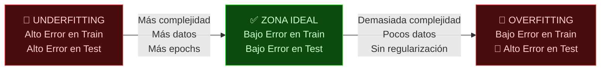

**Tags:** #ml #overfitting #underfitting #regularizacion #ia
 #m1-fundamentos

> [!quote] Concepto fundamental
> Los dos grandes problemas del ML. Un modelo bien entrenado debe generalizar: rendir bien **tanto en los datos de entrenamiento como en datos nuevos que nunca ha visto**. Overfitting y Underfitting son los dos extremos que hay que evitar.

---

## 🎓 La Metáfora del Estudiante

La forma más intuitiva de entender estos problemas:

| Problema | Metáfora del estudiante | ¿Qué le pasa al modelo? |
| :--------------- | :-------------------------------------------------------------------------------------------------------------------------------------------------------------- | :----------------------------------------------------------------------------------- |
| **Underfitting** | No estudió nada. Suspende el examen y también los ejercicios de práctica. | Modelo demasiado **simple** para capturar el patrón real. Falla en todo. |
| **Overfitting** | Memorizó el libro de exámenes pasados de memoria, sin entender. Resuelve perfectamente los exámenes de práctica, pero si cambia una coma en la pregunta, falla. | Modelo demasiado **complejo** que aprendió el ruido del training, no el patrón real. |
| **✅ Ideal** | Estudió el temario con comprensión, generalizó los conceptos y puede resolver preguntas nuevas. | Modelo con el nivel correcto de complejidad que **generaliza** bien. |

---

## 📉 Visualizando el Problema

---

## 🔴 Underfitting — El Modelo Demasiado Simple

### ¿Qué es?

El modelo **no es capaz de aprender los patrones** presentes en los datos de entrenamiento. Su capacidad de representación es insuficiente para la complejidad del problema.

### Nombre técnico: **Alto Bias (Sesgo)**

El modelo tiene "prejuicios" que le impiden aprender: asume relaciones demasiado simples (ej. intenta ajustar una línea recta a datos que forman una curva).

### Síntomas (cómo detectarlo)

> [!warning] Señales de Underfitting
>
> - **Error alto** en el conjunto de **entrenamiento** (training loss alto).
>
> - **Error alto** también en el conjunto de **test**.
>
> - Las predicciones son mediocres **en todas partes**, no solo en datos nuevos.
>
> - Curvas de aprendizaje que no convergen (el loss no baja).

### Causas Principales

- Modelo demasiado simple (ej. regresión lineal para un problema no lineal)

- Pocas **features** (variables de entrada)

- Pocas **epochs** de entrenamiento

- **Learning rate** demasiado alto (el modelo da pasos tan grandes que nunca converge)

### Soluciones

| Solución | Explicación |
| :--- | :--- |
| **Aumentar la complejidad** del modelo | Añadir capas/neuronas, usar un algoritmo más potente |
| **Añadir más features** (Feature Engineering) | Crear nuevas variables de entrada relevantes |
| **Entrenar más epochs** | Dejar que el modelo aprenda más tiempo |
| **Bajar el learning rate** | Pasos más pequeños para convergencia más precisa |
| **Reducir la regularización** | Si se ha aplicado demasiada regularización, aflójarla |

---

## 🔴 Overfitting — El Modelo que Memoriza

### ¿Qué es?

El modelo aprende **demasiado bien los datos de entrenamiento**, incluyendo el **ruido** y los **valores atípicos** (outliers). Como resultado, "memoriza" en lugar de "generalizar" y rinde muy mal con datos nuevos.

### Nombre técnico: **Alta Varianza**

El modelo es tan sensible a los datos de entrenamiento que varía drásticamente su comportamiento con cualquier cambio en los datos.

### Síntomas (cómo detectarlo)

> [!warning] 🚨 Señal definitiva de Overfitting en el examen
> Si ves que el modelo tiene:
>
> - **98-99% de accuracy en training**
>
> - **55-60% de accuracy en test/validation**
> 
> → Es **overfitting puro**. La clave diagnóstica es el **abismo entre train accuracy y test accuracy**.

### Causas Principales

- Modelo demasiado complejo (demasiadas capas, demasiados parámetros)

- **Muy pocos datos** de entrenamiento

- **No hay regularización**

- Entrenamiento demasiado largo sin early stopping

### Soluciones — Las 6 Técnicas que Debes Memorizar

| Técnica | Cómo funciona | Aplicable en |
| :---------------------------- | :---------------------------------------------------------------------------------------------------------------------- | :--------------------------------- |
| **Más datos** | Más ejemplos → más difícil memorizar, el modelo generaliza mejor | Cualquier modelo |
| **Regularización L1 (Lasso)** | Penaliza coeficientes grandes, lleva algunos a exactamente 0 (feature selection implícita) | Modelos lineales, redes neuronales |
| **Regularización L2 (Ridge)** | Penaliza coeficientes grandes, los reduce pero nunca a 0 | Modelos lineales, redes neuronales |
| **Dropout** | Durante el entrenamiento, desactiva neuronas aleatoriamente → el modelo no puede depender de ninguna neurona específica | Redes Neuronales |
| **Early Stopping** | Detiene el entrenamiento cuando el error de validación empieza a subir aunque el de training siga bajando | Cualquier modelo iterativo |
| **Data Augmentation** | Genera variaciones artificiales de los datos existentes (rotar imágenes, añadir ruido) | Especialmente en imágenes |
| **Cross-Validation (K-Fold)** | Evalúa el modelo en K subconjuntos distintos del dataset para tener una estimación robusta | Datasets pequeños |

> [!tip] Truco mnemotécnico para las soluciones de Overfitting
> **"MÁS DDEC"**:
>
> - **M**ás datos
>
> - **A**umentar datos (Data Augmentation)
>
> - **S**top early (Early Stopping)
>
> - **D**ropout
>
> - **D**isminuir complejidad del modelo
>
> - **E**valuar con Cross-Validation
>
> - **C**astigo (Regularización L1/L2)

---

## 📊 Tabla Comparativa Completa

| | **Underfitting** | **Zona Ideal** | **Overfitting** |
| :--- | :---: | :---: | :---: |
| **Nombre técnico** | Alto Bias | Low Bias, Low Variance | Alta Variance |
| **Error en Training** | 🔴 Alto | 🟢 Bajo | 🟢 Muy bajo |
| **Error en Test** | 🔴 Alto | 🟢 Bajo | 🔴 Alto |
| **Gap Train vs Test** | Pequeño | Pequeño | 🚨 Grande |
| **Causa principal** | Modelo muy simple | — | Modelo muy complejo |
| **Solución principal** | Más complejidad | — | Regularización + más datos |

---

## 🎯 Escenarios de Examen

> [!example] Escenario 1 — Diagnóstico
> *"Un modelo de clasificación de imágenes alcanza 99% de accuracy en el conjunto de entrenamiento pero solo 62% en el conjunto de test."*
> 
> **Respuesta:** El modelo sufre **Overfitting**. Soluciones aplicables: Data Augmentation, Dropout, Early Stopping.

> [!example] Escenario 2 — Diagnóstico
> *"Un modelo de regresión lineal para predecir precios de casas alcanza solo 65% de R² tanto en train como en test."*
> 
> **Respuesta:** El modelo sufre **Underfitting**. Solución: usar un modelo más complejo (árbol de decisión, red neuronal) o añadir más features relevantes.

> [!example] Escenario 3 — Solución
> *"Tu modelo de deep learning tiene overfitting. ¿Qué herramienta de AWS usarías para mejorar los datos de entrenamiento?"*
> 
> **Respuesta:** **SageMaker Data Wrangler** para enriquecer el dataset, o técnicas de **Data Augmentation** si son imágenes.

---
→ Volver al índice: [[📂M1 - Fundamentos IA y ML/00 - Índice Módulo 1|🪐 Módulo 1: Fundamentos IA y ML]]
