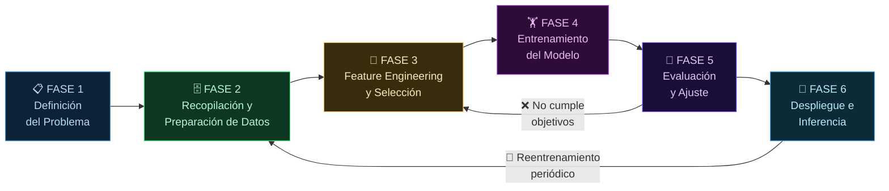

**Tags:** #ml #lifecycle #sagemaker #mlops #ia
 #m1-fundamentos

> [!quote] Concepto fundamental
> El ML Lifecycle es el proceso iterativo de llevar un proyecto de Machine Learning desde la idea hasta producción, y luego mantenerlo funcionando bien con el tiempo. No es lineal: es un **ciclo** que se repite continuamente.

---

## 🔄 El Ciclo de Vida — Diagrama Completo

> [!warning] Clave: El Lifecycle es CÍCLICO, no lineal
> Después del despliegue, los modelos se **degradan** con el tiempo (el mundo cambia). El ciclo vuelve a empezar cuando el modelo deja de rendir bien. **SageMaker Model Monitor** es quien detecta cuándo es hora de reiniciar el ciclo.

---

## 📋 Fase 1 — Definición del Problema

### ¿Qué se hace aquí?

Antes de tocar ningún dato, debes entender y formular el problema de negocio en términos de ML:

- ¿Es un problema de **clasificación, regresión o clustering**?
- ¿Cuál es el **output** que necesitamos?
- ¿Qué **métrica** definirá el éxito? (Accuracy, RMSE, Recall...)
- ¿Cuáles son las **restricciones** (latencia, coste, interpretabilidad)?
- ¿Tenemos los **datos** necesarios?

### Herramientas AWS en esta fase

- Discusión de negocio, definición de KPIs
- **AWS Well-Architected Framework** (ML Lens) para guiar la arquitectura

> [!tip] Consejo práctico
> Un error frecuente es empezar a entrenar modelos sin definir claramente la métrica de éxito. Si no sabes qué métrica medirás, no sabrás cuándo has terminado.

---

## 🗄️ Fase 2 — Recopilación y Preparación de Datos

### ¿Qué se hace aquí?

Es la fase más larga en la práctica (puede ser el 70-80% del tiempo real de un proyecto de ML):

- **Recopilar datos** de múltiples fuentes
- **Limpieza:** tratar valores nulos, eliminar duplicados, corregir errores tipográficos
- **Exploración (EDA):** entender distribuciones, correlaciones, outliers
- **División del dataset:** Training set / Validation set / Test set

> [!tip] Regla del 80/10/10
> Una división típica del dataset:
> - **80% Training:** Para entrenar el modelo
> - **10% Validation:** Para ajustar hiperparámetros (sin contaminar el test)
> - **10% Test:** Para evaluación final honesta (solo se toca al final)

### Herramientas AWS

| Herramienta | Para qué se usa |
| :--- | :--- |
| **Amazon S3** | Almacenamiento del dataset (el "lago de datos") |
| **AWS Glue** | ETL (extracción, transformación, carga) y catálogo de datos |
| **Amazon Athena** | Consultas SQL sobre datos en S3 |
| **AWS Lake Formation** | Gestión centralizada del data lake |
| **SageMaker Data Wrangler** | Limpieza y transformación visual, sin código |
| **SageMaker Clarify** | Detección de **sesgo en los datos** antes de entrenar |

---

## 🔬 Fase 3 — Feature Engineering y Selección

### ¿Qué se hace aquí?

**Feature Engineering** (Ingeniería de Características) significa "preparar y masticar los datos para que la Inteligencia Artificial los digiera mejor". Los modelos son calculadoras gigantes y necesitan que la información se les dé de una forma específica.

Consiste en 4 pasos principales:

- **1. Creación de features (Inventar datos más útiles):** A veces los datos en bruto no sirven directamente, hay que combinarlos para dar "pistas" más claras.

- **2. Encoding (Traducir palabras a números):** La IA solo entiende números. Consiste en crear un diccionario (ej: Rojo = 1, Azul = 2) para transformar texto y categorías en números matemáticos.

- **3. Normalización/Escalado (Usar la misma regla de medir):** Truco matemático para que todos los números estén en la misma escala (ej: convertirlos en decimales de 0 a 1). Así, la IA los compara de forma justa y no da más importancia a un dato solo por ser un número más grande (ej: comparar 100 m² con 250.000 €).

- **4. Selección (Tirar a la basura lo que no sirve):** Como hacer la maleta. Si le damos datos irrelevantes a la IA (ej: signo del zodiaco para predecir si comprará un coche), se lía ("sobreajuste"). Nos quedamos solo con lo que aporta valor.

> [!example] Ejemplo de Feature Engineering (Creación de Features)
> Tienes la fecha de nacimiento de un cliente: `15/05/1985`. A la IA le cuesta entender qué hacer con esa fecha exacta. Pero si haces la resta antes y creas una nueva columna que diga **"Edad: 39 años"**, es un número súper útil. Incluso podrías crear otra que diga **"Generación: Millennial"**. Estas nuevas "features" dan pistas mucho más claras al modelo que la fecha cruda.

### Herramientas AWS

| Herramienta | Para qué se usa |
| :--- | :--- |
| **SageMaker Data Wrangler** | Transformaciones visuales, encoding, normalización |
| **SageMaker Feature Store** | Repositorio centralizado de features reutilizables entre modelos |
| **Amazon SageMaker Processing** | Procesamiento de datos con scripts Python/Spark |

---

## 🏋️ Fase 4 — Entrenamiento del Modelo

### ¿Qué se hace aquí?

- Seleccionar el **algoritmo** (árbol de decisión, red neuronal, transformers...)
- Configurar los **hiperparámetros** iniciales
- Ejecutar el **proceso de entrenamiento** (puede durar horas o días)
- Usar aceleración hardware (GPUs, TPUs, Trainium)

### Herramientas AWS

| Herramienta | Para qué se usa |
| :--- | :--- |
| **SageMaker Training Jobs** | Entrenamiento escalable en instancias gestionadas por AWS |
| **SageMaker JumpStart** | Modelos preentrenados y algoritmos listos para usar/fine-tunear |
| **SageMaker Autopilot** | AutoML: AWS prueba automáticamente múltiples algoritmos y configuraciones |
| **AWS Trainium (Trn1)** | Chips especializados para entrenar LLMs de forma económica |
| **Amazon EC2 (P/G instances)** | Instancias con GPUs NVIDIA para entrenamiento manual |

---

## 📏 Fase 5 — Evaluación y Ajuste

### ¿Qué se hace aquí?

- Calcular las **métricas de evaluación** en el conjunto de validación/test
- Detectar **Overfitting/Underfitting**
- **Ajuste de hiperparámetros** (búsqueda en grid, random, bayesiana)
- **Análisis de errores:** ¿En qué casos falla el modelo? ¿Por qué?
- **Explicabilidad:** ¿Por qué el modelo tomó esa decisión?

### Herramientas AWS

| Herramienta | Para qué se usa |
| :--- | :--- |
| **SageMaker Experiments** | Tracking de métricas, comparación de experimentos |
| **SageMaker Clarify** | Explicabilidad del modelo (SHAP values) y detección de sesgo post-entrenamiento |
| **SageMaker Automatic Model Tuning** | Búsqueda automática de hiperparámetros óptimos (HPO) |
| **Amazon SageMaker Debugger** | Detecta problemas en el entrenamiento en tiempo real |

---

## 🚀 Fase 6 — Despliegue e Inferencia

### ¿Qué se hace aquí?

Poner el modelo en producción para que haga predicciones reales:

| Tipo de inferencia | Características | Cuándo usarlo |
| :--- | :--- | :--- |
| **Real-time inference** | Respuesta en milisegundos, endpoint HTTP persistente | Aplicaciones interactivas, recomendaciones al vuelo |
| **Batch transform** | Procesa datasets enteros en diferido | Predicciones masivas nocturnas, informes periódicos |
| **Asynchronous inference** | Procesa colas de peticiones, sin respuesta inmediata | Peticiones largas, cargas variables |
| **Serverless inference** | Sin infraestructura gestionada, escala a 0 | Tráfico impredecible, baja latencia no crítica |

### Herramientas AWS

| Herramienta | Para qué se usa |
| :--- | :--- |
| **SageMaker Endpoints** | Endpoints de inferencia en tiempo real |
| **SageMaker Batch Transform** | Inferencia masiva en lotes |
| **SageMaker Model Registry** | Versionado y catálogo de modelos aprobados |
| **SageMaker Model Monitor** | Vigilancia continua en producción (¡clave!) |
| **AWS Inferentia (Inf1/Inf2)** | Chips para inferencia de alto rendimiento y bajo coste |
| **Amazon CloudWatch** | Métricas, alarmas y logs del endpoint |

---

## 🚨 SageMaker Model Monitor — El Guardián de Producción

Este servicio merece mención especial. Es el que detecta cuándo un modelo en producción empieza a degradarse.

**¿Qué detecta?**

| Tipo de Drift | ¿Qué ha cambiado? | Ejemplo |
| :--- | :--- | :--- |
| **Data Quality Drift** | La distribución de los datos de entrada ha cambiado | Los clientes ahora tienen edades muy diferentes a las del dataset de entrenamiento |
| **Model Quality Drift** | El rendimiento real del modelo ha caído | La accuracy real bajó de 92% a 71% |
| **Bias Drift** | El modelo desarrolla nuevos sesgos en producción | Empieza a discriminar por género cuando antes no lo hacía |
| **Feature Attribution Drift** | La importancia de las features ha cambiado | Una feature que era clave ya no importa tanto |

> [!warning] SageMaker Model Monitor vs SageMaker Clarify
> - **Clarify** → Detecta sesgo **durante el desarrollo** (antes de desplegar).
> - **Model Monitor** → Detecta drift y degradación **en producción** (después de desplegar).
> - Son complementarios, no alternativos. En el examen, la fase (desarrollo vs producción) determina cuál elegir.

---

## 📋 Resumen por Fase con Herramientas AWS

| Fase | Actividad principal | Herramienta AWS clave |
| :--- | :--- | :--- |
| 1. Definición | Formular el problema de negocio en ML | — |
| 2. Datos | Recopilar, limpiar y explorar | S3, Glue, **Data Wrangler**, **Clarify** (bias) |
| 3. Features | Transformar y seleccionar variables | **Feature Store**, Data Wrangler |
| 4. Entrenamiento | Entrenar el modelo | **Training Jobs**, **JumpStart**, **Trainium** |
| 5. Evaluación | Medir, explicar, ajustar | **Experiments**, **Clarify** (SHAP), **HPO** |
| 6. Despliegue | Servir predicciones + monitorizar | **Endpoints**, **Model Monitor**, **Inferentia** |

---
→ Volver al índice: [[📂M1 - Fundamentos IA y ML/00 - Índice Módulo 1|🪐 Módulo 1: Fundamentos IA y ML]]
