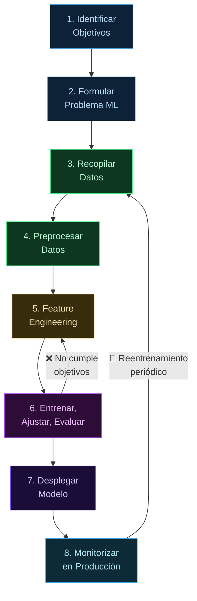

**Tags:** #ml #lifecycle #sagemaker #mlops #ia
 #m1-fundamentos

> [!quote] Concepto fundamental
> El ML Lifecycle es el proceso iterativo de llevar un proyecto de Machine Learning desde la idea hasta producción, y luego mantenerlo funcionando bien con el tiempo. No es lineal: es un **ciclo** que se repite continuamente.

---

## 🔄 El Ciclo de Vida (8 Pasos)

---

## 📋 Fase 1 y 2 — Definición del Negocio y Problema

### Paso 1: Identify Business Goals
Antes de tocar datos, se define el problema de negocio y los KPIs de éxito.

### Paso 2: Frame ML Problem
Formular el problema en términos de Machine Learning (Clasificación, Regresión, etc.).

> [!abstract] Lógica de Negocio: ¿Cuándo SÍ vs Cuándo NO usar IA?
> **SÍ usar IA cuando:** Hay grandes volúmenes de datos, las tareas son ultra-repetitivas, se requiere análisis a gran escala, y los márgenes de error son tolerables.
> **NO usar IA cuando:** Se necesita exactitud 100% determinista (usa código tradicional), hay pocos datos o mala calidad ("basura entra, basura sale"), se resuelve con reglas IF/ELSE o SQL simples, el coste es mayor al beneficio, o hay riesgos críticos (ej. seguridad vital).

---

## 🗄️ Fase 3 y 4 — Preparación de Datos

### Paso 3: Collect Data
Recopilar datos de múltiples fuentes (S3, bases de datos).

- **Herramientas:** **Amazon S3** (Data Lake), **AWS Glue** (Catálogo y ETL).

### Paso 4: Preprocess Data
Limpiar datos, tratar nulos y dividir el dataset.

> [!warning] División de Datos y Memorización
> La regla de oro es separar siempre los datos en **Training (80%)**, **Validation (10%)** y **Test (10%)**. Esto evita trampas: el modelo no puede memorizar las respuestas del examen final (Test).

> [!brain] Sesgo y Equidad (Bias & Fairness)
> El sesgo surge de datos iniciales desequilibrados (ej. 90% currículums de hombres). Si no se corrige, el modelo será discriminatorio. **Amazon SageMaker Clarify** se usa en esta fase para detectar y mitigar el sesgo en los datos antes de entrenar.

- **Herramientas:** **SageMaker Data Wrangler** y **AWS Glue DataBrew** (preparación visual sin código).

---

## 🔬 Fase 5 — Ingeniería de Características

### Paso 5: Engineer Features
Transformar los datos para que el modelo los entienda mejor (ej. extraer "Edad" a partir de "Fecha de Nacimiento").

- **Herramientas:** **SageMaker Feature Store** (repositorio central para almacenar y compartir features).

---

## 🏋️ Fase 6 — Entrenamiento y Evaluación

### Paso 6: Train, Tune, Evaluate
Entrenar el algoritmo, ajustar los hiperparámetros y evaluar el rendimiento.

- **Herramientas:** **SageMaker Training**, **SageMaker Autopilot** (AutoML) y **SageMaker Automatic Model Tuning** (HPO).

---

## 🚀 Fase 7 y 8 — Producción

### Paso 7: Deploy
Poner el modelo a disposición de las aplicaciones.

> [!tip] Modos de Inferencia
> - **Batch (Diferido):** Lotes masivos procesados a la vez (ej. reportes nocturnos). Se usa **SageMaker Batch Transform**.
> - **Real-Time (Tiempo real):** Respuesta instantánea en milisegundos. Se usa **SageMaker Endpoints** o servicios como **Amazon Lex** (chatbots) y **Amazon Personalize** (recomendaciones).

- **Herramientas:** **SageMaker Endpoints**, **AWS Lambda** (para inferencia serverless ligera).

### Paso 8: Monitor
Vigilar el rendimiento del modelo a lo largo del tiempo.

- **Herramientas:** **SageMaker Model Monitor** (detecta degradación o *Model Drift*) y **Amazon CloudWatch** (métricas de infraestructura).

---

## 🛠️ MLOps y Deuda Técnica

> [!quote] ¿Qué es la Deuda Técnica?
> Es el coste implícito de tomar decisiones de diseño rápidas pero pobres (atajos) al inicio, que luego hacen que el mantenimiento sea una pesadilla. En ML, "desplegar un modelo es rápido, mantenerlo 5 años es costoso".

**MLOps** (Machine Learning Operations) es la solución a la deuda técnica. Consiste en automatizar todo este ciclo (pipelines), versionar los datos y el código, y monitorizar activamente (Model Drift) para que las actualizaciones sean seguras y repetibles.

---
→ Volver al índice: [[📂M1 - Fundamentos IA y ML/00 - Índice Módulo 1|🪐 Módulo 1: Fundamentos IA y ML]]
