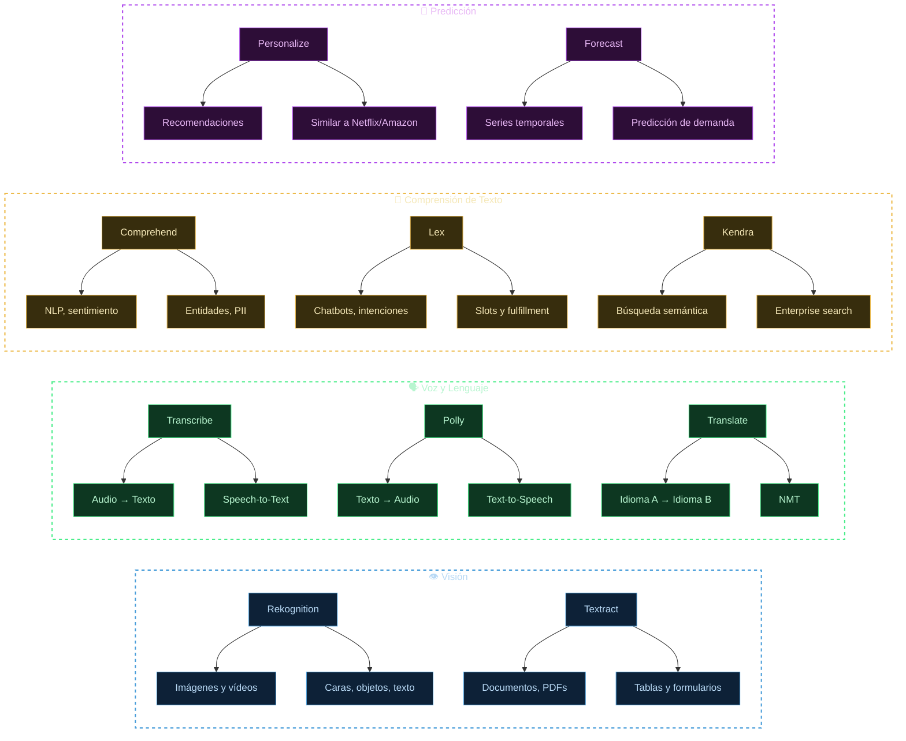

**Tags:** #servicios-aws #ai #rekognition #comprehend #lex #polly #transcribe #ia
 #m2-servicios

> [!quote] Concepto clave
> Los servicios de IA de alto nivel de AWS son **APIs pre-construidas** que añaden capacidades de inteligencia artificial a cualquier aplicación sin necesidad de entrenar modelos. Solo consumes el servicio y recibes resultados.

---

## 🗺️ Mapa Visual de Servicios

---

## 📊 Tabla Maestra Comparativa

| Servicio | Entrada | Salida | Superpoder | Palabras clave del examen |
| :--- | :--- | :--- | :--- | :--- |
| **Amazon Rekognition** | 🖼️ Imagen / 🎥 Vídeo | Etiquetas, caras, texto, objetos, emociones | Visión por computadora en imágenes y vídeo en tiempo real | `análisis de imágenes`, `verificación identidad`, `content moderation`, `PPE detection` |
| **Amazon Transcribe** | 🎤 Audio (.mp3, .wav, etc.) | 📝 Texto transcrito | Speech-to-Text con identificación de hablantes y redacción de PII | `transcripción`, `subtítulos`, `call center`, `speaker diarization` |
| **Amazon Translate** | 📝 Texto (idioma origen) | 📝 Texto (idioma destino) | Traducción neuronal fluida entre 75+ idiomas | `traducción automática`, `localización`, `NMT` |
| **Amazon Comprehend** | 📝 Texto no estructurado | Sentimiento, entidades, idioma, PII, temas | NLP: analiza y extrae insights de texto | `análisis de sentimiento`, `NER`, `detección PII`, `NLP` |
| **Amazon Polly** | 📝 Texto | 🔊 Audio (voz sintética) | Text-to-Speech con voces neurales hiperrealistas | `síntesis de voz`, `text-to-speech`, `narración`, `accesibilidad` |
| **Amazon Textract** | 📄 PDF, imagen de documento | Texto, tablas y formularios estructurados | OCR avanzado que entiende la estructura de documentos | `OCR`, `facturas`, `formularios`, `tablas`, `IDP` |
| **Amazon Lex** | 🎤 Voz / 📝 Texto | Intents detectados + Slots extraídos | Chatbots y asistentes de voz (tecnología de Alexa) | `chatbot`, `bot conversacional`, `Alexa`, `intent`, `slot` |
| **Amazon Personalize** | 📊 Historial de interacciones | 🎯 Lista de ítems recomendados | Motor de recomendaciones en tiempo real | `recomendaciones`, `personalización`, `similar a Amazon/Netflix` |
| **Amazon Forecast** | 📈 Serie temporal histórica | 📊 Predicciones futuras con intervalos | Predicción de series temporales con variables externas | `predicción demanda`, `forecasting`, `serie temporal`, `stock` |
| **Amazon Kendra** | 📚 Repositorios de documentos | Respuesta en lenguaje natural | Búsqueda semántica empresarial con comprensión de contexto | `búsqueda inteligente`, `enterprise search`, `FAQ` |

---

## ⚡ Tabla de Decisión Rápida — Elige el Servicio

| Si el escenario dice... | El servicio es... |
| :--- | :--- |
| "Detectar objetos/caras en fotos o vídeo" | **Amazon Rekognition** |
| "Convertir grabaciones de audio a texto" | **Amazon Transcribe** |
| "Traducir contenido a otro idioma" | **Amazon Translate** |
| "Analizar el sentimiento de reseñas de clientes" | **Amazon Comprehend** |
| "Generar narración de audio desde texto" | **Amazon Polly** |
| "Extraer datos de facturas o formularios PDF" | **Amazon Textract** |
| "Construir un chatbot de atención al cliente" | **Amazon Lex** |
| "Recomendar productos a usuarios individuales" | **Amazon Personalize** |
| "Predecir ventas para el próximo mes" | **Amazon Forecast** |
| "Buscar información en documentos internos de la empresa" | **Amazon Kendra** |

---

## 🔀 Confusiones Habituales en el Examen

> [!warning] Rekognition vs Textract
> - **Rekognition:** Lee texto en **imágenes naturales** (señales de tráfico, matrículas, rótulos en fotos). Pensado para "ver" el mundo.
> - **Textract:** Extrae texto **estructurado de documentos** (tablas, formularios, PDFs). Pensado para IDP (Intelligent Document Processing) empresarial.
>
> *Pista: Si el escenario habla de "facturas", "formularios" o "documentos" → Textract. Si habla de "fotos", "vídeo" o "imágenes" → Rekognition.*

> [!warning] Comprehend vs Lex
> - **Comprehend:** **ANALIZA** texto pasivamente. ¿Qué dice? ¿Qué siente? ¿Qué entidades menciona? No hay conversación.
> - **Lex:** **COMPRENDE INTENCIONES** en un contexto conversacional. El usuario dice algo → Lex identifica qué quiere hacer (intent) y qué datos necesita (slots) → ejecuta una acción.
>
> *Pista: "Chatbot" → Lex. "Analizar texto" → Comprehend.*

> [!warning] Transcribe vs Polly — Son OPUESTOS
> - **Transcribe:** Audio → Texto (escucha y transcribe)
> - **Polly:** Texto → Audio (lee en voz alta)
>
> *Mnemotécnico: **Polly** habla como un **loro** (polly = loro en inglés). Transcribe transcribe.*

> [!warning] Personalize vs Forecast
> - **Personalize:** "¿Qué ítems le gustarán a ESTE usuario?" → Recomendaciones 1:1
> - **Forecast:** "¿Cuántas unidades venderemos MAÑANA?" → Predicción de cantidades futuras

---
→ Volver al índice: [[📂M2 - Servicios IA-ML AWS/00 - Índice Módulo 2|🪐 Módulo 2: Servicios IA-ML AWS]]
