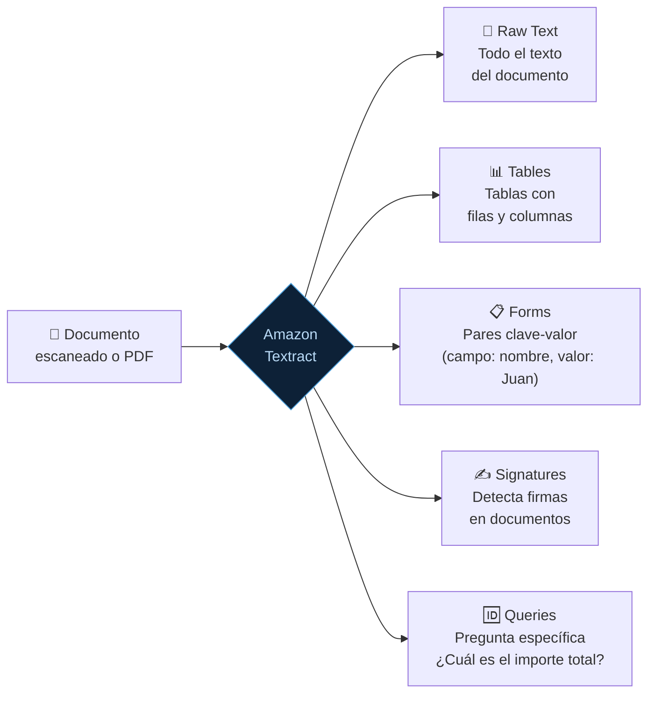
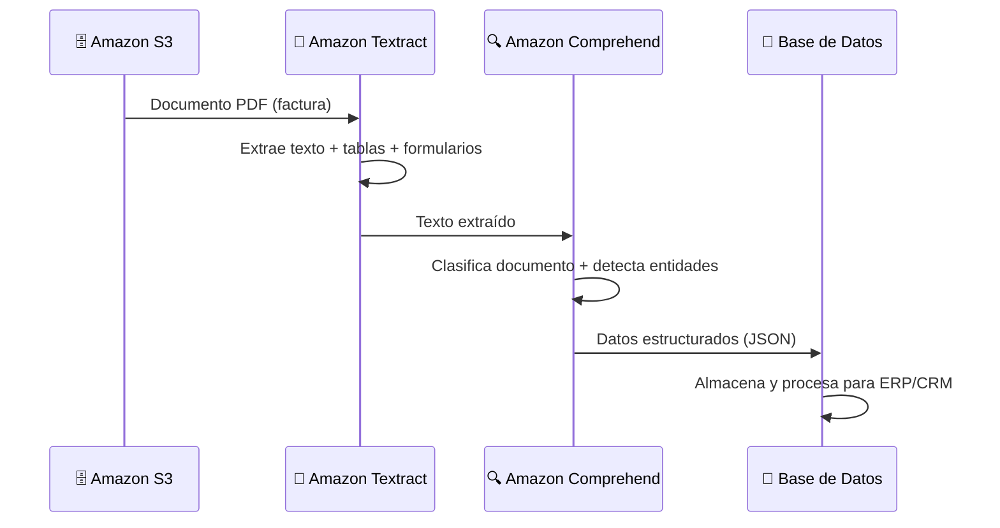

**Tags:** #rekognition #textract #vision-artificial #ocr #idp #ia
 #m2-servicios

---
## 👁️ Amazon Rekognition

> [!quote] Definición AWS
> Amazon Rekognition es un servicio de **análisis de imágenes y vídeos** basado en Deep Learning que permite detectar objetos, personas, texto, escenas y actividades, así como detectar contenido inapropiado.


### 📋 Capacidades en Detalle

| Capacidad | ¿Qué detecta? | Caso de uso empresarial |
| :--- | :--- | :--- |
| **Object & Scene Detection** | Objetos (perro, coche, árbol) y escenas (playa, cocina, estadio) | Catalogación automática de imágenes en una galería de e-commerce |
| **Facial Analysis** | Caras, edad estimada, emoción, si lleva gafas, si lleva mascarilla | Análisis de satisfacción del cliente en una tienda física |
| **Face Comparison** | Si dos fotos son de la misma persona (con % de similitud) | Verificación de identidad en banca digital (selfie vs DNI) |
| **Face Search** | Buscar una cara en una colección de caras almacenadas | Control de acceso en edificios (reconocimiento en tiempo real) |
| **Text in Image (OCR básico)** | Texto impreso o manuscrito en imágenes | Leer matrículas en parkings, capturar texto de fotografías de recibos |
| **Content Moderation** | Contenido explícito, violento o inapropiado | Moderar automáticamente imágenes subidas por usuarios en redes sociales |
| **Celebrity Recognition** | Identifica personas famosas del mundo del espectáculo/política | Indexar archivos multimedia en una cadena de televisión |
| **PPE Detection** | Equipos de protección personal (cascos, guantes, mascarillas, chalecos) | Verificar cumplimiento de normas de seguridad en fábricas |
| **Custom Labels** | Entrena Rekognition para detectar objetos específicos de tu negocio | Detectar defectos de fabricación en una línea de producción |

> [!example] Flujo de caso de uso — Verificación de Identidad Bancaria
> ```
> Usuario sube selfie → Rekognition (Face Comparison) → Compara con foto del DNI
> ↓
> Similitud > 95% → ✅ Identidad verificada
> Similitud < 95% → ❌ Revisión manual
> ```

> [!example] Flujo de caso de uso — Moderación de Contenido
> ```
> Usuario sube imagen → Rekognition (Content Moderation)
> ↓
> Contenido explícito detectado → Bloquear automáticamente + Notificar
> Contenido seguro → Publicar imagen
> ```

### 💰 Modelo de Precios

- Cobro por **imagen analizada** o por **minuto de vídeo** procesado

- Sin costes iniciales, pago por uso

---

## 📄 Amazon Textract

> [!quote] Definición AWS
> Amazon Textract es un servicio de **procesamiento inteligente de documentos (IDP)** que extrae automáticamente texto, tablas y datos de formularios de documentos escaneados, sin necesidad de configuración manual ni OCR tradicional.

### ¿Por qué Textract es diferente a un OCR tradicional?

| Característica | OCR Tradicional | Amazon Textract |
| :--- | :--- | :--- |
| **Qué extrae** | Solo texto plano, sin estructura | Texto + estructura (tablas, formularios, celdas) |
| **Comprensión** | No entiende el documento | Entiende qué es un "nombre de campo" y cuál es su "valor" |
| **Tablas** | Las rompe o las ignora | Mantiene la estructura de filas y columnas |
| **Formularios** | Pierde la relación campo-valor | Preserva la relación "Nombre del empleado: → Juan García" |
| **Configuración** | Requiere templates por tipo de documento | Funciona sin configuración previa |
| **Salida** | Texto plano | JSON estructurado con coordenadas de cada elemento |

### 🎯 Tipos de Extracción



### 📋 Casos de Uso de Textract

> [!example] Procesamiento de Facturas (Accounts Payable)
> Una empresa recibe 10.000 facturas de proveedores al mes en PDF. Textract extrae automáticamente: número de factura, fecha, proveedor, líneas de pedido, subtotal, IVA e importe total. Los datos van directamente al ERP sin intervención humana.

> [!example] Procesamiento de Solicitudes Hipotecarias
> Un banco digitaliza formularios de solicitud de hipoteca. Textract extrae los datos del formulario (nombre, NIF, ingresos, domicilio) y los valida contra otros documentos (nóminas, declaración de la renta).

> [!example] Compliance y Contratos Legales
> Un departamento legal escanea miles de contratos. Textract + Comprehend extraen cláusulas clave, fechas de vencimiento y partes contratantes para poblar automáticamente una base de datos contractual.

### 🔗 Textract en la Arquitectura IDP Completa



> [!tip] Truco de examen — IDP Architecture
> El patrón **S3 → Textract → Comprehend → BD/ERP** es el flujo estándar de **Intelligent Document Processing (IDP)** en AWS. Si el examen pregunta cómo automatizar el procesamiento de documentos empresariales, esta es la arquitectura de referencia.

### 💰 Modelo de Precios

- Cobro por **página analizada**

- Tarifas diferentes según el tipo de análisis (texto simple, tablas, formularios, queries)

---

## ⚡ Rekognition vs Textract — Decisión Final

| Situación | Servicio |
| :--- | :---: |
| "Analizar fotos de una cámara de vigilancia" | **Rekognition** |
| "Detectar si los empleados llevan casco en el almacén" | **Rekognition** |
| "Verificar la identidad de un usuario comparando selfie con DNI" | **Rekognition** |
| "Extraer los datos de una factura en PDF" | **Textract** |
| "Digitalizar formularios de solicitud de seguro" | **Textract** |
| "Leer el texto de una señal de tráfico en una foto" | **Rekognition** (Text in Image) |
| "Extraer la tabla de datos de un balance financiero en PDF" | **Textract** |

---
→ Volver al índice: [[📂M2 - Servicios IA-ML AWS/00 - Índice Módulo 2|🪐 Módulo 2: Servicios IA-ML AWS]]
