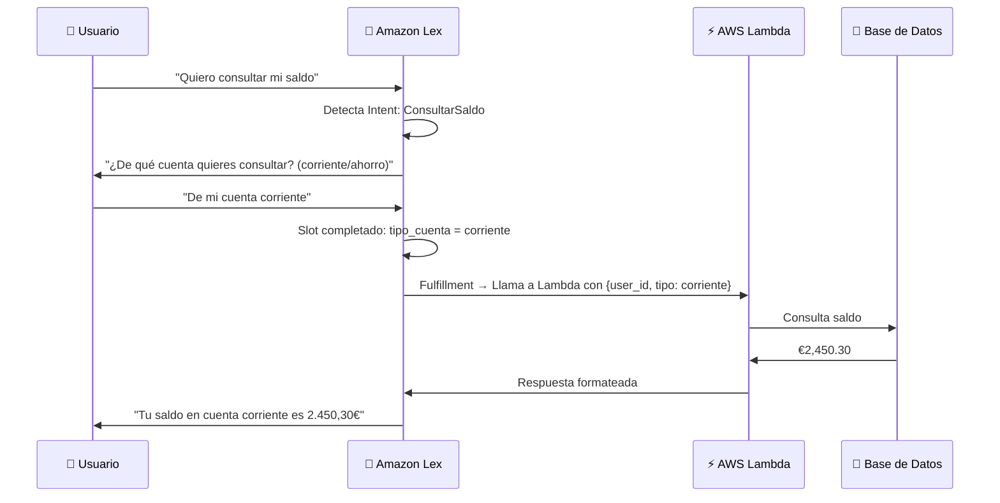

**Tags:** #comprehend #lex #translate #polly #transcribe #nlp #voz #ia
 #m2-servicios

---

## 🔍 Amazon Comprehend — El Analista de Texto

> [!quote] Definición AWS
> Amazon Comprehend es un servicio de **Procesamiento de Lenguaje Natural (NLP)** que usa ML para encontrar información y relaciones en texto: sentimiento, entidades, idioma, temas y datos personales (PII).

### 🎯 Capacidades de Comprehend

| Capacidad | ¿Qué hace? | Ejemplo de output |
| :--- | :--- | :--- |
| **Sentiment Analysis** | Determina el tono emocional del texto | `{"Sentiment": "NEGATIVE", "SentimentScore": {"Negative": 0.97}}` |
| **Entity Recognition (NER)** | Detecta entidades nombradas: personas, lugares, organizaciones, fechas, cantidades | `PERSON: "María García"`, `LOCATION: "Madrid"`, `DATE: "15 de enero"` |
| **Key Phrase Extraction** | Extrae las frases más significativas | `"entrega tardía"`, `"servicio al cliente"` |
| **Language Detection** | Detecta automáticamente el idioma del texto (100 idiomas) | `{"LanguageCode": "es", "Score": 0.99}` |
| **PII Detection** | Detecta información personal identificable (emails, teléfonos, DNI, tarjetas) | `PII: EMAIL → "juan@example.com"` |
| **PII Redaction** | Reemplaza PII por `[REDACTED]` en el texto | `"Mi email es [REDACTED]"` |
| **Topic Modeling** | Agrupa documentos por temáticas comunes (LDA) | Tema 1: tecnología, Tema 2: deportes |
| **Custom Classification** | Clasificador de texto personalizado entrenado con tus propias etiquetas | Clasifica tickets de soporte en categorías propias |
| **Custom Entity Recognition** | Detector de entidades específicas de tu dominio | Detecta nombres de medicamentos o códigos de producto propios |

> [!example] Caso de uso real — Análisis de atención al cliente
> ```
> Flujo: Reseñas de clientes → Comprehend
>        ↓ Sentiment Analysis → Identifica reseñas muy negativas
>        ↓ Entity Recognition → Extrae el producto mencionado
>        ↓ Alerta automática → Crea ticket de soporte prioritario
> ```

> [!example] Caso de uso real — Compliance y PII
> Un banco analiza los registros de chat de atención al cliente. Comprehend detecta automáticamente si algún agente ha compartido o solicitado datos sensibles (número de tarjeta, contraseña) y los redacta antes de almacenar los logs.

---

## 🤖 Amazon Lex — El Motor de los Chatbots

> [!quote] Definición AWS
> Amazon Lex es el servicio para construir **interfaces conversacionales** (chatbots) con voz y texto. Usa la misma tecnología de comprensión del lenguaje natural que potencia a **Alexa**.

### 🧩 Conceptos Clave de Lex (Vocabulario del Examen)

| Concepto | Definición | Ejemplo |
| :--- | :--- | :--- |
| **Intent** | La intención del usuario. ¿Qué quiere hacer? | `PedirPizza`, `ConsultarSaldo`, `CancelarPedido` |
| **Utterances** | Las distintas formas en que el usuario puede expresar un intent | "Quiero pedir una pizza" / "Ponme una pizza" / "Pizza, por favor" |
| **Slots** | Los datos variables que el bot necesita recopilar para cumplir el intent | Tamaño: {grande/pequeña}, Sabor: {margarita/4 quesos} |
| **Slot Types** | Los posibles valores de un Slot (lista enumerable o abierta) | `{grande, mediana, pequeña}` |
| **Fulfillment** | La acción que se ejecuta cuando todos los Slots están rellenos | Llamar a AWS Lambda que procesa el pedido |
| **Session** | El contexto de la conversación (memorizando slots previos) | El bot recuerda que pediste pizza grande |

### 🔄 Flujo de una Conversación en Lex



> [!tip] Lex + Connect = Contact Center IA
> **Amazon Connect** es el servicio de call center de AWS. Lex se integra nativamente con Connect para crear **asistentes de voz automatizados** en call centers que pueden resolver consultas sin intervención humana.

---

## 🌐 Amazon Translate — El Traductor Universal

> [!quote] Definición AWS
> Amazon Translate proporciona **traducción automática neuronal (NMT)** fluida y precisa entre más de 75 idiomas, con soporte para vocabulario personalizado.

### Funcionalidades Clave

| Funcionalidad | Descripción |
| :--- | :--- |
| **Traducción en tiempo real** | API síncrona para traducir textos en milisegundos |
| **Traducción por lotes** | Traduce archivos S3 de gran volumen de forma asíncrona |
| **Custom Terminology** | Diccionario personalizado para términos específicos de tu empresa (ej. nombres de productos, jerga interna) |
| **Active Custom Translation** | Fine-tuning del modelo de traducción con tus propios documentos paralelos |
| **Formality Settings** | Control del nivel de formalidad (formal/informal) en idiomas que lo permiten |

> [!example] Caso de uso real — E-commerce global
> Una tienda online con 500,000 productos usa Translate para localizar automáticamente todas las descripciones, reseñas de clientes y fichas técnicas a 20 idiomas. El sistema detecta el idioma del usuario (Comprehend) y sirve el contenido en su idioma automáticamente.

---

## 🔊 Amazon Polly — La Voz de AWS

> [!quote] Definición AWS
> Amazon Polly es un servicio de **síntesis de voz (Text-to-Speech)** que convierte texto en voz natural y humana usando Deep Learning.

### Tipos de Voces

| Tipo | Calidad | Cuándo usarlo |
| :--- | :--- | :--- |
| **Standard (TTS)** | Buena, sintética clásica | Aplicaciones con bajo coste prioritario |
| **Neural (NTTS)** | Excelente, muy natural | Aplicaciones de alto valor, asistentes, e-learning |

### Características Avanzadas

| Característica | Descripción |
| :--- | :--- |
| **SSML (Speech Synthesis Markup Language)** | XML para controlar velocidad, tono, pausas, énfasis, respiraciones |
| **Lexicons** | Define cómo pronunciar términos específicos ("AWS" → "Amazon Web Services") |
| **Speech marks** | Devuelve timestamps de cada palabra/fonema (para sincronizar subtítulos) |
| **Newscaster style** | Voz con estilo de locutor de noticias |

> [!example] Caso de uso real
> ```
> SSML Example:
> <speak>
>   Bienvenido a nuestra plataforma.
>   <break time="500ms"/>
>   Su pedido número <emphasis level="strong">A-12345</emphasis>
>   ha sido <prosody rate="slow">confirmado correctamente</prosody>.
> </speak>
> ```

> [!example] Casos de uso de Polly
> - **E-learning:** Convertir cursos escritos en audio para consumo mientras se conduce
> - **Accesibilidad:** Leer contenido web en voz alta para personas con discapacidad visual
> - **IoT/Dispositivos:** Dar voz a dispositivos embebidos sin conexión a internet (con lexicons descargados)

---

## 🎙️ Amazon Transcribe — El Transcriptor

> [!quote] Definición AWS
> Amazon Transcribe es el servicio de **reconocimiento automático de voz (ASR)** que convierte audio en texto con alta precisión.

### Capacidades Clave

| Capacidad                   | Descripción                                                                         | Caso de uso                                      |
| :-------------------------- | :---------------------------------------------------------------------------------- | :----------------------------------------------- |
| **Speaker Diarization**     | Diferencia quién habla en cada momento ("Hablante 1:", "Hablante 2:")               | Transcribir reuniones o entrevistas multipersona |
| **Custom Vocabulary**       | Entrena el modelo con términos especializados (jerga médica, nombres de empresa)    | Transcripción en sectores muy técnicos           |
| **Automatic Punctuation**   | Añade puntuación automáticamente al texto                                           | Transcripciones más legibles                     |
| **PII Redaction**           | Redacta automáticamente PII del texto transcrito                                    | Cumplimiento GDPR en registros de llamadas       |
| **Language Identification** | Detecta automáticamente el idioma hablado                                           | Call centers multilinguales                      |
| **Subtitles**               | Genera ficheros SRT/VTT de subtítulos sincronizados                                 | Accesibilidad en plataformas de vídeo            |
| **Medical Transcribe**      | Versión especializada con vocabulario médico                                        | Transcripción de consultas y dictados médicos    |
| **Call Analytics**          | Analiza conversaciones de call center: interrupciones, tiempo de habla, sentimiento | QA automatizado de call centers                  |

> [!example] Arquitectura — Análisis Automático de Call Center
> ```mermaid
> flowchart LR
>     A[📞 Grabación de llamada] --> B[Amazon Transcribe\nCall Analytics]
>     B --> C[Texto transcrito\n+ Metadatos: sentimiento, interrupciones]
>     C --> D[Amazon Comprehend\nAnálisis de sentimiento]
>     D --> E{¿Cliente\ninsatisfecho?}
>     E -->|Sí| F[🚨 Alerta al supervisor\n+ Ticket prioritario]
>     E -->|No| G[📊 Dashboard\nde calidad]
> ```

---

## 📊 Tabla Comparativa Final — Servicios NLP/Voz

| Servicio | Dirección del dato | Input | Output | Superpoder |
| :--- | :--- | :--- | :--- | :--- |
| **Transcribe** | Audio → Texto | Fichero de audio | Transcripción JSON/texto | Speech-to-Text con metadatos ricos |
| **Polly** | Texto → Audio | String de texto | Fichero MP3/OGG | Text-to-Speech con voces neurales |
| **Translate** | Texto → Texto | Texto (idioma A) | Texto (idioma B) | Traducción neuronal multiidioma |
| **Comprehend** | Texto → Insights | Texto no estructurado | Entidades, sentimiento, PII | Análisis profundo del contenido textual |
| **Lex** | Texto/Voz → Acción | Mensaje del usuario | Intent + Slots | Comprensión conversacional para bots |

---
→ Volver al índice: [[📂M2 - Servicios IA-ML AWS/00 - Índice Módulo 2|🪐 Módulo 2: Servicios IA-ML AWS]]
