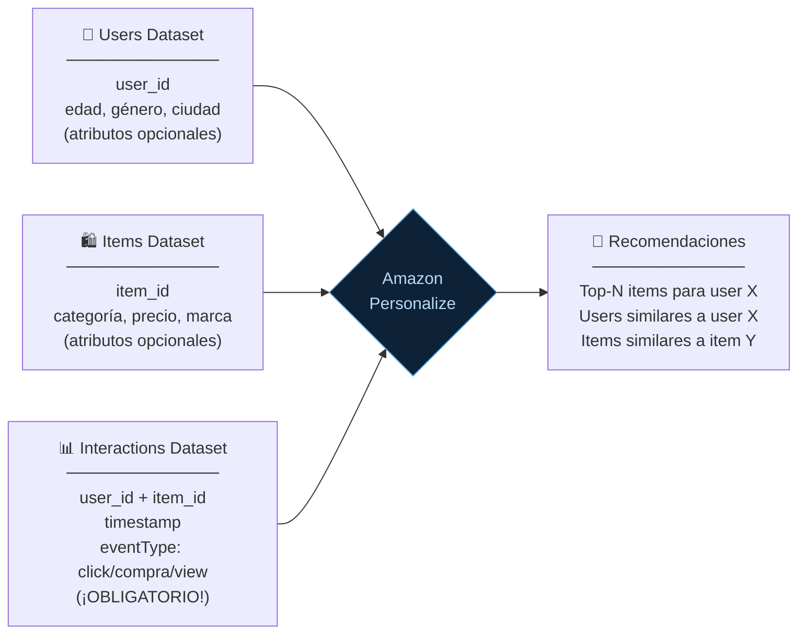
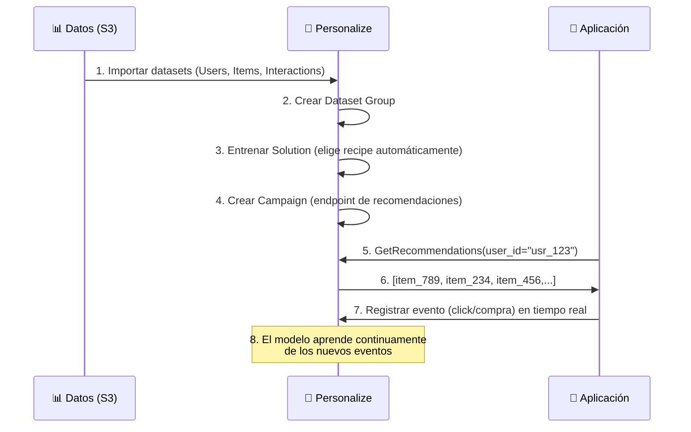
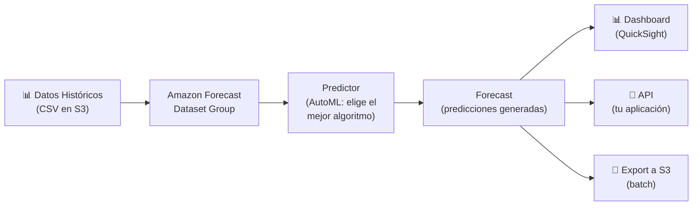

**Tags:** #personalize #forecast #recomendaciones #series-temporales #ia
 #m2-servicios

---

## 🎯 Amazon Personalize — Motor de Recomendaciones

> [!quote] Definición AWS
> Amazon Personalize es un servicio de **machine learning fully managed** para crear sistemas de recomendaciones personalizadas en tiempo real, usando la misma tecnología que impulsa las recomendaciones de Amazon.com.

### ¿Por qué Personalize y no un modelo propio?

Construir un motor de recomendaciones desde cero requiere experiencia profunda en ML (Collaborative Filtering, Matrix Factorization, redes neuronales...). Personalize abstrae toda esa complejidad: tú aportas los datos, AWS entrena el modelo y te sirve recomendaciones en tiempo real.

---

### 📥 Datos que necesita Personalize



| Dataset | ¿Obligatorio? | Contenido mínimo |
| :--- | :---: | :--- |
| **Interactions** | ✅ Sí | `user_id`, `item_id`, `timestamp` |
| **Users** | ❌ Opcional | `user_id` + atributos demográficos |
| **Items** | ❌ Opcional | `item_id` + atributos del ítem |

> [!warning] El dataset de Interactions es el más importante
> Sin el historial de interacciones usuario-ítem, no hay recomendaciones. Es el core del sistema. Necesitas al menos **1.000 registros** de interacciones para entrenar un modelo con Personalize.

---

### 🎯 Tipos de Recomendaciones que Ofrece

| Recipe (algoritmo) | ¿Qué recomienda? | Ejemplo |
| :--- | :--- | :--- |
| **User Personalization** | Ítems relevantes para un usuario específico | "Recomendaciones para ti" en Netflix |
| **Similar Items** | Ítems similares a uno dado | "Productos similares a este" en Amazon |
| **Personalized Ranking** | Reordena una lista de ítems según relevancia para el usuario | Personalizar resultados de búsqueda |
| **Trending Now** | Ítems que están ganando popularidad rápidamente | "Tendencias" en TikTok |
| **User Segmentation** | Agrupa usuarios con comportamientos similares | Segmentación para campañas de marketing |

---

### 🔄 Flujo de Implementación



> [!example] Caso de uso real — Plataforma de Streaming
> Un servicio de streaming tipo Netflix usa Personalize para:
>
> - Recomendar películas en la página principal (User Personalization)
>
> - Mostrar "Porque viste X, te recomendamos Y" (Similar Items)
>
> - Personalizar el orden de los géneros en la portada (Personalized Ranking)
>
> - Actualizar las recomendaciones en tiempo real cuando el usuario termina de ver algo

> [!tip] Truco de examen — Personalize
> Si el escenario menciona: "recomendaciones personalizadas", "como lo hace Amazon/Netflix", "comportamiento del usuario", "historial de compras/visualizaciones" → **Amazon Personalize**.

---

## 📈 Amazon Forecast — Predictor del Futuro

> [!quote] Definición AWS
> Amazon Forecast es un servicio de **predicción de series temporales** fully managed que usa ML para generar predicciones precisas con intervalos de confianza, usando la misma tecnología que Amazon emplea para gestionar el inventario de sus almacenes.

### ¿Qué es una Serie Temporal?

Una serie temporal es cualquier secuencia de valores medidos a lo largo del tiempo:

- Ventas diarias de un producto (últimos 3 años)

- Consumo eléctrico por hora (último año)

- Número de visitas a un sitio web por día (último mes)

- Precio de cierre de una acción (últimos 10 años)

---

### 📥 Datos que necesita Forecast

| Dataset | ¿Obligatorio? | Contenido |
| :--- | :---: | :--- |
| **Target Time Series** | ✅ Sí | La métrica histórica que quieres predecir (`timestamp`, `item_id`, `value`) |
| **Related Time Series** | ❌ Opcional | Variables externas que afectan a la predicción (precio, temperatura, día festivo) |
| **Item Metadata** | ❌ Opcional | Atributos de los ítems (categoría, familia de producto) |

> [!example] Ejemplo de datos para predecir ventas de supermercado
> ```
> Target Time Series:
> 2024-01-01, producto_A, 245 unidades
> 2024-01-02, producto_A, 312 unidades
>...
>
> Related Time Series (variables externas):
> 2024-01-01, es_festivo=No, temperatura=12°C, precio_promo=No
> 2024-01-02, es_festivo=No, temperatura=8°C, precio_promo=Sí (↑ ventas esperadas)
> ```

---

### 🎯 Lo que Genera Forecast

Forecast no solo da un número: devuelve **predicciones probabilísticas** con intervalos de confianza.

```
Predicción de ventas para producto_A el 2024-03-15:

P10 (percentil 10): 180 unidades ← Solo 10% de probabilidad de ser menor
P50 (mediana): 245 unidades ← Lo más probable
P90 (percentil 90): 340 unidades ← Solo 10% de probabilidad de ser mayor
```

Esta información es más valiosa que un único número porque permite decisiones informadas:

- **Stock conservador:** usa P50 (normal)

- **Evitar rotura de stock:** usa P90 (alto)

- **Minimizar exceso de inventario:** usa P10 (bajo)

---

### 🔄 Flujo de Uso de Amazon Forecast



---

### 🤖 Algoritmos que Usa Internamente

Forecast usa AutoML: elige automáticamente el mejor algoritmo para tus datos:

| Algoritmo | Basado en | Cuándo es mejor |
| :--- | :--- | :--- |
| **ETS** | Estadística clásica | Series simples con estacionalidad clara |
| **ARIMA** | Estadística clásica | Series con autocorrelación |
| **Prophet** | Descomposición (Meta) | Series con múltiples estacionalidades y festivos |
| **DeepAR+** | Deep Learning (LSTM) | Múltiples series relacionadas, patrones complejos |
| **CNN-QR** | Deep Learning (CNN) | Patrones no lineales complejos |

---

### ⚡ Casos de Uso Más Habituales

> [!example] Retail — Gestión de Inventario
> Una cadena de supermercados predice la demanda de 50,000 SKUs en 500 tiendas con una semana de antelación, considerando las promociones planificadas y el historial de festivos.

> [!example] Energía — Previsión de Consumo
> Una eléctrica predice el consumo energético hora a hora para los próximos 7 días, considerando la temperatura prevista y el día de la semana.

> [!example] Finanzas — Gestión de Tesorería
> Un banco predice los flujos de caja futuros para optimizar la gestión de liquidez.

> [!example] Cloud — Capacidad de Servidores
> AWS internamente usa Forecast para predecir la demanda de recursos y aprovisionar infraestructura anticipadamente.

---

## 📊 Personalize vs Forecast — Diferencia Clave

| | **Amazon Personalize** | **Amazon Forecast** |
| :--- | :--- | :--- |
| **Pregunta que responde** | "¿Qué le gustará a ESTE usuario?" | "¿Cuánto venderemos MAÑANA?" |
| **Output** | Lista de ítems recomendados para un usuario | Valor numérico futuro (con intervalo) |
| **Input principal** | Historial de interacciones usuario-ítem | Serie temporal de valores históricos |
| **Uso típico** | Recomendaciones de productos/contenido | Predicción de demanda, ventas, tráfico |
| **Tiempo** | Tiempo real (ms de latencia) | Batch o near-real-time |

---
→ Volver al índice: [[📂M2 - Servicios IA-ML AWS/00 - Índice Módulo 2|🪐 Módulo 2: Servicios IA-ML AWS]]
