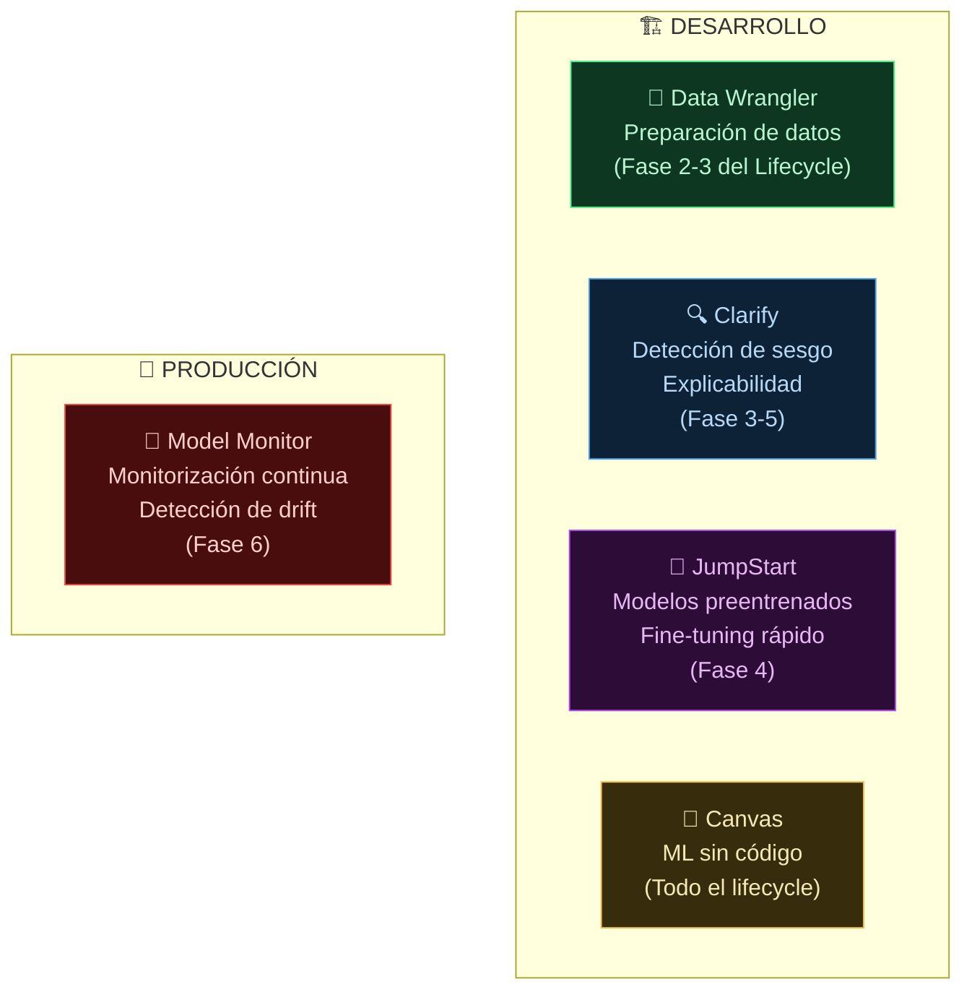

**Tags:** #sagemaker #jumpstart #canvas #clarify #model-monitor #data-wrangler #ia
 #m2-servicios

> [!quote] Contexto
> Amazon SageMaker es la plataforma principal (y más grande) de inteligencia artificial y machine learning en AWS. Como SageMaker es gigantesco y tiene decenas de funcionalidades, aquí se resumen los 5 servicios clave que debes conocer sí o sí para el examen de AI Practitioner, explicados de forma sencilla.

---

## 🗺️ Los 5 Servicios de SageMaker para el Examen

---

## 🔧 1. SageMaker Data Wrangler (El preparador de ingredientes)

Antes de entrenar una IA, necesitas datos limpios (sin errores, sin celdas vacías, bien formateados). Normalmente esto requiere escribir mucho código en Python. 

**¿Para qué sirve?** Data Wrangler es una herramienta visual donde puedes conectar tus datos (por ejemplo, un Excel gigante o una base de datos) y limpiarlos, transformarlos y prepararlos con clics, sin necesidad de programar.

> [!example] Ejemplo
> Tienes una lista de clientes y en la columna de edad faltan datos. Con Data Wrangler puedes decirle visualmente "rellena los vacíos con la edad media", sin escribir código.

---

## 🔍 2. SageMaker Clarify (El auditor de justicia)

Las IAs pueden ser injustas o racistas si los datos con los que aprenden lo son (esto se llama sesgo o bias). Además, a veces una IA toma una decisión y no sabemos por qué (es como una "caja negra"). 

**¿Para qué sirve?** Clarify tiene dos funciones clave:

- **Detectar sesgos:** Te avisa si tu modelo está discriminando (por ejemplo, si aprueba más hipotecas a hombres que a mujeres con el mismo sueldo).

- **Explicabilidad:** Te explica por qué el modelo tomó una decisión concreta (ej: "Denegué este crédito porque el cliente tenía un historial de impagos muy alto").

---

## 🚀 3. SageMaker JumpStart (El catálogo de modelos listos para usar)

Entrenar un modelo de IA desde cero es carísimo y muy difícil. A menudo es mejor coger un modelo que ya haya creado otra empresa (como Meta, HuggingFace, etc.) y adaptarlo a lo tuyo. 

**¿Para qué sirve?** JumpStart es como una "tienda de aplicaciones" o catálogo dentro de AWS. Te permite buscar modelos preentrenados (como Llama de Meta, o modelos de detección de fraude) y desplegarlos en tu cuenta con un par de clics para empezar a usarlos inmediatamente.

---

## 🎨 4. SageMaker Canvas (El creador de IAs para los que no saben programar)

No todo el mundo en una empresa sabe programar en Python (analistas de marketing, managers, etc.), pero también necesitan predecir cosas con IA. 

**¿Para qué sirve?** Canvas es una interfaz visual 100% libre de código (No-Code). Subes tu Excel, le dices qué columna quieres adivinar (ej: "¿Qué clientes se van a dar de baja el mes que viene?"), le das a un botón, y Canvas por detrás prueba cientos de algoritmos, elige el mejor y te da las predicciones. Está pensado para perfiles de negocio, no para ingenieros.

---

## 📡 5. SageMaker Model Monitor (El vigilante de seguridad)

Una vez que has creado tu modelo de IA y lo estás usando en la vida real (en producción), las cosas pueden cambiar. Por ejemplo, si entrenaste tu IA para detectar fraude con datos de 2019, igual en 2024 los estafadores usan métodos nuevos y tu modelo empieza a fallar. 

**¿Para qué sirve?** Model Monitor se queda "vigilando" tu modelo las 24 horas del día. Si detecta que la precisión está bajando o que los datos nuevos que llegan son muy diferentes a los que usaste para entrenar, hace saltar una alarma para que lo arregles o lo reentrenes.

---

## 💡 Resumen rápido

- **¿Datos sin código?** → Data Wrangler
- **¿Sesgos y explicar el "por qué"?** → Clarify
- **¿Modelos preentrenados rápido?** → JumpStart
- **¿IA para analistas (sin programar nada)?** → Canvas
- **¿Vigilar en producción que no falle?** → Model Monitor

---

---
→ Volver al índice: [[📂M2 - Servicios IA-ML AWS/00 - Índice Módulo 2|🪐 Módulo 2: Servicios IA-ML AWS]]
