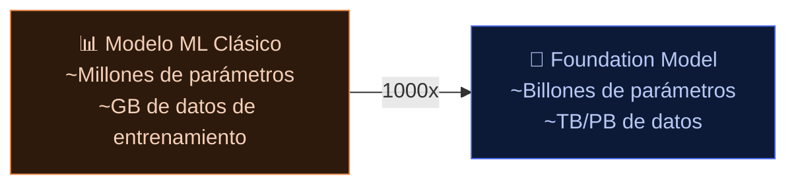
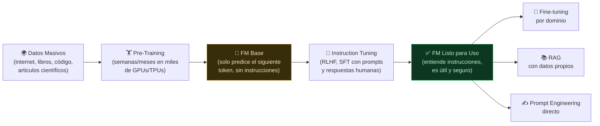

**Tags:** #genai #foundation-models #narrow-ai #llm #ia
 #m3-genai

> [!quote] Definición AWS de Foundation Model
> Un **Foundation Model (FM)** es un modelo de IA de gran escala, entrenado con cantidades masivas de datos no etiquetados mediante auto-supervisión, que puede adaptarse a una amplia variedad de tareas con poca o ninguna personalización adicional.

---

## 🆚 Comparativa: Foundation Models vs Narrow AI

La diferencia fundamental está en el **alcance** y el **paradigma de uso**:

| Dimensión | **Narrow AI (Modelos Tradicionales)** | **Foundation Models (FMs)** |
| :------------------------- | :----------------------------------------- | :-------------------------------------------------------- |
| **Alcance** | Una sola tarea específica | Múltiples tareas y dominios |
| **Entrenamiento** | Desde cero, para cada tarea | Una vez (pre-training masivo), luego se adapta |
| **Datos de entrenamiento** | Miles/millones de ejemplos etiquetados | Billones de tokens no etiquetados (toda internet) |
| **Flexibilidad** | Rígido: solo hace lo que fue entrenado | Flexible: se adapta con instrucciones en lenguaje natural |
| **Especialización** | Extrema en su tarea única | Generalista con especialización opcional |
| **Coste de adaptación** | Reentrenamiento desde cero | Prompt engineering, RAG o fine-tuning ligero |
| **Ejemplos** | Modelo de spam, modelo de precios de casas | GPT-4, Claude, Amazon Titan, Llama 3 |

---

## 🏆 La Metáfora del Especialista vs el Generalista

**Narrow AI = Cirujano cardíaco especialista:**

- Extraordinariamente bueno operando corazones

- No puede ayudarte con una consulta de dermatología

- No puede redactar el informe médico post-operatorio

- No puede explicar los resultados al paciente en alemán

**Foundation Model = Médico con múltiples especialidades + doctorado en lingüística:**

- Puede diagnosticar enfermedades comunes

- Puede redactar informes médicos detallados

- Puede traducirlos a 20 idiomas

- Puede explicar los resultados de forma sencilla a un paciente

- Puede escribir código para analizar datos clínicos

- Puede buscar información en literatura médica

---

## 🔬 ¿Por qué son tan Potentes los Foundation Models?

### 1. Escala sin precedentes

Los FMs más grandes (GPT-4, Llama 3 405B, Claude 3 Opus) tienen **cientos de miles de millones de parámetros** y fueron entrenados con prácticamente toda la información textual de internet.

> [!info] ¿Qué son los "Parámetros" o "Pesos" (Weights)?
> Imagina el cerebro humano con sus miles de millones de conexiones neuronales. En las redes neuronales de IA, esas conexiones se llaman **parámetros** o **pesos**. Un "peso" es simplemente un número matemático que decide cuánta importancia tiene una palabra sobre otra en un contexto dado. 
> Cuando decimos que un modelo "aprende", en realidad significa que el ordenador está ajustando milimétricamente esos miles de millones de números (pesos) hasta que la red neuronal empieza a dar respuestas correctas. Por eso entrenar desde cero cuesta millones de dólares, y por eso el *Fine-tuning* (modificar levemente una parte de esos pesos) es mucho más barato.

### 2. Pre-training auto-supervisado

No necesitan millones de ejemplos etiquetados por humanos. Aprenden prediendo el siguiente token de enormes cantidades de texto no etiquetado (la web, libros, código, artículos científicos).

### 3. Emergent Abilities (Capacidades Emergentes)

Superando ciertos umbrales de escala, los FMs desarrollan capacidades que **no fueron explícitamente entrenadas**:

- Razonamiento matemático complejo

- Traducción entre idiomas poco representados

- Escritura de código en lenguajes de nicho

- Razonamiento multi-paso (Chain-of-Thought)

---

## 🏗️ Cómo se Construye un Foundation Model

---

## 📋 Catálogo de Foundation Models en AWS (Bedrock)

| Proveedor | Modelos Destacados | Especialidad |
| :--- | :--- | :--- |
| **Anthropic** | Claude 3 Haiku / Sonnet / Opus, Claude 3.5 | Texto, código, análisis, seguridad |
| **Meta** | Llama 2, Llama 3 (8B, 70B, 405B) | Open-source, texto general |
| **Amazon** | Titan Text, Titan Embeddings, Titan Image, Titan Multimodal | Texto, imágenes, embeddings (nativo AWS) |
| **Mistral AI** | Mistral 7B, Mixtral 8x7B | Texto eficiente, open-source |
| **Stability AI** | Stable Diffusion XL | Generación de imágenes |
| **Cohere** | Command, Embed, Rerank | Texto empresarial, embeddings, búsqueda |
| **AI21 Labs** | Jurassic-2 | Texto en múltiples idiomas |

> [!tip] Truco de examen — Amazon Titan
> Amazon Titan es la **familia propia de Amazon** en Bedrock. Para el examen, recuerda:
>
> - **Titan Text** → Generación de texto general
>
> - **Titan Embeddings** → Convertir texto en vectores para búsqueda semántica (RAG)
>
> - **Titan Image Generator** → Generación y edición de imágenes
> Si el examen pregunta por el modelo nativo de AWS en Bedrock → **Amazon Titan**

---

## ⚡ Casos de Uso de Foundation Models

| Caso de Uso | Capacidad del FM | Servicio AWS |
| :--- | :--- | :--- |
| **Q&A sobre documentos internos** | Comprensión + generación de texto | Bedrock + Knowledge Bases |
| **Generación de código** | Comprensión de instrucciones + código | Bedrock (Claude) / Amazon Q Developer |
| **Resumen de documentos** | Compresión semántica de información | Bedrock (cualquier modelo) |
| **Traducción contextual** | Comprensión multilingüe | Bedrock / Amazon Translate |
| **Generación de imágenes** | Síntesis de píxeles desde texto | Bedrock (Titan Image / Stable Diffusion) |
| **Análisis de sentimiento** | Comprensión emocional del texto | Bedrock / Amazon Comprehend |

---
→ Volver al índice: [[📂M3 - IA Generativa/00 - Índice Módulo 3|🪐 Módulo 3: IA Generativa]]
