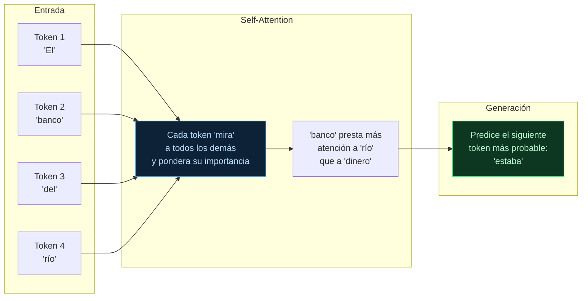
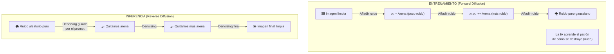

**Tags:** #transformers #difusion #arquitectura #llm #imagen #ia
 #m3-genai

> [!quote] Contexto
> Las dos grandes arquitecturas de Deep Learning que impulsan la GenAI moderna son los **Transformers** (para texto y código) y los **Modelos de Difusión** (para imágenes y vídeo). Entender sus diferencias conceptuales es suficiente para el examen.

---

## 🔤 Transformers — La Arquitectura detrás de los LLMs

> [!quote] Origen histórico
> Presentados en el paper **"Attention is All You Need"** (Vaswani et al., Google, 2017). Revolucionaron el NLP al introducir el mecanismo de **Self-Attention**, eliminando la necesidad de procesar el texto de forma secuencial.

### ¿Cómo Funcionan los Transformers? (Simplificado)



### El Mecanismo de Self-Attention — La Clave

La innovación central de los Transformers es el **Self-Attention**: un mecanismo que permite a cada token "mirar" a todos los demás tokens de la secuencia y aprender qué relaciones son importantes.

**Ejemplo práctico de ambigüedad:**

- "El banco del río estaba mojado" → "banco" se refiere a la orilla

- "El banco del pueblo cerró ayer" → "banco" se refiere a la entidad financiera

El Self-Attention resuelve esta ambigüedad porque "banco" puede calcular su similitud con "río" vs "pueblo" vs "dinero" y ajustar su representación según el contexto.

### Generación de Texto — Proceso Autoregresivo

Los LLMs basados en Transformers generan texto **token a token**, de izquierda a derecha:

```
Prompt: "La capital de España es"
↓
Paso 1: Predice "Madrid" (probabilidad 0.95) → "La capital de España es Madrid"
↓
Paso 2: Predice "," (probabilidad 0.72) → "La capital de España es Madrid,"
↓
Paso 3: Predice "una" (probabilidad 0.68) → "La capital de España es Madrid, una"
... y así sucesivamente
```

### Modelos que Usan Transformers

| Modelo | Proveedor | Disponible en Bedrock |
| :--- | :--- | :---: |
| Claude 3 (Haiku/Sonnet/Opus) | Anthropic | ✅ |
| Llama 2/3 | Meta | ✅ |
| Amazon Titan Text | Amazon | ✅ |
| Mistral/Mixtral | Mistral AI | ✅ |
| GPT-4 | OpenAI | ❌ (Azure) |
| Gemini | Google | ❌ (Google Cloud) |

**Casos de uso de Transformers:**

- Generación de texto (artículos, código, emails)

- Traducción automática

- Resumen de documentos

- Q&A conversacional (chatbots)

- Análisis de sentimiento

- Generación de código

---

## 🎨 Modelos de Difusión — La Arquitectura de las Imágenes

> [!quote] Concepto
> Los modelos de difusión aprenden a **generar imágenes eliminando ruido** progresivamente. Durante el entrenamiento aprenden a deshacer el proceso de "destrucción" de una imagen; durante la inferencia, parten de ruido puro y lo "limpian" guiados por un prompt.

### El Proceso en Dos Fases (Analogía del Restaurador y la Arena)

Para entender cómo funcionan, imagina que la IA es un **restaurador de arte mágico** que trabaja con arena. 



#### Fase 1: El Entrenamiento (Aprender destruyendo) 🌪️

Para que la IA aprenda a crear imágenes, primero tiene que aprender a "destruirlas".

1. Le damos a la IA una foto perfecta (ej: un gato).

2. Paso a paso, le va echando puñados de arena encima (esto se llama añadir **"ruido"**). 

3. Se repite hasta que la foto desaparece y solo queda un cuadrado de arena gris.

4. **Lo clave:** En cada paso, la IA aprende exactamente *cómo* se destruye la imagen.

#### Fase 2: La Inferencia (Crear guiado por el prompt) 🖼️

Así es como funciona cuando le pides una imagen a la IA.

1. La IA empieza con un lienzo lleno de arena aleatoria (ruido puro). No hay nada debajo.

2. Tú le pasas un **prompt**: *"Un perro astronauta en marte"*.

3. La IA empieza el proceso inverso: **quitar la arena poco a poco** (proceso de *denoising*). Como ya aprendió cómo se comporta la arena en la Fase 1, ahora sabe cómo quitarla para revelar lo que hay debajo.

### ¿Cómo el Prompt Guía la Generación?

¿Cómo sabe la IA quitar la arena para que salga un perro astronauta y no una pizza? 

Aquí es donde entra tu **prompt**. El texto que escribes se convierte en vectores numéricos (embeddings). Durante el proceso de limpiar el ruido, el prompt actúa como un "imán" o un "director de orquesta". 

En cada paso, el prompt *condiciona* (guía) la limpieza: le dice a la IA *"quita la estática de forma que aquí vaya apareciendo un casco... aquí pelo de perro..."*. La IA no dibuja de la nada, sino que esculpe y elimina la "arena" que no encaja con tu texto, hasta revelar la imagen deseada.

### Modelos de Difusión Disponibles en AWS

| Modelo | Proveedor | En Bedrock |
| :--- | :--- | :---: |
| **Amazon Titan Image Generator** | Amazon | ✅ |
| **Stable Diffusion XL** | Stability AI | ✅ |
| DALL-E 3 | OpenAI | ❌ |
| Midjourney | Midjourney | ❌ |

**Casos de uso de Modelos de Difusión:**

- Generación de imágenes desde texto (text-to-image)

- Edición de imágenes (inpainting, outpainting)

- Variaciones de imágenes existentes

- Generación de arte y diseño

- Creación de assets para juegos/cine

---

## ⚡ Transformers vs Modelos de Difusión

| Dimensión | **Transformers** | **Modelos de Difusión** |
| :--- | :--- | :--- |
| **Datos de salida** | Texto, código | Imágenes, vídeo, audio |
| **Proceso de generación** | Token a token (autoregresivo) | Eliminación iterativa de ruido |
| **Modalidad de entrada** | Texto (prompt) | Texto (prompt) + opcionalmente imagen |
| **Modelos ejemplo** | Claude, GPT-4, Llama | Stable Diffusion, DALL-E, Titan Image |
| **Pasos de generación** | N tokens (uno por paso) | T pasos de denoising (50-1000) |

> [!tip] Truco de examen — Texto vs Imagen
>
> - **¿El output es texto o código?** → Probablemente un **Transformer** (LLM)
>
> - **¿El output es una imagen?** → Probablemente un **Modelo de Difusión**
>
> - En Bedrock: **Claude/Titan Text** = Transformer | **Titan Image/Stable Diffusion** = Difusión

---
→ Volver al índice: [[📂M3 - IA Generativa/00 - Índice Módulo 3|🪐 Módulo 3: IA Generativa]]
