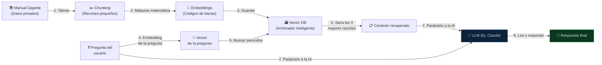

**Tags:** #tokens #embeddings #vector-db #chunking #rag #pre-training #fine-tuning #ia
 #m3-genai

> [!quote] Contexto Inicial: El Gran Malentendido (RAG NO es entrenar a la IA)
> Antes de entrar en la parte técnica, hay que entender dónde encaja todo esto en el mundo de la Inteligencia Artificial usando la **Analogía del Estudiante**.
> 
> **1. Pre-entrenamiento (Crear la IA desde cero):** La IA va al colegio 15 años. Lee todo el internet público en superordenadores gigantes. Aprende a hablar y razonar. Cuesta millones de dólares. Así nacen modelos como Claude o Llama.
> **2. Fine-Tuning (Ajuste Fino):** La IA hace un máster. Le damos miles de ejemplos para modificar un poco su "cerebro" y hacerla experta en una tarea concreta (ej: hablar como un médico). Cuesta miles de dólares.
> **3. RAG (Lo que vas a aprender en este archivo):** La IA se presenta a un examen **con el libro abierto**. Aquí **NO estamos entrenando a la IA**. Su cerebro no cambia. Simplemente le pasamos nuestros documentos privados (el libro abierto) en el momento en que le hacemos la pregunta para que los lea y nos responda basándose estrictamente en ellos.

---

## 🎯 ¿Cuál es el objetivo de RAG?

Las IAs se quedan "congeladas" en el tiempo (no saben noticias nuevas) y **no han leído los PDFs privados de tu empresa** durante su Pre-entrenamiento. Además, a veces "alucinan" y se inventan cosas.

Para solucionar esto sin tener que gastar millones en reentrenar a la IA, usamos **RAG (Retrieval-Augmented Generation)**. RAG es el sistema que prepara nuestros documentos privados para dárselos a la IA a modo de "apuntes" justo antes de preguntarle. 

Este sistema se construye con 4 piezas clave: Tokens, Chunking, Embeddings y Vector DB.

---

## 1. 🔢 Tokens — La "moneda" y el límite de lectura de la IA

Un **token** es la unidad mínima de texto que lee una IA. Puede ser una palabra, media palabra o un signo de puntuación. 

> [!warning] El idioma importa (Inglés vs Español)
> Los modelos están optimizados para el inglés. Escribir y recibir respuestas en **inglés gasta menos tokens** que en español (porque en español las palabras largas y con tildes se rompen en varios tokens). Como en AWS te cobran por cada token que entra y sale, usar inglés es técnicamente **más barato y más rápido**.

### El problema: El "Context Window" (La memoria a corto plazo)

Cada IA tiene un límite de cuántos tokens puede leer a la vez en un chat, llamado **Context Window** (Ventana de Contexto).
Imagina que la IA es el chico súper inteligente pero con una memoria a corto plazo muy limitada: solo puede leer unas pocas páginas de golpe. **Si le pasas tu manual de empresa de 1.000 páginas como "apuntes" para el examen, le "explota la cabeza"** porque supera su límite de tokens. 

¿Cómo le pasamos entonces nuestro manual gigante? Aquí entran los siguientes pasos.

---

## 2. ✂️ Chunking — Dividir para Gobernar (Las Tijeras)

Como no podemos darle el manual de 1.000 páginas entero por culpa del límite del Context Window, agarramos unas "tijeras virtuales" y **cortamos el documento en recortes más pequeños** (por ejemplo, recortes de 2 o 3 párrafos).
A cada uno de estos recortes lo llamamos **Chunk**. 

- **¿Por qué lo hacemos?** Para que, cuando busquemos una respuesta en nuestros apuntes, solo le pasemos a la IA los 2 o 3 "recortes" (chunks) que contienen la información. Esos recortes sí caben perfectamente en su memoria a corto plazo.

---

## 3. 🌌 Embeddings y Dimensiones — El traductor matemático (Las Pegatinas)

Ahora tenemos miles de recortes de papel (chunks) tirados por el suelo. ¿Cómo encontramos el recorte que tiene la respuesta correcta sin leerlos todos a mano? Usando Embeddings.

Los ordenadores no entienden letras, entienden números. Cuando hablamos de crear un **Embedding**, nos referimos a pasar el texto por un **Modelo de Embedding** que es una **Red Neuronal especializada** (generalmente basada en la arquitectura Transformer, como *Amazon Titan Embeddings* o *BERT*).

**¿Cómo funciona realmente?**

1. La red neuronal lee tu recorte de papel (chunk) y analiza cada palabra en su contexto usando el mecanismo de *Self-Attention* (el mismo que vimos en el archivo 02).

2. A través de sus múltiples capas, la red comprime todo el significado de ese párrafo en una sola representación matemática.

3. El resultado final que escupe la red es tu **código de barras matemático** (llamado **Vector**).

Ese código de barras no busca coincidencias de palabras exactas, sino que captura el **significado** profundo de la frase basándose en lo que la red neuronal aprendió durante su entrenamiento. 

> [!example] Ejemplo de búsqueda por significado
> Imagina estas dos frases:
>
> 1. *"¿Cómo cancelo mi suscripción?"*
>
> 2. *"Pasos para dar de baja tu cuenta premium"*
> 
> Un buscador antiguo (como buscar en Word) no las relacionaría porque no comparten palabras clave. Sin embargo, al pasarlas por el modelo de Embedding, **sus códigos de barras matemáticos (vectores) son casi idénticos**. El sistema sabe al instante que significan exactamente lo mismo sin importar las palabras usadas.

### ¿Qué son las Dimensiones?

Para describir el significado matemáticamente, los modelos de AWS (como Amazon Titan) usan vectores de **1.024 dimensiones**. 
Imagínalo así: para describir a una persona con números podrías usar 2 dimensiones (Edad y Altura: `[25, 170]`). La IA usa 1.024 características secretas (dimensiones) para describir perfectamente el significado de una palabra o de un texto completo.

> [!example] El ejemplo del "banco del río"
> Cuando la IA lee la frase "El banco del río", calcula las matemáticas entre los vectores de "banco" y "río". Al multiplicar sus dimensiones, descubre una altísima relación en la dimensión de "naturaleza/agua". 
> Así es como la IA descarta el significado de "entidad financiera" y sabe que, por probabilidad matemática, la siguiente palabra debe ser "estaba" o "es", y no "cerró".

---

## 4. 🗃️ Vector Database — El Universo de Conceptos (La Búsqueda)

Ya tenemos nuestros recortes (chunks) con sus pegatinas matemáticas (vectores/embeddings). Ahora cogemos todos esos papeles y los guardamos en un **Vector Database** (Base de Datos Vectorial).

Para visualizar cómo funciona, no imagines un archivador normal ordenado de la A a la Z. Imagina una **habitación gigante (un espacio matemático)**:

- En lugar de guardar los papeles en carpetas, la base de datos lanza todos los recortes a flotar en el aire dentro de esta habitación.

- **¿Dónde flota cada papel?** Su posición exacta depende de su "pegatina" (su vector). Todos los papeles que hablan de "perros" acaban flotando juntos en la esquina superior derecha. Los que hablan de "coches" flotan en la esquina inferior izquierda.

### ¿Cómo encuentra la respuesta tan rápido?

Cuando tú haces una pregunta (ej: *"¿Qué comen los perros?"*), el sistema crea un vector para tu pregunta y lo lanza a la habitación. 
Tu pregunta va a aterrizar matemáticamente justo en la esquina superior derecha, rodeada de los recortes de perros. La base de datos simplemente traza un pequeño círculo alrededor de tu pregunta y dice: *"¡Toma, estos son los 3 papeles que están flotando más cerca de ti!"*. 

A esto se le llama **Búsqueda de Similitud** (o *Nearest Neighbors*), y es lo que permite encontrar respuestas por significado en milisegundos entre millones de documentos.

**Servicios de AWS para esto:** *Amazon OpenSearch*, *Aurora con pgvector*, o la opción recomendada automática *Knowledge Bases for Bedrock*.

---

## 🔄 5. RAG: Enlazándolo todo en la práctica

Vamos a ver cómo funciona todo este flujo en la vida real, paso a paso, cuando un usuario hace una pregunta sobre un documento privado de la empresa.

1. **La Pregunta:** Entras en tu aplicación y escribes: *"¿Qué ocurrió el 2 de mayo en Madrid?"*

2. **Embedding de la pregunta:** Tu pregunta se pasa por la máquina para crearle su propia "pegatina matemática" (Vector).

3. **Búsqueda en el Archivador (Vector DB):** El sistema va al archivador y le dice: *"Dame los 3 recortes (chunks) cuyas pegatinas se parezcan más a la pegatina de mi pregunta"*. Como busca por significado, saca al instante los 3 recortes exactos del manual gigante.

4. **El turno de la IA (El examen a libro abierto):** Ahora llamas a la IA pre-entrenada. Le das tu pregunta y **SOLAMENTE** le pasas esos 3 recortes recuperados como apuntes. 

5. **La Respuesta:** Como son solo 3 recortes, no superamos el límite de tokens (Context Window). La IA lee la pregunta, lee los 3 recortes, usa su inteligencia general, y te redacta una respuesta perfecta basándose estrictamente en tus datos privados, sin memorizarlos ni entrenarse con ellos.

> [!tip] Resumen para el Examen
> Si AWS te pregunta cómo hacer que una IA responda sobre documentos privados o PDFs de tu empresa **sin tener que entrenarla desde cero**, la arquitectura que debes buscar en las respuestas se llama **RAG**, y se implementa usando **Knowledge Bases for Amazon Bedrock** (que hace todos los pasos de chunking, embedding y vector DB por ti).

---

---
→ Volver al índice: [[📂M3 - IA Generativa/00 - Índice Módulo 3|🪐 Módulo 3: IA Generativa]]
