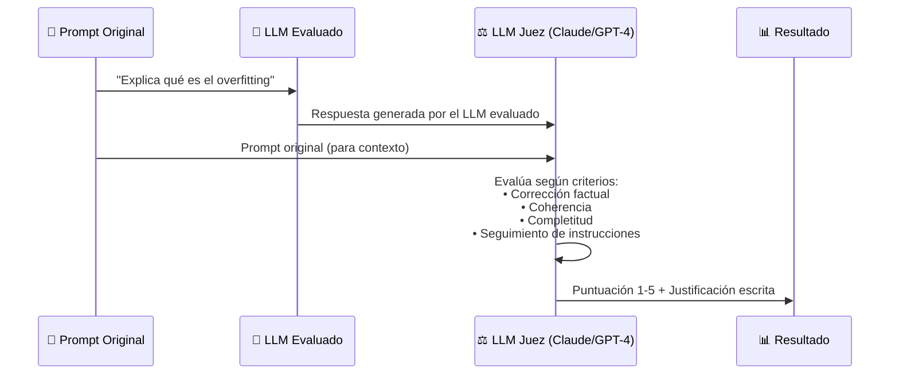

**Tags:** #rouge #bleu #bertscore #llm-judge #evaluacion-genai #ia #m3-genai

> [!quote] El reto de evaluar GenAI
> Evaluar texto generado es radicalmente más difícil que evaluar una clasificación binaria. "¿Es buena esta respuesta?" no tiene una respuesta única. Por eso existen estas métricas especializadas.

---

## 🔴 ROUGE — El Evaluador de Resúmenes

> [!quote] Definición
> **ROUGE** (Recall-Oriented Understudy for Gisting Evaluation) es un conjunto de métricas que mide la **superposición de n-gramas** entre el texto generado y un texto de referencia. Está orientado al **Recall**.

### ¿Qué son los N-gramas?
Para entender las métricas de ROUGE y BLEU, primero debes entender qué es un "n-grama". Un n-grama es simplemente **una secuencia de "N" palabras consecutivas** en una frase:

- **Unigrama (1-grama):** Palabras sueltas. Ej: "El", "gato", "come".

- **Bigrama (2-grama):** Pares de palabras seguidas. Ej: "El gato", "gato come", "come pescado".

- **Trigrama (3-grama):** Tríos de palabras. Ej: "El gato come", "gato come pescado".

### Las Variantes de ROUGE
ROUGE cuenta cuántos de estos n-gramas del texto humano (referencia) han sido "acertados" e incluidos en el texto generado por el modelo.

| Variante | Qué mide |
| :--- | :--- |
| **ROUGE-1** | Mide aciertos de **unigramas** (palabras sueltas). Evalúa si el vocabulario principal está presente en la respuesta del modelo. |
| **ROUGE-2** | Mide aciertos de **bigramas** (pares). Empieza a evaluar si el orden sintáctico a corto plazo se está respetando. |
| **ROUGE-N** | Mide aciertos de "N" palabras consecutivas (ROUGE-3, ROUGE-4...). |
| **ROUGE-L** | Mide la **secuencia más larga de palabras comunes** (LCS - Longest Common Subsequence). No exige que todas las palabras estén estrictamente juntas una tras otra, pero sí exige que mantengan el **mismo orden general** en la oración. |

### Ejemplo de Cálculo de ROUGE-1

```
Referencia: "El gato come pescado fresco"
Generado: "El gato ha comido pescado"

Palabras de referencia: {El, gato, come, pescado, fresco} = 5
Palabras coincidentes en el generado: {El, gato, pescado} = 3

ROUGE-1 Recall = 3/5 = 0.60 (60% de la referencia fue capturada)
ROUGE-1 Precision = 3/5 = 0.60 (60% del generado estaba en la referencia)
ROUGE-1 F1 = 0.60
```

### Cuándo Usar ROUGE

> [!example] Casos de uso de ROUGE
>
> - **Evaluación de sistemas de resumen** (summarization): ¿Capturó el resumen las ideas principales?
>
> - **Evaluación de traducción automática** (como métrica secundaria)
>
> - **Evaluación de generación de respuestas a preguntas** (Q&A)
>
> - Cualquier tarea donde exista un texto de referencia "correcto" con el que comparar

> [!warning] Limitación crítica de ROUGE
> ROUGE mide **solapamiento de palabras**, **no significado**. Una respuesta semánticamente idéntica pero expresada con sinónimos puede obtener ROUGE ≈ 0:
> 
> ```
> Referencia: "El coche es veloz"
> Generado: "El automóvil es rápido"
> ROUGE-1 ≈ 0.33 (solo "El" coincide, aunque significan lo mismo)
> BERTScore ≈ 0.95 (captura que son semánticamente equivalentes)
> ```

---

## 🔵 BLEU — El Evaluador de Traducción

> [!quote] Definición
> **BLEU** (Bilingual Evaluation Understudy) es una métrica orientada a la **Precision** de n-gramas. Mide qué porcentaje del texto generado aparece en el texto de referencia. Fue diseñada originalmente para traducción automática.

### Diferencia BLEU vs ROUGE

| | **ROUGE** | **BLEU** |
| :--- | :--- | :--- |
| **Orientación** | Recall (¿cuánto de la referencia captura lo generado?) | Precision (¿cuánto de lo generado está en la referencia?) |
| **Uso principal** | Resumen, Q&A | Traducción automática |
| **Referencia** | Una referencia | Puede usar múltiples referencias |
| **Penalización** | No penaliza respuestas cortas | Sí penaliza respuestas demasiado cortas (Brevity Penalty) |

### Ejemplo de Cálculo de BLEU

```
Traducción Humana (Referencia): "El gato está sobre la alfombra" (6 palabras)
Traducción del Modelo: "El gato está sobre" (4 palabras)

Precision de unigramas (BLEU-1):
Las 4 palabras del modelo {"El", "gato", "está", "sobre"} sí aparecen en la referencia humana.
¡La Precisión del modelo es del 100%! (4 palabras acertadas de 4 generadas = 1.0)
```

**¡Problema!** Aunque la precisión del modelo sea perfecta (100%), su respuesta es incompleta y el significado está truncado.
Aquí es donde BLEU brilla en comparación a otras métricas: BLEU aplica matemáticamente una **Brevity Penalty (Penalización por brevedad)**. Dado que el modelo generó solo 4 palabras frente a las 6 de la referencia, la fórmula castiga severamente la puntuación final de BLEU para evitar que modelos que responden respuestas extremadamente cortas (pero muy precisas) ganen puntuaciones altas inmerecidas.

> [!example] Cuándo usar BLEU
>
> - Evaluación de sistemas de **traducción automática** (Machine Translation)
>
> - Comparar la salida de diferentes modelos de traducción entre sí
>
> - Benchmark estándar de NLP para muchas tareas generativas

---

## 🤗 BERTScore — El Evaluador Semántico

> [!quote] Definición
> **BERTScore** usa **embeddings de BERT** para calcular la similitud semántica entre el texto generado y el de referencia token a token, capturando sinónimos y paráfrasis que ROUGE/BLEU ignoran.

### Cómo Funciona BERTScore

```mermaid
graph LR
 subgraph "Texto Generado"
 G1["El"] G2["automóvil"] G3["es"] G4["rápido"]
 end
 subgraph "Texto Referencia"
 R1["El"] R2["coche"] R3["es"] R4["veloz"]
 end
 
 G1 -->|"similitud\n1.00"| R1
 G2 -->|"similitud\n0.95"| R2
 G3 -->|"similitud\n1.00"| R3
 G4 -->|"similitud\n0.93"| R4

 Note["BERTScore F1 ≈ 0.97\n¡Captura que son equivalentes!"]
```

### Por Qué BERTScore es Superior a ROUGE/BLEU

| Capacidad | ROUGE/BLEU | BERTScore |
| :--- | :---: | :---: |
| Detecta palabras exactas | ✅ | ✅ |
| Detecta sinónimos | ❌ | ✅ |
| Detecta paráfrasis | ❌ | ✅ |
| Evalúa coherencia semántica | ❌ | ✅ |
| Coste computacional | Bajo | Medio (necesita BERT) |

> [!tip] Cuándo usar BERTScore vs ROUGE
>
> - Si quieres evaluar si el **significado** se preserva → **BERTScore**
>
> - Si quieres evaluar si las **palabras clave específicas** aparecen → **ROUGE**
>
> - En la práctica, se usan **juntas** como métricas complementarias

---

## 🤖 LLM-as-a-Judge — El Evaluador Inteligente

> [!quote] Definición
> **LLM-as-a-Judge** es una técnica en la que se usa un **LLM potente** (el "juez") para evaluar automáticamente la calidad de las respuestas de otro LLM (el "evaluado"), en lugar de usar métricas lexicales o evaluadores humanos.

### Cómo Funciona



### Criterios de Evaluación Típicos

| Criterio | ¿Qué evalúa? |
| :--- | :--- |
| **Faithfulness** | ¿Es factualmente correcta la respuesta? ¿No alucina? |
| **Relevance** | ¿Responde directamente a la pregunta? |
| **Coherence** | ¿Es lógica y bien estructurada? |
| **Helpfulness** | ¿Es útil para el usuario? |
| **Harmlessness** | ¿Evita contenido dañino o inapropiado? |

### Ventajas e Inconvenientes

| Aspecto | Ventaja | Inconveniente |
| :--- | :--- | :--- |
| **Escala** | Puede evaluar millones de respuestas automáticamente | Coste de API del LLM juez |
| **Calidad** | Más cercano al juicio humano que ROUGE/BLEU | El LLM juez tiene sus propios sesgos |
| **Flexibilidad** | Evalúa cualquier criterio que definas | Puede tener inconsistencias |
| **Sesgos conocidos** | — | Preferencia por respuestas largas, autopreferencia (prefiere respuestas de su mismo proveedor) |

> [!tip] LLM-as-a-Judge en Amazon Bedrock
> **Bedrock Model Evaluation** soporta evaluación automática usando un LLM como juez. Es la solución AWS para evaluar calidad de modelos sin revisión humana. Si el examen pregunta:
>
> - "Evaluar automáticamente la calidad de respuestas de un chatbot sin revisión humana" → **LLM-as-a-Judge / Bedrock Model Evaluation**
>
> - "Evaluar la calidad de resúmenes automáticos" → **ROUGE**
>
> - "Evaluar la similitud semántica entre respuestas" → **BERTScore**

---

## 📊 Tabla Comparativa Final — Las 4 Métricas

| Métrica | Basada en | Mide | Captura sinónimos | Mejor para | En AWS |
| :--- | :--- | :--- | :---: | :--- | :--- |
| **ROUGE** | N-gramas (Recall) | Solapamiento léxico | ❌ | Evaluación de resúmenes | Bedrock Model Eval |
| **BLEU** | N-gramas (Precision) | Solapamiento léxico | ❌ | Traducción automática | Bedrock Model Eval |
| **BERTScore** | Embeddings semánticos | Similitud de significado | ✅ | Evaluación semántica general | Bedrock Model Eval |
| **LLM-as-a-Judge** | Juicio de otro LLM | Calidad holística | ✅ | Evaluación completa de chatbots | Bedrock Model Eval |
---

## 💼 Métricas de Éxito Empresarial (Más allá de lo técnico)

> [!warning] Mentalidad para el Examen
> AWS evaluará tu capacidad para pensar como un líder de proyecto. No basta con saber que el modelo tiene buen ROUGE o BLEU; debes saber cómo medir el impacto real en el negocio.

A la hora de evaluar si un proyecto de GenAI es exitoso, las empresas miran estas métricas fundamentales:

- **Eficiencia / Ahorro de tiempo:** ¿Ha reducido el tiempo promedio para resolver un ticket de soporte técnico de 10 minutos a 2 minutos?

- **Tasa de Conversión:** Incremento en el porcentaje de usuarios que completan una compra gracias a las recomendaciones personalizadas del chatbot.

- **ARPU (Average Revenue Per User) / LTV (Life Time Value):** ¿Genera el modelo más ingresos promedio por usuario gracias a interacciones más fluidas?

- **Exactitud Operativa:** Reducción en la tasa de errores manuales en la entrada de datos.

---

## 🗂️ Evaluación del Pipeline RAG (Retrieve vs Generate)

> [!brain] Regla de Oro del Diagnóstico RAG
> Si un sistema RAG da una respuesta incorrecta, **no siempre es culpa de la IA (Generate)**. A menudo es culpa de la base de datos que no encontró el documento correcto (Retrieve). ¡Hay que evaluarlos por separado!

En el examen, te pedirán que identifiques dónde falla un sistema RAG:

1. **Fallo en Retrieval (Recuperación):** El modelo de Embedding o la base de datos vectorial sacan los documentos equivocados.

   - *¿Cómo se evalúa?* Usando métricas clásicas de búsqueda como MRR (Mean Reciprocal Rank) o NDCG.

   - *Síntoma:* La IA dice "No tengo información sobre eso" (porque los recortes que le llegaron no contenían la respuesta).

2. **Fallo en Generation (Generación):** La base de datos sacó los recortes perfectos, pero la IA redactó mal la respuesta o alucinó.

   - *¿Cómo se evalúa?* Con métricas como **Faithfulness** (Fidelidad a los recortes) y **Answer Relevance** (Relevancia de la respuesta).

   - *Síntoma:* La IA se inventa datos que no estaban en los recortes recuperados.

---
→ Volver al índice: [[📂M3 - IA Generativa/00 - Índice Módulo 3|🪐 Módulo 3: IA Generativa]]
