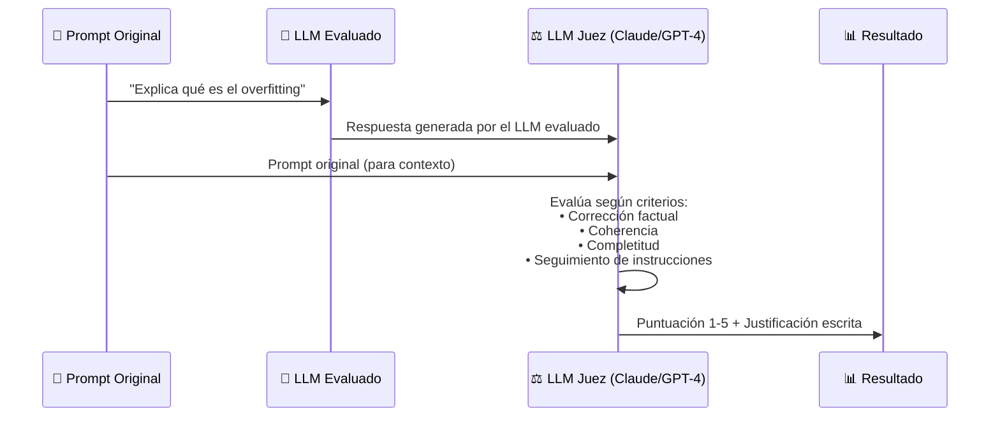

**Tags:** #rouge #bleu #bertscore #llm-judge #evaluacion-genai #ia #m3-genai

> [!quote] El reto de evaluar GenAI
> Evaluar texto generado es radicalmente más difícil que evaluar una clasificación binaria. "¿Es buena esta respuesta?" no tiene una respuesta única. Por eso existen estas métricas especializadas.

---

## 🔴 ROUGE — El Evaluador de Resúmenes

> [!quote] Definición
> **ROUGE** (Recall-Oriented Understudy for Gisting Evaluation) es un conjunto de métricas que mide la **superposición de n-gramas** entre el texto generado y un texto de referencia. Está orientado al **Recall**.

### Las Variantes de ROUGE

| Variante | Qué mide | Fórmula conceptual |
| :--- | :--- | :--- |
| **ROUGE-1** | Superposición de unigramas (palabras individuales) | n-gramas de 1 palabra coincidentes / n-gramas en la referencia |
| **ROUGE-2** | Superposición de bigramas (pares de palabras) | n-gramas de 2 palabras coincidentes / n-gramas en la referencia |
| **ROUGE-L** | Secuencia de palabras comunes más larga (LCS) | Preserva el orden de las palabras |

### Ejemplo de Cálculo de ROUGE-1

```
Referencia: "El gato come pescado fresco"
Generado: "El gato ha comido pescado"

Palabras de referencia: {El, gato, come, pescado, fresco} = 5
Palabras coincidentes en el generado: {El, gato, pescado} = 3

ROUGE-1 Recall = 3/5 = 0.60 (60% de la referencia fue capturada)
ROUGE-1 Precision = 3/5 = 0.60 (60% del generado estaba en la referencia)
ROUGE-1 F1 = 0.60
```

### Cuándo Usar ROUGE

> [!example] Casos de uso de ROUGE
>
> - **Evaluación de sistemas de resumen** (summarization): ¿Capturó el resumen las ideas principales?
>
> - **Evaluación de traducción automática** (como métrica secundaria)
>
> - **Evaluación de generación de respuestas a preguntas** (Q&A)
>
> - Cualquier tarea donde exista un texto de referencia "correcto" con el que comparar

> [!warning] Limitación crítica de ROUGE
> ROUGE mide **solapamiento de palabras**, **no significado**. Una respuesta semánticamente idéntica pero expresada con sinónimos puede obtener ROUGE ≈ 0:
> 
> ```
> Referencia: "El coche es veloz"
> Generado: "El automóvil es rápido"
> ROUGE-1 ≈ 0.33 (solo "El" coincide, aunque significan lo mismo)
> BERTScore ≈ 0.95 (captura que son semánticamente equivalentes)
> ```

---

## 🔵 BLEU — El Evaluador de Traducción

> [!quote] Definición
> **BLEU** (Bilingual Evaluation Understudy) es una métrica orientada a la **Precision** de n-gramas. Mide qué porcentaje del texto generado aparece en el texto de referencia. Fue diseñada originalmente para traducción automática.

### Diferencia BLEU vs ROUGE

| | **ROUGE** | **BLEU** |
| :--- | :--- | :--- |
| **Orientación** | Recall (¿cuánto de la referencia captura lo generado?) | Precision (¿cuánto de lo generado está en la referencia?) |
| **Uso principal** | Resumen, Q&A | Traducción automática |
| **Referencia** | Una referencia | Puede usar múltiples referencias |
| **Penalización** | No penaliza respuestas cortas | Sí penaliza respuestas demasiado cortas (Brevity Penalty) |

> [!example] Cuándo usar BLEU
>
> - Evaluación de sistemas de **traducción automática** (Machine Translation)
>
> - Comparar la salida de diferentes modelos de traducción entre sí
>
> - Benchmark estándar de NLP para muchas tareas generativas

---

## 🤗 BERTScore — El Evaluador Semántico

> [!quote] Definición
> **BERTScore** usa **embeddings de BERT** para calcular la similitud semántica entre el texto generado y el de referencia token a token, capturando sinónimos y paráfrasis que ROUGE/BLEU ignoran.

### Cómo Funciona BERTScore

```mermaid
graph LR
 subgraph "Texto Generado"
 G1["El"] G2["automóvil"] G3["es"] G4["rápido"]
 end
 subgraph "Texto Referencia"
 R1["El"] R2["coche"] R3["es"] R4["veloz"]
 end
 
 G1 -->|"similitud\n1.00"| R1
 G2 -->|"similitud\n0.95"| R2
 G3 -->|"similitud\n1.00"| R3
 G4 -->|"similitud\n0.93"| R4

 Note["BERTScore F1 ≈ 0.97\n¡Captura que son equivalentes!"]
```

### Por Qué BERTScore es Superior a ROUGE/BLEU

| Capacidad | ROUGE/BLEU | BERTScore |
| :--- | :---: | :---: |
| Detecta palabras exactas | ✅ | ✅ |
| Detecta sinónimos | ❌ | ✅ |
| Detecta paráfrasis | ❌ | ✅ |
| Evalúa coherencia semántica | ❌ | ✅ |
| Coste computacional | Bajo | Medio (necesita BERT) |

> [!tip] Cuándo usar BERTScore vs ROUGE
>
> - Si quieres evaluar si el **significado** se preserva → **BERTScore**
>
> - Si quieres evaluar si las **palabras clave específicas** aparecen → **ROUGE**
>
> - En la práctica, se usan **juntas** como métricas complementarias

---

## 🤖 LLM-as-a-Judge — El Evaluador Inteligente

> [!quote] Definición
> **LLM-as-a-Judge** es una técnica en la que se usa un **LLM potente** (el "juez") para evaluar automáticamente la calidad de las respuestas de otro LLM (el "evaluado"), en lugar de usar métricas lexicales o evaluadores humanos.

### Cómo Funciona



### Criterios de Evaluación Típicos

| Criterio | ¿Qué evalúa? |
| :--- | :--- |
| **Faithfulness** | ¿Es factualmente correcta la respuesta? ¿No alucina? |
| **Relevance** | ¿Responde directamente a la pregunta? |
| **Coherence** | ¿Es lógica y bien estructurada? |
| **Helpfulness** | ¿Es útil para el usuario? |
| **Harmlessness** | ¿Evita contenido dañino o inapropiado? |

### Ventajas e Inconvenientes

| Aspecto | Ventaja | Inconveniente |
| :--- | :--- | :--- |
| **Escala** | Puede evaluar millones de respuestas automáticamente | Coste de API del LLM juez |
| **Calidad** | Más cercano al juicio humano que ROUGE/BLEU | El LLM juez tiene sus propios sesgos |
| **Flexibilidad** | Evalúa cualquier criterio que definas | Puede tener inconsistencias |
| **Sesgos conocidos** | — | Preferencia por respuestas largas, autopreferencia (prefiere respuestas de su mismo proveedor) |

> [!tip] LLM-as-a-Judge en Amazon Bedrock
> **Bedrock Model Evaluation** soporta evaluación automática usando un LLM como juez. Es la solución AWS para evaluar calidad de modelos sin revisión humana. Si el examen pregunta:
>
> - "Evaluar automáticamente la calidad de respuestas de un chatbot sin revisión humana" → **LLM-as-a-Judge / Bedrock Model Evaluation**
>
> - "Evaluar la calidad de resúmenes automáticos" → **ROUGE**
>
> - "Evaluar la similitud semántica entre respuestas" → **BERTScore**

---

## 📊 Tabla Comparativa Final — Las 4 Métricas

| Métrica | Basada en | Mide | Captura sinónimos | Mejor para | En AWS |
| :--- | :--- | :--- | :---: | :--- | :--- |
| **ROUGE** | N-gramas (Recall) | Solapamiento léxico | ❌ | Evaluación de resúmenes | Bedrock Model Eval |
| **BLEU** | N-gramas (Precision) | Solapamiento léxico | ❌ | Traducción automática | Bedrock Model Eval |
| **BERTScore** | Embeddings semánticos | Similitud de significado | ✅ | Evaluación semántica general | Bedrock Model Eval |
| **LLM-as-a-Judge** | Juicio de otro LLM | Calidad holística | ✅ | Evaluación completa de chatbots | Bedrock Model Eval |

---
→ Volver al índice: [[📂M3 - IA Generativa/00 - Índice Módulo 3|🪐 Módulo 3: IA Generativa]]
