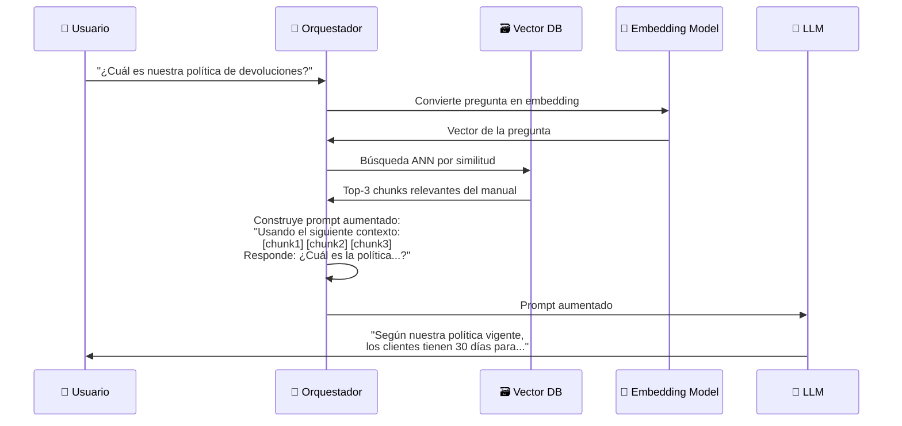
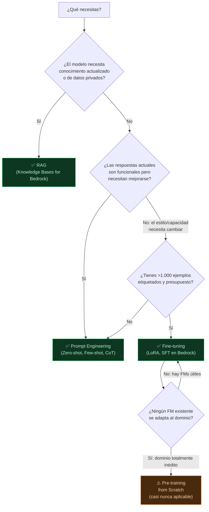

**Tags:** #prompt-engineering #rag #fine-tuning #few-shot #chain-of-thought #ia
 #m3-genai

> [!quote] El reto de la adaptación
> Los Foundation Models son generalistas. Para hacerlos útiles en contextos específicos de negocio, tenemos cuatro técnicas de adaptación con diferentes niveles de esfuerzo, coste y control. Elegir la correcta es una decisión de arquitectura crítica.

---

## 🏆 La Tabla Maestra — Esfuerzo / Coste / Caso de Uso

| Técnica | Esfuerzo | Coste | Tiempo | Modifica pesos | Lo que cambia | Caso de uso principal |
| :--- | :---: | :---: | :---: | :---: | :--- | :--- |
| **Prompt Engineering** | ⭐ Mínimo | 💰 Muy bajo | Horas | ❌ No | El input | Ajuste inmediato sin datos |
| **RAG** | ⭐⭐ Bajo | 💰💰 Bajo | Días | ❌ No | El contexto del prompt | Conocimiento actualizado/privado |
| **Fine-tuning** | ⭐⭐⭐ Alto | 💰💰💰 Alto | Semanas | ✅ Sí | Los pesos del modelo | Estilo específico, habilidades nuevas |
| **Pre-training from scratch** | ⭐⭐⭐⭐⭐ Extremo | 💰💰💰💰💰 Extremo | Meses | ✅ Todo | El modelo entero | Dominio completamente inédito |

---

## ✍️ Técnica 1: Prompt Engineering

> [!quote] Definición
> El arte de **diseñar los inputs (prompts)** para guiar al modelo hacia la respuesta deseada sin modificar ningún peso del modelo. También se le conoce formalmente en el examen como **In-Context Learning (Aprendizaje en Contexto)**.

**Es siempre la primera técnica a probar.** Si funciona, no necesitas nada más porque su coste de entrenamiento es **Cero**.

---

### 🧩 Los 4 Componentes de un Prompt Empresarial

Un prompt de calidad profesional (Prompt Engineering) debe estructurarse incluyendo:

1. **Rol:** Indicarle que actúe bajo un rol experto (ej. *"Actúa como un arquitecto cloud senior"*).
2. **Contexto:** Delimitar el escenario (ej. *"para una startup financiera que migra a AWS"*).
3. **Tarea Específica:** La orden exacta (ej. *"compara EC2 vs Lambda"*).
4. **Formato de Salida:** El formato final (ej. *"en una tabla Markdown"*).

> [!tip] Prompt Engineering vs Alucinaciones
> El Prompt Engineering riguroso es la primera (y más barata) línea de defensa para reducir **alucinaciones**. Sin embargo, no es infalible; no garantiza una verdad absoluta y siempre requiere validación humana posterior, especialmente en áreas críticas.

---
### 🎯 Zero-shot Prompting

El modelo realiza la tarea **sin ningún ejemplo previo**, basándose únicamente en su conocimiento preentrenado.

```
Prompt:
"Clasifica el sentimiento de la siguiente reseña como Positivo, 
 Negativo o Neutro:

 Reseña: 'El envío llegó 3 días tarde y la caja estaba golpeada.'
 
 Sentimiento:"

Respuesta del modelo: "Negativo"
```

**Cuándo funciona:** Tareas simples y bien definidas que el modelo haya visto durante el preentrenamiento.

---

### 🎯 Single-shot y Few-shot Prompting

Se proporcionan **entre 1 (Single-shot) y 5 (Few-shot) ejemplos** de pares input→output en el propio prompt para que el modelo aprenda el patrón deseado.

```
Prompt:
"Clasifica el sentimiento:

Reseña: 'La comida estaba deliciosa y el servicio fue excelente.'
Sentimiento: Positivo

Reseña: 'Esperé 45 minutos y el pedido llegó frío y equivocado.'
Sentimiento: Negativo

Reseña: 'El local es amplio y tiene buena ubicación.'
Sentimiento: Neutro

Reseña: 'El precio es razonable pero la calidad podría mejorar.'
Sentimiento:"

Respuesta del modelo: "Neutro"
```

**Por qué funciona mejor que Zero-shot:**

- Los ejemplos **muestran el formato exacto** de respuesta esperado

- Definen implícitamente el **criterio de clasificación** de tu empresa

- El modelo puede aprender patrones muy específicos del dominio

> [!tip] Cuándo usar Few-shot vs Fine-tuning
> Si necesitas **personalizar el comportamiento** del modelo:
>
> - **¿Tienes < 100 ejemplos o no quieres coste de entrenamiento?** → Few-shot
>
> - **¿Tienes > 1.000 ejemplos y quieres consistencia permanente?** → Fine-tuning

---

### 🧠 Chain-of-Thought (CoT) Prompting

Técnica que le pide al modelo que **razone paso a paso** antes de dar la respuesta final. Mejora drásticamente el rendimiento en problemas de razonamiento multi-paso.

```
Prompt SIN Chain-of-Thought:
"Si Juan tiene 15 manzanas, da 1/3 a María y la mitad 
 de lo que queda a Pedro, ¿cuántas le quedan a Juan?"

Respuesta final: "5"

---

Prompt CON Chain-of-Thought:
"Resuelve el siguiente problema razonando paso a paso:
 Si Juan tiene 15 manzanas, da 1/3 a María y la mitad 
 de lo que queda a Pedro, ¿cuántas le quedan a Juan?"

Respuesta:
"Paso 1: Juan tiene 15 manzanas.
 Paso 2: Da 1/3 a María → 15 × (1/3) = 5 manzanas para María.
 Le quedan a Juan: 15 - 5 = 10 manzanas.
 Paso 3: Da la mitad de lo que le queda a Pedro → 10 / 2 = 5 para Pedro.
 Le quedan a Juan: 10 - 5 = 5 manzanas.
 Respuesta final: Juan se queda con 5 manzanas."
```

**Por qué funciona:** Fuerza al modelo a "pensar en voz alta", activando capacidades de razonamiento más profundas. Reduce errores en matemáticas, lógica y razonamiento causal.

> [!tip] Variante: Zero-shot CoT
> Simplemente añade al final del prompt: **"Piensa paso a paso:"** o **"Let's think step by step:"**
> Esta variante es sorprendentemente efectiva sin necesidad de ejemplos.

---

### 🌌 Espacio Latente y Negative Prompts

El **Espacio Latente (Latent Space)** es el "universo matemático" donde la IA organiza todos los conceptos aprendidos. Cuando haces un prompt, le estás dando a la IA unas coordenadas para "navegar" hacia la respuesta correcta dentro de ese espacio.

- **Negative Prompting:** Es una técnica donde le dices explícitamente a la IA lo que **NO** quieres que haga o genere.
- *Ejemplo en texto:* "Escribe una historia infantil. NO uses lenguaje violento ni palabras complejas."
- *Ejemplo en imágenes:* "Gato en un parque, [negative prompt: borroso, deforme, blanco y negro]".
- **Por qué funciona:** El Negative Prompt bloquea "regiones indeseadas" del Espacio Latente, forzando a la IA a buscar la respuesta solo en las regiones permitidas.

---

### 🔀 Prompt Routing (Enrutamiento)

A medida que tu aplicación crece, no todos los prompts necesitan el modelo más caro.
El **Prompt Routing** es una arquitectura donde una pequeña pieza de código (o un LLM muy rápido) clasifica la pregunta entrante y la envía al modelo adecuado.
- Pregunta simple ("¿Qué hora es?") ➔ Enruta a Claude Haiku (barato y rápido).
- Pregunta compleja ("Revisa este contrato") ➔ Enruta a Claude Opus (caro y preciso).

---

## 🔍 Técnica 2: RAG (Retrieval-Augmented Generation)

> [!quote] Definición AWS
> RAG es una técnica que **aumenta el prompt del LLM** con información relevante recuperada en tiempo real de una base de conocimiento externa, sin modificar los pesos del modelo.

### ¿Por Qué RAG en Lugar de Fine-tuning para Conocimiento?

| Criterio | RAG | Fine-tuning |
| :--- | :---: | :---: |
| **Conocimiento actualizable** | ✅ Solo actualizas la KB | ❌ Reentrenamiento necesario |
| **Datos privados/confidenciales** | ✅ Nunca salen de tu infraestructura | ⚠️ Se exponen durante el entrenamiento |
| **Citación de fuentes** | ✅ Puedes mostrar el chunk origen | ❌ No puede citar |
| **Reducción de alucinaciones** | ✅ El modelo se ancla a los datos | ❌ No garantizado |
| **Coste de implementación** | 💰 Medio | 💰💰💰 Alto |

### Flujo RAG Completo



### Cuándo Usar RAG (Regla de Oro)

> [!tip] RAG es la respuesta cuando...
>
> - El modelo necesita saber cosas que ocurrieron **después** de su fecha de corte de entrenamiento
>
> - Necesitas dar respuestas sobre **documentos internos privados** (manuales, políticas, contratos)
>
> - Quieres que el modelo **cite sus fuentes** (grounding)
>
> - Necesitas que el modelo **no invente** respuestas sobre datos factuales específicos
>
> - El conocimiento **cambia frecuentemente** (precios, normativas, inventario)

---

## 🏋️ Técnica 3: Fine-tuning

> [!quote] Definición
> Fine-tuning es el proceso de **continuar el entrenamiento** de un FM preentrenado con un dataset específico y más pequeño, **modificando los pesos del modelo** para especializarlo.

### Lo Que Cambia (y Lo Que No)

```
Foundation Model Original:
[Pesos W1, W2, W3,..., Wn] ← Resultado del pre-training masivo

Después del Fine-tuning con tus datos:
[Pesos W1', W2', W3',..., Wn'] ← Ligeramente modificados para tu dominio
```

**El fine-tuning modifica los pesos**, a diferencia de RAG y Prompt Engineering que solo cambian el input.

### Tipos de Fine-tuning

#### 1. SFT (Supervised Fine-Tuning)
Es el "Ajuste Fino Supervisado". Coges el modelo base preentrenado y le das miles de ejemplos exactos de cómo quieres que se comporte, presentados en pares de `(Pregunta, Respuesta Ideal)`.
- **Ejemplo:** Le pasas 5.000 pares de "Mensaje del cliente" ➔ "Categoría del ticket técnico".
- **Resultado:** El modelo ajusta sus pesos para aprender a replicar exactamente ese formato y lógica de categorización para futuros mensajes.

#### 2. RLHF (Reinforcement Learning from Human Feedback)
Es el "Aprendizaje por Refuerzo con Retroalimentación Humana". En lugar de darle respuestas perfectas, el modelo genera varias respuestas posibles a una misma pregunta y un equipo de humanos vota cuál es la mejor, la más segura y la más educada. El modelo desarrolla un "sistema de recompensas interno" para priorizar siempre respuestas útiles e inofensivas.
- **Cuándo se usa:** Principalmente para alinear a los chatbots conversacionales (como Claude, Amazon Q o ChatGPT) para evitar que sean tóxicos o alucinen peligrosamente.

#### 3. PEFT (Parameter-Efficient Fine-Tuning) y LoRA
El *Fine-tuning completo* de un modelo gigante requeriría clusters de ordenadores gigantescos y carísimos. **PEFT** soluciona esto ajustando solo una pequeñísima parte de los pesos (ej. el 1% o menos) y "congelando" todo el resto del cerebro principal.
- **LoRA (Low-Rank Adaptation):** Es la técnica de PEFT más famosa. En lugar de cambiar los pesos originales, LoRA añade unas pequeñas "matrices externas" (como unas gafas nuevas para el modelo) que se entrenan de forma muy rápida y barata.
- **Resultado:** Consigues casi la misma calidad que con el Fine-Tuning completo, pero **costando 10 veces menos** y completándose en horas en lugar de semanas.

> [!tip] Truco para el Examen
> Si una pregunta del examen menciona la necesidad de **reducir los costes de computación o evitar reentrenar billones de parámetros** a la hora de adaptar un modelo a tu negocio, la respuesta correcta apuntará a **PEFT** o **LoRA**. Amazon Bedrock soporta estas técnicas de forma nativa.

### Cuándo Usar Fine-tuning (NO RAG)

> [!warning] Fine-tuning es para COMPORTAMIENTO, no para CONOCIMIENTO
>
> - ✅ **Sí usa fine-tuning cuando:** Quieres cambiar el **estilo o tono** (responder siempre en formato JSON, usar el tono de voz de tu marca)
>
> - ✅ **Sí usa fine-tuning cuando:** Quieres enseñar una **habilidad nueva** (clasificar tickets de soporte en categorías propias muy específicas)
>
> - ❌ **No uses fine-tuning para:** Darle al modelo información actualizada → usa **RAG**
>
> - ❌ **No uses fine-tuning para:** Proporcionar documentos contextuales → usa **RAG**

> [!brain] Regla Mnemotécnica del Dominio 3
> - **Hechos / Datos / Memoria:** RAG.
> - **Estilo / Tono / Habilidades / Formato:** Fine-Tuning.
> - **Costo Cero / Aprendizaje Inmediato:** In-Context Learning (Prompt Engineering).

---

## 🏗️ Técnica 4: Pre-training from Scratch

> [!quote] Definición
> Entrenar un Foundation Model completamente nuevo desde cero, con billones de tokens de datos propios y miles de GPUs durante semanas o meses.

### La Realidad del Pre-training

| Recurso | Magnitud |
| :--- | :--- |
| **Datos** | > 1 billón de tokens (TB o PB de texto) |
| **Cómputo** | Miles de GPUs/TPUs durante semanas o meses |
| **Coste** | Decenas a cientos de millones de dólares |
| **Equipo** | Decenas de investigadores senior de ML |
| **Tiempo total** | 6-18 meses (datos + entrenamiento + evaluación + alineamiento) |

**¿Quién hace esto en la práctica?**

- Anthropic (Claude), Meta (Llama), Google (Gemini), Amazon (Titan), Mistral AI

**Para el 99.9% de empresas:** No tiene sentido económico. Siempre es mejor partir de un FM existente y adaptarlo.

> [!tip] Truco de examen — Pre-training CASI NUNCA es la respuesta correcta
> Si el examen te presenta un escenario de empresa buscando la solución más práctica, **pre-training from scratch prácticamente nunca es la respuesta correcta**. Solo es válido si el escenario específicamente menciona un dominio totalmente nuevo sin FMs disponibles (ej. "proteómica de organismos marinos no estudiados previamente").

---

## 🗺️ Árbol de Decisión — ¿Qué Técnica Elegir?



---

## 🎯 Escenarios de Examen — Elige la Técnica

> [!example] Escenario A
> *"Una empresa quiere que su chatbot responda preguntas sobre el manual de procedimientos interno (actualizado mensualmente)."*
> → **RAG** con el manual como Knowledge Base. El conocimiento cambia frecuentemente y es privado.

> [!example] Escenario B
> *"Un desarrollador quiere mejorar la calidad de las respuestas de un LLM en problemas de razonamiento lógico sin coste adicional."*
> → **Chain-of-Thought Prompting**. Sin coste de entrenamiento, mejora inmediata.

> [!example] Escenario C
> *"Una empresa legal quiere que el modelo responda siempre en un formato JSON estructurado con campos específicos del sector legal."*
> → **Fine-tuning**. Necesita cambiar el comportamiento/estilo de forma permanente y consistente.

> [!example] Escenario D
> *"Una startup farmacéutica quiere un modelo que hable el idioma de sus científicos, usando miles de ejemplos de publicaciones internas."*
> → **Fine-tuning** con los papers internos. Habilidad nueva + estilo de dominio específico.

---
→ Volver al índice: [[📂M3 - IA Generativa/00 - Índice Módulo 3|🪐 Módulo 3: IA Generativa]]
