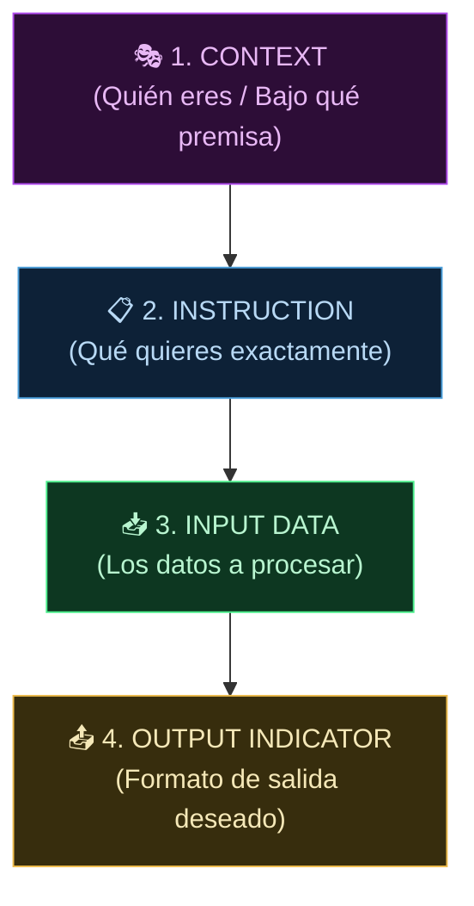

**Tags:** #prompt-engineering #few-shot #cot #prompt-templates #ia #m3-genai
#m3-genai

> [!quote] Concepto fundamental
> El **Prompt Engineering** es el arte y la ciencia de dar instrucciones precisas a un modelo fundacional para obtener el resultado exacto deseado. Es la forma más barata y rápida de "programar" o ajustar el comportamiento de un LLM sin necesidad de reentrenarlo.

---

## 🧬 Anatomía de un Prompt Perfecto (Las 4 Partes)

Todo prompt profesional se compone de hasta **4 bloques**. No siempre necesitas los 4, pero cuantos más uses, más precisa será la respuesta.



### 1. Context (Contexto / Rol)
Define **quién es** el modelo y bajo qué premisa debe actuar. Condiciona el tono, el vocabulario y el nivel de profundidad de la respuesta.

> **Ejemplo:** *"Eres un abogado especialista en derecho laboral español con 20 años de experiencia."*

### 2. Instruction (Instrucción)
Define **qué tarea** debe realizar el modelo. Debe ser específica y clara.

> **Ejemplo:** *"Analiza el siguiente contrato de trabajo y lista todas las cláusulas que incumplen el Estatuto de los Trabajadores."*

### 3. Input Data (Datos de Entrada)
Los **datos concretos** que el modelo debe procesar. Pueden ser texto, código, tablas, o cualquier información que necesite.

> **Ejemplo:** *"CONTRATO: El trabajador acepta una jornada de 50 horas semanales sin compensación de horas extra..."*

### 4. Output Indicator (Indicador de Salida)
Define el **formato exacto** en el que quieres recibir la respuesta (JSON, lista, tabla, párrafo, código, etc.).

> **Ejemplo:** *"Devuelve la respuesta en formato JSON con los campos: 'clausula', 'articulo_infringido' y 'explicacion'."*

### Ejemplo Completo Combinando las 4 Partes

```text
[CONTEXT] Eres un experto financiero de Wall Street especializado en análisis de riesgo.

[INSTRUCTION] Analiza el siguiente reporte trimestral y extrae exactamente 
los 3 riesgos más críticos para la empresa.

[INPUT DATA]
"La empresa XYZ reportó un incremento del 40% en deuda a corto plazo, 
una reducción del 15% en el margen operativo y la pérdida de 2 clientes 
que representaban el 35% de la facturación total..."

[OUTPUT] Devuélvelo en formato de tabla Markdown con las columnas: 
Riesgo | Gravedad (Alta/Media/Baja) | Recomendación
```

> [!tip] Truco de examen — Anatomía del Prompt
> Si la pregunta dice "¿cómo mejorar la calidad de las respuestas de un modelo sin reentrenarlo?" → **Mejorar el prompt** (añadir más contexto, ser más específico en la instrucción, definir el formato de salida).

---

## 📋 Prompt Templates (Plantillas de Prompt)

En producción, **nunca** escribes prompts a mano cada vez. Creas **plantillas reutilizables** con **variables** (placeholders) que se rellenan dinámicamente con cada petición.

### ¿Qué son?
Son prompts predefinidos con huecos marcados por `{{variable}}` que tu aplicación rellena automáticamente en cada llamada a la API de Bedrock.

### Ejemplo de Prompt Template

```text
Eres un asistente de atención al cliente para la empresa {{nombre_empresa}}.

El cliente se llama {{nombre_cliente}} y tiene el plan {{tipo_plan}}.

Su consulta es: "{{pregunta_del_cliente}}"

Responde de forma amable y profesional en un máximo de {{max_parrafos}} párrafos. 
Si no tienes la información, indica que derivarás al equipo humano.
```

**En cada llamada, la aplicación sustituye las variables:**
- `{{nombre_empresa}}` → "Telefónica"
- `{{nombre_cliente}}` → "María García"
- `{{tipo_plan}}` → "Premium"
- `{{pregunta_del_cliente}}` → "¿Puedo cambiar mi tarifa?"
- `{{max_parrafos}}` → "2"

### ¿Dónde se gestionan en AWS?

| Herramienta | Qué permite |
| :--- | :--- |
| **Amazon Bedrock Prompt Management** | Crear, versionar y gestionar Prompt Templates directamente en la consola de Bedrock. Permite probar variaciones con distintos modelos |
| **Amazon Bedrock Prompt Flows** | Encadenar múltiples prompts en un flujo visual (ej. Prompt 1 clasifica → Prompt 2 responde según la clase) |

> [!brain] Clave para el examen
> Si te preguntan cómo **reutilizar y gestionar prompts a escala en una empresa** → **Bedrock Prompt Management / Prompt Templates**.
> Si te preguntan cómo **encadenar varios prompts en un flujo de trabajo** → **Bedrock Prompt Flows**.

---

## 🎨 Técnicas Avanzadas de Prompt Engineering

En el examen AIF-C01 se evalúa el conocimiento de diferentes estrategias para controlar las salidas del modelo. Aquí están las más importantes:

### 1. Ajuste del Prompt (Prompt Tuning / Shaping)
- **Definición:** Controlar el tono, longitud, y formato de marca de la respuesta modificando directamente las instrucciones.
- **Caso de Uso:** Si un modelo responde de forma muy técnica a clientes inexpertos, en lugar de reentrenar al modelo, añades al prompt: *"Responde con un tono amable, usando vocabulario sencillo y limita tu respuesta a 3 párrafos"*.
- **Ventaja:** Cero coste adicional de infraestructura, resultados inmediatos.

### 2. Zero-Shot Prompting
- **Definición:** Pedir al modelo que realice una tarea sin darle ningún ejemplo previo. Confías enteramente en su entrenamiento previo.
- **Ejemplo:** *"Clasifica el siguiente texto como Positivo o Negativo: 'El servicio fue excelente'."*
- **Cuándo usarlo:** Tareas simples y universales donde el modelo ya tiene suficiente conocimiento (clasificar sentimiento, traducir, resumir...).

### 3. Few-Shot Prompting (Aprendizaje por Ejemplos)
- **Definición:** Incluir **pares de ejemplos** (entrada + respuesta correcta) dentro del propio prompt para enseñar al modelo el patrón exacto que quieres.
- **Por qué funciona:** Los LLMs son excelentes "imitadores de patrones". Al ver 2 o 3 ejemplos, replican el formato a la perfección.
- **Cuándo usarlo:** Cuando necesitas un formato de salida muy específico, una convención de tu empresa, o la tarea es poco común.

**Ejemplo detallado de Few-Shot:**
```text
Clasifica el sentimiento de cada reseña de cliente:

Reseña: "El envío llegó en 2 días, ¡increíble!" → Sentimiento: Positivo
Reseña: "El producto venía roto y nadie me ayudó" → Sentimiento: Negativo
Reseña: "Está bien, cumple su función" → Sentimiento: Neutro

Reseña: "Tardaron 3 semanas en entregar y el paquete estaba dañado" → Sentimiento:
```

**¿Qué responderá el modelo?** → `Negativo` (ha aprendido el patrón de los 3 ejemplos anteriores).

> [!abstract] Variantes de Few-Shot
> - **One-Shot:** Un solo ejemplo. Para tareas sencillas.
> - **Few-Shot (2-5 ejemplos):** Lo más habitual. Balance entre precisión y coste de tokens.
> - **Many-Shot (10+):** Cuando la tarea es muy compleja o el formato es muy específico. Cuidado con el límite de la Context Window.

### 4. Rol en el Contexto (Role-Prompting)
- **Definición:** Asignar un rol específico o *persona* al modelo al principio del prompt. Esto ayuda a adaptar el estilo, vocabulario y nivel de detalle según el perfil o edad del usuario.
- **Caso de Uso:** Adaptación según edad/perfil. *"Actúa como un profesor de primaria. Explica cómo funciona la fotosíntesis a un niño de 8 años."* vs *"Actúa como un biólogo molecular y explica la fotosíntesis."*

### 5. Chain of Thought — CoT (Cadena de Pensamiento)
- **Definición:** Obligar al modelo a **desglosar su razonamiento paso a paso** antes de dar la respuesta final. Es especialmente efectivo en problemas matemáticos, lógicos o de múltiples pasos.
- **Por qué funciona:** Los LLMs generan texto secuencialmente (token a token). Si le pides que "piense" antes de responder, genera los pasos intermedios que le sirven de contexto para calcular la respuesta final correctamente.

**Ejemplo SIN Chain of Thought:**
```text
Prompt: "María tiene 3 manzanas. Le da la mitad a Juan. Luego compra 4 más. 
¿Cuántas tiene?"
Respuesta del modelo: "5" ← ¡INCORRECTO! (debería ser 5.5, y dependiendo 
de la interpretación, 5 o 6)
```

**Ejemplo CON Chain of Thought:**
```text
Prompt: "María tiene 3 manzanas. Le da la mitad a Juan. Luego compra 4 más. 
¿Cuántas tiene? Piensa paso a paso antes de responder."

Respuesta del modelo:
"Paso 1: María empieza con 3 manzanas.
Paso 2: Le da la mitad a Juan → 3 / 2 = 1.5 manzanas para cada uno.
Paso 3: María se queda con 1.5 manzanas.
Paso 4: Compra 4 más → 1.5 + 4 = 5.5 manzanas.
Respuesta: María tiene 5.5 manzanas (o 5 si solo se pueden dar manzanas enteras)."
```

> [!tip] Truco de examen — CoT
> Si el escenario menciona "mejorar la precisión en problemas matemáticos o lógicos" o "reducir alucinaciones en razonamiento complejo" → **Chain of Thought (CoT)**.
> La frase mágica es: *"Piensa paso a paso"* o *"Explica tu razonamiento antes de dar la respuesta"*.

---

> [!brain] Comparativa: Prompt Engineering vs Fine-Tuning
> Si en el examen te preguntan cómo cambiar el formato de salida de un LLM o enseñarle un tono específico de marca para 5 casos de uso de marketing: **Empieza siempre por Few-Shot Prompting o ajustes al Prompt**. El *Fine-Tuning* solo se recomienda cuando el Prompt Engineering ya no es suficiente, debido a su alto coste y complejidad.

---
→ Volver al índice: [[📂M3 - IA Generativa/00 - Índice Módulo 3|🪐 Módulo 3: IA Generativa]]
