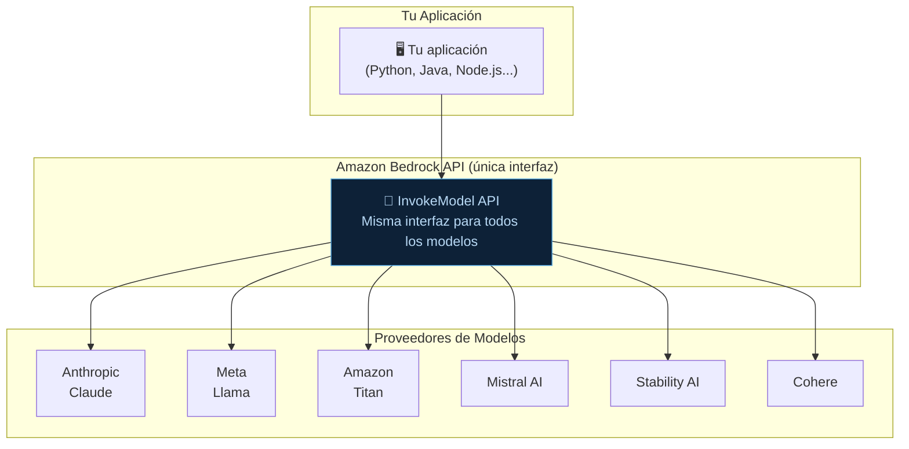
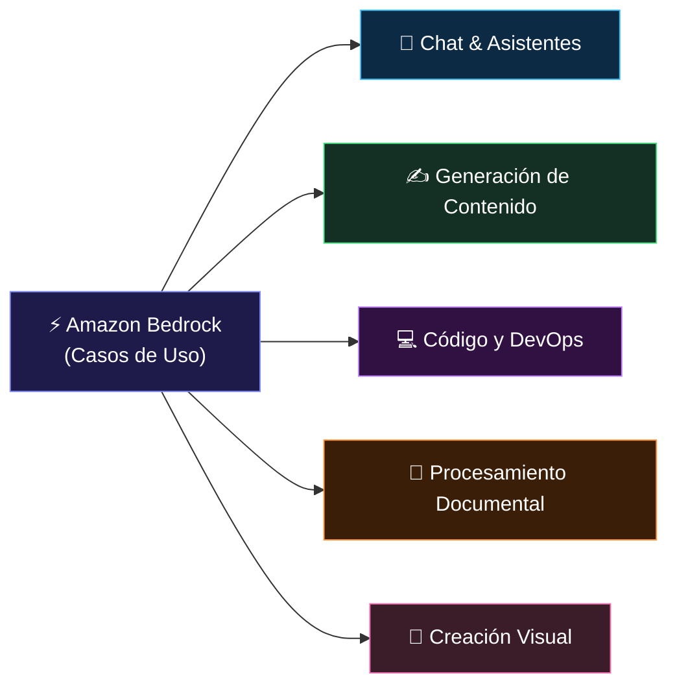

**Tags:** #bedrock #foundation-models #serverless #claude #titan #llama #ia
 #m4-bedrock

> [!quote] Definición AWS Oficial
> Amazon Bedrock es un servicio **fully managed** que ofrece acceso a **Foundation Models** de alto rendimiento de las principales empresas de IA, a través de una única API, sin necesidad de gestionar infraestructura.

---

## 🏗️ ¿Qué es Amazon Bedrock?

### La Propuesta de Valor

Bedrock resuelve el problema fundamental de "quiero usar un LLM potente en mi empresa, pero no quiero:

- ❌ Montar y mantener servidores de GPU

- ❌ Gestionar licencias con múltiples proveedores de IA

- ❌ Preocuparme de que mis datos de clientes se usen para reentrenar los modelos públicos

- ❌ Escribir código diferente para cada proveedor de modelos"

**Bedrock lo soluciona con una única API, serverless, con garantías de privacidad.**

### Características Fundamentales de Bedrock

| Característica | Detalle |
| :--- | :--- |
| **Serverless** | Sin servidores que gestionar, sin infraestructura que aprovisionar |
| **Multi-model** | Acceso a modelos de múltiples proveedores con una sola API |
| **Privacidad garantizada** | AWS garantiza que tus datos NO se usan para reentrenar modelos públicos |
| **Integración nativa AWS** | IAM, CloudWatch, CloudTrail, VPC Endpoints, KMS |
| **Región AWS** | Los datos permanecen en la región AWS elegida |
| **Fine-tuning gestionado** | Puedes hacer fine-tuning de modelos seleccionados con tus datos |

---

## 📋 Catálogo de Modelos en Amazon Bedrock

### 🏆 Anthropic Claude — El Más Popular para Chat y Análisis

| Modelo | Context Window | Fortaleza | Cuándo usarlo |
| :--- | :--- | :--- | :--- |
| **Claude 3 Haiku** | 200K tokens | Velocidad + bajo coste | Tareas de alto volumen, clasificación, respuestas cortas |
| **Claude 3 Sonnet** | 200K tokens | Balance calidad/velocidad | Chatbots, resúmenes, análisis general |
| **Claude 3 Opus** | 200K tokens | Máxima calidad | Tareas complejas, análisis profundo, código difícil |
| **Claude 3.5 Sonnet** | 200K tokens | Estado del arte en código | Programación, análisis técnico, razonamiento |

> [!tip] Para el examen: Claude = líder en texto, análisis y código en Bedrock

---

### 🦙 Meta Llama — Open-Source de Alta Calidad

| Modelo | Parámetros | Característica |
| :--- | :--- | :--- |
| **Llama 2** | 7B, 13B, 70B | Primer gran modelo abierto de Meta en Bedrock |
| **Llama 3** | 8B, 70B | Mejor rendimiento, contexto expandido |
| **Llama 3.1** | 8B, 70B, 405B | Llama 3.1 405B es uno de los mejores open-source |

**Ventaja:** Al ser open-source, se pueden descargar y desplegar en tu propia infraestructura (SageMaker JumpStart) si necesitas control total.

---

### 🏠 Amazon Titan — La Familia Nativa de AWS

| Modelo | Tipo | Uso principal |
| :--- | :--- | :--- |
| **Titan Text Express** | Texto | Generación de texto general, Q&A, resumen |
| **Titan Text Lite** | Texto | Texto simple, bajo coste, alta velocidad |
| **Titan Text Premier** | Texto | Tareas complejas, RAG, agentes |
| **Titan Embeddings V2** | Embeddings | Búsqueda semántica, RAG (1024 dimensiones) |
| **Titan Multimodal Embeddings** | Embeddings texto+imagen | Búsqueda semántica combinada |
| **Titan Image Generator G1** | Imágenes | Generar y editar imágenes desde texto |

> [!tip] Titan para el examen
>
> - **Titan Embeddings** → la opción nativa de AWS para convertir texto en vectores (RAG)
>
> - **Titan Image Generator** → generación de imágenes en Bedrock (usando Difusión)
>
> - La familia Titan es la respuesta cuando el examen pide "el modelo **nativo** de AWS en Bedrock"

---

### 🌪️ Mistral AI — Eficiencia Europea

| Modelo | Parámetros | Característica |
| :--- | :--- | :--- |
| **Mistral 7B** | 7B | Modelo pequeño pero muy eficiente |
| **Mixtral 8x7B** | 47B efectivos | Mezcla de Expertos (MoE): eficiente y potente |

**Ventaja:** Excelente rendimiento para su tamaño. MoE activa solo una fracción de los parámetros por token, haciéndolo muy eficiente.

---

### 🎨 Stability AI — Generación de Imágenes

| Modelo | Uso |
| :--- | :--- |
| **Stable Diffusion XL** | Generación y edición de imágenes de alta calidad |

**El motor de difusión** más conocido del mundo open-source. Disponible en Bedrock.

---

### 💼 Cohere — Especialista en Empresas y Búsqueda

| Modelo | Uso |
| :--- | :--- |
| **Command** | Generación de texto orientada a negocio |
| **Embed** | Embeddings para búsqueda semántica (muy bueno en multilingüe) |
| **Rerank** | Reordenar resultados de búsqueda por relevancia |

**Ventaja de Cohere Rerank:** Útil en pipelines RAG para mejorar la calidad de recuperación antes de enviar al LLM.

---

## 🔬 Funcionalidades Avanzadas de Bedrock

### Bedrock Studio

Interface visual para explorar y probar modelos sin escribir código. Útil para prototipado rápido.

### Playgrounds en Bedrock Console

- **Chat Playground:** Conversaciones directas con cualquier modelo

- **Text Playground:** Completado de texto, prompts directos

- **Image Playground:** Generación de imágenes

### Bedrock Guardrails

(Cubierto en detalle en el Módulo 5)
Filtros de seguridad que se aplican a las entradas y salidas de cualquier modelo en Bedrock.

### Bedrock Model Evaluation
(Cubierto en [[04 - Precios y Model Evaluation]])
Herramienta para comparar modelos con métricas automáticas o evaluación humana.

---

## 🎯 Casos de Uso Comunes de Amazon Bedrock

Amazon Bedrock permite acceder a los mejores modelos fundacionales del mercado sin gestionar servidores. Estos son sus usos más habituales:

---

### 1. 💬 Chatbots Inteligentes y Atención al Cliente (Claude / Llama 3)

* **Uso común:** Atender consultas de usuarios 24/7 en webs y apps con lenguaje natural y humano.

* **Solución breve:** Conectas el modelo por API; entiende el contexto de la conversación, analiza el sentimiento del cliente y resuelve incidencias sin respuestas robóticas.

### 2. ✍️ Generación y Síntesis de Contenido (Amazon Titan / Claude)

* **Uso común:** Redactar borradores de marketing, emails comerciales, fichas de producto o resumir informes de 50 páginas.

* **Solución breve:** Le proporcionas los puntos clave y el modelo redacta el contenido adaptado al tono de tu empresa o sintetiza documentos extensos en un párrafo ejecutivo.

### 3. 💻 Asistencia al Desarrollo de Software (Claude / Mistral / Llama)

* **Uso común:** Escribir funciones, depurar errores de compilación, refactorizar código antiguo o crear tests unitarios.

* **Solución breve:** El programador le pasa una función o mensaje de error; el modelo devuelve el código optimizado, explicado y listo para producción.

### 4. 📄 Extracción Estructurada de Documentos (Modelos Multimodales)

* **Uso común:** Procesar facturas, nóminas, albaranes o informes médicos escaneados en PDF o imagen.

* **Solución breve:** El modelo lee el documento visualmente y extrae los campos clave (importes, fechas, CIF, conceptos) en formato JSON limpio directo a tu base de datos.

### 5. 🎨 Generación y Edición de Imágenes (Stable Diffusion XL / Titan Image)

* **Uso común:** Crear creatividades publicitarias, portadas, prototipos visuales o variantes de productos para catálogos.

* **Solución breve:** Escribes una descripción en texto (*prompt*) y el modelo genera imágenes fotorrealistas de alta calidad en segundos sin pagar bancos de imágenes.

---
→ Volver al índice: [[📂M4 - Bedrock y Amazon Q/00 - Índice Módulo 4|🪐 Módulo 4: Bedrock y Amazon Q]]

