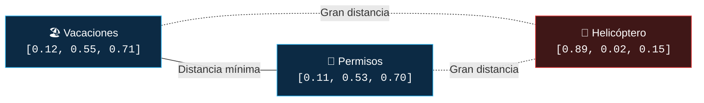
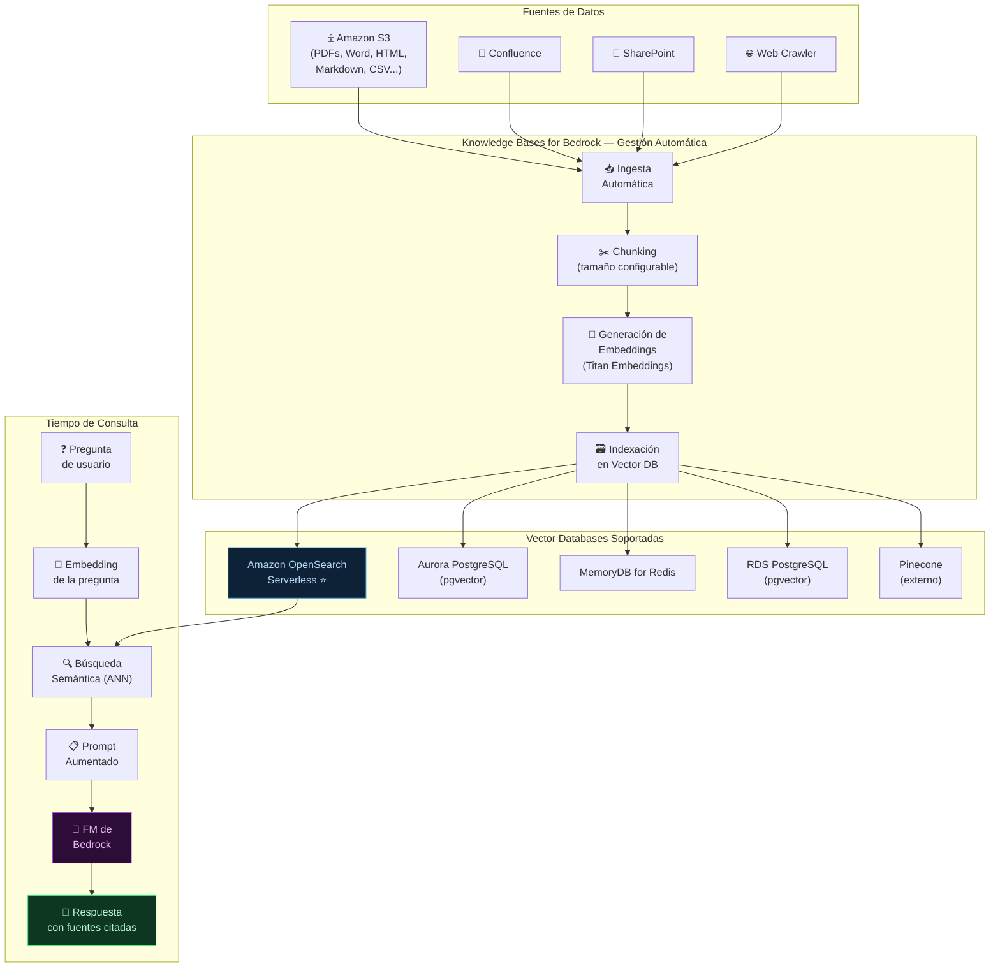
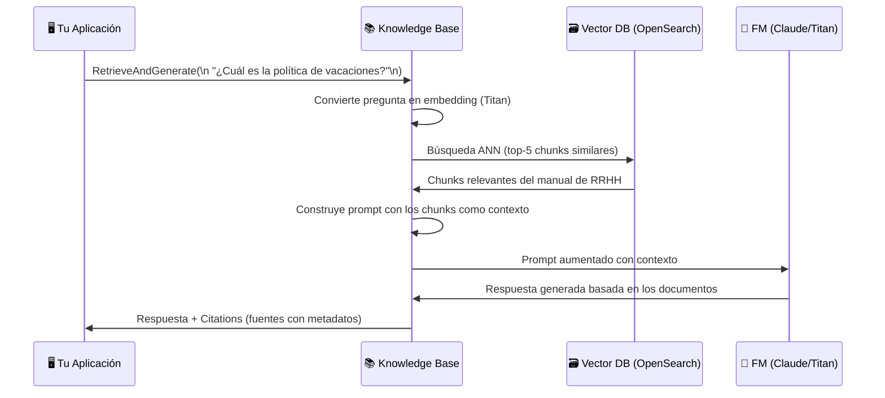

**Tags:** #bedrock #knowledge-bases #rag #vector-db #s3 #ia
 #m4-bedrock

> [!quote] Definición AWS
> **Knowledge Bases for Amazon Bedrock** es una capacidad fully managed que implementa **RAG de extremo a extremo**: conecta tus fuentes de datos (S3, Confluence, SharePoint...), las indexa automáticamente en una base de datos vectorial, y las integra con cualquier modelo FM de Bedrock para respuestas fundamentadas.

---

## 🎯 ¿Por Qué Knowledge Bases?

Sin Knowledge Bases, implementar RAG requiere:

1. Crear y gestionar una base de datos vectorial (OpenSearch, Aurora...)

2. Escribir el pipeline de chunking y embedding

3. Mantener la sincronización cuando los documentos cambian

4. Gestionar la integración con el LLM

5. Manejar la seguridad y el cifrado

**Knowledge Bases for Bedrock hace TODO esto automáticamente.**

---

## 💡 De Documentos Privados a Respuestas Precisas: El Problema y la Solución (Caso Real Avincis)

Este es el bloque conceptual más importante para comprender la necesidad de **Bedrock**, **Knowledge Bases** y **RAG** en entornos corporativos reales.

### El Problema del Mundo Real

Imagina que una empresa aeronáutica y de servicios de emergencia como **Avincis** tiene almacenados en sus repositorios estos documentos privados:
* `Manual_RRHH.pdf`
* `Politica_Viajes.pdf`
* `Procedimiento_Compras.pdf`
* `Mantenimiento_Helicopteros.pdf`

Un empleado entra al portal y pregunta:
> *"¿Cuántos días antes debo solicitar vacaciones?"*

Un Modelo Fundacional (LLM) generalista (como Claude, Titan o Llama) **no conoce esos documentos** porque nunca formaron parte de su entrenamiento público. Además, superan con creces los límites de lectura simultánea de la ventana de contexto.

Para resolverlo, entran en juego cuatro piezas: **Chunks**, **Embeddings**, **Base Vectorial** y **RAG**.

---

### Paso 1: Chunks (Fragmentación del Documento)

Supongamos que el PDF `Manual_RRHH.pdf` indica:
> *"Las vacaciones deben solicitarse con 15 días de antelación. Las solicitudes se tramitan mediante Workday."*

La IA no suele procesar PDFs completos de golpe. Por ello, el sistema los fragmenta en bloques pequeños manejables llamados **Chunks**:

* **Chunk 1:** *"Las vacaciones deben solicitarse con 15 días de antelación."*
* **Chunk 2:** *"Las solicitudes se tramitan mediante Workday."*

---

### Paso 2: Embeddings (Representación Matemática del Significado)

Un **Embedding** es una representación matemática (un vector numérico) del **significado semántico** de un texto.

Para los humanos, *"Vacaciones"*, *"Permisos"* y *"Ausencias"* son conceptos afines. La IA no entiende palabras de forma lingüística: las convierte en coordenadas numéricas dentro de un espacio multidimensional.

Ejemplo conceptual simplificado:

| Concepto | Vector de Embedding (Coordenadas) | Posición Relativa en el Espacio |
| :--- | :---: | :--- |
| **Vacaciones** | `[0.12, 0.55, 0.71]` | Muy cerca de "Permisos" |
| **Permisos** | `[0.11, 0.53, 0.70]` | Muy cerca de "Vacaciones" |
| **Helicóptero** | `[0.89, 0.02, 0.15]` | **Muy lejos** de vacaciones y permisos |



> [!important] La Clave de los Embeddings
> La IA no busca coincidencias literales de caracteres: **entiende proximidad semántica**. *"Vacaciones"* y *"Permisos"* quedan prácticamente en la misma posición del mapa porque comparten significado; mientras que *"Helicóptero"* queda en un cuadrante completamente alejado.

---

### Paso 3: Base Vectorial (Vector Store)

Los embeddings generados se almacenan en una base de datos optimizada para cálculos de similitud matemática (ej: *Amazon OpenSearch Serverless*, *Pinecone*, *Weaviate*, *Aurora con pgvector*).

La base vectorial guarda cada registro con la estructura:
$$\mathbf{Chunk} \quad + \quad \mathbf{Embedding}$$

* **Chunk:** *"Las vacaciones deben solicitarse con 15 días de antelación."*
* **Embedding:** `[0.11, 0.65, 0.33, 0.92, ...]`

#### Diferencia Vital: Base SQL Tradicional vs. Base Vectorial

| Tipo de Base | Consulta Habitual | ¿Cómo busca? | Resultado ante: *"¿Cómo pido días libres?"* |
| :--- | :--- | :--- | :--- |
| **Base SQL Relacional** | `WHERE texto LIKE '%vacaciones%'` | Coincidencias de **palabras exactas**. | ❌ **0 resultados** (*"días libres"* no contiene la palabra *"vacaciones"*). |
| **Base Vectorial** | `ANN (Similitud del Coseno)` | **Significado semántico profundo.** | ✅ **Recupera el Chunk:** detecta que *"días libres"* y *"vacaciones"* tienen vectores casi idénticos. |

---

### Paso 4: RAG (Retrieval-Augmented Generation)

RAG une las dos fases críticas: **Recuperación (Retrieval)** + **Generación (Generation)**.

* **Sin RAG:** Le preguntas a Claude *"¿Cuántos días antes debo pedir vacaciones en Avincis?"*. Claude responde usando solo lo que aprendió en su entrenamiento público general. **Puede equivocarse o inventarse una política inexistente (alucinación)**.
* **Con RAG:** El flujo conecta tus datos privados con la inteligencia del modelo:

$$\text{Usuario (Pregunta)} \longrightarrow \text{Base Vectorial (Búsqueda semántica)} \longrightarrow \text{Recupera Chunk 1} \longrightarrow \text{Claude (Contexto + Pregunta)} \longrightarrow \text{Respuesta con Citations}$$

#### Flujo en Ejecución Real:
1. **Pregunta:** *"¿Cuántos días antes debo pedir vacaciones?"*
2. **La Base Vectorial recupera el Chunk exacto:** *"Las vacaciones deben solicitarse con 15 días de antelación."*
3. **Claude recibe el prompt enriquecido:**
   ```text
   CONTEXTO:
   Las vacaciones deben solicitarse con 15 días de antelación.

   PREGUNTA:
   ¿Cuántos días antes debo pedir vacaciones?
   ```
4. **Claude responde:**
   > *"Según la política oficial de la empresa (Manual de RRHH), las vacaciones deben solicitarse con 15 días de antelación."*

> [!tip] La Analogía del Examen: Memoria vs. Libro Abierto
> * **Sin RAG:** Haces un examen respondiendo **de memoria** (puedes dudar, confundirte o inventar datos si no te acuerdas).
> * **Con RAG:** Haces el examen **con el libro abierto**: buscas en el manual la página exacta donde está la norma, la lees y contestas con certeza absoluta.

---

### ¿Dónde encaja Knowledge Bases for Amazon Bedrock?

Knowledge Bases automatiza de extremo a extremo todo este flujo técnico sin que tengas que programar ni mantener servidores:

$$\text{Subir PDF a S3} \xrightarrow{\quad\text{Knowledge Bases}\quad} \text{Chunks} \longrightarrow \text{Embeddings (Titan)} \longrightarrow \text{Base Vectorial (OpenSearch)} \longrightarrow \text{Búsqueda} \longrightarrow \text{Claude} \longrightarrow \text{Respuesta con Citas}$$

Tú únicamente depositas tus documentos en S3 y AWS se encarga de todo el ciclo de vida.

---

## 🏗️ Arquitectura de Knowledge Bases



---

## ⚙️ Configuración de Knowledge Bases

### Opciones de Chunking

| Estrategia | Descripción | Cuándo usar |
| :--- | :--- | :--- |
| **Fixed Size** | Chunks de N tokens con overlap configurable | Uso general |
| **Default (Bedrock)** | 300 tokens con 20% de overlap (recomendado por AWS) | Punto de partida |
| **Semantic Chunking** | Divide por cambios semánticos detectados automáticamente | Máxima precisión |
| **Hierarchical** | Chunks padre + chunks hijo para preguntas generales y específicas | Documentos complejos |
| **No chunking** | Cada documento es un único chunk | Documentos cortos |

### Modelos de Embedding Disponibles

| Modelo | Dimensiones | Idiomas | Cuándo usar |
| :--- | :--- | :--- | :--- |
| **Titan Embeddings V2** | 1,024 | Multi-idioma | Default (nativo AWS, recomendado) |
| **Titan Multimodal Embeddings** | 1,024 | Multi-idioma | Si necesitas embeds de imágenes también |
| **Cohere Embed Multilingual** | 1,024 | 100+ idiomas | Colecciones de documentos muy multilingües |

---

## 🔄 Flujo de Consulta con Knowledge Bases



### Dos Modos de Uso

| Modo | API Call | ¿Qué devuelve? | Cuándo usarlo |
| :--- | :--- | :--- | :--- |
| **Retrieve** | `Retrieve()` | Solo los chunks relevantes (sin generar respuesta) | Si quieres controlar tú el prompt y la generación |
| **RetrieveAndGenerate** | `RetrieveAndGenerate()` | Respuesta generada + citations automáticas | Si quieres la solución completa gestionada |

---

## 📑 Fuentes de Datos Soportadas

| Fuente | Formatos soportados |
| :--- | :--- |
| **Amazon S3** | PDF, Word (.docx), Excel, PowerPoint, HTML, Markdown, texto plano, CSV |
| **Confluence** | Páginas y espacios de Confluence |
| **SharePoint** | Sitios y documentos de SharePoint |
| **Salesforce** | Artículos de Knowledge de Salesforce |
| **ServiceNow** | Artículos de Knowledge de ServiceNow |
| **Web Crawler** | URLs públicas (Bedrock crawlea y indexa automáticamente) |

---

## 🔒 Seguridad en Knowledge Bases

| Aspecto de Seguridad | Cómo se implementa |
| :--- | :--- |
| **Cifrado en reposo** | AWS KMS (clave gestionada por AWS o clave propia del cliente - CMK) |
| **Cifrado en tránsito** | TLS 1.2+ automático |
| **Control de acceso** | IAM Roles con políticas de mínimo privilegio |
| **Aislamiento de red** | VPC Endpoints (AWS PrivateLink) para que el tráfico no salga a internet público |
| **Auditoría** | AWS CloudTrail registra todas las llamadas a la API |

---

## ✨ Grounding y Citations

Una de las ventajas más importantes de RAG con Knowledge Bases es la capacidad de **citar fuentes**:

```json
{
 "output": {
 "text": "Los empleados tienen derecho a 22 días laborables de vacaciones anuales."
 },
 "citations": [
 {
 "generatedResponsePart": {
 "textResponsePart": { "text": "22 días laborables" }
 },
 "retrievedReferences": [
 {
 "content": { "text": "...tienen derecho a 22 días laborables..." },
 "location": { "s3Location": { "uri": "s3://mi-bucket/rrhh-manual.pdf" } }
 }
 ]
 }
 ]
}
```

**Beneficios del grounding:**

- El usuario puede verificar la fuente de cada afirmación

- Reduce dramáticamente las **alucinaciones** (el modelo no inventa)

- Mejora la **confianza** del usuario en el sistema

- Permite **trazabilidad** y cumplimiento normativo

---

## 🚀 Casos de Uso Comunes de Knowledge Bases for Bedrock

Knowledge Bases se utiliza siempre que necesites que un LLM responda basándose en **datos privados de tu empresa** citando la fuente exacta y sin alucinaciones.

### 1. 👥 Asistente de Recursos Humanos (Onboarding y Políticas)

* **Uso común:** Responder preguntas de empleados sobre vacaciones, permisos, bajas médicas, seguros o convenios.

* **Solución breve:** Conecta un bucket de Amazon S3 con los PDFs corporativos; el empleado pregunta y la IA responde indicando la página exacta del manual oficial.

### 2. 🛠️ Helpdesk Técnico y Atención al Cliente

* **Uso común:** Guiar a clientes o técnicos de soporte en la resolución de averías y códigos de error.

* **Solución breve:** Indexa manuales de producto y artículos de ServiceNow o Salesforce; la IA devuelve el paso a paso exacto para reparar la avería sin inventar nada.

### 3. ⚖️ Auditoría Legal y Revisión de Contratos Masiva

* **Uso común:** Localizar cláusulas de penalización, fechas de rescisión o indemnizaciones en cientos de contratos.

* **Solución breve:** Sube los contratos a S3 cifrados con KMS; la búsqueda semántica localiza de inmediato los párrafos legales exactos para auditorías.

### 4. 💻 Wiki Técnica de Ingeniería y DevOps

* **Uso común:** Consultar cómo desplegar un microservicio, qué variables requiere o cómo resolver incidencias pasadas.

* **Solución breve:** Sincroniza espacios de Atlassian Confluence; los programadores obtienen respuestas técnicas actualizadas sin perder horas buscando en la wiki.

### 5. 🏥 Protocolos Médicos y Sanitarios

* **Uso común:** Consultar pautas de medicación, contraindicaciones o protocolos hospitalarios.

* **Solución breve:** Conecta guías clínicas y vademécums; los médicos reciben la dosis o protocolo recomendado con verificación directa de la literatura médica oficial.

---

## 🎓 Resumen Maestro para el Examen AWS AI Practitioner (AIF-C01)

| Concepto Clave | Definición Rápida de Examen | Flujo Operativo / Ejemplo |
| :--- | :--- | :--- |
| **Chunk** | Fragmento o recorte pequeño de un documento para no desbordar la ventana de contexto (*Context Window*). | $\text{PDF gigante} \longrightarrow \text{Trozos de 300 tokens}$ |
| **Embedding** | Representación numérica del significado semántico en un espacio vectorial multidimensional. | $\text{Texto} \longrightarrow \text{Vector matemático (Titan: 1.024 dims)}$ |
| **Base Vectorial** | Base de datos especializada que almacena Chunks + Embeddings y busca por similitud semántica (k-NN / ANN). | Amazon OpenSearch Serverless, Pinecone, Aurora pgvector |
| **RAG** | Patrón que recupera información relevante y se la inyecta al LLM en el prompt antes de generar la respuesta. | $\text{Pregunta} \longrightarrow \text{Búsqueda} \longrightarrow \text{Contexto} \longrightarrow \text{LLM} \longrightarrow \text{Respuesta}$ |
| **Bedrock Knowledge Bases** | Servicio totalmente gestionado de AWS que automatiza el pipeline completo de RAG empresarial. | $\text{S3} \longrightarrow \text{Chunks} \longrightarrow \text{Embeddings} \longrightarrow \text{Vector DB} \longrightarrow \text{LLM}$ |

> [!tip] Truco de examen — Knowledge Bases = RAG gestionado + S3
> Si una pregunta del examen describe: *"permitir que un LLM responda preguntas basándose en documentos corporativos internos almacenados en Amazon S3 sin aprovisionar ni gestionar infraestructura y minimizando alucinaciones"* ➔ la respuesta correcta es **Knowledge Bases for Amazon Bedrock**.

---
→ Volver al índice: [[📂M4 - Bedrock y Amazon Q/00 - Índice Módulo 4|🪐 Módulo 4: Bedrock y Amazon Q]]

