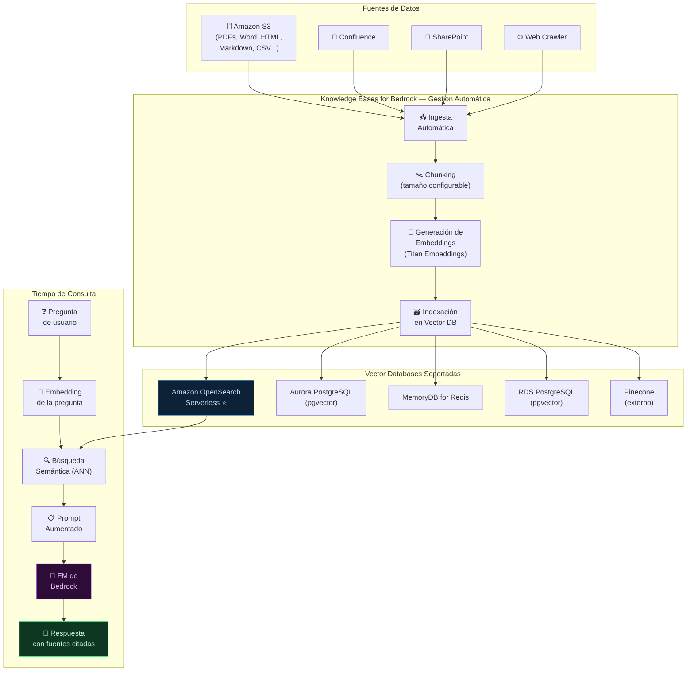
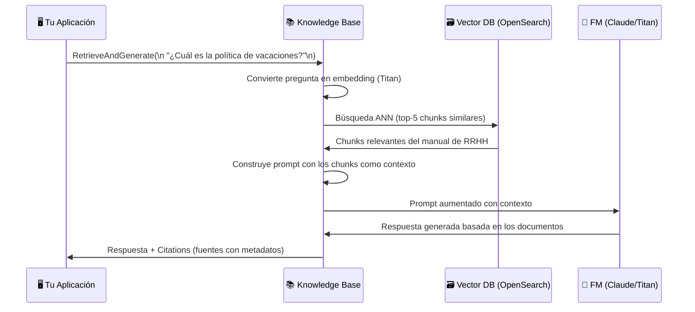

# 02 — Knowledge Bases for Bedrock (RAG Gestionado)

**Tags:** #bedrock #knowledge-bases #rag #vector-db #s3 #ia
 #m4-bedrock
**Módulo:** [[00 - Índice Módulo 4]] | **Índice:** [[🏠 AWS AIF-C01 — Índice Maestro]]

> [!quote] Definición AWS
> **Knowledge Bases for Amazon Bedrock** es una capacidad fully managed que implementa **RAG de extremo a extremo**: conecta tus fuentes de datos (S3, Confluence, SharePoint...), las indexa automáticamente en una base de datos vectorial, y las integra con cualquier modelo FM de Bedrock para respuestas fundamentadas.

---

## 🎯 ¿Por Qué Knowledge Bases?

Sin Knowledge Bases, implementar RAG requiere:

1. Crear y gestionar una base de datos vectorial (OpenSearch, Aurora...)

2. Escribir el pipeline de chunking y embedding

3. Mantener la sincronización cuando los documentos cambian

4. Gestionar la integración con el LLM

5. Manejar la seguridad y el cifrado

**Knowledge Bases for Bedrock hace TODO esto automáticamente.**

---

## 🏗️ Arquitectura de Knowledge Bases



---

## ⚙️ Configuración de Knowledge Bases

### Opciones de Chunking

| Estrategia | Descripción | Cuándo usar |
| :--- | :--- | :--- |
| **Fixed Size** | Chunks de N tokens con overlap configurable | Uso general |
| **Default (Bedrock)** | 300 tokens con 20% de overlap (recomendado por AWS) | Punto de partida |
| **Semantic Chunking** | Divide por cambios semánticos detectados automáticamente | Máxima precisión |
| **Hierarchical** | Chunks padre + chunks hijo para preguntas generales y específicas | Documentos complejos |
| **No chunking** | Cada documento es un único chunk | Documentos cortos |

### Modelos de Embedding Disponibles

| Modelo | Dimensiones | Idiomas | Cuándo usar |
| :--- | :--- | :--- | :--- |
| **Titan Embeddings V2** | 1,024 | Multi-idioma | Default (nativo AWS, recomendado) |
| **Titan Multimodal Embeddings** | 1,024 | Multi-idioma | Si necesitas embeds de imágenes también |
| **Cohere Embed Multilingual** | 1,024 | 100+ idiomas | Colecciones de documentos muy multilingües |

---

## 🔄 Flujo de Consulta con Knowledge Bases



### Dos Modos de Uso

| Modo | API Call | ¿Qué devuelve? | Cuándo usarlo |
| :--- | :--- | :--- | :--- |
| **Retrieve** | `Retrieve()` | Solo los chunks relevantes (sin generar respuesta) | Si quieres controlar tú el prompt y la generación |
| **RetrieveAndGenerate** | `RetrieveAndGenerate()` | Respuesta generada + citations automáticas | Si quieres la solución completa gestionada |

---

## 📑 Fuentes de Datos Soportadas

| Fuente | Formatos soportados |
| :--- | :--- |
| **Amazon S3** | PDF, Word (.docx), Excel, PowerPoint, HTML, Markdown, texto plano, CSV |
| **Confluence** | Páginas y espacios de Confluence |
| **SharePoint** | Sitios y documentos de SharePoint |
| **Salesforce** | Artículos de Knowledge de Salesforce |
| **ServiceNow** | Artículos de Knowledge de ServiceNow |
| **Web Crawler** | URLs públicas (Bedrock crawlea y indexa automáticamente) |

---

## 🔒 Seguridad en Knowledge Bases

| Aspecto de Seguridad | Cómo se implementa |
| :--- | :--- |
| **Cifrado en reposo** | AWS KMS (clave gestionada por AWS o clave propia del cliente - CMK) |
| **Cifrado en tránsito** | TLS 1.2+ automático |
| **Control de acceso** | IAM Roles con políticas de mínimo privilegio |
| **Aislamiento de red** | VPC Endpoints (AWS PrivateLink) para que el tráfico no salga a internet público |
| **Auditoría** | AWS CloudTrail registra todas las llamadas a la API |

---

## ✨ Grounding y Citations

Una de las ventajas más importantes de RAG con Knowledge Bases es la capacidad de **citar fuentes**:

```json
{
 "output": {
 "text": "Los empleados tienen derecho a 22 días laborables de vacaciones anuales."
 },
 "citations": [
 {
 "generatedResponsePart": {
 "textResponsePart": { "text": "22 días laborables" }
 },
 "retrievedReferences": [
 {
 "content": { "text": "...tienen derecho a 22 días laborables..." },
 "location": { "s3Location": { "uri": "s3://mi-bucket/rrhh-manual.pdf" } }
 }
 ]
 }
 ]
}
```

**Beneficios del grounding:**

- El usuario puede verificar la fuente de cada afirmación

- Reduce dramáticamente las **alucinaciones** (el modelo no inventa)

- Mejora la **confianza** del usuario en el sistema

- Permite **trazabilidad** y cumplimiento normativo

> [!tip] Truco de examen — Knowledge Bases = RAG gestionado + S3
> Si el examen describe: "conectar un LLM a documentos internos almacenados en S3 sin gestionar infraestructura" → la respuesta es **Knowledge Bases for Amazon Bedrock**. 
> Es el servicio RAG de referencia de AWS para el examen AIF-C01.

---
→ Volver al índice: [[📂M4 - Bedrock y Amazon Q/00 - Índice Módulo 4|🪐 Módulo 4: Bedrock y Amazon Q]]
