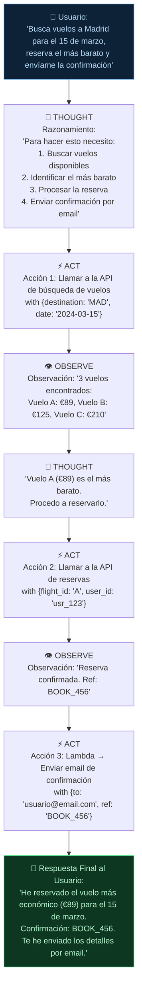
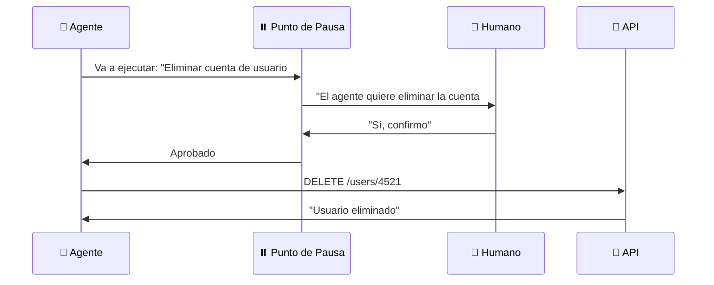

**Tags:** #bedrock #agents #react #autonomia #apis #orchestration #ia
 #m4-bedrock

> [!quote] Definición AWS
> **Agents for Amazon Bedrock** permite crear agentes de IA que pueden **planificar y ejecutar tareas de varios pasos** de forma autónoma, orquestando llamadas a APIs y servicios de AWS para completar objetivos complejos.

---

## 🤖 ¿Qué es un Agente en Bedrock?

**La diferencia fundamental entre un chatbot y un agente:**

| | **Chatbot tradicional** | **Agent for Bedrock** |
| :--- | :--- | :--- |
| **Capacidad** | Responde preguntas | Responde preguntas Y **ejecuta acciones** |
| **Memoria** | Por sesión (stateless) | Mantiene contexto de la tarea |
| **Autonomía** | Ninguna | Alta: planifica y ejecuta pasos |
| **Acciones posibles** | Solo texto | Llamadas a APIs, Lambda, consultas a KBs |
| **Ejemplo** | "¿Cuál es el estado de mi pedido?" | "Cancela mi pedido y procesa el reembolso" |

---

## 🧠 El Ciclo de Razonamiento ReAct

Los Agents for Bedrock usan el patrón **ReAct (Reasoning + Acting)** para resolver tareas complejas:



---

## 🧩 Componentes de un Agente

```mermaid
mindmap
 root((Agent for\nBedrock))
 Foundation Model
 El cerebro del agente
 Claude, Titan, Llama...
 System Prompt
 Instrucciones y personalidad
 Qué puede y no puede hacer
 Action Groups
 APIs que puede llamar
 Definidas con OpenAPI Schema
 Ejecutadas via Lambda
 Knowledge Bases
 Fuentes de consulta
 RAG integrado
 Memory
 Session memory
 Recuerda el contexto
```

### Action Groups — Las "Manos" del Agente

Los **Action Groups** definen qué acciones puede ejecutar el agente:

```yaml
# Ejemplo de OpenAPI Schema para un Action Group de "Gestión de Pedidos"
/pedidos/estado:
 get:
 description: "Consulta el estado actual de un pedido"
 parameters:
 - name: order_id
 required: true
 schema:
 type: string

/pedidos/cancelar:
 post:
 description: "Cancela un pedido existente y procesa reembolso"
 requestBody:
 required: true
 content:
 application/json:
 schema:
 properties:
 order_id:
 type: string
 reason:
 type: string
```

**Flujo de ejecución de un Action Group:**
```
Agente decide llamar a la API → Bedrock invoca AWS Lambda → 
Lambda ejecuta la lógica de negocio → Devuelve resultado al Agente → 
Agente continúa razonando
```

---

## 🔒 Seguridad en Agents — Human-in-the-Loop

Para acciones de alto riesgo (borrar datos, realizar pagos grandes), los agentes soportan **confirmación humana** antes de ejecutar:



---

## 🚀 Casos de Uso de Agents for Bedrock

> [!example] Agente de Atención al Cliente E-commerce
> **Tarea:** "Quiero devolver el artículo que compré la semana pasada"
> 
> **El agente:**
>
> 1. Consulta el historial de pedidos del usuario (Action Group: get_orders)
>
> 2. Identifica el pedido reciente
>
> 3. Verifica la elegibilidad de devolución (dentro de 30 días)
>
> 4. Genera etiqueta de envío de devolución (Action Group: create_return_label)
>
> 5. Inicia el reembolso (Action Group: process_refund)
>
> 6. Envía email de confirmación (Action Group: send_email)
> 
> **Sin intervención humana en ningún paso.**

> [!example] Agente de Análisis Financiero
> **Tarea:** "Genera un informe de rendimiento de las inversiones del cliente #1234 del último trimestre y envíaselo"
> 
> **El agente:**
>
> 1. Consulta datos de inversiones en el sistema (Action Group)
>
> 2. Calcula métricas de rendimiento (Action Group: calculate_metrics)
>
> 3. Consulta contexto de mercado en la Knowledge Base
>
> 4. Genera el informe narrativo en formato PDF (Action Group)
>
> 5. Envía por email al cliente (Action Group)

---

## ⚡ Bedrock Agents vs Otras Soluciones

| | **Agents for Bedrock** | **Amazon Lex** | **AWS Step Functions + Lambda** |
| :--- | :--- | :--- | :--- |
| **Complejidad de tareas** | Multi-paso, no determinista | Un intent definido | Multi-paso, determinista |
| **Flexibilidad** | Alta (el agente decide el camino) | Baja (flujo predefinido) | Alta (pero flujo definido por humanos) |
| **Sin código de orquestación** | ✅ El FM orquesta | ❌ Necesitas definir el flujo | ❌ Necesitas definir el flujo |
| **Para qué** | Tareas complejas y dinámicas | Chatbots conversacionales simples | Flujos de negocio predefinidos |

> [!tip] Truco de examen — Agents
> Si el escenario describe un asistente de IA que necesita **ejecutar acciones** (no solo responder preguntas), **llamar a APIs externas** o **completar tareas de múltiples pasos** de forma autónoma → **Agents for Bedrock**.
> 
> Palabras clave: "autónomo", "ejecutar acciones", "llamar APIs", "multi-paso", "orquestar tareas".

---
→ Volver al índice: [[📂M4 - Bedrock y Amazon Q/00 - Índice Módulo 4|🪐 Módulo 4: Bedrock y Amazon Q]]
