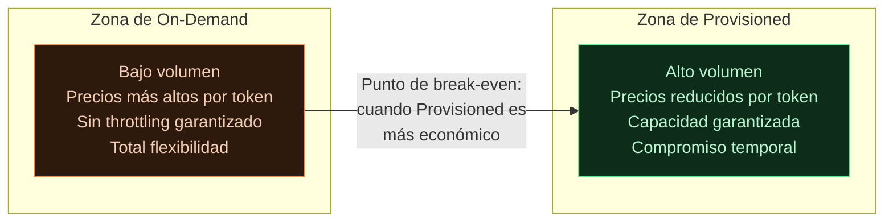
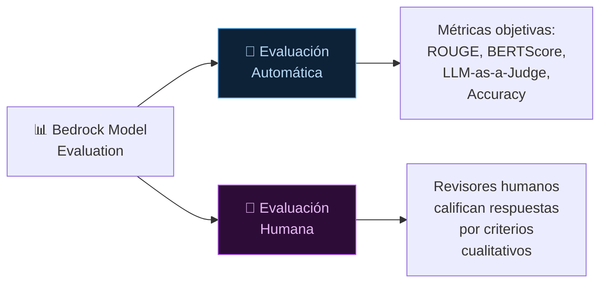

# 04 — Precios en Bedrock y Model Evaluation

**Tags:** #bedrock #precios #on-demand #provisioned-throughput #model-evaluation #ia
 #m4-bedrock
**Módulo:** [[00 - Índice Módulo 4]] | **Índice:** [[🏠 AWS AIF-C01 — Índice Maestro]]

---

## 💰 Modelos de Precios en Amazon Bedrock

Bedrock ofrece dos modelos de precios para la inferencia. Elegir el correcto puede significar una diferencia de coste del 50-70%.

---

### 🎯 On-Demand (Pago por Uso)

> [!quote] Definición
> Con **On-Demand**, pagas únicamente por los **tokens que consumes**: tokens de entrada (prompt) + tokens de salida (respuesta). Sin compromisos, sin mínimos.

**Fórmula:**
```
Coste = (Tokens Input × $/1K input tokens) + (Tokens Output × $/1K output tokens)
```

**Ejemplo con Claude 3 Haiku:**
```
Prompt: 1.000 tokens → $0.00025
Respuesta: 500 tokens → $0.000625
Total por llamada: ~$0.00088
```

**Características:**
- Sin compromisos de tiempo
- Sin aprovisionamiento de capacidad
- Escalado automático
- Puede experimentar **throttling** en picos de tráfico (el servicio puede rechazar peticiones si hay mucha demanda simultánea)

**Cuándo usar On-Demand:**
- Tráfico bajo o **impredecible**
- Prototipado y desarrollo
- Cargas de trabajo intermitentes
- Cuando empiezas y no conoces el volumen

---

### 🏭 Provisioned Throughput (Capacidad Reservada)

> [!quote] Definición
> Con **Provisioned Throughput**, reservas una capacidad de procesamiento específica (medida en **Model Units** - MUs) durante un período comprometido (1 mes o 6 meses), a cambio de una **tarifa por hora fija** independientemente del uso real.

**Características:**
- Capacidad **garantizada**: sin throttling
- **Latencia predecible** y consistente
- Compromiso temporal: 1 mes o 6 meses (mayor compromiso = mayor descuento)
- Coste fijo por hora (pagues o no uses la capacidad)
- Descuentos del **40-60%** respecto a On-Demand en cargas altas

**Cuándo usar Provisioned Throughput:**
- Tráfico **alto y predecible** (ej. aplicación en producción con millones de usuarios)
- Necesitas **SLA de latencia garantizada**
- Aplicaciones que no pueden permitirse throttling
- Cuando el análisis de ROI muestra que el coste fijo es menor que On-Demand a ese volumen

---

### ⚖️ Comparativa: On-Demand vs Provisioned Throughput

| Criterio | **On-Demand** | **Provisioned Throughput** |
| :--- | :--- | :--- |
| **Coste unitario** | Mayor (sin compromiso) | Menor (con compromiso) |
| **Coste con bajo uso** | ✅ Mejor (pagas lo que usas) | ❌ Peor (pagas aunque no uses) |
| **Coste con alto uso** | ❌ Peor | ✅ Mejor (40-60% ahorro) |
| **Garantía de capacidad** | ❌ Puede haber throttling | ✅ Garantizada |
| **Compromiso** | Ninguno | 1 o 6 meses |
| **Flexibilidad** | ✅ Total | ❌ Limitada |
| **Latencia** | Variable | ✅ Predecible y consistente |
| **Ideal para** | Desarrollo, tráfico bajo/variable | Producción con alto tráfico predecible |



> [!tip] Truco de examen — Cuándo elegir cada modelo
> La pregunta del examen siempre tiene estas pistas:
> - "**Tráfico predecible** y alto volumen" / "producción con millones de usuarios" → **Provisioned Throughput**
> - "**Sin compromisos**" / "tráfico variable" / "prototipado" / "desarrollo" → **On-Demand**
> - "Necesita **SLA garantizado** de latencia" → **Provisioned Throughput**
> - "Máxima **flexibilidad**" → **On-Demand**

---

### 🔖 Batch Inference — El Tercer Modo de Precios

Para procesamiento de grandes volúmenes de manera asíncrona (sin respuesta en tiempo real):

- **Cuándo usarlo:** Procesar millones de documentos durante la noche
- **Coste:** ~50% más barato que On-Demand
- **Limitación:** Solo para cargas de trabajo offline (horas, no segundos de respuesta)

---

## 📊 Bedrock Model Evaluation

> [!quote] Definición
> **Bedrock Model Evaluation** es la funcionalidad de Bedrock para **comparar y evaluar** el rendimiento de diferentes FMs en tus casos de uso específicos, antes de decidir cuál desplegar en producción.

---

### El Problema que Resuelve

"Tengo 5 modelos disponibles en Bedrock. ¿Cuál funciona mejor para mi caso de uso específico (ej. resumir contratos legales en español)?"

La respuesta no es universal: el mejor modelo general puede no ser el mejor para tu tarea específica. **Model Evaluation** permite comparar objetivamente.

---

### Dos Modos de Evaluación



#### 🤖 Evaluación Automática

| Tipo | ¿Cuándo usar? | Métricas |
| :--- | :--- | :--- |
| **Métricas predefinidas** | Dataset etiquetado con respuestas de referencia | ROUGE, BERTScore, Accuracy, Robustness |
| **LLM-as-a-Judge** | Sin respuestas de referencia | Helpfulness, Coherence, Faithfulness (puntuados por otro LLM) |

**Cómo funciona:**
1. Subes un dataset de prompts (y respuestas de referencia si las tienes) a S3
2. Seleccionas los modelos que quieres comparar
3. Seleccionas las métricas
4. Bedrock ejecuta todos los prompts contra todos los modelos
5. Genera un informe comparativo con puntuaciones

#### 👥 Evaluación Humana (Human Evaluation)

- Bedrock envía las respuestas a un equipo de revisores humanos
- Los revisores evalúan según criterios cualitativos (utilidad, claridad, tono, precisión)
- Útil para casos donde la calidad subjetiva importa (atención al cliente, contenido creativo)
- Más lento y costoso, pero más cercano al juicio real del usuario final

---

### Métricas Soportadas en Evaluación Automática

| Métrica | Tipo de tarea | Lo que mide |
| :--- | :--- | :--- |
| **ROUGE** | Resumen, traducción | Solapamiento léxico con respuesta de referencia |
| **BERTScore** | Q&A, generación | Similitud semántica con referencia |
| **Accuracy** | Clasificación | Porcentaje de clasificaciones correctas |
| **Robustness** | Cualquier tarea | Consistencia de respuestas ante variaciones del prompt |
| **Toxicity** | Moderación | Detección de contenido dañino o inapropiado |
| **Helpfulness** (LLM-Judge) | Chat, Q&A | Qué tan útil fue la respuesta para el usuario |
| **Faithfulness** (LLM-Judge) | RAG, Q&A | Si la respuesta está fundamentada en el contexto dado |

> [!tip] Truco de examen — Model Evaluation
> Si el examen pregunta:
> - "Comparar qué modelo es mejor para tu caso de uso" → **Bedrock Model Evaluation**
> - "Evaluar automáticamente la calidad sin revisión humana" → **Bedrock Model Evaluation (automática)**
> - "Evaluación cualitativa por personas" → **Bedrock Model Evaluation (humana)**

---
→ Volver al índice: [[📂M4 - Bedrock y Amazon Q/00 - Índice Módulo 4|🪐 Módulo 4: Bedrock y Amazon Q]]
