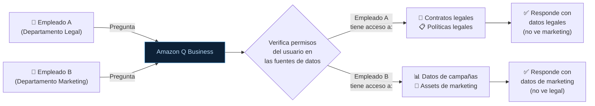

# 05 — Amazon Q: Developer, Business y QuickSight

**Tags:** #amazon-q #q-developer #q-business #q-quicksight #ia
 #m4-bedrock
**Módulo:** [[00 - Índice Módulo 4]] | **Índice:** [[🏠 AWS AIF-C01 — Índice Maestro]]

> [!warning] ⚠️ Confusión habitual en el examen
> **Amazon Q** es una familia de **tres productos distintos** con nombres similares. Confundirlos es uno de los errores más comunes. Memoriza cuál es cuál antes de entrar al examen.

---

## 🗺️ La Familia Amazon Q

```mermaid
mindmap
 root((Amazon Q))
 Q Developer
 Asistente de programación
 IDE plugins
 Similar a GitHub Copilot
 Genera, explica y depura código
 Q Business
 Asistente empresarial
 Conectado a fuentes de datos propias
 Similar a un ChatGPT privado
 Control de acceso por roles
 Q in QuickSight
 Asistente de BI
 Consultas en lenguaje natural
 Genera gráficos desde texto
 Solo dentro de QuickSight
```

---

## 👨‍💻 Amazon Q Developer

> [!quote] Definición
> Amazon Q Developer es un **asistente de IA para desarrolladores** integrado en IDEs y la consola de AWS. Ayuda a escribir, explicar, depurar y optimizar código, y a navegar por la documentación de AWS.

### ¿Qué Puede Hacer?

| Capacidad | Descripción | Ejemplo |
| :--- | :--- | :--- |
| **Code Generation** | Genera código a partir de comentarios en lenguaje natural | Escribes `# Función que conecta a DynamoDB y obtiene un ítem por id` → Q Developer genera el código completo |
| **Code Completion** | Autocompletado inteligente de líneas y bloques de código | Similar a un IntelliSense avanzado |
| **Code Explanation** | Explica qué hace un bloque de código | Seleccionas código complejo y pides "Explain" |
| **Code Debugging** | Detecta errores y sugiere correcciones | Analiza el error y propone el fix |
| **Security Scanning** | Detecta vulnerabilidades de seguridad en el código (OWASP Top 10, etc.) | Detecta SQL injection, hard-coded credentials... |
| **Unit Test Generation** | Genera tests unitarios automáticamente | A partir de tu función, genera los casos de prueba |
| **Code Transformation** | Migra código legacy (ej. Java 8 → Java 17) | Modernización de aplicaciones |
| **AWS Documentation** | Responde preguntas sobre servicios AWS | "¿Cómo configuro un S3 Lifecycle Policy?" |

### Disponibilidad

| Entorno | Soporte |
| :--- | :--- |
| **VS Code** | ✅ Plugin disponible |
| **JetBrains** (IntelliJ, PyCharm, etc.) | ✅ Plugin disponible |
| **AWS Cloud9** | ✅ Integrado |
| **Amazon SageMaker Studio** | ✅ Integrado |
| **Consola de AWS** | ✅ Integrado (chat en la consola) |
| **AWS CLI** | ✅ |
| **Terminal (macOS/Linux/Windows)** | ✅ |

### Planes de Q Developer

| Plan | Coste | Límites | Para quién |
| :--- | :--- | :--- | :--- |
| **Free Tier** | Gratis | 50 interacciones de chat/mes | Individuos, experimentación |
| **Pro** | $19/usuario/mes | Ilimitado + características avanzadas | Equipos de desarrollo profesionales |

> [!tip] Q Developer para el examen
> Si el escenario menciona: "asistente de programación", "generar código", "depurar errores", "análisis de seguridad del código", "migrar código legacy" → **Amazon Q Developer**.
> 
> Es el equivalente de AWS a **GitHub Copilot**.

---

## 🏢 Amazon Q Business

> [!quote] Definición
> Amazon Q Business es un **asistente de IA empresarial** que conecta a las fuentes de datos internas de una organización (SharePoint, Confluence, Google Drive, S3, JIRA...) y permite a los empleados hacer preguntas en lenguaje natural sobre el conocimiento interno de la empresa, respetando los permisos de acceso de cada usuario.

### La Propuesta de Valor Única: Control de Acceso



**Esta integración con los permisos existentes (ACLs) de las fuentes de datos es la diferencia clave de Q Business respecto a un ChatGPT corporativo genérico.**

### Conectores de Fuentes de Datos

| Categoría | Fuentes soportadas |
| :--- | :--- |
| **Documentos** | S3, SharePoint, Confluence, Google Drive, Box |
| **Gestión de proyectos** | JIRA, Asana, GitHub |
| **Comunicación** | Slack, Microsoft Teams |
| **CRM/ERP** | Salesforce, ServiceNow |
| **BBDD** | RDS, Aurora, Microsoft SQL Server |
| **BI** | Amazon QuickSight |
| **Email** | Microsoft Outlook |

### Capacidades de Q Business

| Capacidad | Descripción |
| :--- | :--- |
| **Q&A sobre datos internos** | "¿Cuál es la política de gastos de viaje?" → responde desde el manual de RRHH |
| **Resumen de documentos** | Sube un contrato de 100 páginas y pide un resumen ejecutivo |
| **Búsqueda semántica** | Encuentra documentos relevantes por significado, no por palabras exactas |
| **Generación de contenido** | Crea borradores de emails, informes, presentaciones basados en datos internos |
| **Plugins y Actions** | Puede ejecutar acciones en herramientas conectadas (crear ticket en JIRA, etc.) |

### Q Business vs Knowledge Bases for Bedrock

| | **Amazon Q Business** | **Knowledge Bases for Bedrock** |
| :--- | :--- | :--- |
| **Para quién** | Usuarios de negocio no técnicos | Desarrolladores |
| **Interfaz** | Chat web gestionado | API para integrar en tu app |
| **Conectores** | 40+ conectores nativos | S3, Confluence, SharePoint, Web Crawler |
| **Control de acceso** | Integrado con SSO/IAM Identity Center | Gestionado por el desarrollador |
| **Personalización** | Limitada | Total |
| **Coste** | Por usuario/mes | Por tokens + vector DB |

---

## 📊 Amazon Q in QuickSight

> [!quote] Definición
> Amazon Q in QuickSight es un **asistente de Business Intelligence** integrado exclusivamente dentro de Amazon QuickSight. Permite a usuarios no técnicos consultar y visualizar datos en lenguaje natural.

### ¿Qué Puede Hacer?

| Capacidad | Descripción | Ejemplo |
| :--- | :--- | :--- |
| **Natural Language Queries** | Hacer preguntas en lenguaje natural sobre los datos conectados a QuickSight | "¿Cuáles fueron las ventas del Q3 por región?" |
| **Generación automática de gráficos** | Crea visualizaciones desde una descripción textual | "Muéstrame un gráfico de barras de ingresos por mes este año" |
| **Executive Summary** | Genera resúmenes narrativos de dashboards automáticamente | Texto que explica las tendencias clave del dashboard |
| **Análisis de datos** | Detecta anomalías, tendencias y correlaciones y las explica | "El martes hubo un pico inusual del 40% en devoluciones" |
| **Data Stories** | Genera presentaciones narrativas basadas en datos | Convierte un dashboard en una presentación con texto y gráficos |

> [!tip] Q in QuickSight para el examen
> Solo existe **dentro de QuickSight**. No es un chatbot de propósito general. Si el escenario menciona: "BI", "análisis de datos en QuickSight", "generar gráficos con lenguaje natural", "dashboard en lenguaje natural" → **Amazon Q in QuickSight**.

---

## 📊 Tabla Comparativa Final — La Familia Amazon Q

| | **Q Developer** | **Q Business** | **Q in QuickSight** |
| :--- | :--- | :--- | :--- |
| **Para quién** | Desarrolladores y DevOps | Todos los empleados de una empresa | Analistas y usuarios de BI |
| **Dominio** | Código y AWS | Conocimiento interno corporativo | Business Intelligence y datos |
| **Caso de uso principal** | Escribir, depurar y mejorar código | Q&A sobre documentos y datos internos | Consultar dashboards en lenguaje natural |
| **Fuentes de datos** | Código, documentación AWS | SharePoint, S3, Confluence, JIRA... | Datasets conectados a QuickSight |
| **Integración** | IDEs, CLI, consola AWS | Portal web + API | Solo dentro de QuickSight |
| **Competidor externo** | GitHub Copilot | Microsoft Copilot 365 | Microsoft Fabric + Copilot |

---

## 🎯 Escenarios de Examen — Elige el Producto Q Correcto

> [!example] Escenario A
> *"Un desarrollador quiere que una herramienta de IA le sugiera código mientras escribe en VS Code y detecte vulnerabilidades de seguridad."*
> → **Amazon Q Developer**

> [!example] Escenario B
> *"Una empresa quiere que sus 5.000 empleados puedan hacer preguntas sobre las políticas internas, manuales de procedimientos y proyectos, usando sus credenciales corporativas existentes."*
> → **Amazon Q Business**

> [!example] Escenario C
> *"Un director financiero quiere poder preguntar en español 'muéstrame las ventas del último trimestre por categoría de producto' sin saber SQL ni cómo usar QuickSight."*
> → **Amazon Q in QuickSight**

---
→ Volver al índice: [[📂M4 - Bedrock y Amazon Q/00 - Índice Módulo 4|🪐 Módulo 4: Bedrock y Amazon Q]]
