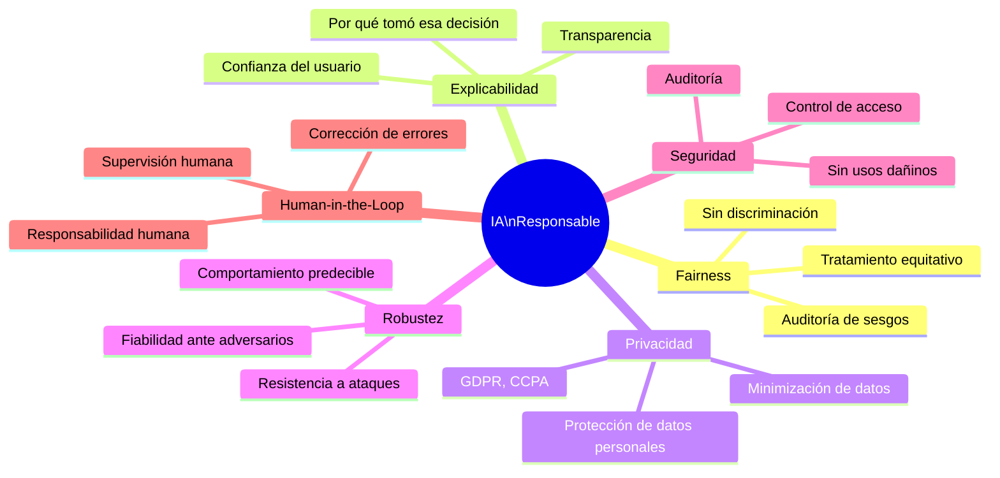

# 01 — IA Responsable: Sesgos, Fairness, Explicabilidad y HITL

**Tags:** #ia-responsable #sesgo #fairness #explicabilidad #hitl #etica #m5-seguridad
**Módulo:** [[00 - Índice Módulo 5]] | **Índice:** [[🏠 AWS AIF-C01 — Índice Maestro]]

> [!quote] Principio AWS
> AWS está comprometido con el desarrollo de IA de forma **responsable**, lo que incluye garantizar que los sistemas de IA sean justos, transparentes, robustos, seguros y privados. La IA Responsable no es una característica opcional: es un requisito fundamental.

---

## 🏛️ Los Pilares de la IA Responsable



---

## ⚖️ Sesgos en Datos y Modelos

### ¿Qué es el Sesgo en IA?

Un **sesgo (bias)** en IA ocurre cuando el modelo produce resultados **sistemáticamente injustos o incorrectos** para ciertos grupos de personas, debido a problemas en los datos de entrenamiento o en el proceso de modelado.

**El sesgo no es aleatorio: es sistemático.** Si un modelo sesga contra las mujeres en contratación, lo hará *consistentemente*, no por accidente.

---

### 📊 Tipos de Sesgo (Los Más Importantes para el Examen)

#### 🎯 Sampling Bias (Sesgo de Muestreo)

> [!quote] Definición
> El dataset de entrenamiento **no es representativo** de la población real porque el proceso de recopilación de datos favoreció ciertos grupos sobre otros.

**Ejemplo:**
Un modelo de reconocimiento facial entrenado con 95% de fotos de personas de piel clara. El modelo rendirá mal en personas de piel oscura **no porque sea "racista", sino porque nunca las vio suficiente durante el entrenamiento**.

> [!example] Caso real — Cámaras de vigilancia
> En 2018 estudios mostraron que sistemas de reconocimiento facial comerciales tenían tasas de error hasta 34% más altas para mujeres de piel oscura vs hombres de piel clara. Causa: **Sampling bias** en los datasets de entrenamiento.

#### 📜 Historical Bias (Sesgo Histórico)

> [!quote] Definición
> El dataset refleja con precisión la realidad histórica, pero esa realidad histórica en sí misma era injusta. El modelo aprende y **perpetúa la injusticia histórica**.

**Ejemplo:**
Un modelo de scoring de CVs entrenado con datos de contratación de los últimos 20 años. Si históricamente la empresa contrató menos mujeres para puestos de liderazgo, el modelo aprenderá a penalizar CVs femeninos para esos puestos, aunque los CVs sean idénticos.

> [!example] Caso real — Amazon hiring tool (2018)
> Amazon descartó una herramienta de selección de CVs con IA que había entrenado con datos de contratación históricos. El modelo penalizaba CVs que contenían la palabra "mujeres" (ej. "capitana del equipo de mujeres de hockey") porque históricamente habían sido menos contratadas en roles técnicos.

#### Otros Tipos de Sesgo

| Tipo | Definición | Ejemplo |
| :--- | :--- | :--- |
| **Confirmation Bias** | El modelo confirma sesgos preexistentes del diseñador | Un médico que solo incluye síntomas que confirman su diagnóstico inicial |
| **Label Bias** | Las etiquetas del dataset fueron asignadas con prejuicios | Anotadores humanos que inconscientemente etiquetizan diferente para distintos grupos |
| **Availability Bias** | Se usan solo los datos fácilmente disponibles, que pueden no ser representativos | Solo tener datos de pacientes de hospitales urbanos, no rurales |

---

## 🌍 Fairness (Equidad)

> [!quote] Definición
> **Fairness** en IA significa que el modelo trata de forma **equitativa** a diferentes grupos demográficos (género, raza, edad, religión, etc.), sin discriminación injustificada.

### Métricas de Fairness

| Métrica | Definición | Qué mide |
| :--- | :--- | :--- |
| **Demographic Parity** | La tasa de predicciones positivas es igual para todos los grupos | ¿Aprueba préstamos al mismo % de hombres y mujeres? |
| **Equal Opportunity** | El Recall (True Positive Rate) es igual para todos los grupos | ¿Detecta el mismo % de enfermos reales en todos los grupos demográficos? |
| **Individual Fairness** | Individuos similares reciben predicciones similares | Dos candidatos con CVs iguales ¿reciben la misma puntuación? |

> [!tip] SageMaker Clarify para Fairness
> **SageMaker Clarify** calcula automáticamente métricas de fairness como:
> - **Class Imbalance (CI):** Desequilibrio de clases en el dataset
> - **DPL (Difference in Positive Proportions in Labels):** Diferencia en proporciones de resultados positivos entre grupos
> - **Conditional Demographic Disparity (CDD):** Disparidad condicionada a otras variables

---

## 🔍 Explicabilidad e Interpretabilidad

> [!quote] Definición
> La **explicabilidad** de un modelo de IA se refiere a la capacidad de entender y comunicar **por qué** el modelo tomó una decisión concreta.

### ¿Por Qué Importa la Explicabilidad?

- **Legal/Compliance:** El GDPR europeo establece el "derecho a explicación" cuando una decisión automatizada afecta significativamente a una persona
- **Confianza:** Los usuarios y reguladores necesitan entender las decisiones para confiar en el sistema
- **Depuración:** Los ingenieros necesitan saber por qué falla el modelo para corregirlo
- **Detección de sesgo:** La explicabilidad revela si el modelo usa atributos injustos

### Herramienta: SHAP (SHapley Additive exPlanations)

La técnica más usada para explicabilidad de modelos ML, implementada en **SageMaker Clarify**:

```
Predicción del modelo: "Crédito DENEGADO" para cliente ID-8821

Contribución de cada feature a la decisión:
━━━━━━━━━━━━━━━━━━━━━━━━━━━━━━━━━━━━━━━
Feature                  SHAP Value    Efecto
━━━━━━━━━━━━━━━━━━━━━━━━━━━━━━━━━━━━━━━
ratio_deuda_ingresos: 0.72  → -0.45   ↓ Empuja a DENEGAR
historial_impagos: 2        → -0.31   ↓ Empuja a DENEGAR  
tiempo_empleo: 8 meses      → -0.18   ↓ Empuja a DENEGAR
ingresos_anuales: €28k      → +0.12   ↑ Empuja a APROBAR
━━━━━━━━━━━━━━━━━━━━━━━━━━━━━━━━━━━━━━━
Suma de contribuciones: -0.82 → DENEGADO
```

---

## 🧑‍⚖️ Human-in-the-Loop (HITL)

> [!quote] Definición
> **Human-in-the-Loop (HITL)** es el diseño de sistemas donde un humano supervisa, valida o aprueba las decisiones de la IA antes o después de ejecutarlas, especialmente cuando hay riesgo alto.

### Cuándo es Necesario HITL

| Nivel de riesgo | Ejemplo | Recomendación HITL |
| :--- | :--- | :--- |
| **Alto** | Diagnóstico médico definitivo | ✅✅ Siempre revisión humana |
| **Alto** | Decisiones legales (sentencias, contratos) | ✅✅ Siempre revisión humana |
| **Medio** | Aprobación de préstamos grandes | ✅ HITL para casos borderline |
| **Bajo** | Clasificación de spam | ❌ Puede ser completamente automático |
| **Bajo** | Recomendaciones de productos | ❌ Puede ser completamente automático |

### Implementaciones de HITL en AWS

| Servicio AWS | Cómo implementa HITL |
| :--- | :--- |
| **Amazon Augmented AI (A2I)** | Flujos de revisión humana cuando la IA tiene baja confianza en una predicción |
| **Agents for Bedrock** | Pausa de aprobación antes de ejecutar acciones de alto riesgo |
| **SageMaker Ground Truth** | Etiquetado de datos con revisión humana de calidad |

> [!example] HITL con Amazon A2I
> Un banco usa Textract para extraer datos de facturas. Cuando Textract tiene < 80% de confianza en un campo extraído, Amazon A2I envía automáticamente ese documento a un revisor humano que confirma o corrige el valor antes de que entre en el ERP.

---

## 📋 AWS y la IA Responsable

AWS ha publicado sus principios de IA Responsable en las **AWS AI Service Cards** (cubiertas en el [[03 - Guardrails, AI Service Cards y Clarify|Módulo 5, Archivo 03]]):

| Principio | Descripción |
| :--- | :--- |
| **Fairness** | Sistemas que tratan a todos los usuarios de manera equitativa |
| **Explicabilidad** | Capacidad de entender cómo funciona el sistema |
| **Privacidad y Seguridad** | Protección de datos de usuario |
| **Robustez** | Comportamiento fiable incluso ante entradas inesperadas |
| **Gobernanza** | Procesos para supervisión, auditoría y responsabilidad |
| **Transparencia** | Comunicación honesta sobre capacidades y limitaciones |

---
→ Volver al índice: [[📂M5 - IA Responsable y Seguridad/00 - Índice Módulo 5|🪐 Módulo 5: IA Responsable y Seguridad]]
