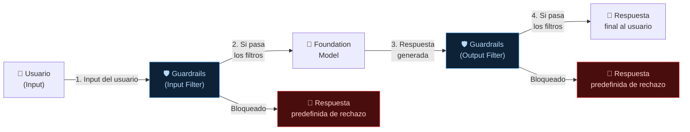
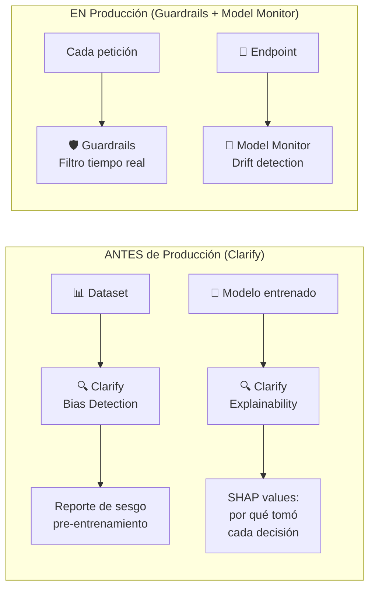

# 03 — Guardrails, AI Service Cards y SageMaker Clarify

**Tags:** #guardrails #ai-service-cards #clarify #proteccion #filtros #ia
 #m5-seguridad
**Módulo:** [[00 - Índice Módulo 5]] | **Índice:** [[🏠 AWS AIF-C01 — Índice Maestro]]

---

## 🛡️ Amazon Bedrock Guardrails

> [!quote] Definición AWS
> **Amazon Bedrock Guardrails** es una capa de seguridad configurable que se aplica a las entradas y salidas de cualquier FM en Bedrock, filtrando contenido dañino, inapropiado o fuera de política antes de que llegue al usuario.

### ¿Cómo se Integra en el Flujo?



**Los Guardrails se aplican tanto al INPUT del usuario como al OUTPUT del modelo.** Esto es crítico: un modelo podría generar contenido dañino aunque el prompt fuera inocuo.

---

### 🔒 Las Cuatro Capacidades de Bedrock Guardrails

#### 1️⃣ Content Filters (Filtros de Contenido)

Detecta y bloquea contenido dañino según categorías predefinidas, con niveles de sensibilidad configurables (None, Low, Medium, High):

| Categoría | Qué detecta | Nivel de sensibilidad |
| :--- | :--- | :--- |
| **Hate** | Discurso de odio, discriminación por raza, género, religión | None / Low / Medium / High |
| **Insults** | Insultos y lenguaje vejatorio | None / Low / Medium / High |
| **Sexual** | Contenido sexual explícito | None / Low / Medium / High |
| **Violence** | Contenido violento o que promueve la violencia | None / Low / Medium / High |
| **Misconduct** | Actividades ilegales, fraude, instrucciones dañinas | None / Low / Medium / High |
| **Prompt Attacks** | Intentos de jailbreak e injection | Enable / Disable |

#### 2️⃣ Denied Topics (Temas Denegados)

Lista personalizable de **temas específicos** que el asistente nunca debe abordar, definidos en lenguaje natural:

```yaml
denied_topics:
 - name: "Asesoramiento legal específico"
 definition: "No proporcionar consejos legales concretos o interpretaciones
 de contratos. Referir siempre a un abogado."
 
 - name: "Competidores"
 definition: "No mencionar ni comparar con productos de empresas competidoras.
 No hablar de precios ni características de la competencia."
 
 - name: "Política"
 definition: "No tomar posiciones políticas ni recomendar candidatos o partidos."
```

#### 3️⃣ PII Redaction (Protección de Datos Personales)

Detecta y protege automáticamente **PII (Personally Identifiable Information)**:

| Tipo de PII | Ejemplos |
| :--- | :--- |
| **Nombre** | Juan García Pérez |
| **Email** | juan@empresa.com |
| **Teléfono** | +34 612 345 678 |
| **Dirección** | Calle Mayor 15, Madrid |
| **DNI/SSN/Pasaporte** | 12345678A |
| **Tarjeta de crédito** | 4532 XXXX XXXX 1234 |
| **Número de cuenta** | ES98 2100 0418 4502 |
| **Fecha de nacimiento** | 15/03/1985 |

**Dos modos de actuación:**

- **Block:** Rechaza la solicitud si contiene PII

- **Anonymize:** Reemplaza la PII por `[NOMBRE]`, `[EMAIL]`, etc., y procesa el texto anonimizado

#### 4️⃣ Grounding (Verificación Factual en RAG)

Para sistemas RAG, verifica que la respuesta del modelo esté **fundamentada en el contexto proporcionado**:

```
Contexto RAG: "El precio del producto A es €99"

Respuesta del modelo: "El producto A cuesta €149"
 ↓
Guardrails (Grounding check): BLOQUEADO
"La respuesta contradice el contexto. Posible alucinación detectada."

Respuesta del modelo: "El producto A cuesta €99"
 ↓
Guardrails (Grounding check): PERMITIDO ✅
```

---

### 📊 Bedrock Guardrails vs Otras Mitigaciones

| Herramienta | Cuándo se aplica | Qué mitiga |
| :--- | :--- | :--- |
| **Bedrock Guardrails** | En tiempo real, en cada llamada al FM | Contenido dañino, PII, temas prohibidos, injection, alucinaciones |
| **SageMaker Clarify** | Durante el desarrollo/entrenamiento | Sesgos en datos y modelos |
| **Amazon Macie** | Análisis de S3 | PII en archivos almacenados (no en tiempo real) |
| **Amazon Comprehend** | Procesamiento de texto | Detección de PII y sentimiento |

---

## 🌱 Sostenibilidad (Customer Carbon Footprint Tool)

> [!quote] El Impacto Ambiental de GenAI
> Entrenar y ejecutar Modelos Fundacionales consume enormes cantidades de energía y genera una huella de carbono significativa. La IA Responsable también abarca el pilar de **Sostenibilidad** de AWS.

Para medir esto, AWS ofrece la **Customer Carbon Footprint Tool**.
- **Qué hace:** Mapea y monitorea el impacto ambiental (emisiones de carbono) del uso que hace tu empresa de los servicios de AWS (incluyendo recursos masivos como instancias EC2 con GPUs para entrenamiento de IA).
- **Para el Examen:** Si preguntan por sostenibilidad, eficiencia energética de los FMs o reporte de emisiones de carbono corporativo ➔ **Customer Carbon Footprint Tool**.

---

## 📋 AWS AI Service Cards

> [!quote] Definición AWS
> Las **AWS AI Service Cards** son documentos de **transparencia y responsabilidad** que AWS publica para cada uno de sus servicios de IA. Describen las capacidades, limitaciones, casos de uso apropiados, consideraciones éticas y cómo AWS ha evaluado el sesgo y la fairness del servicio.

### ¿Qué Contiene una AI Service Card?

| Sección | Contenido |
| :--- | :--- |
| **Overview** | Descripción del servicio y sus capacidades |
| **Intended Use Cases** | Para qué está diseñado y para qué NO se recomienda |
| **Fairness and Bias** | Cómo AWS evaluó el sesgo y qué medidas tomó |
| **Performance** | Métricas de rendimiento en diferentes condiciones y grupos demográficos |
| **Responsible AI Design** | Principios aplicados en el diseño del servicio |
| **Limitations** | Casos donde el servicio no funciona bien |
| **Customer Responsibilities** | Qué debe hacer el cliente para usar el servicio de forma responsable |

> [!example] AI Service Cards disponibles
> AWS ha publicado AI Service Cards para:
>
> - Amazon Rekognition
>
> - Amazon Transcribe
>
> - Amazon Comprehend
>
> - Amazon Polly
>
> - Amazon Textract
>
> - Amazon Personalize
> -... y otros servicios de IA

> [!tip] Para el examen — ¿Para qué sirven las AI Service Cards?
> Si el examen pregunta sobre cómo AWS proporciona **transparencia** sobre sus servicios de IA o cómo documenta las **limitaciones y sesgos** → **AWS AI Service Cards**.
> 
> No son herramientas de seguridad técnica (eso es Guardrails). Son **documentación de gobernanza y transparencia**.

---

## 🔍 SageMaker Clarify en el Contexto de la Seguridad

(Ya cubierto en profundidad en [[05 - SageMaker para Practitioner|Módulo 2]])

**Resumen de su rol en IA Responsable:**



| Herramienta | Fase | Función |
| :--- | :--- | :--- |
| **SageMaker Clarify** | Desarrollo | Detectar sesgos ANTES de desplegar |
| **Bedrock Guardrails** | Producción | Filtrar contenido dañino EN TIEMPO REAL |
| **SageMaker Model Monitor** | Producción | Detectar drift/degradación ESTADÍSTICA |

---
→ Volver al índice: [[📂M5 - IA Responsable y Seguridad/00 - Índice Módulo 5|🪐 Módulo 5: IA Responsable y Seguridad]]
