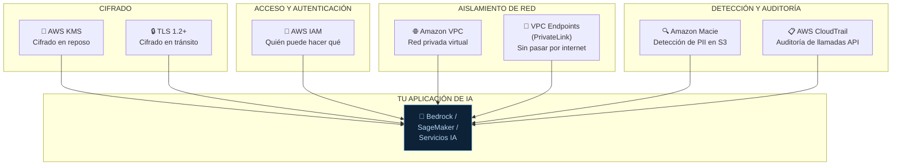
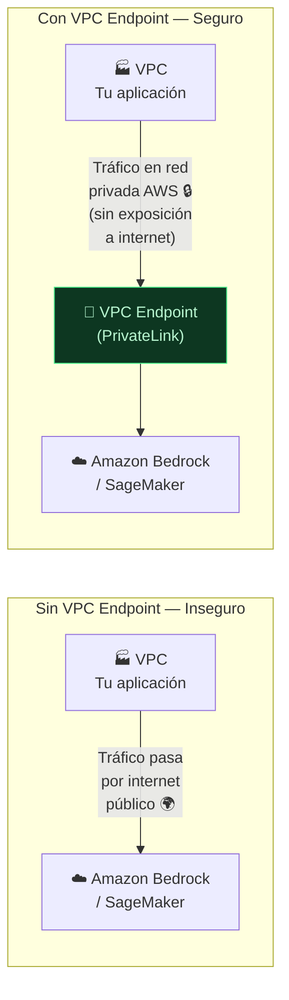
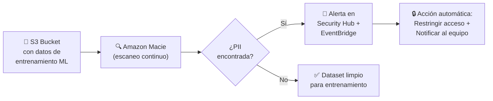
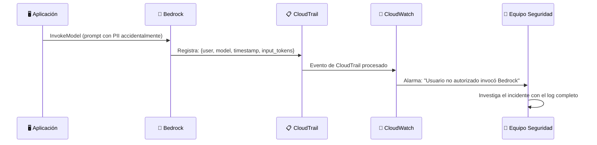

# 04 — Seguridad e Infraestructura: KMS, IAM, VPC, Macie y CloudTrail

**Tags:** #kms #iam #vpc #macie #cloudtrail #seguridad #cifrado #ia
 #m5-seguridad
**Módulo:** [[00 - Índice Módulo 5]] | **Índice:** [[🏠 AWS AIF-C01 — Índice Maestro]]

> [!quote] Principio fundamental
> La seguridad de una solución de IA en AWS no es solo responsabilidad del modelo: es una responsabilidad compartida entre AWS y el cliente. El cliente es responsable de **cómo y para qué** usa los servicios, el control de acceso, el cifrado adicional y la configuración de red.

---

## 🗺️ El Ecosistema de Seguridad de AWS para IA



---

## 🔑 AWS KMS — Cifrado en Reposo

> [!quote] Definición
> **AWS Key Management Service (KMS)** es el servicio de gestión de claves criptográficas de AWS. Permite crear, controlar y rotar las claves de cifrado que protegen tus datos **en reposo**.

### Tipos de Claves KMS

| Tipo de Clave | Quién la gestiona | Cuándo usar |
| :--- | :--- | :--- |
| **AWS Managed Keys** | AWS gestiona automáticamente rotación y permisos | Uso general, compliance básico |
| **Customer Managed Keys (CMK)** | Tú controlas la política, rotación y acceso | Requisitos de compliance estrictos (HIPAA, PCI-DSS, FedRAMP) |
| **AWS Owned Keys** | AWS usa y gestiona completamente | Sin visibilidad del cliente |

### Aplicación en IA/ML

| Servicio | Qué cifra con KMS |
| :--- | :--- |
| **Amazon S3** | Datasets, modelos, outputs almacenados |
| **Amazon SageMaker** | Datos de entrenamiento, modelos, notebooks |
| **Amazon Bedrock** | Datos fine-tuning, Knowledge Bases, configuraciones |
| **Amazon OpenSearch** | Bases de datos vectoriales de Knowledge Bases |
| **AWS Glue** | Datos procesados en ETL |

> [!tip] KMS para el examen
>
> - **Cifrado en reposo** → **KMS**
>
> - **Customer Managed Keys** → Cuando el cliente necesita controlar sus propias claves (compliance estricto)
>
> - KMS aplica a datos **almacenados**, no a datos en movimiento (eso es TLS)

---

## 🔒 TLS — Cifrado en Tránsito

> [!quote] Definición
> **TLS (Transport Layer Security)** es el protocolo que cifra los datos **en movimiento** entre tu aplicación y los servicios de AWS.

**AWS garantiza TLS 1.2+ en todos sus servicios de IA:**

- Llamadas a la API de Bedrock

- Transferencias de datos a/desde S3

- Comunicaciones entre servicios internos de AWS

> [!tip] Regla simple
>
> - Datos almacenados en S3, BD... → **KMS** (en reposo)
>
> - Datos viajando por la red → **TLS** (en tránsito)

---

## 👤 IAM — Control de Acceso y Principio de Menor Privilegio

> [!quote] Definición
> **AWS IAM (Identity and Access Management)** controla **quién puede hacer qué** en tu cuenta de AWS. Es el mecanismo de autenticación y autorización central.

### El Principio de Menor Privilegio en IA

**Menor privilegio:** Dar a cada entidad (usuario, aplicación, servicio) solo los permisos estrictamente necesarios para su función, y nada más.

```json
// Política IAM — Principio de Menor Privilegio para Bedrock
// Solo permite invocar el modelo Claude 3 Haiku. Nada más.
{
 "Version": "2012-10-17",
 "Statement": [
 {
 "Sid": "AllowBedrockInvokeOnlyHaiku",
 "Effect": "Allow",
 "Action": [
 "bedrock:InvokeModel"
 ],
 "Resource": [
 "arn:aws:bedrock:us-east-1::foundation-model/anthropic.claude-3-haiku-20240307-v1:0"
 ]
 }
 ]
}
```

### Casos de Uso de IAM en IA

| Escenario | Configuración IAM recomendada |
| :--- | :--- |
| **Lambda que llama a Bedrock** | Role con `bedrock:InvokeModel` solo para el modelo específico |
| **Cientista de datos en SageMaker** | Role con permisos de lectura en S3 de datos + permisos de training jobs |
| **Pipeline CI/CD de ML** | Role con permisos para crear/actualizar endpoints, nada más |
| **Usuario humano accediendo a Q Business** | Integración con IAM Identity Center (SSO) |
| **Aplicación que lee Knowledge Bases** | Role con `bedrock:Retrieve` y `bedrock:RetrieveAndGenerate` |

> [!warning] Anti-patrón frecuente en el examen
> **NUNCA** usar credenciales de larga duración (Access Key + Secret) hard-codeadas en el código de la aplicación. La respuesta correcta siempre es **IAM Roles** (credenciales temporales, rotación automática).

---

## 🌐 VPC Endpoints (AWS PrivateLink) — Aislamiento de Red

> [!quote] Definición
> Un **VPC Endpoint** permite que tu VPC se conecte a servicios de AWS **sin que el tráfico pase por internet público**, usando la red interna de AWS (PrivateLink).

### Por Qué es Crítico para IA con Datos Sensibles



### Aplicación en IA

| Servicio | VPC Endpoint |
| :--- | :--- |
| **Amazon Bedrock** | `com.amazonaws.<region>.bedrock-runtime` |
| **Amazon SageMaker** | `com.amazonaws.<region>.sagemaker.api` |
| **Amazon S3** | `com.amazonaws.<region>.s3` (Gateway Endpoint) |
| **AWS Secrets Manager** | Para almacenar credenciales de APIs externas |

> [!example] Caso de uso — Banco con datos de clientes
> Un banco tiene su aplicación de chatbot en una VPC privada. Configura un VPC Endpoint para Amazon Bedrock: los datos confidenciales de los clientes (transcripciones de llamadas, datos financieros) nunca salen de la red privada de AWS ni pasan por internet público, aunque se usen en prompts al LLM.

---

## 🔍 Amazon Macie — Detective de PII en S3

> [!quote] Definición
> **Amazon Macie** es un servicio de seguridad de datos que usa ML para **descubrir, clasificar y proteger datos sensibles** almacenados en Amazon S3, incluyendo PII.

### ¿Qué Detecta Macie?

| Categoría | Ejemplos |
| :--- | :--- |
| **PII Personal** | Nombres, fechas de nacimiento, direcciones |
| **Financiero** | Números de tarjeta de crédito, números de cuenta bancaria |
| **Credenciales** | Claves de API, contraseñas en texto plano, claves SSH |
| **Médico** | Información de salud protegida (PHI) |
| **Identificadores** | DNI, número de seguridad social, pasaporte |

### Macie en el Contexto de IA



**Casos de uso específicos para IA:**

- Escanear datasets antes de usarlos para entrenamiento ML

- Detectar si alguien subió datos de producción con PII a un bucket de desarrollo

- Cumplimiento GDPR: asegurar que los datos de entrenamiento no contienen PII sin consentimiento

> [!warning] Macie vs Comprehend para PII
>
> - **Amazon Macie** → Detecta PII en **archivos almacenados en S3** (análisis offline)
>
> - **Amazon Comprehend** → Detecta PII en **texto procesado en tiempo real** (análisis de strings)
>
> - **Bedrock Guardrails** → Detecta/redacta PII en **prompts y respuestas en tiempo real**

---

## 📋 AWS CloudTrail — El Libro de Registro

> [!quote] Definición
> **AWS CloudTrail** registra automáticamente todas las **llamadas a la API** realizadas en tu cuenta de AWS: quién las hizo, desde dónde, qué hizo y cuándo. Es el servicio de auditoría y trazabilidad de AWS.

### ¿Qué Registra CloudTrail en Contextos de IA?

| Acción | Lo que registra CloudTrail |
| :--- | :--- |
| Llamada a `InvokeModel` en Bedrock | Usuario/Role, modelo invocado, timestamp, IP origen, región |
| Creación de Knowledge Base | Quién la creó, cuándo, qué fuentes de datos |
| Modificación de Guardrails | Quién cambió la configuración y qué cambió |
| Acceso a S3 (datasets) | Quién descargó/subió qué archivo y cuándo |
| Cambio de política IAM | Quién modificó qué permiso |

### CloudTrail en la Arquitectura de IA Segura



> [!tip] CloudTrail para el examen
> Si el escenario dice:
>
> - "Auditar quién invocó modelos de Bedrock" → **CloudTrail**
>
> - "Investigar un incidente de acceso no autorizado" → **CloudTrail**
>
> - "Compliance: demostrar que nadie accedió a datos sensibles sin autorización" → **CloudTrail**
>
> - "Alertar en tiempo real cuando alguien hace una llamada sospechosa" → **CloudTrail + CloudWatch Events**

---

## 📊 Tabla Resumen Final — Los 6 Controles de Seguridad

| Control | Para qué | Cuándo aplica | Palabra clave |
| :--- | :--- | :--- | :--- |
| **AWS KMS** | Cifrar datos almacenados | En reposo (S3, BD, modelos) | "Cifrado", "claves de cifrado" |
| **TLS** | Cifrar datos en movimiento | En tránsito (APIs, red) | "Cifrado en tránsito", "HTTPS" |
| **IAM** | Controlar quién puede hacer qué | Siempre | "Permisos", "menor privilegio", "roles" |
| **VPC Endpoints** | Aislar el tráfico de internet | Red privada | "Red privada", "sin internet público", "PrivateLink" |
| **Amazon Macie** | Detectar PII en S3 | Análisis de datos en S3 | "PII en S3", "datos sensibles almacenados" |
| **CloudTrail** | Auditar llamadas a la API | Compliance, investigación | "Auditoría", "quién hizo qué", "trazabilidad" |

---
→ Volver al índice: [[📂M5 - IA Responsable y Seguridad/00 - Índice Módulo 5|🪐 Módulo 5: IA Responsable y Seguridad]]
