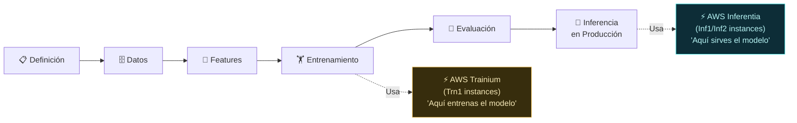

# 01 — AWS Trainium vs AWS Inferentia

**Tags:** #trainium #inferentia #hardware #chips #aceleradores #ia
 #m6-hardware
**Módulo:** M6 - Hardware AWS | **Índice:** [[🏠 AWS AIF-C01 — Índice Maestro]]

> [!quote] Contexto
> AWS diseña sus propios chips de silicio optimizados para cargas de trabajo de IA/ML, ofreciendo mejor rendimiento por dólar que las GPUs estándar. Hay dos chips y se usan en momentos distintos del ciclo de vida: **uno para entrenar, otro para inferir**.

---

## ⚡ La Regla de Oro (Memorízala Antes del Examen)

> [!tip] 🏋️ Trainium = TRAIN | 🚀 Inferentia = INFER
> 
> **AWS Trainium** → Optimizado para **entrenar** modelos de ML (el proceso largo y costoso)
> **AWS Inferentia** → Optimizado para **inferencia** (usar el modelo en producción)
> 
> La palabra ya lo dice: **Train**ium y **Infer**entia.

---

## 🏋️ AWS Trainium — El Chip de Entrenamiento

> [!quote] Definición AWS
> AWS Trainium es un chip personalizado diseñado por AWS, optimizado para el **entrenamiento de modelos de Deep Learning** a escala. Está disponible en instancias de Amazon EC2 de la familia **Trn1**.

### ¿Qué lo Hace Especial?

| Característica | Detalle |
| :--- | :--- |
| **Propósito** | Entrenamiento de modelos (la fase más intensiva en cómputo) |
| **Rendimiento** | Hasta 50% más económico que GPUs comparables para entrenamiento |
| **Memoria HBM** | Gran capacidad de memoria de ancho de banda alto para manejar modelos grandes |
| **Interconexión** | Chip Link para comunicación ultra-rápida entre chips en entrenamiento distribuido |
| **Frameworks** | PyTorch, TensorFlow mediante AWS Neuron SDK |
| **Instancias EC2** | `trn1.2xlarge`, `trn1.32xlarge` (16 chips Trainium) |

### ¿Por Qué el Entrenamiento Necesita un Chip Especial?

El entrenamiento de un LLM grande implica:

- Calcular gradientes para **billones de parámetros**

- Actualizar esos parámetros **millones de veces**

- Hacerlo distribuido en **miles de chips simultáneamente**

- Durante **semanas o meses**

Las GPUs estándar (NVIDIA A100, H100) son excelentes pero muy caras. Trainium ofrece el mismo rendimiento a menor coste para esta carga específica.

---

## 🚀 AWS Inferentia — El Chip de Inferencia

> [!quote] Definición AWS
> AWS Inferentia es un chip personalizado diseñado por AWS, optimizado para ejecutar modelos de ML entrenados en **producción** (inferencia), con alta eficiencia y bajo coste por petición. Disponible en instancias de Amazon EC2 de la familia **Inf1** e **Inf2**.

### ¿Qué lo Hace Especial?

| Característica | Detalle |
| :--- | :--- |
| **Propósito** | Inferencia en producción (cada vez que un usuario hace una pregunta) |
| **Rendimiento** | Hasta 70% más económico que GPUs comparables para inferencia |
| **Latencia** | Ultra-baja latencia para respuestas en tiempo real |
| **Throughput** | Alto rendimiento: muchas peticiones por segundo |
| **Modelos soportados** | Modelos de CV, NLP, recomendaciones, LLMs |
| **Instancias EC2** | `inf1.xlarge`, `inf1.6xlarge`, `inf2.xlarge`, `inf2.48xlarge` |

### ¿Por Qué la Inferencia Necesita un Chip Diferente?

La inferencia (usar un modelo ya entrenado) tiene un perfil de carga muy diferente al entrenamiento:

- **Muchas peticiones pequeñas** (vs. pocas operaciones masivas en training)

- **Latencia crítica** (el usuario espera la respuesta)

- **Alto paralelismo** (miles de usuarios simultáneos)

- **Sin gradientes** (solo forward pass, no backpropagation)

Inferentia está diseñado específicamente para este patrón: muchas peticiones pequeñas, rápidas y baratas.

---

## ⚖️ Comparativa Completa: Trainium vs Inferentia

| Dimensión | **AWS Trainium (Trn1)** | **AWS Inferentia (Inf1/Inf2)** |
| :--- | :--- | :--- |
| **Fase del ML Lifecycle** | Fase 4: Entrenamiento | Fase 6: Despliegue e Inferencia |
| **Tipo de operación** | Forward + Backward pass (gradientes) | Solo Forward pass |
| **Duración típica** | Horas, días o semanas | Milisegundos por petición |
| **Escala** | Clusters de chips para un gran trabajo | Miles de instancias paralelas |
| **Optimizado para** | Alta utilización de memoria, cálculo matricial masivo | Baja latencia, alto throughput |
| **Coste vs GPU equivalente** | ~50% más barato en training | ~70% más barato en inferencia |
| **Instancias EC2** | Familia `Trn1` | Familia `Inf1`, `Inf2` |
| **SDK** | AWS Neuron SDK | AWS Neuron SDK |

---

## 🗺️ Posicionamiento en el ML Lifecycle



---

## 🧠 Neuron SDK — El Puente entre Frameworks y los Chips

Tanto Trainium como Inferentia requieren el **AWS Neuron SDK** para ejecutar modelos entrenados con PyTorch o TensorFlow:

```
Modelo PyTorch/TensorFlow
 ↓
 AWS Neuron SDK
 (compilación y optimización)
 ↓
 Trainium o Inferentia
 (ejecución optimizada)
```

El SDK compilar el modelo al formato nativo del chip, aplicando optimizaciones específicas para el hardware de AWS.

---

## 💰 Contexto de Coste: ¿Cuándo Usar Trainium/Inferentia vs GPU?

| Escenario | Recomendación |
| :--- | :--- |
| **Entrenar un LLM desde cero o fine-tuning masivo** | AWS Trainium (Trn1) si el modelo es compatible |
| **Inferencia de alta escala en producción** | AWS Inferentia (Inf2) para máxima eficiencia |
| **Necesito GPU NVIDIA por compatibilidad de frameworks** | EC2 P4/P5 (A100/H100 NVIDIA) |
| **Prototipado rápido, cualquier carga** | EC2 G5 (NVIDIA A10G, más disponible y flexible) |
| **Inferencia sin gestionar infraestructura** | Amazon Bedrock (abstrae todo el hardware) |

---

## 🎯 Escenarios de Examen — Elige el Chip Correcto

> [!example] Escenario A
> *"Una empresa de startups quiere entrenar su propio LLM de 70B parámetros y busca la opción más económica de AWS para el entrenamiento."*
> → **AWS Trainium (instancias Trn1)** — Más económico que GPUs para entrenamiento de LLMs.

> [!example] Escenario B
> *"Una plataforma de atención al cliente tiene un modelo desplegado en producción que recibe 10.000 consultas por segundo. Quieren reducir el coste por inferencia."*
> → **AWS Inferentia (instancias Inf2)** — Optimizado para inferencia de alto throughput y bajo coste.

> [!example] Escenario C
> *"Un equipo de investigación quiere fine-tunear el modelo Llama 3 70B con datos propios y luego desplegarlo en producción con baja latencia."*
> → **Trainium para el fine-tuning** + **Inferentia para la producción** — Dos chips, dos fases.

---

## 📊 Tabla Resumen Final

| | **AWS Trainium** | **AWS Inferentia** |
| :--- | :---: | :---: |
| **Emoji mnemónico** | 🏋️ | 🚀 |
| **Palabra clave** | TRAIN | INFER |
| **Fase** | Entrenamiento (4) | Inferencia/Producción (6) |
| **Instancias** | Trn1 | Inf1, Inf2 |
| **Ahorro vs GPU** | ~50% | ~70% |
| **Latencia crítica** | ❌ No importa (proceso batch) | ✅ Sí (usuarios esperando) |

→ Volver al índice: [[🏠 AWS AIF-C01 — Índice Maestro]]

---
→ Volver al índice: [[📂M6 - Hardware AWS/00 - Índice Módulo 6|🪐 Módulo 6: Hardware AWS]]
