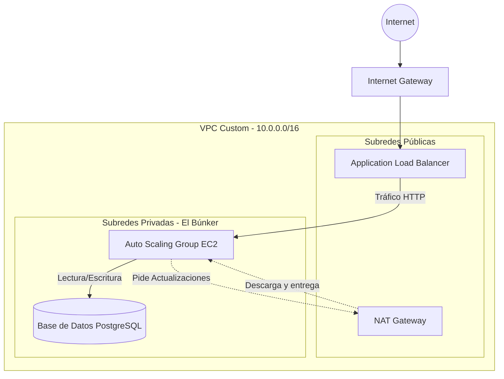
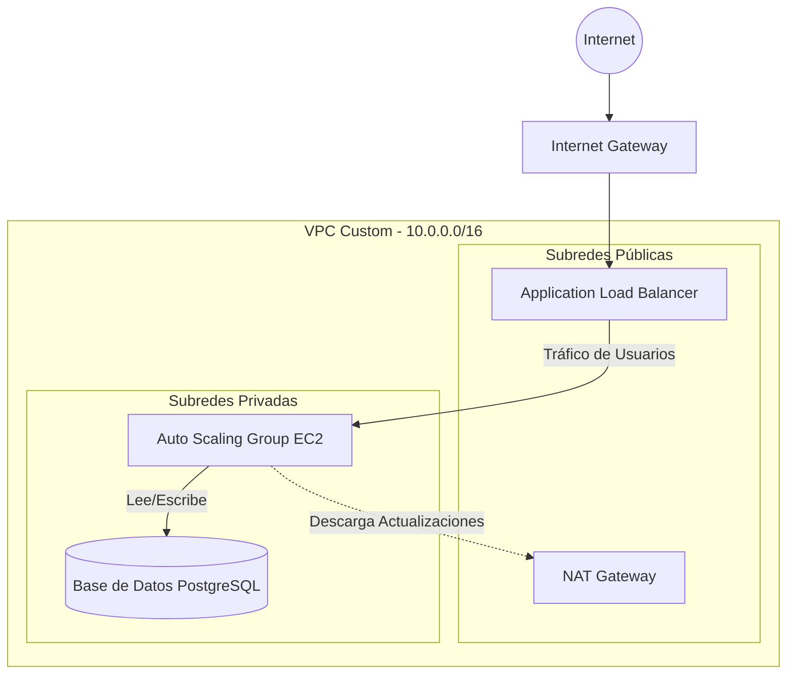

PROYECTO PARA HACER EN EL FUTURO:

Proyecto 2: Arquitectura Web Resiliente y Desacoplada con Terraform
Objetivo: Dominar Terraform, bases de datos gestionadas, almacenamiento seguro y balanceo de carga.

Qué construir: Un backend web completo aprovisionado 100% mediante Terraform.

Infraestructura:

Networking: VPC con subredes públicas y privadas distribuidas en dos zonas de disponibilidad (Multi-AZ).

Cómputo y Tráfico: Un Application Load Balancer (ALB) público que distribuye peticiones a un grupo de Auto Scaling (ASG) con instancias EC2 en subredes privadas.

Base de datos: Instancia RDS (PostgreSQL o MySQL) en subredes de datos aisladas, sin acceso a Internet.

Seguridad: Credenciales de la base de datos guardadas en AWS Secrets Manager y recuperadas en tiempo de ejecución; datos estáticos servidos desde S3 vía CloudFront.

Entregable: Código modular de Terraform estructurado en carpetas (network, compute, database) con su archivo de estado remoto en S3 y bloqueo en DynamoDB.

**LO DEJE A MEDIAS PORQUE ES BASTANTE COMPLETO PREFIERO IR POCO A POCO**


Este documento es la base de conocimiento interna (ADR - Architecture Decision Record) para la arquitectura web resiliente. Contiene explicaciones técnicas, diagramas y decisiones de diseño.

## 🗺️ Mapa Visual de la Red



---

## Fase 0: El Cerebro Compartido (Remote State)

En proyectos básicos, el estado de Terraform (`.tfstate`) se guarda en local. En arquitecturas empresariales, esto es inviable porque varios ingenieros sobrescribirían el trabajo de los demás, duplicando recursos y rompiendo la infraestructura.

### 1. AWS S3 (Almacenamiento Centralizado)

Para que un equipo comparta el mismo "cerebro", guardamos el archivo `.tfstate` en un bucket de S3. De esta forma, si el Desarrollador A crea un servidor, el Desarrollador B verá que ese servidor ya existe antes de ejecutar su propio código.

### 2. AWS DynamoDB (State Locking / Semáforo)

¿Qué pasa si dos desarrolladores ejecutan `terraform apply` en el mismo milisegundo? Corrupción del archivo. 

Para evitarlo, usamos una tabla de DynamoDB. Funciona como un **semáforo**:

- Cuando el Desarrollador A ejecuta código, DynamoDB pone el semáforo en rojo (bloquea el estado).
- Si el Desarrollador B lo intenta a la vez, recibe un error: *"El estado está bloqueado por A"*.

### ❓ Preguntas Frecuentes y Lecciones Aprendidas (Fase 0)

> **¿Por qué el bucket S3 estaba vacío tras hacer el `terraform init`? ¿Es normal?**
> 
> Sí, es completamente normal. El archivo `terraform.tfstate` se genera la **primera vez que haces un `terraform apply`** (cuando realmente creas un servidor o una red). En la fase `init`, Terraform simplemente "conecta los tubos".
>
> **¿Se guarda en ese `.tfstate` la creación del S3 y la DynamoDB?**
> 
> ¡No! Como creamos el S3 y DynamoDB a mano por la terminal (fuera de Terraform) resolviendo el problema del *"Huevo y la gallina"*, Terraform no los considera "suyos". Simplemente los usa como un disco duro externo. Si hicieras un `terraform destroy`, **NO** borraría ni el bucket ni DynamoDB.
>
> **¿DynamoDB es una función de S3 o es su propio servicio?**
> 
> Es un servicio **completamente independiente** de Amazon (su base de datos NoSQL ultrarrápida). S3 no tiene ni idea de qué es DynamoDB. Terraform está programado para conectarse a ambos servicios de forma paralela.

---

## Fase 1: Los Cimientos (Networking Avanzado)

La red no es solo cables, es nuestra barrera de ciberseguridad. Hemos diseñado una arquitectura "Zero Trust" donde casi nada es directamente accesible desde internet.

### 1. VPC (Virtual Private Cloud)

Nuestra parcela de terreno. Elegimos un bloque CIDR grande (`10.0.0.0/16`) para tener un límite teórico de 65.536 direcciones IP disponibles.

### 2. Zonas de Disponibilidad (Multi-AZ)

AWS divide sus regiones (ej. Virginia) en varios centros de datos separados físicamente (AZs). Al dividir nuestros recursos entre `us-east-1a` y `us-east-1b`, logramos **Alta Disponibilidad**. Si un centro de datos entero se cae (por fuego o corte de luz), la arquitectura conmuta al otro automáticamente.

### 3. Subredes Públicas y el Internet Gateway (IGW)

- El **Internet Gateway (IGW)** es la puerta al mundo real. 
- Las **Subredes Públicas** (`map_public_ip_on_launch = true`) tienen una tabla de rutas que envía tráfico directamente al IGW. 
- **¿Qué va aquí?** SOLO recursos que deben ser vistos por usuarios, como el Application Load Balancer.

### 4. Subredes Privadas (El Búnker)

- Estas subredes NO asignan IPs públicas a sus servidores. Un hacker no puede escribir una IP en su terminal y atacar un servidor nuestro, porque esa IP pública no existe.
- **¿Qué va aquí?** Nuestro código de aplicación (instancias EC2 dentro de un Auto Scaling Group) y nuestra base de datos (Amazon RDS).

### 5. NAT Gateway y Elastic IP (El Mayordomo Secreto)

Si nuestras instancias EC2 son invisibles y no pueden hablar con internet... ¿cómo descargan librerías de Python o actualizaciones de Linux (`apt update`)?

Para solucionar esto, usamos un **NAT Gateway**. 

- Lo situamos en la subred pública.
- Le asignamos una **Elastic IP** (una IP pública fija de AWS).
- **Funcionamiento:** El servidor privado manda la petición al NAT. El NAT (que sí tiene internet) hace la petición, descarga la actualización y se la devuelve al servidor privado. Los hackers solo verán la IP del NAT realizando una petición legítima, pero no podrán ver los servidores que hay detrás.

### 6. Route Tables (Señales de Tráfico)

Las tablas de enrutamiento (Route Tables) dictan el flujo de red.

- **Tabla Pública:** *"Si quieres ir a internet (`0.0.0.0/0`), usa la gran puerta principal (Internet Gateway)"*.
- **Tabla Privada:** *"Si quieres ir a internet (`0.0.0.0/0`), envíale la petición a nuestro intermediario (NAT Gateway)"*.
  
  
  
  README GITHUB
  # 🚀 Arquitectura Web Resiliente y Desacoplada en AWS

Un backend Cloud de nivel empresarial aprovisionado al 100% como Infraestructura como Código (IaC) mediante **Terraform**.

## 🎯 Resumen de la Arquitectura
Esta infraestructura está diseñada para ser altamente disponible (Multi-AZ), segura (recursos críticos aislados en redes privadas) y escalable automáticamente según el tráfico.



## 🛠️ Tecnologías Principales
- **AWS VPC & Networking:** Red Multi-AZ con subredes públicas y privadas, usando NAT Gateways.
- **AWS ALB & Auto Scaling:** Balanceo de carga y autoescalado dinámico de servidores web.
- **AWS RDS & Secrets Manager:** Base de datos segura sin credenciales en el código fuente.
- **AWS S3 & DynamoDB:** Almacenamiento de estado remoto (`.tfstate`) y State Locking.
- **Terraform:** Estructura modular avanzada.

## 📂 Estructura del Proyecto (Módulos)
```text
terraform/
├── main.tf              # Llama y orquesta los submódulos
├── provider.tf          # Configuración del proveedor y Backend S3
├── variables.tf         # Variables globales del entorno
├── outputs.tf           # Datos de salida finales (ej. URL del Balanceador)
└── modules/             # Piezas lógicas reutilizables
    ├── network/         # VPC, Subredes, IGW, NAT, Tablas de Rutas
    ├── database/        # Amazon RDS y Secrets Manager
    └── compute/         # ALB, Launch Templates, Auto Scaling Group
```

## 🚀 Despliegue Rápido
1. **Configurar Estado Remoto (Solo la primera vez):** Crear el bucket S3 y la tabla DynamoDB mediante AWS CLI.
2. **Inicializar Terraform:**
   ```bash
   terraform init
   ```
3. **Desplegar Infraestructura:**
   ```bash
   terraform apply
   ```

*(Nota: Las decisiones de diseño arquitectónico y explicaciones técnicas detalladas se encuentran en mis apuntes de Obsidian, tengo un repositorio donde están todos mis apuntes, te lo dejaré abajo).* 

***

**Apuntes de clase, libros, apuntes y lo que necesito para comprender y aprender mejor la tecnología y conceptos que se van viendo en cada clase o momento de aprendizaje.**
https://github.com/izann06/Apuntes-Tecnicos-Obsidian
