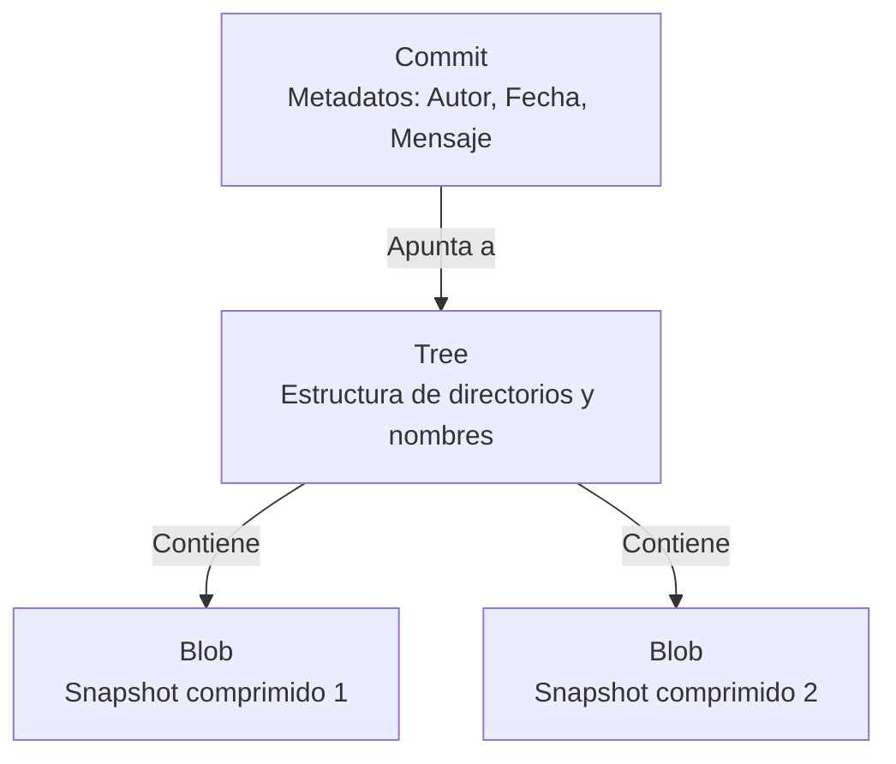

#git #control-de-versiones #datacamp #commits #historial

> [!info] Navegación
> Apuntes del curso **Historial de Versiones en [[Git]]** (DataCamp - George Boorman).

---

## 1. Ver el historial de versiones (`git log`)

El historial de versiones es fundamental en cualquier sistema de [[Control de Versiones]]. Nos permite inspeccionar qué ha cambiado, quién lo hizo y cuándo.

### Anatomía Interna de un Commit

En [[Git]], una confirmación o *commit* no es simplemente una "foto" plana, sino que está compuesto por tres estructuras de datos fundamentales:



1. **[[Commits|Commit]]:** Contiene los metadatos (autor, fecha/hora, mensaje descriptivo) y un puntero al árbol (Tree) que representa el estado del proyecto en ese momento.
2. **Árbol (Tree):** Representa la estructura de directorios y los nombres de los archivos (mapeo clave-valor).
3. **Blob (Binary Large Object):** Contiene el contenido comprimido del archivo en sí (el *snapshot*), pero sin el nombre.

### Hashes en Git (Identificación Unívoca)

Todos los objetos en Git se identifican mediante **funciones hash criptográficas (SHA-1)** (un código alfanumérico de 40 caracteres, ej: `a1b2c3d4...`).

> [!INFO] ¿Por qué Git compara Hashes y no texto completo?
> Git es extremadamente rápido porque **compara hashes en lugar de leer y comparar archivos de texto completos**. Calcular y comparar una cadena de 40 caracteres es instantáneo comparado con analizar megabytes de código fuente línea por línea para encontrar diferencias entre repositorios. Si el hash no cambia, el archivo es idéntico.

- **Comando principal:** `git log` visualiza el historial cronológico de confirmaciones, ordenadas de la más reciente a la más antigua.

---

## 2. Consejos y trucos sobre el historial de versiones

Cuando un repositorio crece mucho, navegar por el `git log` estándar se vuelve inmanejable. Es crucial dominar el filtrado y la búsqueda avanzada.

### Filtrado y Búsqueda

- **Limitar la cantidad de commits:**
  ```bash
  git log -N
  # Ejemplo: Mostrar solo los últimos 3 commits
  git log -3
  
  # Salida esperada:
  # commit a1b2c3d4... (HEAD -> main)
  # Author: Izan <izan@email.com>
  # Date:   Wed Oct 25 14:30:00 2023 +0200
  #
  #     Update README.md
  #
  # commit e5f6g7h8...
  # [...] (Muestra los 3 últimos)
  ```

- **Filtrar por archivo específico:**
  ```bash
  git log <nombre_archivo>
  # Ejemplo: Ver el historial del archivo report.md
  git log report.md
  ```

- **Combinar filtros y rutas:**
  ```bash
  # Ver los últimos 2 commits que afectaron a un archivo específico
  git log -2 report.md
  ```

### Búsqueda por Rango de Fechas

Puedes acotar el historial usando `--since` (desde) y `--until` (hasta).

```bash
git log --since="2 weeks ago"

# Salida esperada (solo muestra los commits recientes):
# commit 9f8e7d6c...
# Author: Izan <izan@email.com>
# Date:   Mon Oct 23 09:15:00 2023 +0200
#
#     Fix login bug
```

**Tabla de Formatos de Fecha**

| Formato                       | Ejemplo                        | ¿Es válido? | Notas                                                   |
| :---------------------------- | :----------------------------- | :---------: | :------------------------------------------------------ |
| **Lenguaje natural**          | `"2 weeks ago"`, `"yesterday"` |    ✅ Sí     | Útil para búsquedas rápidas.                            |
| **Formato ISO 8601**          | `2023-10-25` (YYYY-MM-DD)      |    ✅ Sí     | **Recomendado** por su precisión y evitar ambigüedades. |
| **Fecha exacta ISO**          | `2023-10-25T14:30:00`          |    ✅ Sí     | Máxima precisión.                                       |
| **Formatos locales ambiguos** | `10/25/2023` o `25/10/2023`    | ⚠️ Depende  | Puede fallar según la configuración regional. Evitar.   |

### Inspeccionar un Commit Específico

- **Comando:** `git show <hash>`

> [!TIP] Hashes cortos
> No necesitas copiar los 40 caracteres del hash (SHA-1). Git es lo suficientemente inteligente para identificar un commit usando solo los **primeros 8 a 10 caracteres**. 
> Ejemplo: `git show e2f9a3c1` es mucho más rápido y cómodo.
> 
> ```bash
> git show e2f9a3c1
> 
> # Salida esperada:
> # commit e2f9a3c1a4b5...
> # Author: Izan <izan@email.com>
> # 
> #     Añade sección de precios
> #
> # diff --git a/index.html b/index.html
> # + <h2>Precios</h2>
> # + <p>10€ al mes</p>
> ```

---

## 3. Comparación de versiones (`git diff`)

El comando `git diff` es vital para entender qué cambios se van a empaquetar en el próximo commit o qué ha cambiado en el historial.

### Tabla Comparativa de Estados en Git

Para entender `git diff`, primero hay que tener claro dónde se encuentran los archivos:

| Estado | Comando Asociado | ¿Qué contiene? |
| :--- | :--- | :--- |
| **Working Directory** (Espacio de trabajo) | Los archivos tal como los ves y editas en tu editor de código. | Cambios locales que **aún no** están listos para confirmarse. |
| **[[Staging Area]]** (Área de preparación) | Archivos añadidos con `git add`. | Cambios preparados que **formarán parte** del próximo commit. |
| **Repository** (Repositorio / Historial) | El último commit registrado (HEAD). | El historial seguro y guardado. |

### Tipos de Comparación

- **Working Directory vs. Repository (Último commit):**
  Compara lo modificado que **no** está en staging.

  ```bash
  git diff
  
  # Salida esperada:
  # diff --git a/app.js b/app.js
  # index 8a9b0c1..2d3e4f5 100644
  # --- a/app.js
  # +++ b/app.js
  # @@ -10,3 +10,4 @@
  #  function login() {
  # -  console.log("old login");
  # +  console.log("new secure login");
  #  }
  ```

- **Staging Area vs. Repository:**
  Compara los cambios preparados (`git add`) contra el último commit.

  ```bash
  git diff --staged
  ```

- **Comparar archivos individuales:**

  ```bash
  git diff <archivo>
  git diff --staged <archivo>
  ```

- **Comparar dos Commits del historial:**

  ```bash
  git diff <hash_antiguo> <hash_reciente>
  ```
  
* Mediante referencias relativas (`HEAD`):
  
  ```bash
  # Compara el penúltimo commit (HEAD~1) con el último (HEAD)
  git diff HEAD~1 HEAD
  ```

> [!WARNING] Cuidado con el orden de los hashes en `git diff`
> Si escribes los hashes al revés (primero el reciente y luego el antiguo: `git diff <hash_reciente> <hash_antiguo>`), **verás el diff invertido** (los añadidos aparecerán como código borrado y viceversa).
> La convención correcta es poner **el más antiguo a la izquierda** y **el más reciente a la derecha**.

---

## 4. Restaurar y revertir archivos

Todos nos equivocamos. Git ofrece múltiples estrategias para deshacer cambios, dependiendo de si quieres borrar todo un commit o solo restaurar un archivo.

### Revertir confirmaciones completas (`git revert`)

El comando `git revert` **no borra** el commit del historial (lo cual es peligroso si el código ya está en GitHub), sino que **crea un nuevo commit** que deshace exactamente los cambios del commit indicado.

- **Revertir el último commit:**

  ```bash
  git revert HEAD
  
  # Salida esperada:
  # [main 7a8b9c0] Revert "Añade botón roto"
  #  1 file changed, 1 deletion(-)
  ```
  
- **Revertir sin abrir el editor de texto:**
  Omite la pantalla que te pide un mensaje de commit (usa el generado por defecto).

  ```bash
  git revert HEAD --no-edit
  ```
  
- **Aplicar la reversión en el Staging Area sin confirmarla:**
  Ideal si quieres revisar los cambios antes de hacer el commit de reversión tú mismo.

  ```bash
  git revert HEAD -n
  ```

### Revertir un solo archivo (`git checkout`)

Si solo quieres recuperar la versión anterior de un archivo concreto y no tocar el resto:

```bash
git checkout HEAD~1 -- <archivo>
```

### Desmarcar del Área de Preparación (`git restore --staged`)

Si hiciste `git add` por accidente, puedes quitar el archivo del *Staging Area* (sin perder tus modificaciones en el código).

- **Desmarcar un archivo específico:**

  ```bash
  git restore --staged index.html
  
  # Salida esperada (Git es silencioso si hay éxito, pero al 
  # hacer 'git status' verás que ya no está en el staging area):
  # Changes not staged for commit:
  #   modified:   index.html
  ```
  
- **Desmarcar todos los archivos:**

  ```bash
  git restore --staged .
  ```

> [!IMPORTANT] Diferencia Clave: `revert` vs `checkout`
> - Usa **`git revert <commit>`** cuando quieras **deshacer un commit completo** (todos los archivos afectados) creando un nuevo registro en el historial. Es seguro y respetuoso con el trabajo colaborativo.
> - Usa **`git checkout HEAD~1 -- <archivo>`** cuando solo quieras **recuperar la versión antigua de un único archivo** en tu directorio de trabajo actual, sin afectar al resto del commit anterior.
