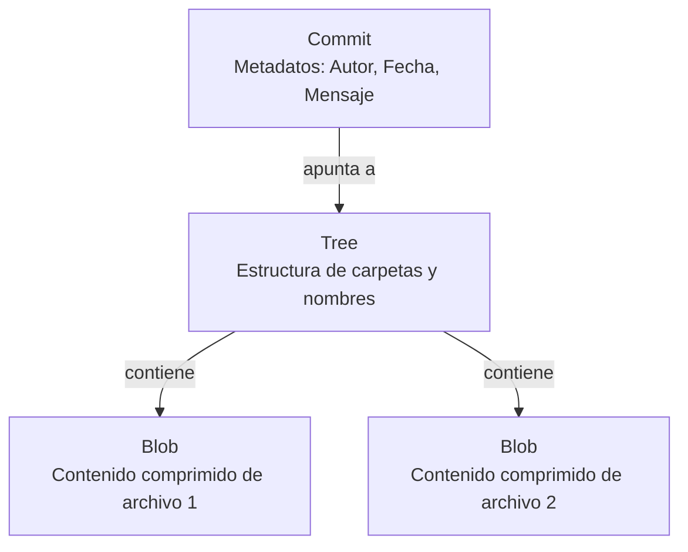

#github #git #control-de-versiones #gh-foundations

> [!info] Navegación
> ◀ [[🎓 Índice - GitHub Foundations]] · ▶ [[D2 - Trabajando con Repositorios]]

---

# Dominio 1 — Introducción a Git y GitHub

## 1.1 Conceptos Base de Git y GitHub

### ¿Qué es el Control de Versiones?

El **control de versiones** es un sistema que registra los cambios realizados en un archivo o conjunto de archivos a lo largo del tiempo, de modo que puedas recuperar versiones específicas más adelante.

Sin control de versiones, si borras o rompes algo, es posible que no haya manera de recuperarlo. Con él, puedes:

- Revertir un archivo o todo el proyecto a un estado anterior.
- Comparar cambios a lo largo del tiempo.
- Ver quién modificó qué y cuándo.
- Trabajar en paralelo con otras personas sin pisarse los cambios.

### Control de Versiones Distribuido (DVCS)

Un **sistema de control de versiones distribuido** (DVCS) como Git hace que cada cliente tenga una copia completa del repositorio (historial incluido), no solo la última versión. Esto significa:

- Si el servidor central falla, cualquier cliente puede restaurarlo.
- Se puede trabajar sin conexión a internet.
- Las operaciones son más rápidas (ocurren localmente).

> [!tip] Centralizado vs. Distribuido
> - **Centralizado (ej. SVN):** Un único servidor central. Si cae, nadie trabaja.
> - **Distribuido (ej. Git):** Cada desarrollador tiene una copia completa. Si cae el servidor, el trabajo puede continuar y restaurarse.

---

### ¿Qué es Git?

**Git** es el sistema de control de versiones distribuido de código abierto más utilizado en el mundo. Fue creado por **Linus Torvalds** en 2005 (el mismo creador de Linux) para gestionar el desarrollo del kernel de Linux.

Git **vive en tu máquina local**. Es la herramienta de línea de comandos que rastrea los cambios en tus archivos.

### ¿Qué es GitHub?

**GitHub** es una **plataforma de alojamiento en la nube** para repositorios Git. Añade sobre Git:

- Una interfaz web visual para gestionar repositorios.
- Herramientas de colaboración (Issues, Pull Requests, Discussions).
- Automatización (GitHub Actions).
- Gestión de proyectos integrada.

### La Diferencia Clave: Git vs. GitHub

| | Git | GitHub |
| :--- | :--- | :--- |
| **¿Qué es?** | Herramienta de control de versiones | Plataforma de alojamiento para proyectos Git |
| **¿Dónde vive?** | En tu ordenador (local) | En la nube (internet) |
| **¿Sin internet?** | ✅ Funciona offline | ❌ Requiere conexión |
| **¿Quién lo hace?** | Comunidad Open Source | Microsoft |

---

## 1.2 Conceptos Fundamentales de Git

### Repositorio (Repository / Repo)

Un **repositorio** es el directorio raíz de tu proyecto, más la carpeta oculta `.git/` que contiene todo el historial de cambios. Es la "caja" donde vive tu proyecto versionado.

```bash
git init           # Crea un nuevo repositorio local vacío
git clone <url>    # Clona (descarga) un repositorio remoto completo
```

### Commit

Un **commit** es una foto instantánea del estado de tu proyecto en un momento concreto. Cada commit tiene:

- Un **hash SHA-1** único que lo identifica (ej. `a3f9b2c`).
- Un **mensaje** que describe qué cambios incluye.
- Una referencia al commit anterior (su "padre").

```bash
git add .                        # Prepara los archivos para el commit
git commit -m "Añade formulario de login"   # Crea el commit con un mensaje
```

> [!important] El mensaje del commit importa
> Un buen mensaje de commit debe explicar el **POR QUÉ** del cambio, no solo el qué. Sigue la convención: usa el imperativo en presente: "Añade X", "Corrige Y", "Elimina Z".

### Anatomía Interna de un Commit y el Historial

Para entender realmente Git, es útil saber cómo guarda los datos internamente. Un commit no es solo una "foto", está compuesto por 3 objetos fundamentales:



1. **Commit:** Contiene los metadatos (quién hizo el cambio, cuándo, el mensaje) y un puntero al *Tree* principal.
2. **Tree (Árbol):** Representa la estructura de directorios. Mapea nombres de archivos a los *Blobs* correspondientes.
3. **Blob (Binary Large Object):** Contiene el contenido real del archivo comprimido (el *snapshot* o instantánea), pero **no** su nombre.

> [!info] ¿Por qué Git usa Hashes (SHA-1)?
> Cada objeto en Git (commits, trees, blobs) se identifica unívocamente mediante un **hash criptográfico (SHA-1)**. Git usa hashes en lugar de comparar archivos de texto completos línea por línea porque calcular y comparar un hash de 40 caracteres es **infinitamente más rápido** que leer megabytes de texto. Si el hash de un archivo no cambia, Git sabe al instante que el archivo no ha sido modificado.

### Ver y Filtrar el Historial de Versiones (`git log`)

El comando `git log` muestra el historial cronológico de confirmaciones, empezando por la más reciente. Para repositorios grandes, puedes usar trucos de filtrado avanzado:

- **Limitar el número de resultados:** `git log -N` (ejemplo: `git log -3` muestra solo los últimos 3 commits).
- **Filtrar por archivo específico:** `git log -- nombre_archivo.txt` (muestra solo los commits que modificaron ese archivo).
- **Buscar por autor:** `git log --author="Nombre"`
- **Búsqueda en el mensaje:** `git log --grep="palabra_clave"`

### Branching (Ramas)

Una **rama (branch)** es una línea de desarrollo paralela e independiente. Permite trabajar en nuevas funcionalidades o correcciones sin afectar al código principal (`main`).

```
main:      A --- B --- C
                  \
feature:          D --- E --- F
```

```bash
git branch feature/login    # Crea una rama nueva
git checkout feature/login  # Cambia a esa rama
git checkout -b feature/login  # Crea y cambia en un solo comando
```

### Remote (Repositorio Remoto)

Un **remote** es la versión del repositorio alojada en un servidor (como GitHub). Por convención, el remoto principal se llama `origin`.

```bash
git remote -v               # Lista los remotos configurados
git push origin main        # Sube los commits locales al remoto
git pull origin main        # Descarga y fusiona los cambios del remoto
```

### El GitHub Flow

El **GitHub Flow** es la metodología de trabajo recomendada por GitHub. Es simple y está pensada para entornos de despliegue continuo:

1. **Crea una rama** desde `main` para tu nueva funcionalidad.
2. **Haz commits** con cambios pequeños y descriptivos.
3. **Abre un Pull Request** para iniciar la revisión del código.
4. **Discute y revisa** el código con tu equipo.
5. **Fusiona (merge)** la rama a `main` una vez aprobada.
6. **Despliega** desde `main`.

---

## 1.3 Tipos de Cuentas en GitHub

| Tipo de Cuenta | Descripción |
| :--- | :--- |
| **Personal** | Cuenta individual. Tiene versión gratuita (GitHub Free) y de pago (GitHub Pro). |
| **Organización** | Cuenta colectiva para equipos. Permite gestionar múltiples miembros, permisos y repositorios. |
| **Enterprise** | Para grandes corporaciones. Incluye funcionalidades de seguridad, compliance y SSO avanzado. |

### Planes para Cuentas Personales

- **GitHub Free:** Repositorios ilimitados (públicos y privados), GitHub Actions limitado, colaboradores ilimitados en repos públicos.
- **GitHub Pro:** Incluye todo lo de Free + GitHub Codespaces, Pages avanzado, Insights detallados, PR Reviews en repos privados.

### Despliegue de GitHub Enterprise

- **GitHub Enterprise Cloud (GHEC):** Alojado por GitHub en la nube de Microsoft. Añade SSO con SAML, SCIM, auditorías avanzadas.
- **GitHub Enterprise Server (GHES):** Instancia que tú mismo alojas en tus propios servidores (on-premise). Máximo control sobre los datos.

---

## 1.4 Perfil de Usuario en GitHub

Tu perfil es tu carta de presentación pública. Incluye:

- **Metadata:** Foto, nombre, bio, ubicación, empresa, web.
- **Achievements (Logros):** Insignias que GitHub otorga automáticamente (ej. "Arctic Code Vault Contributor", "Pull Shark").
- **Profile README:** Si creas un repositorio con el mismo nombre que tu usuario y añades un `README.md`, su contenido aparece destacado en tu perfil. Es tu tarjeta de presentación.
- **Repositorios Fijados (Pinned):** Puedes fijar hasta 6 repositorios o gists en tu perfil para destacar tu mejor trabajo.
- **Stars:** Repositorios que has marcado como favoritos.

---

## 1.5 GitHub Markdown

**Markdown** es un lenguaje de marcado ligero que permite dar formato al texto usando caracteres simples. GitHub usa su propio dialecto llamado **GitHub Flavored Markdown (GFM)**.

### Sintaxis Básica

```markdown
# Encabezado 1

## Encabezado 2

**negrita** / *cursiva* / ~~tachado~~

[texto del enlace](https://url.com)


- Lista no ordenada
1. Lista ordenada

`código en línea`

```bloque de código```

> Cita / Blockquote

- [x] Tarea completada
- [ ] Tarea pendiente
```

### Slash Commands (`/`)

En los comentarios de issues y pull requests, puedes escribir `/` para acceder a una lista de comandos rápidos:

- `/code` → Inserta un bloque de código
- `/details` → Inserta un bloque desplegable
- `/table` → Inserta una tabla
- `/tasklist` → Inserta una lista de tareas

---

## 1.6 GitHub Desktop y GitHub Mobile

### GitHub Desktop

- **GitHub Desktop** es una aplicación de escritorio con interfaz gráfica para gestionar repositorios Git.
- **Diferencia con github.com:** Es una app local que funciona sin navegador; gestiona operaciones Git (clone, commit, push) de forma visual sin usar la terminal.
- Ideal para usuarios que prefieren una GUI sobre la CLI.

### GitHub Mobile

- **GitHub Mobile** (iOS y Android) permite gestionar Issues, Pull Requests, notificaciones y revisiones de código desde el móvil.
- Puedes **gestionar tus notificaciones** directamente desde la app: marcar como leídas, filtrar por repositorio, responder a comentarios.
