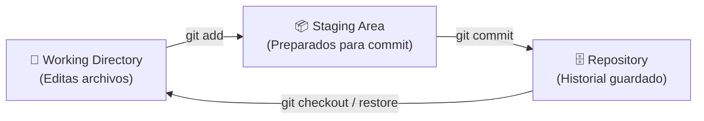
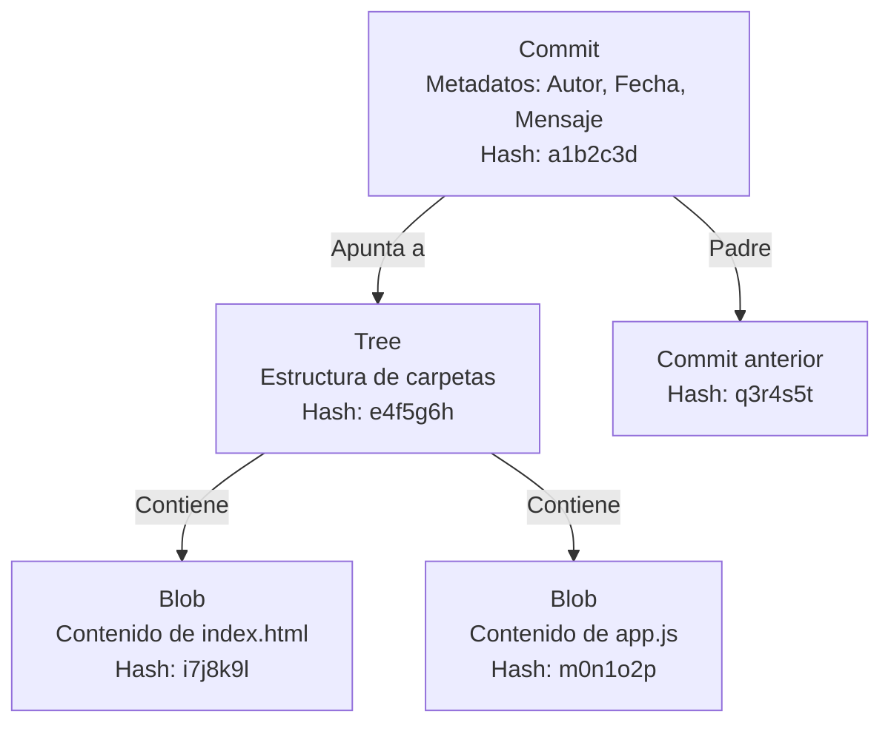

#git #gh-foundations #modulo-1 #arquitectura

> [!info] Navegación
> ◀ [[🎓 Índice Maestro - GitHub Foundations]] · ▶ [[02 - Configuración y Ciclo de Vida Local]]

---

# 01 — Arquitectura Interna y Estados de Git

> **Resumen ejecutivo:**
> 1. [[Git]] es un sistema de **control de versiones distribuido** (DVCS) donde cada copia es un repositorio completo.
> 2. Los archivos pasan por **3 estados**: Working Directory → Staging Area → Repository.
> 3. Internamente, Git almacena datos como objetos (**Blob**, **Tree**, **Commit**) identificados por hashes **SHA-1**.

---

## 1. Control de Versiones: Centralizado vs. Distribuido

El **control de versiones** registra los cambios en archivos a lo largo del tiempo, permitiendo recuperar versiones anteriores, comparar cambios y trabajar en equipo sin conflictos.

| Característica | Centralizado (SVN, TFVC) | Distribuido ([[Git]], Mercurial) |
| :--- | :--- | :--- |
| **Repositorio** | Uno solo, en el servidor central | Cada desarrollador tiene una copia completa |
| **Sin internet** | ❌ No se puede trabajar | ✅ Se trabaja offline con total normalidad |
| **Si cae el servidor** | 🔴 Nadie puede trabajar | 🟢 Cualquier copia puede restaurar el repo |
| **Velocidad** | Lenta (cada operación va al servidor) | Rápida (las operaciones son locales) |

> [!WARNING] Pregunta frecuente de examen
> El examen te puede preguntar **qué tipo de VCS es Git**. La respuesta es siempre: **Distribuido (DVCS)**. Git NO es centralizado, aunque uses GitHub como servidor remoto. El servidor remoto es solo una copia más.

---

## 2. Los 3 Estados de Git

Todo archivo en un repositorio Git se encuentra en uno de estos tres estados:



| Estado | ¿Qué es? | ¿Qué haces aquí? |
| :--- | :--- | :--- |
| **Working Directory** | La carpeta real de tu proyecto. Los archivos que ves y editas. | Escribes código, creas/borras archivos. |
| **Staging Area** (Index) | Una zona intermedia invisible. Contiene lo que irá en el próximo commit. | Seleccionas qué cambios quieres guardar con `git add`. |
| **Repository** (.git/) | La carpeta oculta `.git/` que almacena todo el historial de commits. | Es el historial seguro e inmutable. |

> [!TIP] Exam Tip — Staging Area
> La Staging Area también se llama **Index**. Si el examen menciona "Index", se refiere a la Staging Area. Es el paso intermedio entre editar un archivo y confirmarlo en el historial.

---

## 3. Objetos Internos de Git

Internamente, Git no guarda archivos completos con cada commit. En su lugar, almacena **3 tipos de objetos**:



| Objeto | ¿Qué almacena? | Ejemplo |
| :--- | :--- | :--- |
| **Blob** (Binary Large Object) | El contenido comprimido de un archivo (sin nombre ni ruta). | El texto de `index.html` comprimido. |
| **Tree** (Árbol) | La estructura de directorios: mapea nombres de archivo → Blobs. | `index.html` → Blob `i7j8k9l`, `app.js` → Blob `m0n1o2p`. |
| **Commit** | Metadatos (autor, fecha, mensaje) + puntero al Tree + puntero al commit padre. | "Izan, 21/09/2026, Añade login" → Tree `e4f5g6h`. |

---

## 4. Hashes SHA-1: Identificación Unívoca

Cada objeto en Git se identifica mediante un **hash SHA-1** de 40 caracteres hexadecimales.

```bash
# Ejemplo de hash completo de un commit:
a1b2c3d4e5f6g7h8i9j0k1l2m3n4o5p6q7r8s9t0

# En la práctica, con los primeros 8-10 caracteres es suficiente:
a1b2c3d4e5
```

> [!INFO] ¿Por qué Git usa Hashes en lugar de comparar texto?
> Comparar un hash de 40 caracteres es **instantáneo**. Comparar dos archivos de 10.000 líneas de código requiere leer ambos enteros. Por eso Git puede gestionar repositorios enormes (como el kernel de Linux) con millones de archivos sin ralentizarse. Si el hash no cambia, Git sabe que el archivo es idéntico sin necesidad de abrirlo.

> [!WARNING] Pregunta frecuente de examen
> El examen puede preguntar **cómo identifica Git los cambios**. La respuesta es: mediante **funciones hash criptográficas SHA-1** que generan un identificador único de 40 caracteres para cada objeto (commit, tree, blob).
