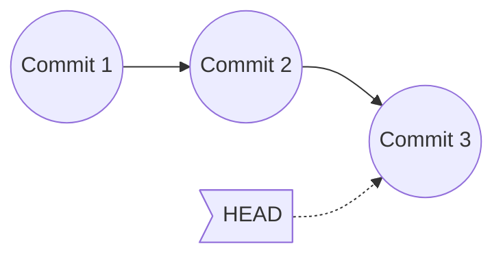
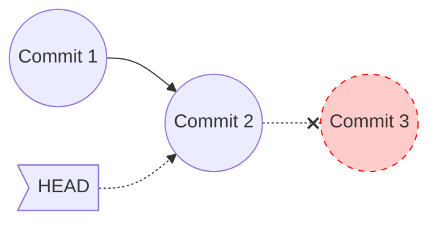

#git #gh-foundations #modulo-1 #revert #reset #stash #reflog #tags

> [!info] Navegación
> ◀ [[03 - Historial y Comparación de Cambios]] · ▶ [[01 - Gestión de Ramas (Branching)]]

---

# 04 — Deshacer Cambios y Recuperación

> **Resumen ejecutivo:**
> 1. `git revert` deshace un commit creando uno nuevo (seguro para repos compartidos). `git reset` reescribe el historial (peligroso).
> 2. `git reflog` es la red de seguridad definitiva: registra TODOS los movimientos de HEAD, incluso tras un `reset --hard`.
> 3. `git stash` guarda temporalmente cambios sin commitear para cambiar de contexto rápidamente.

---

## 1. Restaurar Archivos (`git restore`)

El comando `git restore` tiene dos usos principales dependiendo de si usas la bandera `--staged` o no.

### 1. Descartar cambios por completo (Peligroso)

Si has modificado un archivo y quieres **tirar esos cambios a la basura** (volver a la versión del último commit):

```bash
git restore app.js

# Forma antigua (equivalente)
git checkout -- app.js
```

> [!WARNING] Esto es destructivo
> Los cambios descartados de esta manera **se pierden para siempre**. No hay botón de deshacer.

### 2. Sacar de la caja de Staging (Seguro)

Si ya hiciste `git add app.js` pero te arrepientes y no quieres incluirlo en el próximo commit todavía. Esto **NO borra** tus modificaciones, solo saca el archivo del "área de preparación".

```bash
git restore --staged app.js
```

*(Nota: Esto es idéntico a lo que vimos en el archivo 02, pero es fundamental recordarlo al hablar de deshacer cambios).*

---

## 2. Revertir Confirmaciones de forma segura (`git revert`)

Imagina que subiste a GitHub un commit que rompe la aplicación. ¡No puedes borrarlo porque tus compañeros ya lo han descargado! 

La solución es `git revert`. Este comando **no borra** el commit original. En su lugar, analiza qué sumó ese commit y crea un **NUEVO commit que hace exactamente lo contrario** (resta lo que se sumó, o suma lo que se borró).

**Ejemplo Práctico:**

1. El Commit A añade una línea: `console.log("Hola");`
2. Te das cuenta de que fue un error. Haces un revert del Commit A.
3. Git crea el Commit B, que elimina la línea: `console.log("Hola");`.
4. El historial muestra AMBOS commits: el error (A) y la corrección automática (B).

> [!TIP] ¿Tengo que hacer commit después del revert?
> ¡No! Al ejecutar `git revert`, Git abrirá automáticamente tu editor de texto por defecto con un mensaje autogenerado. **Solo tienes que guardar y cerrar el editor**, y Git completará y guardará el nuevo commit por ti automáticamente.
> - Si se abre **Nano**: Guarda pulsando `Ctrl + O` (luego `Enter`) y sal pulsando `Ctrl + X`.
> - Si se abre **Vim**: Escribe `:wq` y pulsa `Enter`.

```bash
# Revertir el último commit (HEAD)
git revert HEAD

# Revertir un commit específico del pasado usando su hash
git revert 9f8e7d6

# Salida esperada de Git:
# [main 7a8b9c0] Revert "Añade botón roto"
#  1 file changed, 0 insertions(+), 5 deletions(-)
```

```bash
# Revertir pero dejar los cambios inversos en la Staging Area para revisarlos antes de confirmar
git revert HEAD -n
```

---

## 3. Reseteo del Historial (`git reset`) y el Puntero HEAD

Para entender el reset, debes entender qué es **HEAD**. 
Visualmente, imagina una línea de tiempo donde cada círculo es un commit. **HEAD es una flecha o puntero que indica "ESTÁS AQUÍ"**. Normalmente, HEAD apunta al último círculo (el commit más reciente).



Cuando haces `git reset`, estás cogiendo esa flecha (HEAD) y **moviéndola a la fuerza hacia atrás** a un círculo anterior. Los commits que quedan huérfanos por delante desaparecen del historial oficial visible.



¿Pero qué pasa con el código que escribiste en esos commits borrados? `git reset` tiene 3 modos para decidirlo:

| Modo                        | Comando                   | Working Directory |    Staging Area    |   Historial    |
| :-------------------------- | :------------------------ | :---------------: | :----------------: | :------------: |
| **`--soft`**                | `git reset --soft HEAD~1` |     ✅ Intacto     | ✅ Conserva cambios | ❌ Borra commit |
| **`--mixed`** (por defecto) | `git reset HEAD~1`        |     ✅ Intacto     | ❌ Desmarca cambios | ❌ Borra commit |
| **`--hard`**                | `git reset --hard HEAD~1` |  ❌ Borra cambios  |  ❌ Borra cambios   | ❌ Borra commit |

```bash
# Ejemplo: Deshacer el último commit pero conservar los cambios en staging
git reset --soft HEAD~1

# Salida esperada (al hacer git status):
# Changes to be committed:
#   modified:   app.js
```

```bash
# Ejemplo: Deshacer el último commit y desmarcar los cambios
git reset HEAD~1

# Salida esperada:
# Unstaged changes after reset:
# M  app.js
```

```bash
# PELIGRO: Deshacer el último commit y BORRAR todo
git reset --hard HEAD~1

# Salida esperada:
# HEAD is now at 9f8e7d6 Configuración inicial
```

> [!TIP] También puedes viajar hacia ADELANTE
> Si haces `git reset --hard HEAD~1` por error, ¡no entres en pánico! Git nunca borra nada inmediatamente. Usando `git reflog` (que veremos en la siguiente sección) puedes encontrar el hash original del Commit 3 y hacer `git reset --hard <hash_del_commit_3>` para que la flecha de HEAD **vuelva a viajar hacia adelante** y recuperes todo al instante.

> [!IMPORTANT] Diferencia clave para el examen: `revert` vs `reset`
> - **`git revert`**: Crea un commit nuevo que deshace los cambios. El historial **crece**. ✅ Seguro para repos compartidos.
> - **`git reset`**: Borra commits del historial. El historial **retrocede**. ❌ Peligroso en repos compartidos (reescribe la historia de los compañeros).
> 
> **Regla de oro**: Si ya hiciste `git push`, usa `revert`. Si el commit solo existe en tu máquina local, puedes usar `reset`.

---

## 4. Red de Seguridad: `git reflog`

`git reflog` registra **absolutamente todos los movimientos de HEAD**: commits, resets, checkouts, merges, rebases... incluso los que un `git reset --hard` borró del historial visible.

```bash
git reflog

# Salida esperada:
# a1b2c3d (HEAD -> main) HEAD@{0}: reset: moving to HEAD~1
# 7a8b9c0 HEAD@{1}: commit: Añade botón roto
# 9f8e7d6 HEAD@{2}: commit: Configuración inicial
```

### Recuperar un commit "borrado"

Si hiciste `git reset --hard` por accidente y perdiste un commit:

```bash
# 1. Busca el hash del commit perdido en reflog
git reflog

# 2. Recupera el commit apuntando HEAD a ese hash
git reset --hard 7a8b9c0

# Salida esperada:
# HEAD is now at 7a8b9c0 Añade botón roto
# ¡Recuperado! El commit vuelve a existir.
```

> [!TIP] `reflog` es tu seguro de vida
> Mientras no pase mucho tiempo (por defecto Git retiene entradas en reflog durante 90 días), puedes recuperar cualquier cosa con `reflog`. Es la herramienta que te salva de los desastres con `reset --hard`.

---

## 5. Almacenamiento Temporal (`git stash`)

Estás a mitad de programar una función nueva en la rama `feature-x`. Tienes el código a medias. De repente, tu jefe te llama: *"¡Hay un fallo crítico en la rama `main` de producción, arréglalo ya!"*.

No puedes hacer un commit porque tu código está a medias y roto. Tampoco puedes cambiar de rama a `main` porque Git no te dejará saltar con el código incompleto y sin guardar. ¿Qué haces?

Usas `git stash`. Imagina que tu código es un escritorio desordenado. `git stash` coge todo el desorden, lo mete en un cajón (la "pila"), y te deja el escritorio perfectamente limpio. Ahora puedes ir a `main`, arreglar el fallo, volver a tu rama `feature-x`, y "abrir el cajón" (`git stash pop`) para volver a poner el desorden sobre la mesa y seguir programando exactamente donde lo dejaste.

### Comandos de Stash

```bash
# Guardar cambios temporalmente
git stash

# Salida esperada:
# Saved working directory and index state WIP on main: a1b2c3d Añade login
```

```bash
# Ver la lista de stashes guardados
git stash list

# Salida esperada:
# stash@{0}: WIP on main: a1b2c3d Añade login
# stash@{1}: WIP on feature: 9f8e7d6 Bug en CSS
```

```bash
# Recuperar el último stash y borrarlo de la pila
git stash pop

# Salida esperada:
# On branch main
# Changes not staged for commit:
#   modified:   app.js
# Dropped refs/stash@{0} (abc123...)
```

```bash
# Recuperar un stash sin borrarlo de la pila
git stash apply stash@{1}

# Borrar un stash específico
git stash drop stash@{0}

# Borrar TODOS los stashes
git stash clear
```

---

## 6. Etiquetado de Versiones (`git tag`)

Los **tags** marcan commits específicos como puntos importantes (normalmente versiones publicadas como `v1.0.0`).

```bash
# Crear un tag ligero
git tag v1.0.0

# Crear un tag anotado (con mensaje, recomendado)
git tag -a v1.0.0 -m "Primera versión estable"

# Listar todos los tags
git tag

# Salida esperada:
# v0.1.0
# v0.2.0
# v1.0.0
```

```bash
# Subir tags a GitHub
git push origin v1.0.0     # Un tag específico
git push origin --tags      # Todos los tags
```

> [!TIP] Tags y GitHub Releases
> En [[GitHub]], cuando subes un tag, puedes crear un **Release** asociado a él. Los Releases permiten adjuntar binarios descargables (como un `.zip` con el código compilado) y notas de la versión.
