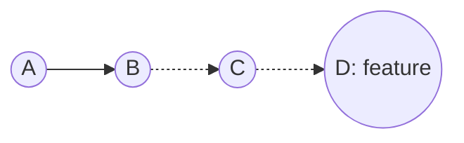
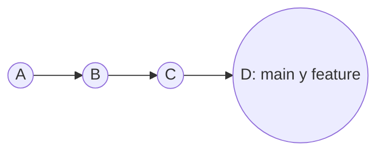
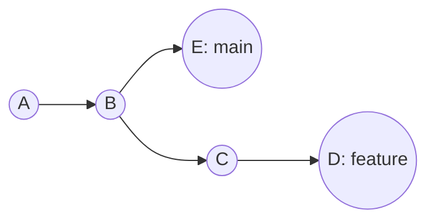
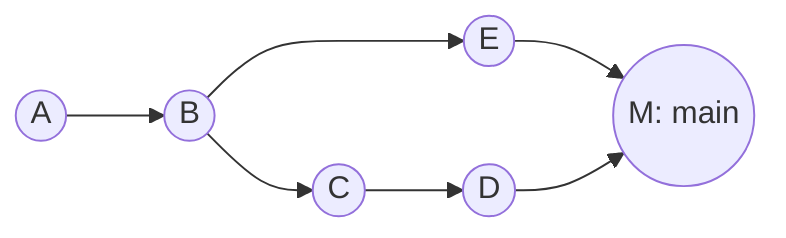

#git #gh-foundations #modulo-2 #merge #conflictos

> [!info] Navegación
> ◀ [[01 - Gestión de Ramas (Branching)]] · ▶ [[03 - Flujos Avanzados (Rebase, Cherry-pick, Flows)]]

---

# 02 — Fusión y Resolución de Conflictos

> **Resumen ejecutivo:**
> 1. `git merge` fusiona una rama en otra. Hay dos estrategias: **Fast-Forward** (sin commit nuevo) y **3-Way Merge** (con commit de merge).
> 2. Los conflictos ocurren cuando ambas ramas modifican las mismas líneas. Se resuelven manualmente editando los marcadores `<<<<<<<`.
> 3. `git merge --abort` cancela una fusión en conflicto y vuelve al estado anterior.

---

## 1. Concepto de Merge

Fusionar (*merge*) significa integrar los cambios de una rama (**source/origen**) en otra (**destination/destino**).

```bash
# Paso 1: Cambia a la rama destino (normalmente main, la que quieres aplicar los cambios)
git switch main

# Paso 2: Fusiona la rama origen (para traspasar los cambios de feature/login a main)
git merge feature/login

# Salida esperada:
# Updating 9f8e7d6..a1b2c3d
# Fast-forward
#  login.html | 10 ++++++++++
#  1 file changed, 10 insertions(+)
```

---

## 2. Estrategias de Fusión

Cuando haces `git merge`, Git analiza la historia y decide automáticamente qué "estrategia" usar para unir los códigos. Principalmente existen dos:

### Estrategia 1: Fast-Forward (Avance Rápido)

* **¿Qué es?** Es la fusión más simple. No hay cruce de ramas, solo una línea recta.

* **¿Cuándo se usa?** Ocurre cuando nadie más ha tocado la rama destino (`main`) mientras tú trabajabas en tu rama (`feature`). Como `main` se quedó "congelada" en el pasado, Git no tiene que mezclar nada; simplemente coge la etiqueta de `main` y la "avanza rápido" (Fast-Forward) hasta donde estás tú.

* **¿Cómo se hace?** Simplemente haciendo `git merge feature`. Al hacerlo, **NO se crea un commit nuevo de merge**. El historial queda como una línea recta perfecta.


*(Arriba: Estado antes del merge. Abajo: Tras el Fast-Forward, main simplemente se desliza hasta la última posición)*


> [!TIP] Forzar un commit de merge
> A veces, aunque puedas hacer Fast-Forward, prefieres crear un commit explícito para que quede constancia visual de que esa funcionalidad se hizo en una rama separada. Para forzar la creación del commit usa: `git merge feature --no-ff` (no fast-forward).

### Estrategia 2: 3-Way Merge (Merge a 3 bandas)

* **¿Qué es?** Es una fusión real donde dos líneas temporales distintas se unen creando un nuevo **Commit de Merge** que actúa como "nudo" uniendo a dos padres.

* **¿Cuándo se usa?** Ocurre cuando **ambas ramas han avanzado**. Ejemplo: Tú creas la rama `feature` y trabajas en ella, pero mientras tanto, un compañero sube cambios nuevos directamente a `main`. Ahora ambas ramas han divergido por caminos separados.

* **¿Por qué se llama a "3 bandas"?** Porque para juntar tu código y el de tu compañero de forma inteligente, Git necesita comparar 3 puntos: (1) El último commit de tu rama, (2) el último de la rama `main`, y (3) el "ancestro común" (el commit desde el que os separasteis).

* **¿Cómo se hace?** Igual, ejecutando `git merge feature`. Como Git detecta que ambas han avanzado, te abrirá el editor de texto pidiéndote guardar un mensaje para el nuevo "Commit de Merge".


*(Arriba: Las ramas han divergido. Abajo: 3-Way Merge creando el commit "M" que actúa como nudo)*


| Estrategia | ¿Cuándo ocurre? | ¿Crea commit de merge? | Forma del Historial |
| :--- | :--- | :---: | :--- |
| **Fast-Forward** | `main` se quedó congelada, no tiene commits nuevos | ❌ No | Lineal (una sola línea recta) |
| **3-Way Merge** | Ambas ramas avanzaron por caminos separados | ✅ Sí | Ramificado (crea un nudo) |

---

## 3. Conflictos de Fusión

Los conflictos ocurren cuando **ambas ramas han modificado las mismas líneas** del mismo archivo. Git no puede decidir automáticamente cuál versión conservar.

### Marcadores de conflicto

Al intentar el merge, Git marca los archivos conflictivos con esta estructura:

```
<<<<<<< HEAD
<p>Versión en main: Precio 10€</p>
=======
<p>Versión en feature: Precio 15€</p>
>>>>>>> feature/precios
```

| Marcador | Significado |
| :--- | :--- |
| `<<<<<<< HEAD` | Inicio del bloque con **tu versión** (la rama actual, destino) |
| `=======` | Separador entre ambas versiones |
| `>>>>>>> feature/precios` | Fin del bloque con la **versión de la otra rama** (origen) |

### Flujo de resolución manual

```bash
# 1. Intenta el merge
git merge feature/precios

# Salida esperada (conflicto):
# Auto-merging index.html
# CONFLICT (content): Merge conflict in index.html
# Automatic merge failed; fix conflicts and then commit the result.
```

```bash
# 2. Abre el archivo conflictivo y edita manualmente.
#    Elige la versión correcta y borra los marcadores:

# ANTES (conflicto):
<<<<<<< HEAD
<p>Precio 10€</p>
=======
<p>Precio 15€</p>
>>>>>>> feature/precios

# DESPUÉS (resuelto):
<p>Precio 15€</p>
```

```bash
# 3. Marca el conflicto como resuelto
git add index.html
```

```bash
Una vez que has arreglado los archivos conflictivos y les has hecho `git add`, tienes que avisar a Git de que has terminado para que cierre el proceso y cree el commit de merge.

# Opción semántica recomendada:
git merge --continue

# Opción clásica (hace exactamente lo mismo):
git commit
```

*(Ambos comandos abrirán tu editor de texto para que simplemente guardes y cierres el mensaje autogenerado).*

### El Botón de Pánico (`--abort`)

A veces haces un merge y te encuentras con 20 archivos llenos de conflictos. Te agobias, no sabes qué versión elegir, o te das cuenta de que estabas mezclando la rama equivocada. Para eso existe el **botón de pánico**:

```bash
git merge --abort
```

* **¿Qué hace?** Cancela todo el proceso de fusión al instante.

* **¿Qué pasa con tus archivos?** Git borra todos los marcadores `<<<<<<<` y devuelve todos tus archivos exactamente al estado en el que estaban un segundo antes de que escribieras el comando `git merge`. Estarás a salvo.

> [!IMPORTANT] Exam Tip — Resolución de conflictos
> El examen puede preguntar cuál es el flujo correcto para resolver un conflicto:
> 1. Editar el archivo eliminando los marcadores `<<<<<<<`, `=======`, `>>>>>>>`
> 2. `git add <archivo>` para marcar como resuelto
> 3. `git commit` o `git merge --continue` para finalizar
