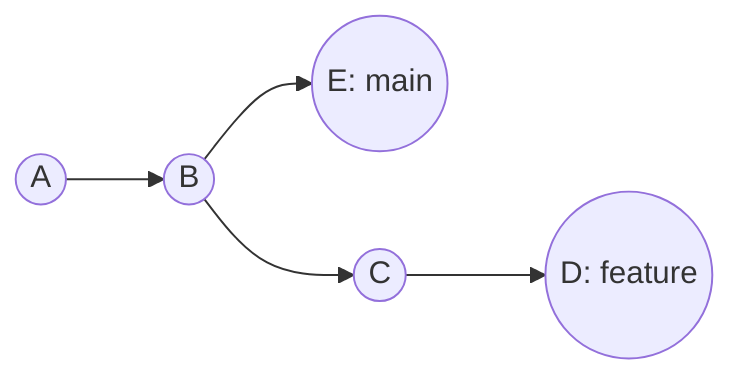
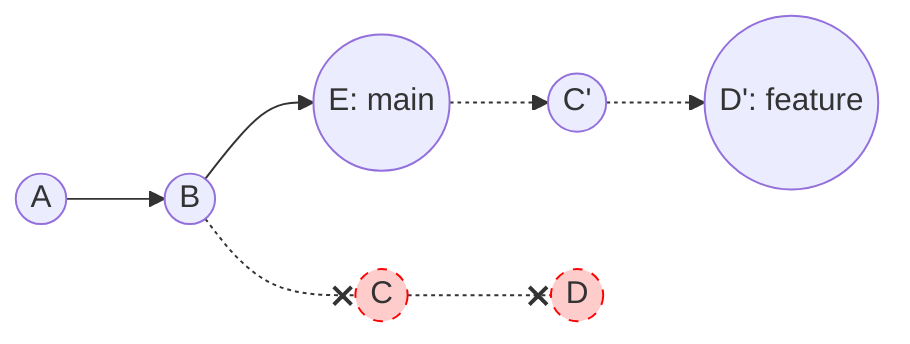
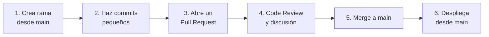

#git #gh-foundations #modulo-2 #rebase #cherry-pick #github-flow #gitflow

> [!info] Navegación
> ◀ [[02 - Fusión y Resolución de Conflictos]] · ▶ [[01 - Ecosistema y Productos]]

---

# 03 — Flujos Avanzados (Rebase, Cherry-pick, Flows)

> **Resumen ejecutivo:**
> 1. `git rebase` reescribe el historial para hacerlo lineal. Es potente pero peligroso en repos compartidos.
> 2. `git cherry-pick` extrae un commit de una rama y lo aplica en otra quirúrgicamente.
> 3. **GitHub Flow** (simple, basado en PRs) vs **GitFlow** (complejo, con ramas `develop`, `release`, `hotfix`).

---

## 1. Reescribir la historia (`git rebase`)

Imagina que estás escribiendo un capítulo extra para un libro (tu rama `feature`) basándote en la 2ª edición de ese libro (tu `main`). Mientras escribes, la editorial saca la 3ª edición en `main` con cambios importantes. 
Puedes hacer un **Merge** (que crea un nudo extraño en el historial para juntar ambas versiones), o puedes hacer un **Rebase**.

Con el **Rebase**, Git pone temporalmente tus apuntes a un lado, actualiza tu base a la 3ª edición (`main` actual), y luego vuelve a aplicar tus apuntes uno por uno encima. **El resultado es como si hubieses empezado a trabajar desde el principio usando la 3ª edición.**

* **¿Qué hace exactamente?** "Desconecta" los commits de tu rama, busca la punta más reciente de la rama principal, y los "reaplica" ahí.

* **El resultado:** Un historial **perfectamente lineal** (una sola línea recta sin nudos ni commits de merge).


*(Arriba: Estado original. Tú empezaste feature desde el commit B, pero main avanzó hasta E)*

*(Abajo: Tras el rebase, Git borra tus antiguos C y D, y crea "copias" exactas (C' y D') enganchadas a E)*

```bash
# 1. Vas a tu rama desactualizada
git switch feature/login

# 2. Le dices a Git que quieres re-basarla sobre los últimos cambios de main
git rebase main

# Salida esperada:
# Successfully rebased and updated refs/heads/feature/login.
```

### Conflictos durante el Rebase

Si al intentar "reaplicar" tus commits Git detecta que la rama `main` modificó exactamente la misma línea que tú modificaste en tu rama, se detendrá y te dará un **error por conflicto**.

El proceso para resolver un conflicto en rebase es muy similar al de un merge:

1. Git pausa el rebase en el commit problemático.

2. Abres el archivo con tu editor y resuelves el conflicto borrando los marcadores `<<<<<<<` (dejando la versión final correcta).

3. Marcas el archivo como resuelto:

   ```bash
   git add archivo_resuelto.js
   ```
   
4. **Le dices a Git que continúe con el proceso** (NO uses `git commit` aquí):

   ```bash
   git rebase --continue
   ```
   
5. *(El Botón de pánico)* Si te agobias y quieres cancelar todo el rebase para volver a como estabas antes de empezar:

   ```bash
   git rebase --abort
   ```

> [!WARNING] Regla de oro del Rebase
> **NUNCA hagas rebase de commits que ya hayas subido (`push`) a GitHub**. El rebase reescribe los hashes de los commits, lo que destruye el historial compartido y causa problemas graves a tus compañeros. Úsalo solo en ramas locales privadas.

| Operación | Historial | ¿Seguro en repos compartidos? | Uso ideal |
| :--- | :--- | :---: | :--- |
| `git merge` | No lineal (conserva la bifurcación) | ✅ Sí | Siempre seguro |
| `git rebase` | Lineal (limpio, sin bifurcaciones) | ❌ Solo en ramas locales | Limpiar historial antes de un PR |

---

## 2. Extracción Quirúrgica de Commits (`git cherry-pick`)

`git cherry-pick` copia un commit específico de cualquier rama y lo aplica en la rama actual, sin fusionar toda la rama.

```bash
# Desde main, aplica un commit específico de otra rama
git switch main
git cherry-pick e5f6g7h

# Salida esperada:
# [main 1a2b3c4] Fix critical bug in login
#  Date: Sun Sep 21 19:00:00 2026 +0200
#  1 file changed, 2 insertions(+), 2 deletions(-)
```

**Caso de uso real:** Un compañero ha corregido un bug crítico en la rama `feature/redesign` que aún no está lista para fusionar. Necesitas ese fix en `main` ahora. Haces `cherry-pick` solo de ese commit.

---

## 3. Flujos de Trabajo Organizacionales

### GitHub Flow (Recomendado para la mayoría de equipos)

Es el flujo que promueve GitHub. Es **simple y directo**:



**Reglas:**

- Solo existe la rama `main` como rama permanente.
- Para cada funcionalidad o fix, se crea una rama corta.
- Se abre un PR, se revisa, se fusiona y se borra la rama.

### GitFlow (Para proyectos con ciclos de release formales)

Es un flujo más complejo, ideal para software con versiones publicadas (apps móviles, etc.):

| Rama | Propósito | Permanente |
| :--- | :--- | :---: |
| `main` | Código en producción. Cada commit es una versión publicada. | ✅ |
| `develop` | Rama de integración donde se acumulan los cambios para la próxima versión. | ✅ |
| `feature/*` | Ramas de funcionalidad. Nacen de `develop`, se fusionan a `develop`. | ❌ |
| `release/*` | Preparación de una versión. Bug fixes de última hora antes de publicar. | ❌ |
| `hotfix/*` | Parches urgentes en producción. Nacen de `main`, se fusionan a `main` Y `develop`. | ❌ |

> [!TIP] Exam Tip — ¿Cuál pregunta el examen?
> El examen se centra en **GitHub Flow**, no en GitFlow. Debes saber los 6 pasos del GitHub Flow de memoria. GitFlow puede salir como comparación, pero no profundizan en él.
