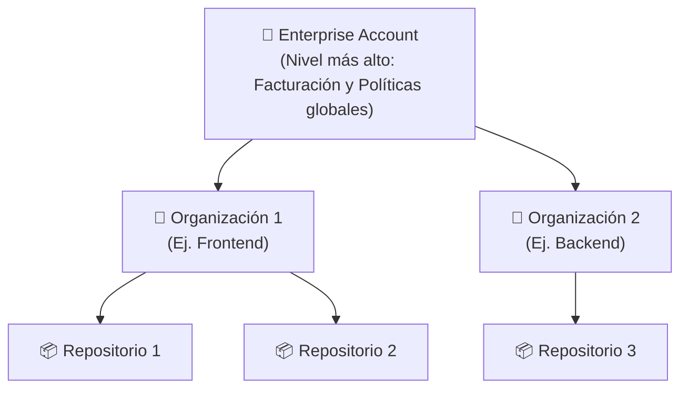

#github #gh-foundations #modulo-3 #productos #planes

> [!info] Navegación
> ◀ [[03 - Flujos Avanzados (Rebase, Cherry-pick, Flows)]] · ▶ [[02 - Estructura Organizativa y Permisos]]

---

# 01 — Ecosistema y Productos de GitHub

> **Resumen ejecutivo:**
> 1. [[Git]] es el motor local. [[GitHub]] es la plataforma SaaS en la nube construida sobre Git.
> 2. Hay 4 planes principales: **Free**, **Pro**, **Team** y **Enterprise** (Cloud o Server).
> 3. Las **EMU (Enterprise Managed Users)** son cuentas controladas totalmente por la empresa.

---

## 1. Arquitectura de Cuentas (Enterprise)

En implementaciones a gran escala, GitHub utiliza una estructura jerárquica para facilitar la administración y facturación unificadas:



## 2. Git vs. GitHub

| | [[Git]] | [[GitHub]] |
| :--- | :--- | :--- |
| **¿Qué es?** | Motor de control de versiones | Plataforma SaaS de alojamiento y colaboración |
| **¿Dónde vive?** | En tu máquina local | En la nube (servidores de Microsoft) |
| **¿Sin internet?** | ✅ Funciona completamente offline | ❌ Requiere conexión |
| **¿Quién lo hace?** | Comunidad Open Source (Linus Torvalds) | Microsoft (adquirido en 2018) |
| **Funcionalidades** | Commits, branches, merges, diffs | Issues, PRs, Actions, Copilot, Projects, Pages |

---

## 2. Planes de GitHub

### Planes Individuales

| Característica | GitHub Free | GitHub Pro |
| :--- | :--- | :--- |
| **Precio** | Gratis | ~4 $/mes |
| **Repos públicos/privados** | ✅ Ilimitados | ✅ Ilimitados |
| **Colaboradores en repos privados** | ✅ Ilimitados | ✅ Ilimitados |
| **GitHub Actions** | 2.000 min/mes | 3.000 min/mes |
| **GitHub Codespaces** | 120 horas core/mes | 180 horas core/mes |
| **GitHub Pages** | ✅ Repos públicos | ✅ Repos públicos y privados |
| **Insights avanzados** | ❌ | ✅ |
| **Revisores obligatorios en repos privados** | ❌ | ✅ |

### Planes para Organizaciones y Empresas

| Característica | GitHub Team | GitHub Enterprise |
| :--- | :--- | :--- |
| **Precio** | ~4 $/usuario/mes | ~21 $/usuario/mes |
| **Branch Protection Rules** | ✅ | ✅ Avanzadas |
| **Equipos (Teams)** | ✅ | ✅ + Team Sync con IdP |
| **SAML SSO** | ❌ | ✅ |
| **Enterprise Managed Users (EMU)** | ❌ | ✅ |
| **Auditoría avanzada** | ❌ | ✅ |
| **SLA** | ❌ | ✅ 99.9% |

### Despliegue Enterprise

| | Enterprise Cloud (GHEC) | Enterprise Server (GHES) |
| :--- | :--- | :--- |
| **Alojamiento** | Microsoft Azure (nube) | Tus propios servidores (on-premise) |
| **Mantenimiento** | GitHub se encarga | Tú te encargas |
| **Actualizaciones** | Automáticas | Manuales |
| **Caso de uso** | Empresas cloud-first | Sectores regulados (banca, gobierno, defensa) |

> [!WARNING] Pregunta frecuente de examen
> **EMU (Enterprise Managed Users):** Son cuentas de GitHub controladas *totalmente* por la empresa a través de un proveedor de identidad (IdP) corporativo, sin perfiles personales asociados. A diferencia de las cuentas personales normales, las cuentas EMU **no pueden contribuir a repositorios públicos fuera de la empresa**. Cuando el empleado deja la empresa, se desprovisiona automáticamente.

---

## 3. Herramientas Complementarias

### GitHub Desktop

Aplicación de escritorio (Windows/Mac) con interfaz gráfica para gestionar repositorios Git sin usar la terminal.

- **Diferencia con github.com:** GitHub Desktop es una app local. `github.com` es la web.
- **Ideal para:** Usuarios que prefieren una GUI sobre la CLI.

### GitHub Mobile

App móvil (iOS/Android) para gestionar Issues, Pull Requests, notificaciones y revisiones de código desde el teléfono.

- Puedes aprobar PRs, responder a comentarios y gestionar notificaciones.
- NO sirve para hacer commits o editar código.

### GitHub CLI (`gh`)

Herramienta de línea de comandos oficial de GitHub para interactuar con la plataforma desde la terminal:

```bash
# Crear un PR desde la terminal
gh pr create --title "Añade login" --body "Descripción del PR"

# Listar issues abiertos
gh issue list

# Clonar un repositorio
gh repo clone usuario/repositorio
```

> [!TIP] Exam Tip — GitHub CLI
> El examen puede preguntar sobre la herramienta `gh`. Recuerda: `gh` es la CLI de **GitHub** (la plataforma), no de Git. Git tiene su propia CLI (`git`). Son cosas distintas.
