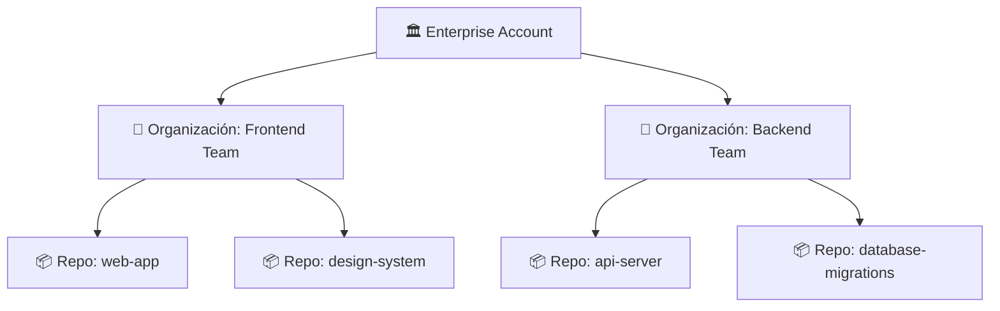

#github #gh-foundations #modulo-3 #organizaciones #permisos #roles

> [!info] Navegación
> ◀ [[01 - Ecosistema y Productos]] · ▶ [[03 - Equipos, Facturación y Sincronización]]

---

# 02 — Estructura Organizativa y Permisos

> **Resumen ejecutivo:**
> 1. GitHub tiene 3 niveles de cuentas: **Personal**, **Organización** y **Enterprise**.
> 2. Los roles a nivel de organización son: Owner, Member, Outside Collaborator y roles especializados.
> 3. Los permisos de repositorio van de **Read** (solo lectura) a **Admin** (control total) en 5 niveles.

---

## 1. Tipos de Cuentas

| Tipo | Descripción | Ejemplo |
| :--- | :--- | :--- |
| **Personal** | Cuenta individual de un usuario | `@izanm` |
| **Organización** | Cuenta colectiva para equipos y empresas | `@my-company` |
| **Enterprise** | Agrupa múltiples organizaciones bajo una sola facturación y políticas de seguridad | `enterprise.github.com/my-corp` |

---

## 2. Roles a Nivel de Organización

| Rol | Permisos | Caso de uso |
| :--- | :--- | :--- |
| **Owner** | Control total: gestión de miembros, facturación, seguridad, repos. | CTO, Tech Lead, Responsable de la org. |
| **Member** | Acceso estándar según los permisos asignados a sus equipos. | Desarrolladores del día a día. |
| **Outside Collaborator** | Acceso limitado a repositorios específicos. No es miembro de la org. | Freelance, consultor externo, auditor. |
| **Billing Manager** | Solo gestión de facturación. Sin acceso a código ni configuración. | Departamento de finanzas. |
| **Security Manager** | Acceso a alertas de seguridad y configuración de seguridad. Sin acceso a código. | Equipo de ciberseguridad. |
| **Moderator** | Gestión de comentarios, discusiones y comunidad. | Community Manager. |

> [!WARNING] Pregunta frecuente de examen
> El examen puede preguntar qué rol necesita alguien para **cambiar la visibilidad de un repositorio** o **borrar una organización**. La respuesta siempre es **Owner**. Ningún otro rol tiene permisos tan destructivos.

---

## 3. Permisos a Nivel de Repositorio

Cada usuario o equipo puede tener un nivel de permiso diferente para cada repositorio:

| Nivel | ¿Qué puede hacer? |
| :--- | :--- |
| **Read** | Clonar y ver el código, crear issues, comentar. No puede hacer push. |
| **Triage** | Todo lo de Read + gestionar issues y PRs (etiquetar, asignar, cerrar). No puede hacer push. |
| **Write** | Todo lo de Triage + hacer push de código, crear ramas, merge de PRs. |
| **Maintain** | Todo lo de Write + gestionar configuración del repo (excepto acciones destructivas). |
| **Admin** | Control total del repositorio: borrar repo, cambiar visibilidad, gestionar webhooks. |

> [!TIP] Exam Tip — Permisos Base (Base Permissions)
> La organización puede definir un **permiso base** que se aplica a todos los miembros para todos los repositorios. Por defecto es `Read`. Esto se puede cambiar en `Settings > Member privileges > Base permissions`. Los equipos pueden tener permisos más altos que el base, pero nunca más bajos.

---

## 4. Perfil de Usuario en GitHub

Tu perfil es tu carta de presentación pública:

| Elemento | Descripción |
| :--- | :--- |
| **Metadata** | Foto, nombre, bio, ubicación, empresa, web personal. |
| **Achievements** | Insignias automáticas: "Arctic Code Vault Contributor", "Pull Shark", "Galaxy Brain". |
| **Profile README** | Si creas un repo con tu username (ej. `izanm/izanm`) y añades un `README.md`, su contenido aparece en tu perfil. |
| **Pinned Repos** | Hasta 6 repositorios/gists fijados para destacar tu mejor trabajo. |
| **Stars** | Repos que has marcado como favoritos. |
| **Contribution Graph** | El famoso cuadro verde que muestra tu actividad de commits. |
