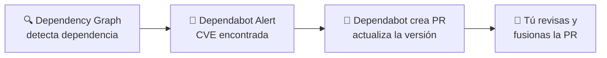

#github #gh-foundations #modulo-4 #dependabot #dependency-graph #seguridad

> [!info] Navegación
> ◀ [[01 - Autenticación (2FA, SSH, PAT, SSO)]] · ▶ [[03 - Secret Scanning y Políticas]]

---

# 02 — Dependencias y Dependabot

> **Resumen ejecutivo:**
> 1. El **Dependency Graph** muestra todas las dependencias de tu proyecto y sus versiones.
> 2. **Dependabot Alerts** te avisa cuando una dependencia tiene una vulnerabilidad conocida (CVE).
> 3. **Dependabot Security Updates** crea PRs automáticas que actualizan la dependencia vulnerable.

---

## 1. Dependency Graph (Gráfico de Dependencias)

El **Dependency Graph** analiza automáticamente los archivos de manifiesto de tu repositorio y muestra un mapa completo de todas las librerías de las que depende tu proyecto.

**Archivos que analiza:**

| Lenguaje | Archivo de manifiesto |
| :--- | :--- |
| JavaScript/Node.js | `package.json`, `package-lock.json` |
| Python | `requirements.txt`, `setup.py`, `Pipfile` |
| Java | `pom.xml` (Maven), `build.gradle` |
| Ruby | `Gemfile`, `Gemfile.lock` |
| .NET | `*.csproj`, `packages.config` |
| Go | `go.mod` |

**Dónde verlo:** Pestaña `Insights > Dependency Graph` del repositorio.

---

## 2. Dependabot Alerts

Cuando el Dependency Graph detecta que una de tus dependencias tiene una **vulnerabilidad conocida** (CVE publicada en la base de datos GitHub Advisory), genera una **alerta de Dependabot**.

La alerta incluye:

- Qué dependencia está afectada y su versión.
- Severidad de la vulnerabilidad (Low, Moderate, High, Critical).
- Descripción de la vulnerabilidad y su CVE.
- Versión recomendada para corregirla.

**Dónde verlas:** Pestaña `Security > Dependabot alerts`.

> [!WARNING] Pregunta frecuente de examen
> Las Dependabot Alerts están **activadas por defecto** en repositorios públicos. En repositorios privados, el administrador debe activarlas manualmente en `Settings > Code security and analysis`.

---

## 3. Dependabot Security Updates

Las **Security Updates** van un paso más allá de las alertas: Dependabot **crea automáticamente un Pull Request** que actualiza la dependencia vulnerable a una versión parcheada.

### Flujo automático



### Dependabot Version Updates

Además de las actualizaciones de seguridad, Dependabot puede mantener tus dependencias **siempre actualizadas** (incluso sin CVEs). Se configura con un archivo en tu repositorio:

```yaml
# .github/dependabot.yml
version: 2
updates:
  - package-ecosystem: "npm"
    directory: "/"
    schedule:
      interval: "weekly"
```

| Tipo | ¿Qué hace? | ¿Cuándo actúa? |
| :--- | :--- | :--- |
| **Security Updates** | Parchea vulnerabilidades conocidas | Cuando se publica un CVE |
| **Version Updates** | Actualiza dependencias a la última versión | Según el intervalo configurado (daily, weekly, monthly) |

> [!TIP] Exam Tip
> El examen puede preguntar la diferencia entre **Dependabot Alerts** (solo te avisa) y **Dependabot Security Updates** (crea PRs automáticas). Una es pasiva, la otra es activa.
