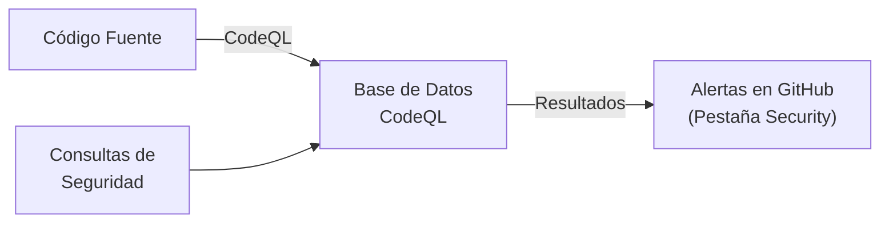

#github #gh-foundations #modulo-4 #ghas #codeql #sarif #code-scanning

> [!info] Navegación
> ◀ [[03 - Secret Scanning y Políticas]] · ▶ [[01 - Repositorios y Documentación]]

---

# 04 — Code Scanning y CodeQL (GHAS)

> **Resumen ejecutivo:**
> 1. **Code Scanning** busca vulnerabilidades en el código fuente (SAST) antes de que lleguen a producción.
> 2. **CodeQL** es el motor de análisis semántico nativo de GitHub que trata el código como una base de datos.
> 3. Puedes integrar herramientas de terceros subiendo los resultados en formato **SARIF v2.1.0**.

---

## 1. GitHub Advanced Security (GHAS)

**GitHub Advanced Security** es un conjunto de funcionalidades avanzadas de seguridad.

| Funcionalidad | ¿Qué hace? |
| :--- | :--- |
| **Code Scanning** | Análisis estático de código (SAST) para buscar vulnerabilidades. |
| **Secret Scanning (Avanzado)** | Detección de secretos con *Push Protection* y Custom Patterns. |
| **Dependency Review** | Analiza el impacto en la seguridad al añadir nuevas dependencias en un PR. |

> [!TIP] Disponibilidad de GHAS
> Las funciones de GHAS son **gratuitas para repositorios públicos**. Para repositorios privados, requieren una licencia adicional de **GitHub Enterprise**.

---

## 2. Code Scanning con CodeQL

**Code Scanning** analiza tu código en busca de errores y vulnerabilidades (como Inyección SQL, Cross-Site Scripting, etc.).

El motor principal detrás del Code Scanning nativo de GitHub es **CodeQL**.

### ¿Cómo funciona CodeQL?

1. **Extracción:** CodeQL compila tu código y lo convierte en una base de datos relacional.
2. **Análisis:** Ejecuta consultas (*queries*) sobre esa base de datos buscando patrones de vulnerabilidades.
3. **Reporte:** Los resultados aparecen en la pestaña **Security** del repositorio y directamente en las Pull Requests.



> [!WARNING] Pregunta frecuente de examen
> CodeQL es una herramienta **SAST** (Static Application Security Testing). Analiza el código *sin* ejecutar la aplicación.

---

## 3. Integración de Herramientas de Terceros (SARIF)

Si tu empresa ya utiliza otros escáneres de seguridad (como SonarQube, Checkmarx o Snyk), puedes integrarlos en GitHub Code Scanning.

### El formato SARIF

Para que GitHub entienda los resultados de otras herramientas, estas deben exportar un archivo en formato **SARIF** (*Static Analysis Results Interchange Format*).

- GitHub solo soporta la versión **SARIF v2.1.0**.
- Al subir un archivo SARIF, las alertas de terceros aparecen en la interfaz nativa de GitHub igual que si las hubiera generado CodeQL.

### Cómo subir archivos SARIF

Existen tres formas principales de subir resultados SARIF a GitHub:

1. **GitHub Actions:** Usando la acción `codeql-action/upload-sarif` en tu flujo de trabajo de CI/CD.
2. **CodeQL CLI:** Ejecutando el comando desde la terminal local o un servidor externo.
3. **API de Code Scanning:** Haciendo una petición REST para automatizaciones personalizadas.

```yaml
# Ejemplo de workflow subiendo un archivo SARIF
steps:
  - name: Subir resultados de escáner externo
    uses: github/codeql-action/upload-sarif@v3
    with:
      sarif_file: resultados_seguridad.sarif
```
