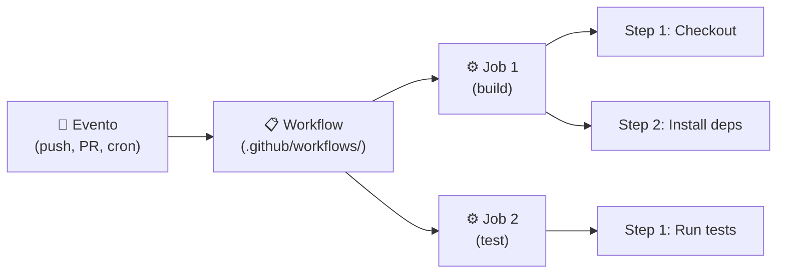

#github #gh-foundations #modulo-6 #actions #cicd #yaml #workflows

> [!info] Navegación
> ◀ [[01 - GitHub Projects y Visualización]] · ▶ [[03 - GitHub Pages y Codespaces]]

---

# 02 — GitHub Actions (CI/CD)

> **Resumen ejecutivo:**
> 1. **GitHub Actions** automatiza flujos de trabajo (CI/CD) mediante archivos YAML en `.github/workflows/`.
> 2. Un workflow tiene: **Evento** (trigger) → **Jobs** → **Steps** → **Actions** reutilizables.
> 3. El **Marketplace** contiene miles de Actions pre-creadas por la comunidad.

---

## 0. DevOps y CI/CD — El Por Qué

Antes de entender cómo funciona GitHub Actions, hay que entender **para qué** sirve.

### ¿Qué es DevOps?

**DevOps** es una filosofía de trabajo que une a los equipos de **Desarrollo** (Dev) y de **Operaciones** (Ops) que antes trabajaban por separado. La idea es que el mismo equipo que escribe el código también se encarga de desplegarlo y mantenerlo en producción.

### Las 3 fases del CI/CD

```
DEV  →  [CI] Build + Test  →  [CD] Entrega  →  [CD] Despliegue  →  PROD
```

| Fase | Nombre completo | ¿Qué hace? | ¿Automático? |
|:---|:---|:---|:---:|
| **CI** | Continuous Integration (Integración Continua) | Cada vez que un developer sube código, se compila y se ejecutan los tests automáticamente | ✅ Siempre |
| **CD** | Continuous Delivery (Entrega Continua) | El código aprobado se empaqueta y deja listo para desplegar, pero **alguien pulsa el botón** | ❌ Solo el último paso |
| **CD** | Continuous Deployment (Despliegue Continuo) | Si todos los tests pasan, el código llega a producción **completamente solo**, sin intervención humana | ✅ Siempre |

> [!IMPORTANT] Exam Tip — Delivery vs Deployment
> Esta distinción es una trampa clásica del examen:
> - **Continuous Delivery** = El proceso es automático PERO alguien tiene que aprobar el despliegue final a producción manualmente.
> - **Continuous Deployment** = El proceso es completamente automático de principio a fin. Si los tests pasan, se despliega solo.

**Analogía:** 
Imagínate una fábrica de coches.
- **CI** es la cadena de montaje: cada pieza que entra se inspecciona automáticamente.
- **Continuous Delivery** es tener el coche terminado, inspeccionado y en el concesionario, esperando que el director firme el pedido para entregarlo.
- **Continuous Deployment** es que el coche sale de la fábrica y llega al cliente directamente sin que nadie firme nada.

---

## 1. Conceptos Clave

| Concepto | Descripción |
| :--- | :--- |
| **Workflow** | Proceso automatizado completo. Se define en un archivo YAML. |
| **Event** | Lo que dispara el workflow (push, PR, schedule, manual). |
| **Job** | Un conjunto de steps que se ejecutan en un mismo runner. |
| **Step** | Una tarea individual dentro de un job. |
| **Action** | Componente reutilizable (tuyo o de terceros). |
| **Runner** | La máquina virtual donde se ejecuta el job (Ubuntu, Windows, macOS). |



---

## 2. Estructura de un Workflow YAML

```yaml
# .github/workflows/ci.yml
name: CI Pipeline

# 1. EVENTO: ¿Cuándo se ejecuta?
on:
  push:
    branches: [main]
  pull_request:
    branches: [main]

# 2. JOBS: ¿Qué trabajos se ejecutan?
jobs:
  build:
    # 3. RUNNER: ¿En qué máquina?
    runs-on: ubuntu-latest

    # 4. STEPS: ¿Qué pasos ejecuta?
    steps:
      # Paso 1: Descarga el código del repo
      - uses: actions/checkout@v4

      # Paso 2: Configura Node.js
      - uses: actions/setup-node@v4
        with:
          node-version: '20'

      # Paso 3: Instala dependencias
      - name: Instalar dependencias
        run: npm install

      # Paso 4: Ejecuta tests
      - name: Ejecutar tests
        run: npm test
```

---

## 3. Tipos de Eventos (Triggers)

| Evento | Sintaxis | ¿Cuándo se dispara? |
| :--- | :--- | :--- |
| **push** | `on: push` | Al hacer push de commits |
| **pull_request** | `on: pull_request` | Al abrir, actualizar o cerrar un PR |
| **schedule** | `on: schedule` | En un horario cron |
| **workflow_dispatch** | `on: workflow_dispatch` | Manualmente desde la UI de GitHub |
| **release** | `on: release` | Al crear un Release |
| **issues** | `on: issues` | Al crear, editar o cerrar un issue |

```yaml
# Ejemplo: Ejecutar cada lunes a las 9:00 UTC
on:
  schedule:
    - cron: '0 9 * * 1'

# Ejemplo: Ejecución manual con inputs
on:
  workflow_dispatch:
    inputs:
      environment:
        description: 'Target environment'
        required: true
        default: 'staging'
```

---

## 4. Actions del Marketplace

El [GitHub Marketplace](https://github.com/marketplace?type=actions) contiene miles de Actions pre-creadas. Las más usadas:

| Action | Uso |
| :--- | :--- |
| `actions/checkout@v4` | Descargar el código del repositorio |
| `actions/setup-node@v4` | Configurar Node.js |
| `actions/setup-python@v5` | Configurar Python |
| `actions/upload-artifact@v4` | Subir archivos como artefactos del workflow |
| `actions/cache@v4` | Cachear dependencias para acelerar builds |

---

## 5. Runners

| Tipo | Descripción | Coste |
| :--- | :--- | :--- |
| **GitHub-hosted** | Máquinas virtuales provisionadas por GitHub (Ubuntu, Windows, macOS) | Incluido en el plan (con límite de minutos) |
| **Self-hosted** | Máquinas tuyas conectadas a GitHub | Sin límite de minutos (tú pagas la infra) |

> [!TIP] Exam Tip — GitHub Actions gratuito
> GitHub Actions es **gratuito e ilimitado para repositorios públicos**. Para repos privados, cada plan tiene un límite mensual de minutos (ej. Free = 2.000 min/mes, Pro = 3.000 min/mes). Los runners macOS cuestan el doble de minutos que los Linux.

---

## 6. Secretos y Variables

Los secretos (API keys, tokens) se almacenan cifrados y se inyectan como variables de entorno:

```yaml
steps:
  - name: Deploy
    env:
      API_KEY: ${{ secrets.API_KEY }}
    run: deploy.sh
```

Se configuran en `Settings > Secrets and variables > Actions`.
