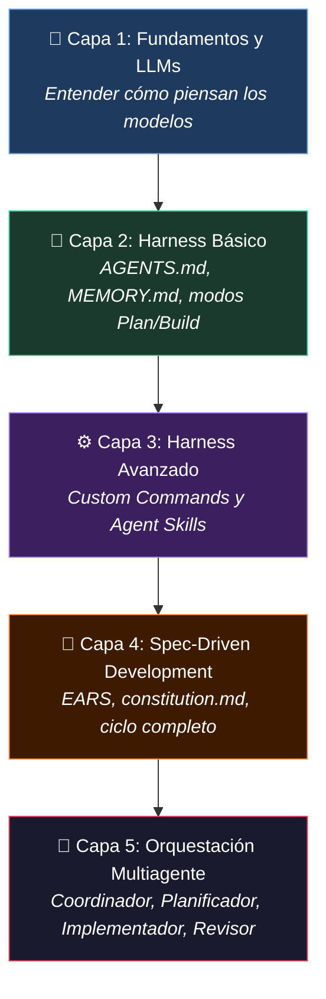

#moc #desarrollo-ia #curso #opencode #sdd #multiagentes

> [!abstract] 🧠 El Nuevo Programador — Mapa de Contenidos
> Este curso transforma tu forma de desarrollar software. La IA no es una herramienta de autocompletado: es un **colaborador que ejecuta**. Tu rol pasa a ser el de **arquitecto, director y revisor** del proceso.
>
> La metáfora central del curso: las **5 capas del nuevo desarrollador**.

→ Volver al centro: [[index|🚀 Biblioteca Digital de Informática]] | [[📂Desarrollo con IA/📂OpenCode/01 - Introducción a OpenCode|🖥️ OpenCode — Guía de Comandos]]

---

## 🗺️ Las 5 Capas del Nuevo Desarrollador

---

## 📚 Índice de Módulos

| # | Módulo | Tema Central |
|---|--------|-------------|
| [[01 - El Nuevo Programador y Fundamentos de LLM\|01]] | El Nuevo Paradigma | LLMs, Vibe Coding vs Ingeniería, Triángulo Potencia/Velocidad/Coste |
| [[02 - Harness Engineering Contexto con AGENTS e Historias de Memoria\|02]] | Harness Básico | `AGENTS.md`, `MEMORY.md`, modos Plan y Build |
| [[03 - Harness Avanzado Comandos Personales y Agent Skills\|03]] | Harness Avanzado | Custom Commands, Agent Skills, `.opencode/commands/` |
| [[04 - Metodologia Spec-Driven Development SDD\|04]] | Spec-Driven Dev | EARS, `constitution.md`, ciclo SDD completo |
| [[05 - Agentes y Subagentes Personalizados en OpenCode\|05]] | Agentes Custom | Configuración YAML, permisos, invocación con `@` |
| [[06 - Sistemas Multiagente Orquestacion y Software Factory\|06]] | Multiagentes | Coordinador, Planificador, Implementador, Revisor |
| [[07 - Paradigmas Avanzados Loop Graph AgentOps y Criterio\|07]] | Vanguardia | Loop/Graph Engineering, AgentOps, criterio profesional |

---

## 🔗 Conexiones con Otros Módulos de la Bóveda

| Tema Relacionado | Enlace | Por Qué se Conecta |
| :--- | :--- | :--- |
| OpenCode CLI | [[📂Desarrollo con IA/📂OpenCode/01 - Introducción a OpenCode\|OpenCode]] | Herramienta principal del curso |
| MCP (Model Context Protocol) | [[📂Desarrollo con IA/📂MCP/00 - MOC MCP\|MOC MCP]] | Los agentes del curso pueden usar servidores MCP |
| Prompt Engineering (AWS) | [[📂AWS/📂IA Practitioner/📂M3 - IA Generativa/12 - Técnicas de Prompt Engineering\|Prompt Engineering]] | Fundamentos de prompting compartidos |
| Foundation Models | [[📂AWS/📂IA Practitioner/📂M3 - IA Generativa/01 - Foundation Models vs Narrow AI\|Foundation Models]] | Base teórica de los LLMs del curso |
| Git y GitHub | [[Fundamentos Git\|Git y GitHub]] | Flujo de trabajo con repositorios en proyectos SDD |

---

> [!tip] 💡 Cómo usar este curso
> Sigue los módulos en orden la **primera vez**. A partir del Módulo 4, el contenido se vuelve muy práctico: aplica SDD a un proyecto real tuyo mientras lees.
