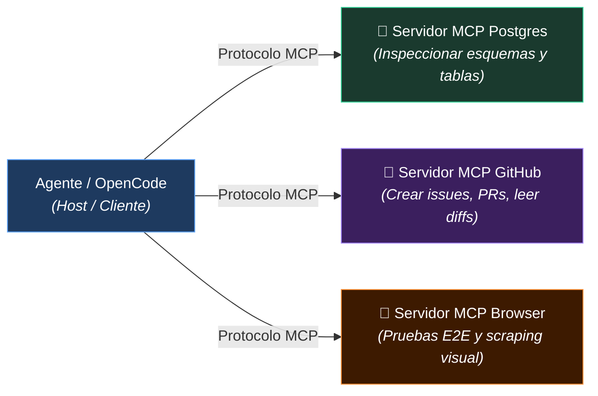

#harness/avanzado #opencode/commands #opencode/skills #automatizacion

> [!info] Navegación
> ◀ Anterior: [[02 - Harness Engineering Contexto con AGENTS e Historias de Memoria|Harness Básico]] | Siguiente ▶: [[04 - Metodologia Spec-Driven Development SDD|Spec-Driven Development]]

---

# 03 — Harness Avanzado: Custom Commands y Agent Skills

> [!abstract] 🎯 Idea central del módulo
> Si el harness básico es la **base del agente** (quién es y qué puede hacer), el harness avanzado es la **caja de herramientas** (qué atajos tiene para ser más eficiente). Los Custom Commands, Agent Skills y MCP eliminan la fricción en tareas recurrentes y conectan al agente con el mundo real.

---

## 🗺️ El Modelo Concéntrico: Capa 03 — Harness Avanzado

![[el_nuevo_programador_capa_03_harness_avanzado.png]]

> [!abstract] 🔍 Análisis del Modelo Visual — Capa 03: Harness Avanzado
> En esta evolución del esquema concéntrico, la **Capa 03 (Harness Avanzado)** expande el radio de acción del agente dotándolo de una suite de herramientas de nivel profesional. Se fundamenta en **3 pilares inseparables**:
>
> 1. ⚡ **Comandos Personalizados (Custom Commands):** Prompts atómicos y reutilizables que dispara el desarrollador (`/<comando>`) para automatizar tareas repetitivas de desarrollo, pruebas o revisión.
> 2. 🧠 **Agent Skills:** Paquetes de directrices modulares y especializadas que el agente activa de forma autónoma según el tipo de código o tarea que aborda (UI, seguridad, testing).
> 3. 🔌 **Model Context Protocol (MCP):** El protocolo estándar que rompe las barreras del repositorio local, permitiendo al agente consultar bases de datos vivas, documentación externa, APIs y herramientas de terceros.

---

## 3.1 Custom Commands (Comandos Personalizados)

### ¿Qué es un Custom Command?

> [!info] 📖 Definición — Custom Command
> Un **Custom Command** es un **prompt estructurado y reutilizable** que se guarda como archivo y se puede invocar con una sintaxis corta del tipo `/<nombre-del-comando>`.
>
> En lugar de escribir el mismo prompt largo cada vez, lo defines una vez y lo reutilizas indefinidamente.

Piénsalo como crear tus propios **atajos de teclado para prompts complejos**.

---

### Dónde se Guardan

En OpenCode, los custom commands se almacenan como archivos Markdown dentro de:

```
tu-proyecto/
└── .opencode/
    └── commands/
        ├── feature.md      ← /feature
        ├── init.md         ← /init  
        ├── review.md       ← /review
        └── bugfix.md       ← /bugfix
```

Cada archivo `.md` contiene el prompt completo que se enviará al agente cuando invocas el comando.

> [!question] 🤔 ¿Puedo ponerle el nombre que me dé la gana a los archivos en `commands/`?
> **¡Sí, totalmente!** No estás limitado a los nombres estándar. Cualquier archivo `.md` que crees dentro de `.opencode/commands/` se registrará inmediatamente como un comando de consola con ese mismo nombre (sin la extensión `.md`).
>
> **Ejemplos reales:**
> - `commands/auditar-sql.md` ➔ Se invoca escribiendo `/auditar-sql`
> - `commands/crear-endpoint.md` ➔ Se invoca escribiendo `/crear-endpoint`
> - `commands/mi_script_personal.md` ➔ Se invoca escribiendo `/mi_script_personal`
>
> > [!tip] 💡 Buenas prácticas para elegir nombres:
> > - Usa **minúsculas y guiones** (`kebab-case`, ej: `/review-pr`, `/doc-gen`), ya que en terminal es mucho más ágil de escribir y autocompletar que nombres con mayúsculas o espacios.
> > - Elige nombres orientados a la acción (un verbo o tarea clara).

---

### Anatomía de un Custom Command

```markdown
# /feature — Planificación de Nueva Funcionalidad

## Propósito
Analiza el contexto del proyecto y crea un plan estructurado 
para implementar una nueva feature antes de tocar código.

## Instrucciones para el Agente
1. Lee el fichero AGENTS.md para entender el stack actual
2. Lee MEMORY.md para conocer el estado del proyecto
3. Analiza los archivos relacionados con la feature solicitada
4. **Sin editar ningún fichero todavía**, propón:
   - Una lista de archivos que serán afectados
   - Los cambios concretos necesarios en cada uno
   - Posibles efectos secundarios o riesgos
   - Estimación de complejidad (Baja / Media / Alta)
5. Espera confirmación del usuario antes de proceder

## Formato de Salida
Usa una tabla para el resumen de cambios y listas numeradas para los pasos.
```

**Cómo invocarlo:**

```
/feature Añadir sistema de notificaciones por email
```

---

### Comandos Esenciales para Tener

| Comando | Para Qué Sirve |
|---|---|
| `/feature` | Planificar una nueva funcionalidad antes de codificar |
| `/init` | Generar o actualizar el `AGENTS.md` del proyecto |
| `/review` | Revisar el código de un módulo o PR contra las convenciones |
| `/bugfix` | Analizar un error concreto y proponer solución |
| `/refactor` | Proponer refactorización de un módulo específico |
| `/test` | Generar suite de tests para un archivo o función |
| `/commit` | Generar mensaje de commit convencional basado en los diffs |

> [!tip] 💡 Cuándo crear un nuevo comando
> Si te encuentras escribiendo el mismo tipo de prompt **más de 3 veces**, es el momento de convertirlo en un custom command. El criterio es la recurrencia.

---

## 3.2 Agent Skills (Habilidades de Agente)

### ¿Qué son las Agent Skills? (Al grano)

> [!info] 📖 Definición Sencilla — Agent Skill
> Las **Skills** son un concepto **global en la Inteligencia Artificial**, no algo exclusivo de una herramienta concreta. Son "paquetes de conocimiento" especializados que la IA **usa automáticamente** cuando detecta que los necesita para hacer bien su trabajo.
> 
> A diferencia de los Custom Commands (que son atajos que tú tienes que ejecutar a mano), las skills se activan solas. Por ejemplo, si tienes una skill de fechas (`local-date`), al lanzarle a la IA un comando o pedirle algo relacionado con fechas, **usará esa skill automáticamente sin que tú le digas nada**.

La diferencia fundamental:

| | Custom Command | Agent Skill |
|---|---|---|
| **Concepto** | Atajo tuyo (`/comando`) específico de herramientas como OpenCode. | Conocimiento global y automático de la IA. |
| **¿Quién lo dispara?** | Tú, explícitamente. | La IA, autónomamente. |

---

### ¿Dónde se Generan y Dónde se Guardan?

Al ser un concepto global, tienes libertad para ubicarlas, dependiendo de cuán organizado quieras ser:

1. **La opción rápida (Raíz del proyecto):** Puedes crear un archivo llamado simplemente `skill.md` en la carpeta principal de tu proyecto. La IA lo leerá sin problema.
   
2. **La opción organizada (Recomendada):** Para estructurarlo mejor y tener múltiples skills, guárdalas en una estructura de carpetas. El estándar habitual es: `.agents/skills/<nombre-de-la-skill>/SKILL.md`.

**Ejemplo de estructura organizada:**
```text
tu-proyecto/
└── .agents/
    └── skills/
        └── local-date/      ← Este es el nombre de la skill
            └── SKILL.md     ← Aquí metes las reglas y conocimientos sobre fechas
```

---

### Invocación Manual de las Skills

Aunque el gran poder de las skills es que la IA las use solas, también puedes forzar su uso o llamarlas de forma manual si estás en un entorno como OpenCode:

- **Usando `@`:** Puedes escribir `@local-date` (ese es el ejemplo de una skill) en tu prompt para obligar a la IA a leer esa skill específica.
  
- **Usando `/`:** En interfaces integradas de skills, si escribes la barra `/` (o accedes al menú de skills), te saldrá un desplegable con las skills disponibles (como `local-date`) para que la selecciones.

---

### Ejemplos de Otras Agent Skills Útiles

Además de fechas (`local-date`), puedes tener skills para:

- **Diseño UI:** `ui-standards` (Forzar el uso de variables CSS, espaciados concretos, modo oscuro).
- **Seguridad:** `security-checklist` (Obligar a sanitizar inputs y no loguear tokens de bases de datos).
- **Documentación:** `auto-documentation` (Forzar formato estricto como JSDoc).

---

### 🌐 El Ecosistema de la Comunidad: skills.sh

No necesitas crear todas tus skills desde cero. Existe un catálogo oficial impulsado por **Vercel** llamado **[skills.sh](https://skills.sh)**. Reúne miles de habilidades creadas por la comunidad y grandes empresas (como Anthropic o Microsoft) para que los agentes carguen conocimientos específicos bajo demanda, manteniendo tu archivo principal (`AGENTS.md`) limpio y ligero.

**🛠️ ¿Cómo se instalan?**

Se utiliza la herramienta de terminal `agent-skills`.

1. **Instalación de la herramienta**: 
   
   ```bash
   npx skills add vercel-labs/agent-skills
   ```
   
1. **Asistente (Wizard)**: Al ejecutarlo, te hará dos preguntas clave:
   
   - **Agentes de destino:** Para qué herramienta la quieres (ej. OpenCode, aprovechando que el formato `.agents/skills` es un estándar abierto).
     
   - **Alcance (Scope):** Si la quieres a nivel **Global** (para cualquier proyecto) o a nivel de **Proyecto** (guardada localmente en el `.agents/skills` de tu proyecto actual).

**💡 Ejemplos Prácticos:**

- **La skill `frontend-design`:** Creada por Anthropic, le da al agente criterios expertos de UX/UI para evitar diseños genéricos por defecto. Se instala así:
  
  Para ver este comando vete a **skills.sh** y busca la skill adecuada para tu y te saldrá el comando para ejecutarla.
  
  Cada vez que cargues una **skill**, **custom prompt** o lo que sea, es conveniente hacer ==*/restart*== para que se reinicie y se actualice.
  
  ```bash
  npx skills add https://github.com/anthropics/skills --skill frontend-design
  ```
  *Uso:* Una vez instalada, la invocas en el chat escribiendo `@frontend-design` y el agente rediseñará la interfaz basándose en esas reglas.

- **La skill `find-skills`:** Creada por Vercel, es una habilidad que permite al propio agente buscar e instalar automáticamente otras *skills* del catálogo cuando detecta que las necesita.

---

## 3.3 Model Context Protocol (MCP) en el Harness Avanzado

### ¿Por Qué MCP Completa el Harness Avanzado?

En la imagen de la **Capa 03 (Harness Avanzado)**, junto a los comandos personalizados y las skills, aparece un tercer pilar indispensable: **Model Context Protocol (MCP)**.

Mientras que los Custom Commands son *atajos disparados por ti* y las Agent Skills son *reglas internas invocadas por el agente*, **MCP es el puente que conecta al agente con el mundo exterior**:

> [!info] 📖 Definición — MCP en el Harness
> **MCP (Model Context Protocol)** es un estándar abierto que actúa como el **"USB-C de la Inteligencia Artificial"**. Permite que el agente se conecte de forma segura y estandarizada a bases de datos en vivo, sistemas de control de versiones remotos, navegadores web y APIs externas sin tener que programar conectores a medida.
>
> 📌 *Tienes una sección completa y exhaustiva sobre MCP en tu bóveda:* [[📂Desarrollo con IA/📂MCP/00 - MOC MCP|🔌 Bóveda Completa de MCP]] | [[📂Desarrollo con IA/📂MCP/01 - Qué es MCP y Problema que Resuelve|01 - Qué es MCP y Problema que Resuelve]].



### ¿Qué  Resuelve MCP que No Resuelven los Commands ni las Skills?

| Dimensión | Custom Commands | Agent Skills | Model Context Protocol (MCP) |
|---|---|---|---|
| **Naturaleza** | Prompt estructurado reusable | Paquete de directrices contextuales | Protocolo cliente-servidor de herramientas vivas |
| **¿Quién lo dispara?** | El desarrollador (`/comando`) | El agente según la tarea | El agente mediante *tool use* estandarizado |
| **Radio de acción** | Dentro de la ventana de contexto | Dentro de los archivos locales | Sistemas externos (BDs, APIs, Git, navegadores) |
| **Ejemplo** | `/review` para auditar código | Skill para escribir CSS con variables | Servidor MCP que consulta la base de datos de staging |

---

### 3.3.1 Implementación Práctica de MCP

Para sacar partido a MCP, hay dos enfoques según lo que necesites: ser **Consumidor** (usar servidores ya creados) o **Creador** (programar los tuyos). Sea cual sea el enfoque, la conexión siempre se hace por una de estas vías:

- **Local (`STDIO`):** El servidor se ejecuta directamente en tu máquina mediante un comando.
  
- **Remoto (`HTTP`):** El servidor es un servicio web remoto.

#### 🔌 Enfoque 1: Conectar un Servidor MCP Existente (Consumidor)

Dependiendo de la herramienta que uses, conectar un servidor a tu agente es muy sencillo:

**A. En OpenCode (CLI)**
Debes añadir la configuración en el archivo `opencode.json` en la raíz de tu proyecto bajo la clave `"mcp"`:

```json
{
  "mcp": {
    "chrome-devtools": {
      "type": "local",
      "command": ["npx", "-y", "chrome-devtools-mcp@latest"]
    },
    "api-externa": {
      "type": "remote",
      "url": "https://mcp.servidor.com",
      "headers": { "API_KEY": "<tu_clave>" }
    }
  }
}
```
*💡 Tras configurarlo, usa el comando `/mcps` en OpenCode para listar, activar o desactivar tus servidores.*

**B. En Editores (VS Code / Cursor)**
Abre la paleta de comandos (`Ctrl+Shift+P`), busca **`Add MCP Server`**, elige el tipo de conexión y el editor creará automáticamente el archivo de configuración `.vscode/mcp.json`.

**C. En Claude Desktop**
Ve a **Settings → Connectors → Custom Connector** y añade allí la ruta de tu servidor o URL.

---

#### 🛠️ Enfoque 2: Crear tu Propio Servidor MCP en Python (Creador)

Si necesitas que la IA interactúe con tu propia base de datos o scripts personalizados, puedes levantar un servidor local rápidamente con el SDK oficial:

1. **Instalación:** Crea tu entorno virtual y ejecuta: `pip install mcp`
   
2. **Crear herramientas (`tools`):** Se usa la abstracción `FastMCP`. 
   > [!important] ⚠️ Regla de Oro
   > Para que la IA entienda tus funciones, **es obligatorio el tipado de datos (type hints)** y los **comentarios (docstrings)** explicando qué hace cada herramienta.

```python
from mcp.server.fastmcp import FastMCP

mcp = FastMCP("MiServidorLocal")

@mcp.tool()
def saludar_usuario(nombre: str) -> str:
    """Devuelve un saludo personalizado al usuario.
    
    Args:
        nombre: El nombre de la persona a saludar.
    """
    return f"¡Hola {nombre}! Bienvenido a tu primer MCP."

if __name__ == "__main__":
    mcp.run()
```

3. **Probar visualmente:** Ejecutando `mcp dev my_mcp.py` se abrirá el **MCP Inspector** en tu navegador para que pruebes las funciones a mano.
   
4. **Conectar a tu IDE:** Solo tienes que añadir a tu `opencode.json` un servidor tipo `local` que ejecute el comando `["python", "/ruta/absoluta/a/my_mcp.py"]`. Al reiniciar el agente, ¡podrá ejecutar tus funciones en Python!

---

## 3.4 La Diferencia Real en la Práctica

Imagina que estás construyendo una feature completa y le dices al agente:

> *"Crea el endpoint de autenticación con GitHub y actualiza la tabla de usuarios"*

**Sin harness avanzado:** El agente inventa un esquema SQL hipotético, no sigue los estándares de seguridad de tu equipo, no valida los inputs y genera código desalineado con tu base de datos real.

**Con harness avanzado completo (Commands + Skills + MCP):**

1. Invocas `/feature OAuth GitHub` (**Custom Command**) para estructurar el plan sin tocar código aún.
   
2. El agente activa la **Skill de Seguridad** para exigir validación estricta de tokens y headers seguros.
   
3. El agente consulta a través del **servidor MCP de PostgreSQL** el esquema exacto de la tabla `users` para no romper foreign keys existentes.
   
4. Al generar los cambios, activa la **Skill de Documentación** con contratos OpenAPI/Swagger precisos.
   
5. El resultado funciona al primer intento, respeta tus normas y encaja con la base de datos real.

---

> [!quote] 🌟 Conclusión del Módulo 3
> *Los Custom Commands eliminan la fricción de prompts repetitivos. Las Agent Skills aportan directrices especializadas que se activan solas. Y MCP dota al agente de conectividad universal con tus bases de datos, APIs y herramientas externas. Juntos, forman la Capa 03 que transforma a un simple modelo de texto en una estación de ingeniería autónoma.*

→ Siguiente: [[04 - Metodologia Spec-Driven Development SDD|Módulo 4 → Spec-Driven Development]]
→ Volver al índice: [[00 - MOC Curso Desarrollo con IA|🗺️ MOC del Curso]]
