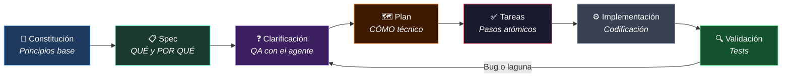

#sdd #especificaciones #ears/requisitos #metodologia #arquitectura

> [!info] Navegación
> ◀ Anterior: [[03 - Harness Avanzado Comandos Personales y Agent Skills|Harness Avanzado]] | Siguiente ▶: [[05 - Agentes y Subagentes Personalizados en OpenCode|Agentes Personalizados]]

---

# 04 — Spec-Driven Development (SDD)

> [!abstract] 🎯 Idea central del módulo
> **Spec-Driven Development** es la metodología que convierte el desarrollo con IA de una actividad caótica en un proceso sistemático y profesional. La clave es simple: **especificar antes de codificar**. La IA no improvisa; ejecuta un plan claro.

---

## 4.1 ¿Qué es Spec-Driven Development?

> [!info] 📖 Definición — SDD
> **Spec-Driven Development** es una metodología donde cada nueva funcionalidad comienza con una **especificación formal** (documentación estructurada del QUÉ y el POR QUÉ) antes de que el agente escriba una sola línea de código.

La comparación con metodologías conocidas:

| Metodología | Enfoque | En el mundo de la IA |
|---|---|---|
| **TDD** (Test-Driven) | Tests primero, luego código | Los tests definen el comportamiento esperado |
| **BDD** (Behavior-Driven) | Escenarios de usuario primero | El comportamiento desde la perspectiva del usuario |
| **SDD** (Spec-Driven) | Especificación formal primero | La IA ejecuta sobre una spec clara, no sobre intuición |

---

### Las 3 Variantes de SDD

**1. Spec-First (Especificación Efímera)**
- Escribes la spec en el chat, la IA la usa y desaparece
- Para features pequeñas y rápidas
- Sin archivos permanentes

**2. Spec-Anchored (Especificación como Ancla Viva)**
- La spec vive en un archivo (`spec.md`) que persiste durante todo el desarrollo
- El agente la consulta constantemente como referencia
- Ideal para features de complejidad media

**3. Spec-as-Source (La Especificación ES el Código)**
- La spec es tan detallada que de ella se puede generar código directamente
- Para proyectos grandes con múltiples agentes
- Máxima trazabilidad y control

---

## 4.2 La Sintaxis EARS: Requisitos sin Ambigüedad

> [!info] 📖 Definición — EARS
> **EARS** (Easy Approach to Requirements Syntax) es una sintaxis de plantillas fijas para escribir requisitos de software que **elimina la ambigüedad** y permite convertirlos directamente en pruebas verificables.

El problema con los requisitos en lenguaje libre:

> *"El sistema debe gestionar bien las notificaciones de usuario"*

¿Qué significa "bien"? ¿Cuándo? ¿Todos los usuarios? ¿Con qué formato? Es completamente ambiguo.

---

### Las 5 Plantillas EARS

**1. Requisito Básico (Siempre)**
```
El sistema DEBE [hacer algo].
```
*Ejemplo:* `El sistema DEBE encriptar las contraseñas antes de almacenarlas.`

---

**2. Requisito con Disparador (Cuando algo sucede)**
```
CUANDO [evento], el sistema DEBE [respuesta].
```
*Ejemplo:* `CUANDO un usuario falla 5 intentos de login, el sistema DEBE bloquear la cuenta durante 30 minutos.`

---

**3. Requisito Condicional (Si se cumple condición)**
```
SI [precondición], el sistema DEBE [comportamiento].
```
*Ejemplo:* `SI el usuario no ha iniciado sesión, el sistema DEBE redirigirle a /login antes de mostrar cualquier página protegida.`

---

**4. Requisito de Estado (Mientras esté en un estado)**
```
MIENTRAS [estado del sistema], el sistema DEBE [comportamiento].
```
*Ejemplo:* `MIENTRAS el servidor esté procesando el pago, el sistema DEBE deshabilitar el botón de confirmar y mostrar un spinner.`

---

**5. Requisito de Caso Opcional (En caso de)**
```
EN CASO DE [condición opcional], el sistema DEBE [comportamiento].
```
*Ejemplo:* `EN CASO DE que la API externa falle, el sistema DEBE mostrar el último dato cacheado con una marca de tiempo y un aviso de "datos desactualizados".`

> [!tip] 💡 Por qué EARS es tan valioso con IA
> Los requisitos en EARS son directamente **convertibles en tests**. La condición "CUANDO X" se convierte en el setup del test, y el "DEBE Y" se convierte en el assert. La IA los entiende perfectamente y genera código alineado con ellos.

---

## 4.3 La Arquitectura de Archivos SDD

Un proyecto con SDD tiene esta estructura de documentación:

```
tu-proyecto/
├── AGENTS.md                    ← Instrucciones del agente
├── MEMORY.md                    ← Estado actual del proyecto
├── docs/
│   └── constitution.md          ← Principios inamovibles del proyecto
└── specs/
    ├── 001-autenticacion/
    │   ├── spec.md              ← El QUÉ y el POR QUÉ
    │   ├── plan.md              ← El CÓMO técnico
    │   └── tasks.md             ← Lista de tareas atómicas
    ├── 002-notificaciones/
    │   ├── spec.md
    │   ├── plan.md
    │   └── tasks.md
    └── ...
```

---

### El Archivo `constitution.md`

> [!info] 📖 Definición — constitution.md
> La **constitución** del proyecto es un documento con los **principios técnicos y de negocio que nunca pueden violarse**, independientemente de lo que diga cualquier spec o plan posterior.

```markdown
# Constitution.md — Principios Inamovibles del Proyecto

## Principios de Arquitectura
1. NUNCA se escribe lógica de negocio en los componentes de UI
2. Toda comunicación con la base de datos pasa por la capa de servicios
3. Las funciones puras no tienen efectos secundarios ni dependencias externas

## Principios de Seguridad
4. Ningún dato sensible se logguea nunca en ningún entorno
5. Toda entrada de usuario se valida en el backend, independientemente de la validación del frontend
6. Los tokens JWT expiran en máximo 24h

## Principios de Calidad
7. Sin PR sin tests. Cobertura mínima del 80%
8. Sin deuda técnica intencionada. Los TODOs tienen fecha límite
9. Si el código no es legible sin comentarios, es un bug de legibilidad
```

> [!warning] ⚠️ La constitución es sagrada
> Ningún agente, ninguna deadline y ningún "lo arreglamos después" justifica violar la constitución. Si necesitas cambiarla, es una conversación de arquitectura explícita, no una excepción silenciosa.

---

## 4.4 El Ciclo de Vida Completo de SDD



---

### Fase 1: Spec — El QUÉ y el POR QUÉ

La spec responde: ¿Qué necesita hacer esta funcionalidad y por qué existe?

```markdown
# spec.md — Sistema de Autenticación

## Propósito
Permitir que los usuarios accedan a su cuenta de forma segura y 
mantengan la sesión activa sin tener que re-autenticarse constantemente.

## Requisitos (en EARS)
- CUANDO un usuario envía credenciales correctas, el sistema DEBE 
  emitir un JWT de acceso (24h) y un refresh token (30 días).
- CUANDO el JWT expira, el sistema DEBE renovarlo automáticamente 
  si el refresh token es válido.
- CUANDO un usuario falla 5 intentos, el sistema DEBE bloquear 
  la cuenta y enviar un email de aviso.
- SI el usuario lleva 30 días sin actividad, el sistema DEBE 
  invalidar el refresh token y cerrar la sesión.

## Lo que NO incluye esta spec
- OAuth con proveedores externos (Google, GitHub) — es la spec 002
- Gestión de roles y permisos — es la spec 003
```

---

### Fase 2: Clarificación — QA con el Agente

Una vez escrita la spec, le pides al agente que **busque contradicciones y lagunas**:

> *"Lee spec.md y dime qué puntos son ambiguos, qué casos borde no he contemplado y qué requisitos pueden entrar en conflicto entre sí."*

El agente puede responder algo como:
- *"¿Qué ocurre si el refresh token expira justo mientras el usuario está usando la app activamente?"*
- *"¿El bloqueo de 5 intentos es por dispositivo o por cuenta?"*
- *"¿Los intentos fallidos se resetean con cada login exitoso?"*

---

### Fase 3: Plan — El CÓMO Técnico

```markdown
# plan.md — Implementación Técnica de Autenticación

## Arquitectura
- AuthService: lógica de negocio (generación de tokens, validación)
- AuthController: endpoints REST (/login, /logout, /refresh)
- AuthMiddleware: interceptor para rutas protegidas

## Funciones Puras (sin efectos secundarios)
- generateJWT(userId, expiresIn): string
- validateJWT(token): { valid: boolean, payload: JWTPayload }
- hashPassword(plain: string): Promise<string>
- comparePassword(plain, hash): Promise<boolean>

## Efectos Secundarios (aislados en servicios)
- saveRefreshToken(userId, token) → DB
- invalidateRefreshToken(token) → DB
- sendBlockedAccountEmail(email) → EmailService
```

---

### Fase 4: Tareas — Pasos Atómicos

```markdown
# tasks.md

- [ ] 1. Crear interfaz JWTPayload en types/auth.ts
- [ ] 2. Implementar generateJWT() como función pura (con tests)
- [ ] 3. Implementar validateJWT() como función pura (con tests)
- [ ] 4. Implementar hashPassword() y comparePassword() (con tests)
- [ ] 5. Crear tabla refresh_tokens en el schema de Prisma
- [ ] 6. Implementar AuthService.login() con tests de integración
- [ ] 7. Implementar AuthService.refresh() con tests
- [ ] 8. Implementar AuthMiddleware
- [ ] 9. Crear endpoints en AuthController
- [ ] 10. Tests E2E del flujo completo de login → refresh → logout
```

---

## 4.5 Automatización: Comandos SDD

Puedes crear [[03 - Harness Avanzado Comandos Personales y Agent Skills|Custom Commands]] para cada fase del ciclo:

| Comando | Qué Hace |
|---|---|
| `/sdd-constitution` | Genera o actualiza `docs/constitution.md` basándose en el proyecto |
| `/sdd-spec` | Crea `spec.md` para una feature descrita en lenguaje libre |
| `/sdd-clarify` | Analiza la spec buscando ambigüedades y lagunas |
| `/sdd-plan` | Genera `plan.md` técnico a partir de la spec clarificada |
| `/sdd-tasks` | Descompone el plan en `tasks.md` con tareas atómicas |
| `/sdd-implement` | Implementa la siguiente tarea pendiente del `tasks.md` |
| `/sdd-validate` | Ejecuta los tests y valida contra los criterios de la spec |

---

> [!example] 📝 Ejemplo de flujo completo en 5 minutos
> ```
> # 1. Describes la feature al agente
> /sdd-spec "Quiero añadir sistema de favoritos para que los usuarios
>            puedan guardar artículos y acceder a ellos desde su perfil"
>
> # 2. El agente genera specs/003-favoritos/spec.md con EARS
>
> # 3. Pides clarificación
> /sdd-clarify
>
> # 4. Respondes las preguntas del agente, él actualiza spec.md
>
> # 5. Generas el plan técnico
> /sdd-plan
>
> # 6. Generas las tareas
> /sdd-tasks
>
> # 7. Empiezas a implementar
> /sdd-implement
> ```

---

> [!quote] 🌟 Conclusión del Módulo 4
> *SDD no ralentiza el desarrollo. Lo acelera porque elimina la ambigüedad que genera retrabajo. El tiempo que "pierdes" en la spec lo recuperas multiplicado en la implementación: el agente ejecuta con precisión quirúrgica porque sabe exactamente qué construir.*

→ Siguiente: [[05 - Agentes y Subagentes Personalizados en OpenCode|Módulo 5 → Agentes Personalizados]]
→ Volver al índice: [[00 - MOC Curso Desarrollo con IA|🗺️ MOC del Curso]]
