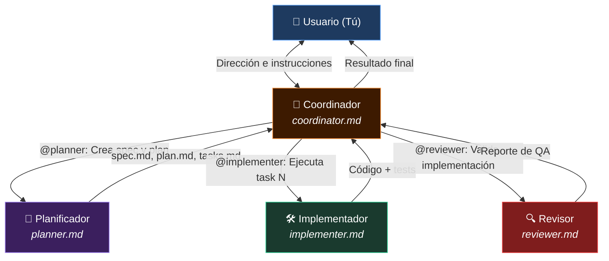

#multiagentes #orquestacion #software-factory #arquitectura-ia

> [!info] Navegación
> ◀ Anterior: [[05 - Agentes y Subagentes Personalizados en OpenCode|Agentes Personalizados]] | Siguiente ▶: [[07 - Paradigmas Avanzados Loop Graph AgentOps y Criterio|Paradigmas Avanzados]]

---

# 06 — Sistemas Multiagente, Orquestación y Software Factory

> [!abstract] 🎯 Idea central del módulo
> Si un Custom Agent es un empleado especializado, un Sistema Multiagente es una **empresa completa con roles, jerarquía y flujos de trabajo**. El objetivo final es la **Software Factory**: un sistema que convierte especificaciones en software validado de forma automatizada.

---

## 6.1 ¿Qué es un Sistema Multiagente?

> [!info] 📖 Definición — Sistema Multiagente
> Un **Sistema Multiagente (MAS)** es un conjunto de agentes de IA especializados que se **coordinan entre sí** para completar un flujo de trabajo complejo que ningún agente individual podría resolver de forma óptima por sí solo.

La diferencia con un único agente avanzado:

| | Agente Único | Sistema Multiagente |
|---|---|---|
| **Especialización** | Generalista | Cada agente tiene un dominio de expertise |
| **Contexto** | Limitado por la ventana de contexto | Cada agente gestiona su propio contexto |
| **Paralelismo** | Secuencial | Múltiples agentes pueden trabajar en paralelo |
| **Escala** | Proyectos pequeños/medianos | Proyectos grandes y complejos |
| **Trazabilidad** | Difícil de auditar | Clara separación de responsabilidades |

---

## 6.2 La Arquitectura de Roles: El Equipo de Desarrollo

El sistema multiagente en el contexto del desarrollo SDD tiene 4 roles fundamentales:



---

### 👑 El Coordinador (`coordinator.md`)

> [!info] 📖 Rol del Coordinador
> El agente **primario** que interactúa directamente con el usuario. Dirige todo el proceso, orquesta a los subagentes y es el único punto de contacto para el desarrollador humano.

**Responsabilidades:**
- Recibir instrucciones del usuario
- Descomponer tareas en subtareas para los subagentes
- Pasar el contexto correcto a cada subagente
- Consolidar los resultados de los subagentes
- Mantener actualizado el `MEMORY.md`
- **NUNCA edita código de producción directamente**

---

### 📐 El Planificador (`planner.md`)

> [!info] 📖 Rol del Planificador
> Subagente especializado en la **metodología SDD**. Convierte requisitos en documentación estructurada usando sintaxis EARS.

**Responsabilidades:**
- Crear y mantener `spec.md` con requisitos EARS
- Generar `plan.md` con arquitectura técnica
- Descomponer el plan en `tasks.md` con tareas atómicas
- Detectar ambigüedades y lagunas en los requisitos

**Acceso:** Lectura de todo el proyecto, escritura solo en `specs/`

---

### 🛠️ El Implementador (`implementer.md`)

> [!info] 📖 Rol del Implementador
> Subagente especializado en **codificación precisa**. Implementa exactamente lo que dicen `plan.md` y `tasks.md`, ni más ni menos.

**Responsabilidades:**
- Implementar una tarea atómica por invocación
- Escribir tests para el código implementado
- Ejecutar typecheck y tests locales
- Marcar la tarea como completada en `tasks.md`

**Acceso:** Lectura de todo, escritura en `src/` y `tests/`, ejecución de comandos de test y lint.

---

### 🔍 El Revisor (`reviewer.md`)

> [!info] 📖 Rol del Revisor
> Subagente de **Quality Assurance**. Valida que cada implementación cumple la spec, la constitución y los estándares del proyecto.

**Responsabilidades:**
- Verificar que el código cumple los requisitos EARS
- Detectar violaciones de la constitución
- Identificar problemas de seguridad
- Verificar cobertura de tests
- Emitir un veredicto: ✅ Aprobado / ❌ Rechazado / ⚠️ Con observaciones

**Acceso:** Solo lectura de todo el proyecto + ejecución de tests.

---

## 6.3 El Flujo Completo de Trabajo Orquestado

Un ciclo completo para implementar una nueva feature:

```
1. USUARIO → COORDINADOR
   "Quiero añadir autenticación con Google OAuth2"

2. COORDINADOR → PLANIFICADOR
   @planner "Crea la spec, el plan y las tareas para OAuth2 Google.
             El contexto del proyecto está en AGENTS.md y MEMORY.md.
             Stack: Node.js + Passport.js + PostgreSQL"

3. PLANIFICADOR → genera archivos
   specs/004-oauth-google/spec.md
   specs/004-oauth-google/plan.md
   specs/004-oauth-google/tasks.md

4. PLANIFICADOR → COORDINADOR (resultado)
   "Documentación SDD creada. Hay 3 puntos ambiguos que el usuario
    debe aclarar: [...]"

5. COORDINADOR → USUARIO
   "El planificador ha generado la spec. Antes de implementar, 
    necesitamos aclarar: [...]"

6. USUARIO → COORDINADOR (respuestas)

7. COORDINADOR → PLANIFICADOR
   @planner "Actualiza spec.md con estas aclaraciones: [...]"

8. (Ciclo de implementación, tarea por tarea)

9. COORDINADOR → IMPLEMENTADOR
   @implementer "Implementa el task #1 del archivo
                 specs/004-oauth-google/tasks.md"

10. IMPLEMENTADOR → COORDINADOR (código + resultado de tests)

11. COORDINADOR → REVISOR
    @reviewer "Revisa la implementación del task #1 contra
               specs/004-oauth-google/spec.md y constitution.md"

12. REVISOR → COORDINADOR (reporte de QA)

13. Si aprobado → siguiente tarea
    Si rechazado → @implementer "Corrige según el reporte de QA: [...]"
```

---

## 6.4 Transmisión Eficaz de Contexto entre Agentes

> [!warning] ⚠️ El problema del contexto aislado
> Los subagentes **no comparten automáticamente el historial** de la conversación del coordinador. Cada vez que invocas un subagente, estás iniciando una conversación nueva. El subagente solo ve lo que el coordinador le pasa explícitamente.

**La solución: Contexto empaquetado**

Cuando el coordinador invoca a un subagente, debe pasar un **paquete de contexto** completo:

```
@implementer "
CONTEXTO DEL PROYECTO:
- Ver AGENTS.md para el stack y convenciones
- Ver MEMORY.md para el estado actual

TAREA A IMPLEMENTAR:
- Ver specs/004-oauth-google/tasks.md, task #3

RESTRICCIONES ESPECÍFICAS:
- El OAuth callback debe usar la ruta /auth/google/callback
- Reutiliza el patrón de AuthService que ya existe en src/services/auth.service.ts

CRITERIOS DE ACEPTACIÓN:
- Los tests deben simular el flujo completo OAuth sin llamadas reales a Google
- El token JWT generado debe seguir el mismo formato que el login normal
"
```

---

## 6.5 Paralelización de Subagentes

Una de las ventajas del sistema multiagente es poder **lanzar múltiples subagentes en paralelo** para acelerar el trabajo.

> [!example] 📝 Ejemplo: Revisión Paralela desde 3 Perspectivas
> ```
> # En lugar de un único revisor, lanzamos 3 especializados en paralelo:
> 
> @reviewer-security "Revisa auth.service.ts desde la perspectiva 
>                     de seguridad únicamente"
> 
> @reviewer-tests "Revisa la cobertura de tests de auth.service.ts.
>                 ¿Hay casos borde sin probar?"
> 
> @reviewer-arch "Revisa auth.service.ts desde la arquitectura.
>                ¿Viola algún principio de constitution.md?"
> 
> # Los 3 trabajan en paralelo → resultados consolidados en segundos
> ```

Otros casos de paralelización:

- **Investigación de alternativas:** 3 agentes investigando 3 enfoques técnicos distintos para el mismo problema
- **Generación de tests:** Implementador genera código mientras otro agente genera los tests
- **Documentación:** Un agente documenta la API mientras otro implementa la siguiente feature

---

## 6.6 La Software Factory

> [!info] 📖 Definición — Software Factory
> Una **Software Factory** es un sistema multiagente completamente automatizado que convierte **especificaciones formales en software validado** con mínima intervención humana.

El flujo de una Software Factory madura:

```
INPUT:  Descripción en lenguaje natural de la feature
   ↓
[Planificador] → Genera spec EARS, plan técnico, lista de tareas
   ↓
[Implementador] × N → Implementa tareas en paralelo
   ↓
[Revisor-Seguridad] + [Revisor-Tests] + [Revisor-Arquitectura] (paralelo)
   ↓
OUTPUT: Pull Request con código, tests y documentación — listo para revisión humana
```

> [!warning] ⚠️ La Software Factory no elimina al desarrollador humano
> La revisión humana final **nunca se elimina**. La Software Factory reduce el trabajo mecánico y repetitivo, pero el criterio profesional sobre qué construir, cómo priorizar y qué riesgo asumir sigue siendo responsabilidad del desarrollador.
>
> Ver: [[07 - Paradigmas Avanzados Loop Graph AgentOps y Criterio|La regla de oro del Nuevo Programador]]

---

> [!quote] 🌟 Conclusión del Módulo 6
> *Un sistema multiagente bien diseñado es como una fábrica de software: cada pieza tiene su lugar, su rol y sus límites. La magia no está en los agentes individuales, está en la **orquestación y el flujo de contexto** entre ellos.*

→ Siguiente: [[07 - Paradigmas Avanzados Loop Graph AgentOps y Criterio|Módulo 7 → Paradigmas de Vanguardia]]
→ Volver al índice: [[00 - MOC Curso Desarrollo con IA|🗺️ MOC del Curso]]
