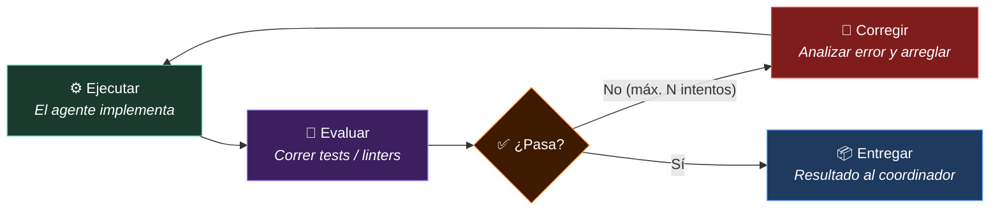

#futuro-ia #agentops #criterio-tecnico #loop-engineering #graph-engineering

> [!info] Navegación
> ◀ Anterior: [[06 - Sistemas Multiagente Orquestacion y Software Factory|Sistemas Multiagente]] | Volver al índice: [[00 - MOC Curso Desarrollo con IA|🗺️ MOC del Curso]]

---

# 07 — Paradigmas Avanzados: Loop, Graph, AgentOps y Criterio Profesional

> [!abstract] 🎯 Idea central del módulo
> Este módulo explora la **frontera del desarrollo con IA**: los patrones arquitectónicos de vanguardia que están redefiniendo qué es posible construir. Y termina con lo más importante: **el criterio humano** que convierte la potencia de la IA en ingeniería responsable.

---

## 7.1 Loop Engineering

> [!info] 📖 Definición — Loop Engineering
> El **Loop Engineering** es el diseño de bucles de **ejecución → evaluación → corrección** en los que un agente puede iterar autónomamente hasta que el resultado supera los criterios de aceptación, sin intervención humana en cada vuelta.

### El Ciclo del Loop



---

### Cómo se Configura un Loop

```yaml
# En el agente implementador:
---
name: "Implementador con Loop"
mode: subagent
loop:
  max_iterations: 5
  success_condition: "npm run test:unit && npm run typecheck"
  on_failure: "analyze_error_and_retry"
---
```

**Ejemplo práctico de Loop en acción:**

1. **Iteración 1:** El agente implementa la función → los tests fallan (error de tipos TypeScript)
2. **Iteración 2:** El agente lee el error, corrige los tipos → los tests fallan (lógica incorrecta en caso borde)
3. **Iteración 3:** El agente ajusta la lógica → los tests pasan, el typecheck pasa → Loop exitoso

> [!tip] 💡 Cuándo usar Loop Engineering
> - Tareas con criterios de aceptación objetivos y automatizables (tests, linters, compilación)
> - Implementaciones bien especificadas donde el "correcto" es verificable automáticamente
> - **NO usar** en decisiones de arquitectura o diseño (requieren criterio humano)

---

### Límites del Loop

> [!warning] ⚠️ El límite de iteraciones es crítico
> Siempre define un `max_iterations`. Sin límite, un agente atascado en un bug puede gastar tokens (y dinero) indefinidamente intentando arreglar algo que necesita intervención humana.
>
> **Regla práctica:** 3-5 iteraciones para tareas normales. Si no resuelve en 5, escala al coordinador para intervención humana.

---

## 7.2 Graph Engineering

> [!info] 📖 Definición — Graph Engineering
> El **Graph Engineering** es la coordinación de agentes mediante **grafos dirigidos de dependencias**, donde cada nodo es un agente o tarea, y las aristas definen el flujo de datos y dependencias entre ellos.

### La Diferencia con el Pipeline Lineal

Un pipeline lineal (Planificador → Implementador → Revisor) es un grafo simple. El Graph Engineering va más allá:

```
                    [Planificador]
                    /            \
          [Impl. Frontend]   [Impl. Backend]    ← Paralelo
                    \            /
                   [Revisor Integración]
                          |
                   [Revisor Seguridad]
                          |
                   [Generador Docs]
```

---

### Cuándo Usar Graph Engineering

**Proyectos con:**
- Features que tienen componentes independientes (frontend/backend pueden implementarse en paralelo)
- Múltiples tipos de revisión que no dependen entre sí
- Dependencias complejas entre tareas que deben ejecutarse en un orden específico

> [!example] 📝 Ejemplo: Grafo para una API con su Frontend
> ```
> Spec completa
>    ├── [Backend] Implementar endpoints (paralelo)
>    └── [Frontend] Implementar UI (paralelo)
>           ↓
>    [Agente de Integración] Verificar que frontend y backend son compatibles
>           ↓
>    [Reviewer-Seguridad] + [Reviewer-Performance] (paralelo)
>           ↓
>    [Doc Writer] Generar documentación de la API
> ```

---

## 7.3 AgentOps: Monitorización de Agentes en Producción

> [!info] 📖 Definición — AgentOps
> **AgentOps** es la práctica de **monitorizar, auditar y medir el rendimiento** de sistemas de agentes de IA en entornos de producción, similar a como DevOps monitoriza infraestructura y aplicaciones.

### Las 4 Dimensiones de AgentOps

**1. Trazabilidad (Tracing)**
Cada acción de cada agente queda registrada: qué prompt recibió, qué herramientas usó, qué produjo y cuánto tardó.

```
[2026-10-02 20:30:01] Coordinador → @planner: "Crea spec OAuth2"
[2026-10-02 20:30:03] Planner: read_file(AGENTS.md) → 4.2KB
[2026-10-02 20:30:05] Planner: write_file(specs/004/spec.md) → 2.1KB
[2026-10-02 20:30:07] Planner → Coordinador: "Spec creada. 3 ambigüedades detectadas."
```

**2. Métricas de Rendimiento**

| Métrica | Descripción |
|---|---|
| **Tasa de éxito de loops** | % de tareas que el agente resuelve sin intervención humana |
| **Iteraciones promedio por tarea** | Media de vueltas del loop hasta éxito |
| **Tasa de rechazo del revisor** | % de implementaciones rechazadas en primera revisión |
| **Coste por feature** | Tokens consumidos × precio por token |
| **Tiempo ciclo SDD** | Tiempo desde spec hasta implementación validada |

---

**3. Alertas y Detección de Anomalías**

El sistema puede alertar cuando:
- Un agente excede el límite de iteraciones sin éxito
- El coste de tokens supera un umbral para una tarea simple
- El revisor rechaza implementaciones repetidamente (posible problema en la spec o el plan)

**4. Auditoría y Cumplimiento**

En proyectos profesionales, necesitas poder demostrar:
- **Qué** código fue generado por IA y **cuál** revisado/aprobado por un humano
- **Qué decisiones** tomó el agente autónomamente vs. bajo supervisión
- **Qué cambios** realizó cada agente en cada sesión

---

## 7.4 La Regla de Oro del Nuevo Programador

Llegamos al punto más importante del curso. Más allá de todas las herramientas, todos los patrones y toda la automatización:

> [!quote] 🌟 La Máxima del Curso
> **"La IA ejecuta, pero el responsable del proyecto eres tú."**
>
> *"La potencia sin control no sirve de nada."*

---

### El Criterio: La Habilidad Más Valiosa

El criterio profesional es lo que **la IA no puede sustituir**:

1. **Criterio de Negocio:** ¿Esta feature tiene sentido para el producto? ¿Realmente resuelve el problema del usuario?

2. **Criterio de Arquitectura:** ¿Esta solución técnica es mantenible? ¿Escala bien? ¿Introduce deuda técnica que no podemos asumir?

3. **Criterio de Seguridad:** ¿Este enfoque expone datos de usuarios? ¿Cumple con las regulaciones aplicables?

4. **Criterio de Priorización:** ¿Esta feature es lo más valioso en lo que podemos invertir tiempo ahora mismo?

5. **Criterio de Riesgo:** ¿Qué pasa si este agente falla? ¿Tenemos un plan B?

---

### Lo que Cambia y lo que No Cambia

| ✅ Sigue siendo tuyo | ❌ La IA lo automatiza |
|---|---|
| Decidir QUÉ construir | Escribir el código repetitivo |
| Diseñar la arquitectura | Generar tests de cobertura |
| Definir los requisitos | Refactorizar por convenciones |
| Validar la seguridad | Generar documentación |
| Revisar el criterio final | Implementar features bien especificadas |
| Gestionar el riesgo | Detectar inconsistencias en la spec |
| Tomar decisiones de trade-off | Mantener el contexto entre sesiones |

---

### El Nuevo Stack de Habilidades

Las habilidades que **más valor tienen** en el ecosistema actual:

```
📐 Diseño de Sistemas y Arquitectura
   └── Decidir patrones, trade-offs, escalabilidad

📋 Context Engineering
   └── Saber cómo alimentar al modelo con el contexto correcto

🔍 Revisión Técnica Crítica
   └── Detectar bugs conceptuales, problemas de seguridad, diseño incorrecto

🎯 Definición de Requisitos
   └── Traducir necesidades del negocio a especificaciones técnicas precisas

🧩 Orquestación de Agentes
   └── Diseñar el harness, los flujos multiagente y los criterios de aceptación

🛡️ Supervisión y Criterio
   └── Saber cuándo confiar en la IA y cuándo intervenir
```

---

### Un Ejemplo Real de Criterio en Acción

Imagina que el agente implementador, siguiendo el plan, propone almacenar las sesiones de usuario en memoria del servidor (sin base de datos) porque es más rápido.

El agente tiene razón técnicamente: es más rápido. Pero:

- ❌ Si el servidor se reinicia, todos los usuarios pierden la sesión
- ❌ Con múltiples instancias del servidor, las sesiones no se comparten
- ❌ No es auditable ni cumple con ciertas regulaciones de datos

**El agente no sabe estas cosas** a menos que estén en la constitución o en los guardrails. Tú sí las sabes. Ese es el criterio que nunca se puede delegar.

---

> [!quote] 🌟 Conclusión Final del Curso
> *El desarrollador que domina el desarrollo con IA no es el que más prompts escribe. Es el que mejor diseña el contexto, mejor define las especificaciones, mejor supervisa el resultado y mejor comprende cuándo intervenir.*
>
> *La IA es la herramienta más poderosa de la historia del software. Como toda herramienta poderosa, su valor depende enteramente del criterio de quien la usa.*

---

## 📚 Resumen del Curso

| Módulo | Concepto Clave | Para Recordar |
|---|---|---|
| 01 | El Nuevo Paradigma | Diriges, no tecleas. Triángulo Potencia/Velocidad/Coste |
| 02 | Harness Básico | `AGENTS.md` + `MEMORY.md` = continuidad entre sesiones |
| 03 | Harness Avanzado | Custom Commands = prompts reutilizables. Skills = capacidades automáticas |
| 04 | SDD | Spec → Clarificación → Plan → Tareas → Implementación → Validación |
| 05 | Agentes Custom | Mínimo privilegio. Especialización. Invocación con `@` |
| 06 | Multiagentes | Coordinador + Planificador + Implementador + Revisor |
| 07 | Vanguardia | Loop/Graph Engineering. AgentOps. El criterio es tuyo |

---

→ Volver al índice completo: [[00 - MOC Curso Desarrollo con IA|🗺️ MOC del Curso]]
→ Recurso relacionado: [[📂Desarrollo con IA/📂OpenCode/01 - Introducción a OpenCode|🖥️ OpenCode — Comandos y Uso]]
→ Recurso relacionado: [[📂Desarrollo con IA/📂MCP/00 - MOC MCP|🔌 MCP — El protocolo que conecta agentes con herramientas]]
