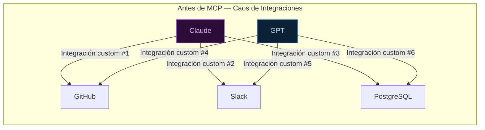
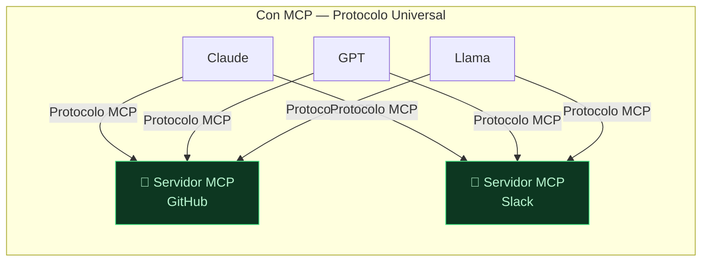

**Tags:** #mcp #concepto #estandar #ia #arquitectura

> [!info] Navegación
> ◀ Índice: [[📂MCP/00 - MOC MCP|🔌 MOC MCP]] | Siguiente ▶: [[📂MCP/02 - Arquitectura Host Cliente y Servidor|Arquitectura]]

---

# 01 — Qué es MCP y el Problema que Resuelve

> [!quote] Definición Oficial
> **MCP (Model Context Protocol)** es un **estándar abierto** que define cómo los modelos de IA (LLMs) se comunican con herramientas externas, bases de datos, APIs y servicios de terceros de forma segura, universal e interoperable. Fue creado por **Anthropic** (creadores de Claude) a finales de 2024 y cedido a la **Linux Foundation / Agentic AI Foundation**.

---

## 🔌 La Gran Analogía: El USB-C de la Inteligencia Artificial

> [!abstract] Antes de USB-C (Antes de MCP)
> Cada marca de móvil tenía su propio cargador propietario: Nokia tenía uno, Sony Ericsson otro, Apple el conector de 30 pines, Samsung el micro-USB... Si cambiabas de marca, tenías que tirar todos tus cables y comprar nuevos.
>
> Lo mismo pasaba con la IA: si querías que Claude leyera tu GitHub, necesitabas programar una integración específica. Si querías que GPT leyera Slack, otra integración completamente diferente. Cada combinación modelo + herramienta requería código a medida.

> [!abstract] Después de USB-C (Después de MCP)
> Llegó el **USB-C**: un estándar universal donde un mismo cable sirve para cargar cualquier dispositivo de cualquier marca.
> 
> **MCP es exactamente eso para la IA.** Un protocolo universal donde:
> - Cualquier **modelo de IA** (Claude, GPT, Llama, Gemini, Amazon Titan) puede conectarse...
> - ...a cualquier **herramienta o servicio** (GitHub, Slack, PostgreSQL, Google Drive, Notion)...
> - ...usando un **protocolo estándar** basado en JSON-RPC, sin escribir código personalizado para cada combinación.

---

## 🔥 El Problema del Contexto Antes de MCP

Los LLMs (como [[📂AWS/📂IA Practitioner/📂M3 - IA Generativa/01 - Foundation Models vs Narrow AI|Foundation Models]]) son modelos de propósito general increíblemente potentes. Pero tienen una limitación fundamental: **están aislados del mundo real**.

Un LLM por sí solo:
- ❌ **No puede leer** tu código en GitHub
- ❌ **No puede consultar** tu base de datos PostgreSQL
- ❌ **No puede enviar** un mensaje por Slack
- ❌ **No puede crear** un ticket en Jira
- ❌ **No puede ejecutar** código en tu máquina
- ❌ **No tiene acceso** a información actualizada (su conocimiento tiene una fecha de corte)

### ¿Cómo se solucionaba antes?

Cada desarrollador o empresa tenía que construir **integraciones ad-hoc** (a medida) para cada combinación de modelo + herramienta. El resultado era un "spaguetti de integraciones":

**Problemas concretos de este enfoque:**
1. **Duplicación de esfuerzo:** Cada empresa reescribía las mismas integraciones desde cero.
2. **Mantenimiento insostenible:** Si la API de GitHub cambiaba, cada integración custom se rompía independientemente.
3. **Inseguridad:** Era habitual pegar claves API directamente en el prompt del sistema o dar acceso total al sistema operativo.
4. **Sin portabilidad:** Si una empresa cambiaba de Claude a GPT, tenía que reprogramar todas las integraciones.

---

## ✅ La Solución Estandarizada de MCP

MCP sustituye todo ese caos por un **protocolo único basado en JSON-RPC**:

**Ventajas operativas:**

| Ventaja | Explicación |
| :--- | :--- |
| **Interoperabilidad total** | Un servidor MCP de GitHub funciona con Claude, GPT, Llama o cualquier otro modelo sin cambiar ni una línea |
| **Modularidad** | Conectar una nueva herramienta es añadir una línea en un archivo de configuración JSON |
| **Seguridad por diseño** | Las credenciales nunca llegan al modelo. Se quedan aisladas en el servidor MCP (ver [[📂MCP/02 - Arquitectura Host Cliente y Servidor|Arquitectura]]) |
| **Ecosistema abierto** | Hay cientos de servidores MCP oficiales ya publicados por la comunidad y empresas (GitHub, Docker, Notion, Supabase...) |
| **Reutilización** | Un servidor MCP que desarrolles se puede compartir y usar en cualquier Host compatible |

> [!tip] Referencia Oficial
> - Web oficial del estándar: [modelcontextprotocol.io](https://modelcontextprotocol.io)
> - Repositorio oficial en GitHub con SDKs, especificación e Inspector de desarrollo.
> - MCP fue cedido a la **Linux Foundation** bajo la **Agentic AI Foundation**, garantizando que seguirá siendo un estándar abierto y neutral.

---
→ Volver al índice: [[📂MCP/00 - MOC MCP|🔌 MOC MCP]]
